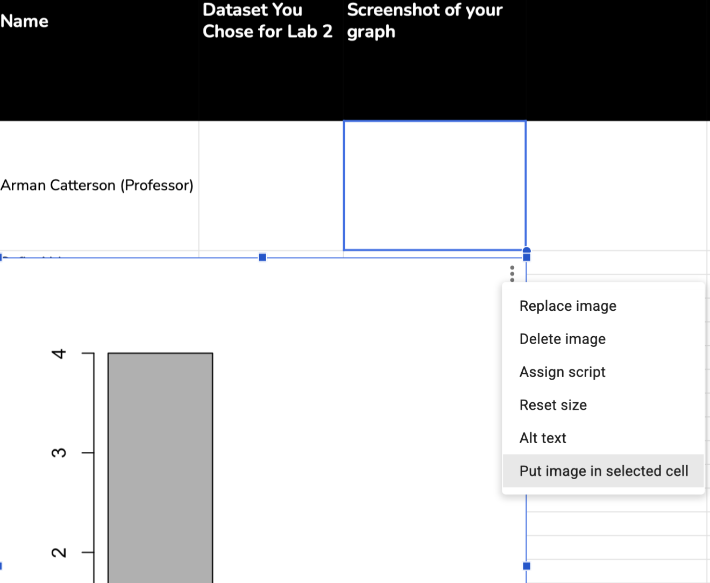

::: callout-tip
## Objectives This Week

- Learn how to load and navigate datasets in R.
- Continue practice graphing variables from datasets, and using your human brain to think about what you observe in the graph (with no fancy statistics terms.)
- Identify some variables that you might want to study as part of a class dataset
:::

## Professor Says Hi

In this video, I recap some of the themes I observed from the work y'all submitted in Week 1, and introduce what we will learn this week!

::: {style="position: relative; padding-bottom: 62.5%; height: 0;"}
<iframe src="https://www.loom.com/share/1459ad1569d64f6eaf6456b223a70e4a" frameborder="0" webkitallowfullscreen mozallowfullscreen allowfullscreen style="position: absolute; top: 0; left: 0; width: 100%; height: 100%;">

</iframe>
:::

## To-Do

### Read the Chapters Below!

1.  [**Why Statistics Chapter 2 (Parts 1 and 2).**](https://catterson.github.io/ystats/chapters/2R_Data.html) In this chapter, you'll learn how to work with collections of variables organized into datasets, and practice thinking about what you observe from a graph. *Note : you can skip Part 3 of Chapter 2, though feel free to read!*
2.  **Read the article “[Data Organization in Spreadsheets](https://www.dropbox.com/scl/fi/4ucbwkxc8890n83n5noe7/1_DataOrganization.pdf?rlkey=h4jxxg7hjxv0h4asghdv9hr7b&dl=0)”**. Choose one of the datasets uploaded to the Datasets folder on bCourses, and look over the dataset (and corresponding Codebook). What are some ways that this dataset adhered to these “best practices”? What are some ways that the dataset did not? What is something from this article that you learned? What did you have a question about?

### Complete These Assignments

1.  **Complete Quiz 2 (on bCourses).** In this quiz, you'll practice navigating a built-in dataset in R, and then practice loading datasets and checking to make sure they loaded correctly. *Please make sure to review the practice quiz in Chapter 2 (with a video key) before starting this quiz.* The quiz is open-note and allows for multiple attempts.
2.  [**Complete Lab 2 (submit on bCourses)**](/COMPSS202/Labs/Lab2.qmd)**.** This week's lab assignment asks you to define and graph two variables in R, share your code, and then join our class discord (see bCourses for the link to join).
3.  **Community Discussion Post on the [Vision Board](https://docs.google.com/spreadsheets/d/1ekZrJ7PubP1h9zkEKDiOF1Q7eVWwd70ksuk2Wrd8pmk/edit?usp=sharing) (Make Sure to Click the Week 2 Tab).** Post your responses to the community discussion prompts below on this week's vision board tab.
    - **YOUR POST :** Share a screenshot of your graph (and interpretation of the graph) from Lab 2, Problem 2B to the Week 2 Community Discussion Post. Note : when pasting your graph into Google Sheets, highlight the cell you want to add the graph to, click the three dots in the top left corner of your graph, and then click "Put Image in Selected Cell". Reach out on discord / via e-mail if you are stuck!

      {width="474"}

    - **YOUR REPLY :** Say hi, and see if you can observe anything else important about this variable. Then, think about a follow-up question you might ask as a researcher about this variable in terms of *prediction*. (What might *predict* this variable? What might this variable *predict?*)
4.  [**Check-In: Exit Survey and Mini Dataset for Week 3**](https://forms.gle/vfsz6ZsmwriyZ3Y58)**.** Finally, six questions about how week 2 went, and then a few questions that we will use as part of a class dataset to analyze in Week 3. Feel free to skip any question that you do not wish to answer.

## Common Questions and/or Additional Resources

**Week 2 :**

- **There are no errors in the qiuz!** Make sure you are following the "3 steps" for loading data (changing the name, checking headers, and setting stringAsFactor = TRUE)

- **Loading datasets can be one of the trickier things to figure out in R.** So be patient with yourself, and reach out for help on Discord if you are feeling stuck!!

**Questions and Resources from Week 1**

- I want to [change my name on bCourses](https://berkeley.service-now.com/kb_view.do?sys_kb_id=f0ffee05dba159108a95bc04b99619ea)!

- **What's the difference between "continuous" and "numeric" data!**

  - "numeric data" refers to data that can be represented by a number. (Any number.)

  - "continuous data" is more a specific type of numeric data, where the numbers (in theory) can range on an infinite spectrum. see chapter 2 for more information.

  - **in practice :**

    - **summer :** good to differentiate between numeric data and categorical data, since this will influence the R commands we use for graphing (e.g., plot vs. hist) and descriptive statistics (week 3!)

    - **fall semester:**

      - we will learn how to measure data continuously.

      - the type of number will influence the type of data analysis we use.
