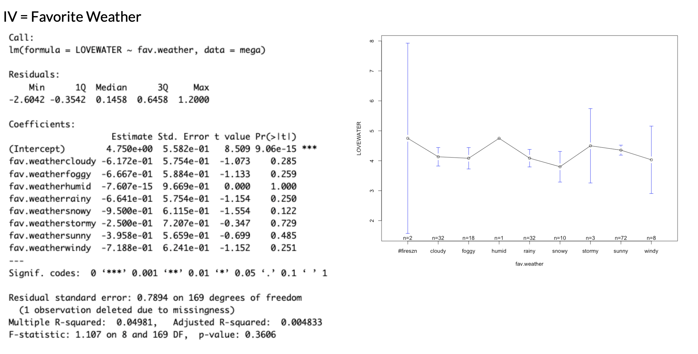
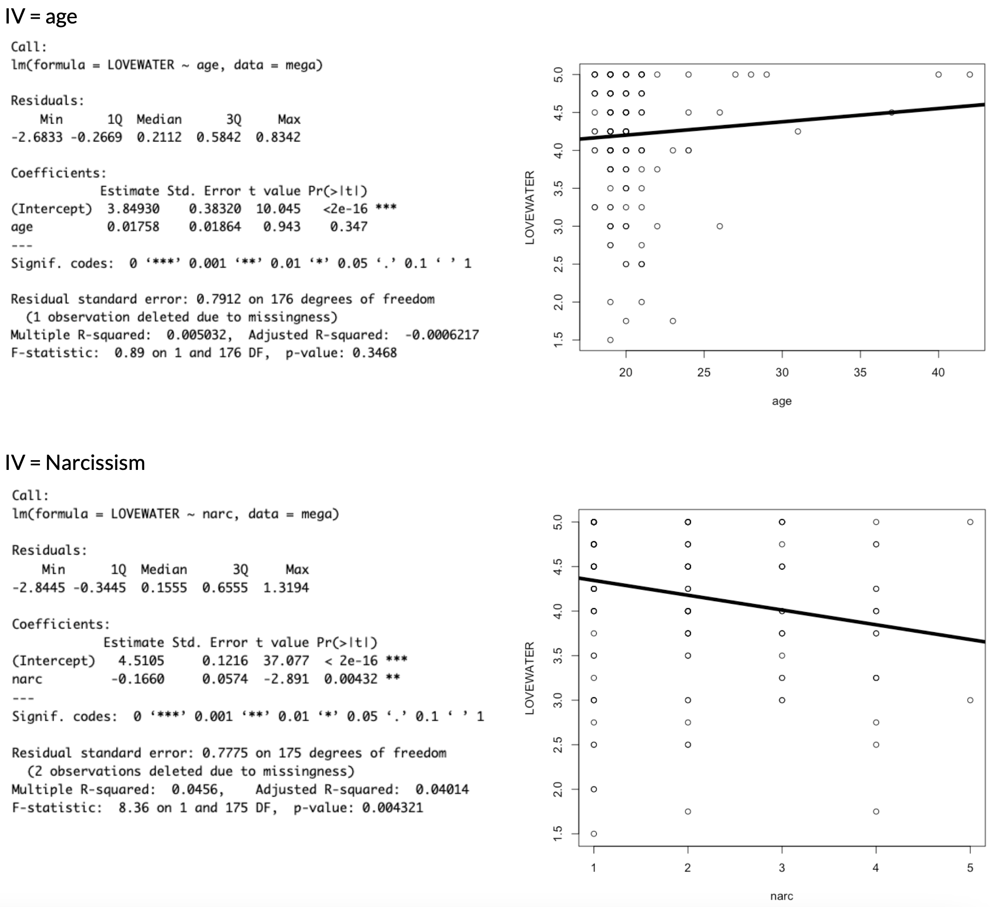

::: callout-tip
## Objectives This Week

- Learn how sampling error and sampling bias can each influence our results and interpretation of the data.
- Learn how to estimate sampling error using Null Hypothesis Significance Testing (NHST) approach, and generate 95% Confidence Intervals to build in sampling error to our estimates.
- Practice interpreting the output from a null-hypothesis significance test (NHST).
:::

## Professor Says Hi

Hello! Professor recorded a video that reviews some of the themes from Week 5 and introduces Chapter 8.

::: {style="position: relative; padding-bottom: 62.5%; height: 0;"}
<iframe src="https://www.loom.com/embed/a6b0565b39b641e1b8c51b800fa8ce3e" frameborder="0" webkitallowfullscreen mozallowfullscreen allowfullscreen style="position: absolute; top: 0; left: 0; width: 100%; height: 100%;">

</iframe>
:::

## To-Do

1.  **Watch the Preview to Chapter 8 \[20 min Video\].** The ideas behind sampling error can be overly confusing, so I recorded a video to try and give a helpful overview of the content. Focus on the difference between making predictions from our sample and the population, the difference between sampling error and bias, and get a quick(ish) overview of one (confusing) way we try to estimate sampling error called Null Hypothesis Significance Testing (NHST) - the p-value and "significance" stuff you may remember from another stats class.



2.  [**Read Why Statistics Chapter 8.**](https://catterson.github.io/ystats/chapters/8R_SamplingError.html#check-out-statistical-significance) The full chapter focuses on sampling bias, sampling error, and using NHST to understand sampling error.

### Complete These Assignments

1.  **Complete the Chapter 8 Quiz (on bCourses).** No R is required for this Quiz; instead you will interpret NHST output from some screenshots of R.
2.  [**Complete Lab 6 (submit on bCourses)**](/COMPSS202/Labs/Lab6.qmd)**.** This lab focuses on the "Culture & Awe (2024)" Dataset. The data come from Study 2 of the research article included in the folder. (You don't need to read the article, but do let us know on Discord if you have any reactions / comments / questions!)
3.  **Community Discussion Post on the [Vision Board](https://docs.google.com/spreadsheets/d/1ekZrJ7PubP1h9zkEKDiOF1Q7eVWwd70ksuk2Wrd8pmk/edit?usp=sharing) (Make Sure to Click the Week 6 Tab).** Post your responses to the community discussion prompts below on this week's vision board tab.
    - **YOUR POST :** Find a linear model that you had previously defined from a lab or vision board. Reprint the graph from that linear model, then run the `summary()` function to estimate the sampling error statistics (standard error, t-value, and p-value) and then do your best to interpret these statistics. Whew!!

    - **YOUR REPLY :** Say hello, and double check your buddy's work, with your own brain and / or the help of an AI tool?!
4.  [**Check-In : Exit Survey**](https://forms.gle/jDt1F4x9ojk2uBNR6). A few short exit survey questions. Thanks!

### Helpful Resources

- **Chapter 8 Videos.** Make sure to also do the readings!
- **More NHST Examples.** This stuff can be very confusing! I recorded the videos below in a previous class (with a different class data). You will likely get different results if you try and replicate these results with our class dataset; a good example of how NHST doesn't really tell us whether the results are "truth" or not, or whether they will replicate.

::::: panel-tabset
#### Example 1

::: {style="position: relative; padding-bottom: 56.25%; height: 0;"}
<iframe src="https://www.loom.com/embed/67776eb1a41f4b5eaa0ca5312d0663ad" frameborder="1" webkitallowfullscreen mozallowfullscreen allowfullscreen style="position: absolute; top: 0; left: 0; width: 100%; height: 100%;">

</iframe>
:::

#### Example 2

::: {style="position: relative; padding-bottom: 56.25%; height: 0;"}
<iframe src="https://www.loom.com/embed/8b755a32fe094e9eb1fc0bd7f16991bd" frameborder="0" webkitallowfullscreen mozallowfullscreen allowfullscreen style="position: absolute; top: 0; left: 0; width: 100%; height: 100%;">

</iframe>
:::

:::::
