```{r}
#| include: false

1+1
```

# Welcome to COMPSS212

- **Please complete the check-in!**

- **We will get started soon!!**

{fig-align="center" width="80%"}

## Who Are You??

### The Professor : Arman Catterson{.smaller}

- **who :** Arman…Professor…Professor Catterson…Dr. Catterson

- **where :** from Texas to Berkeley to Google (briefly) to teaching statistics at the graduate and undergraduate level in the Bay Area \<3

- **what else :** parenting and bicycles and dnd and exploring the bay area (and beyond).

{fig-align="center" width="40%"}

### The GSI : Yi-Ke!

- Yi-Ke Facts Go Here.

### The Students.{.smaller}

***Your voice is needed.***

- **in the classroom!** we learn from each other.

  - clap once if you are here.

  - sound you made when alarm went off this morning?

- [**the vision board :**](https://docs.google.com/spreadsheets/d/14y4W9LJk1I9M3HFIOp3_94tdM0qUSYfkGdZnKK6L23c/edit?usp=sharing)

  - What's your preferred name (and pronouns)

  - Where's home?

  - What do you want to do with computational social science?

# Part 1 : Why Applied Statistics I?{.smaller}

*Why is this class required?*

*Why is this degree or career path needed?????!?*

### Statistics as a Language... {.smaller}

| ...to describe | ...to predict | ...to control |
|------------------------|------------------------|------------------------|
|  | [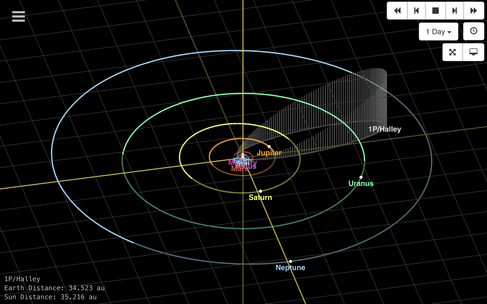](https://ssd.jpl.nasa.gov/tools/sbdb_lookup.html#/?des=1P&view=VOP) |  |

### KEY IDEA : this is hard and errors happen. {.smaller}

| ...error in description | ...error in prediction | ...error in controlling outcomes |
|------------------------|------------------------|------------------------|
| 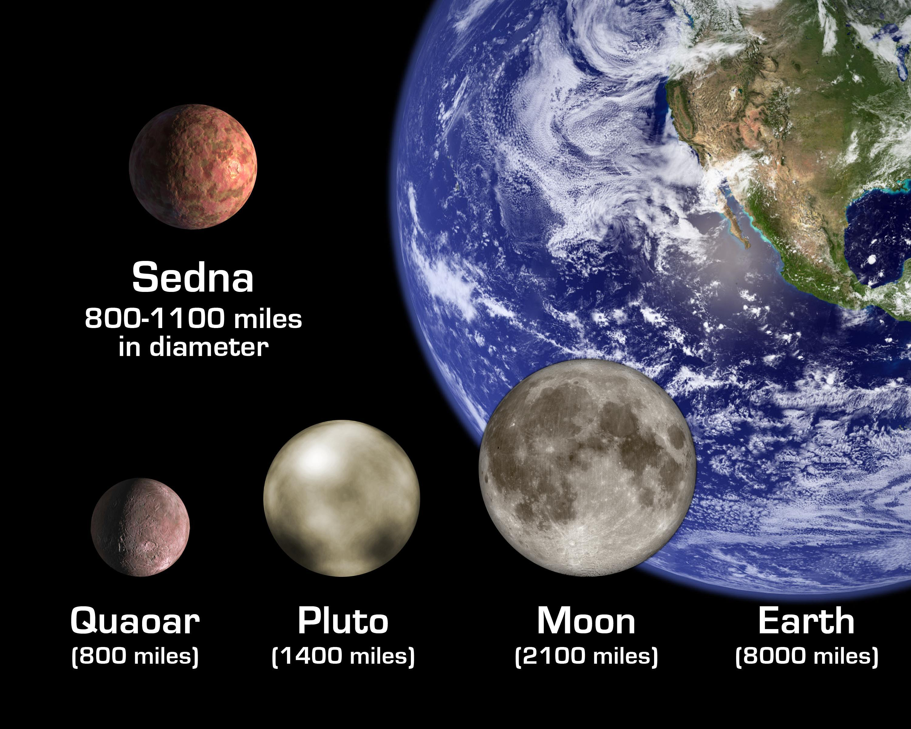{width="190"} |  |  |

### SOCIAL SCIENCE : REAL (TM) SCIENCE{.smaller}

| ...to describe | ...to predict | ...to control |
|------------------------|------------------------|------------------------|
| 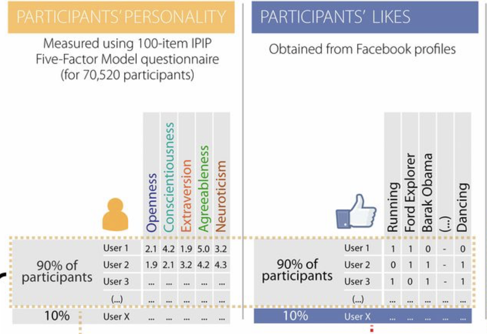 | 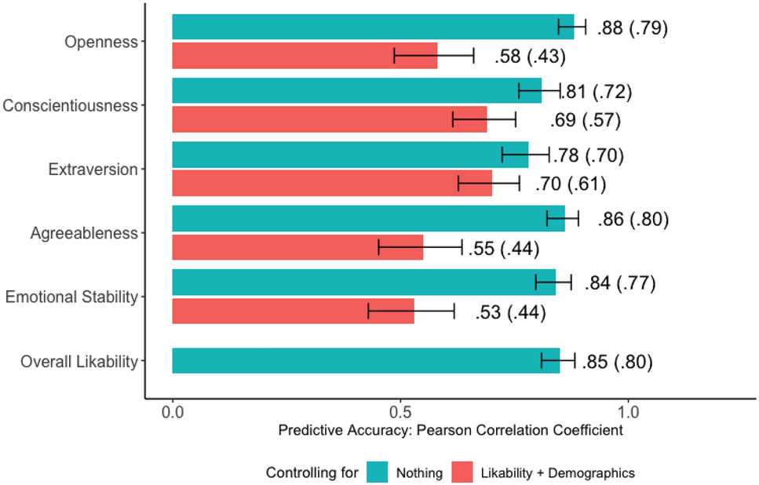 |  |

### On the Vision Board : {.smaller}

- what are the variables you are trying to DESCRIBE with your interest?

- how will you use this knowledge to make PREDICTIONS?

- how might you use this knowledge to CONTROL OUTCOMES?

- what are some places that ERROR might be introduced into your work?

## This Class. {.smaller}

### Goals.

1.  **Deepen** statistics knowledge so you can conduct and critique analyses.
2.  **Practice** doing "good science" in class and discussion section.
3.  **Keep it Chill.** Y'all are juggling a lot; better to learn a few things well than many things poorly.

### Assessments.{.smaller}

The class is structured to support three authentic skills :

- **Brain Exam :** talk and / or write about data without using a computer

- **R Exam :** take a novel dataset and analyze it to answer a question

- **Presentation :** share some analyses you did on data you care about with the class

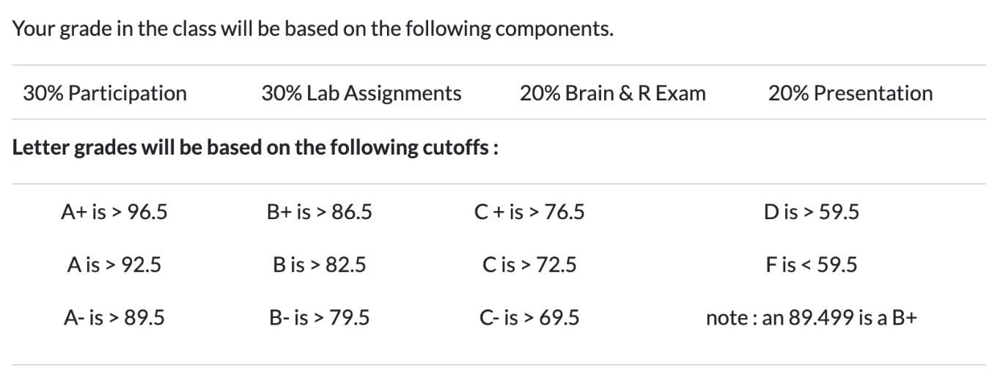{fig-align="center" width="465"}

### Questions?{.smaller}

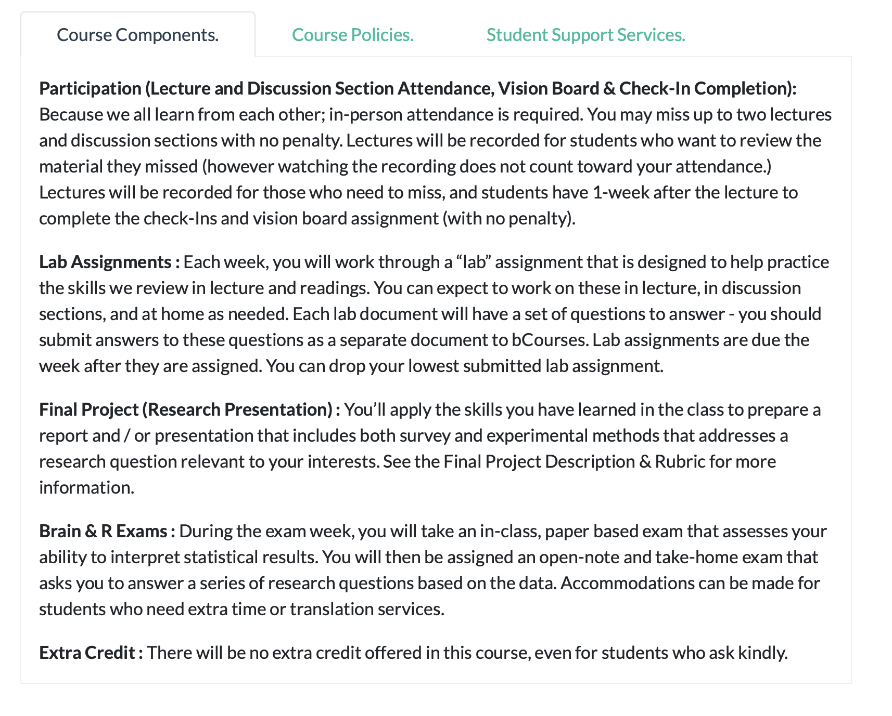

# Part 2 : Good Data

## Operationalization (an Eight Syllable Word)

- A fancy definition (like a rich doctor).
- Technical and precise (like a doctor who operates).
- A *process* (an operation).

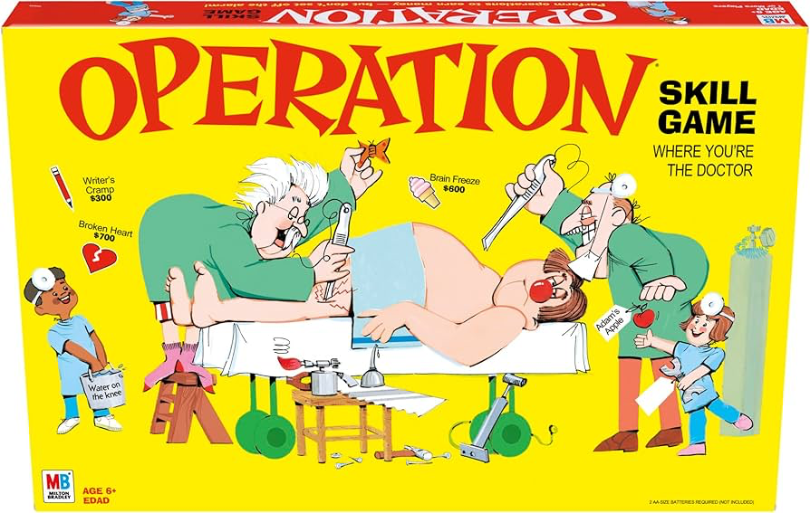{fig-align="center" width="50%"}

### Operationalization in Real-Life

{fig-align="center" width="60%"}

### Operationalization of "Cognitive Exam"

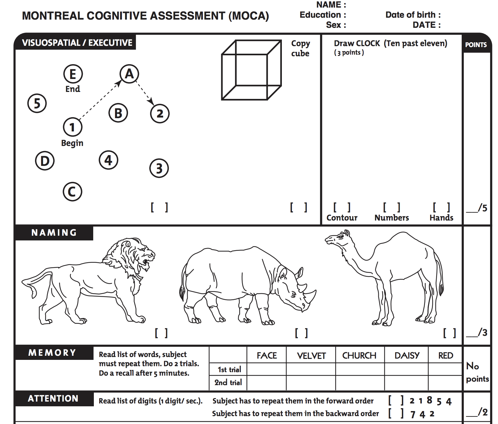{fig-align="center" width="60%"}

### ACTIVITY : Count the Interruptions. {.smaller}

[**Count the Interruptions : tinyurl.com/macssinterrupt**](https://forms.gle/18C52ETsFjugtuXbA)

- Count the number of interruptions in the video (which professor will play soon).
- Submit your answer, **then wait for the letter of the day.**

### ACTIVITY : Count the Interruptions. {.smaller}

{fig-align="center"}

### DISCUSSION : Operationalization

- How was watching the video?

- How many INTERRUPTIONS did you count?

- How did you OPERATIONALIZE an INTERRUPTION?

### ACTIVITY : Count the Interruptions Again. {.smaller}

{fig-align="center"}

### DISCUSSION : How would the data change? {.smaller}

- What differences between our counts at time 1 and time 2 would we expect there to be?
- What patterns in the data would we expect there to be?
- IN R : what analyses would we do to test these predictions?

### RECAP : statistics describe (and predict) {.smaller}

- **mean :** the expected value; value that is closest to *all* the data points.

- **standard deviation :** how much the average individual differs from the mean

- **bivariate regression terms :**

  - intercept : the predicted value of Y when all X values are zero.

  - slope : how changes in X are related to changes in Y

  - \$ R\^2 \$ : how well the IV(s) predict the DV; reduction in error when using the model (vs. the mean)

## Reliability and Validity

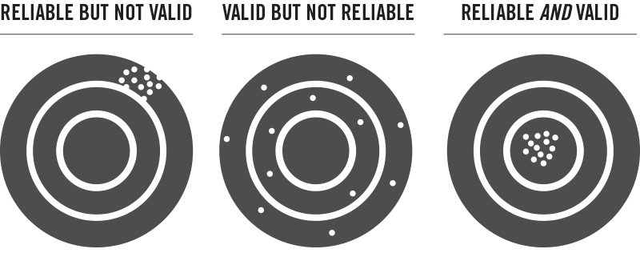{fig-align="center" width="60%"}

### Reliability and Validity (Specific Terms) {.smaller}

::: r-fit-text
|  |  |  |
|------------------------|------------------------|------------------------|
| **Term** | **Example (Bathroom Scale)** | **Example (Interruption Data)** |
| **face validity :** does our measure or result look like what it should look like? | data are numbers; range from 0 to 100s |  |
| **convergent validity :** is our measure similar to related concepts? | weight should increase with height...pant size. |  |
| **discriminant validity :** is our measure different from unrelated concepts? | weight should be unrelated to mouth position. |  |
| **test-retest reliability :** do we get the same result if we take multiple measures? | step on the scale multiple times; get same result. |  |
| **inter-rater reliability :** would another observer (or tool) make the same measurements? | step on multiple scales; get same answer. |  |
:::

### DISCUSSION : examples of these terms in social science research? {.smaller}

::: r-fit-text
|  |  |  |
|------------------------|------------------------|------------------------|
| **Term** | **Example (Social Media "Likes")** | **Example (Your Variable?)** |
| **face validity :** does our measure or result look like what it should look like? |  |  |
| **convergent validity :** is our measure similar to related concepts? |  |  |
| **discriminant validity :** is our measure different from unrelated concepts? |  |  |
| **test-retest reliability :** do we get the same result if we take multiple measures? |  |  |
| **inter-rater reliability :** would another observer (or tool) make the same measurements? |  |  |
:::

# Part 3 : Quarto

## What is Quarto?{.smaller}

- **Fancy R Markdown:** An open-source publishing system supporting R, Python, Julia, and Observable.
- **"Streamlined" Authoring:** Seamlessly weaves narrative text, executable code, and rendered output into a single document that can export into HTML, PDF, Word, website, slide deck...
- **Reproducible Workflows:** Ensures your analysis and reporting stay updated automatically as data changes.
- **Source of Headache and Frustration:** There will be troubleshooting. We will figure it out :)

## Key Terms & Core Concepts{.smaller}

::::: columns
::: {.column width="50%"}
- **YAML Header:** Configuration section at the top (`--- ... ---`) defining document metadata, format, and themes.
- **Code Chunks:** Blocks of executable code (```` ```{r} ... ``` ````) controlled by `#|` options (e.g., `#| echo: false`).
- **Markdown Syntax:** Simple plain-text formatting for headers (`##`), lists (`*`), and text styles (`**bold**`).
- **Rendering:** The conversion process (`quarto render`) that executes code and generates the final output file.
:::

::: {.column width="50%"}
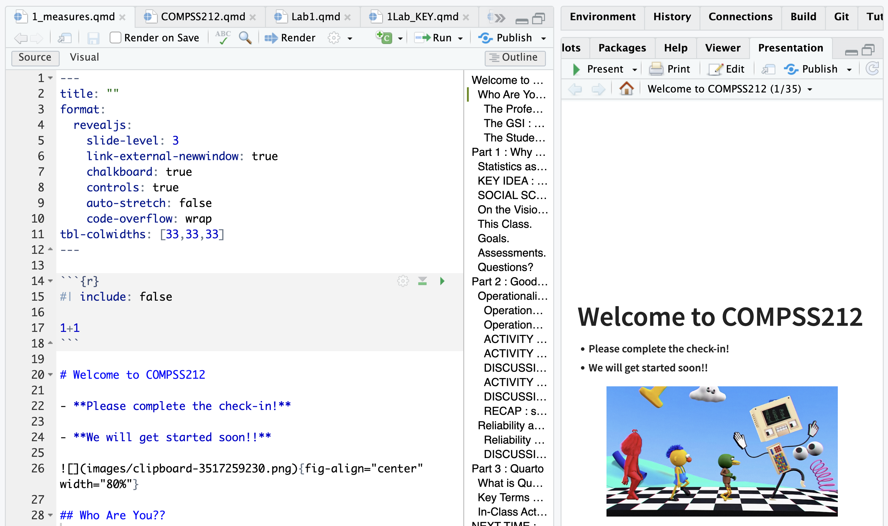
:::
:::::

## In-Class Activity (10 Minutes){.smaller}

1.  **Create Document:** Open RStudio and go to **File \> New File \> Quarto Document...** (Save as `week1.qmd`).
2.  **Insert Code:** Add an R chunk containing your code from the interruption activity.
3.  **Hide Code:** Insert `#| echo: false` on the first line inside the chunk to hide the code and display only the output.
4.  **Render:** Click the **Render** button (or press `Ctrl/Cmd + Shift + K`) to build your HTML presentation slide.

# NEXT TIME : Is It Possible to Be Objective?

### The Replication Crisis : In Social Sciences {.smaller}

[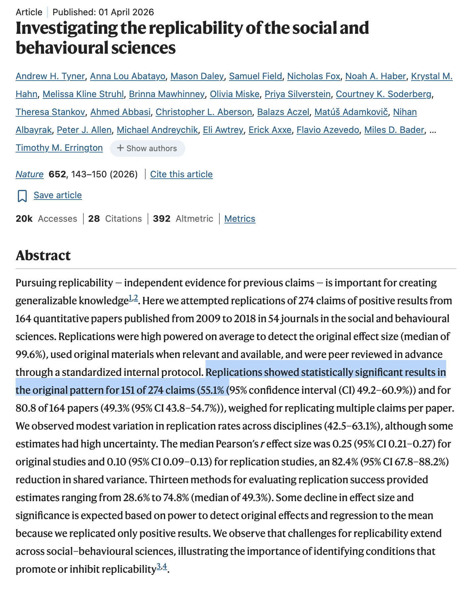](https://www.nature.com/articles/s41586-025-10078-y?fromPaywallRec=false)

### The Replication Crisis : In Other Sciences Too {.smaller}

[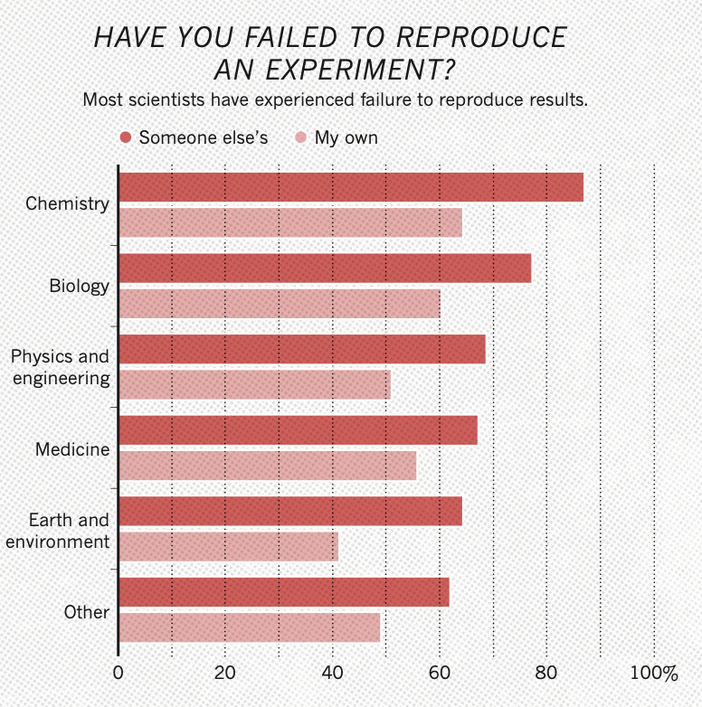](https://www.nature.com/articles/533452a)

### Optional Reading : Objectivity Interrogations

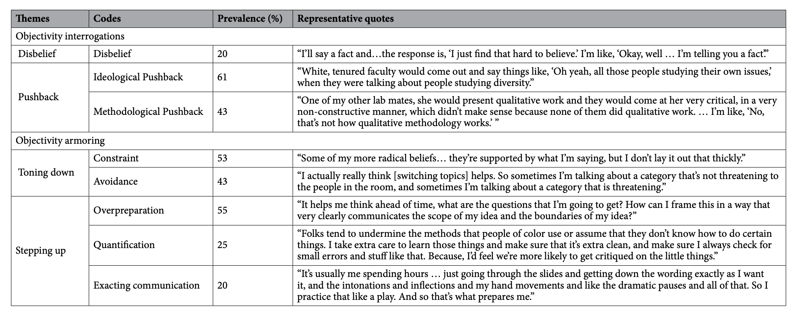
