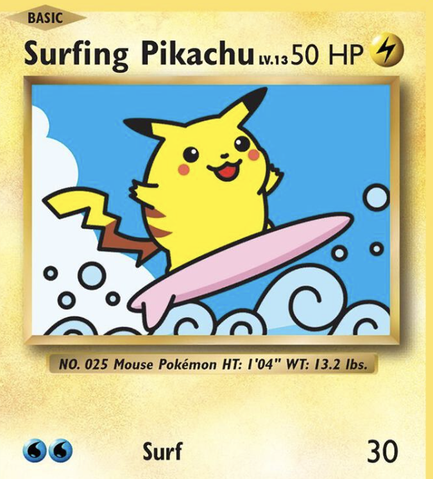
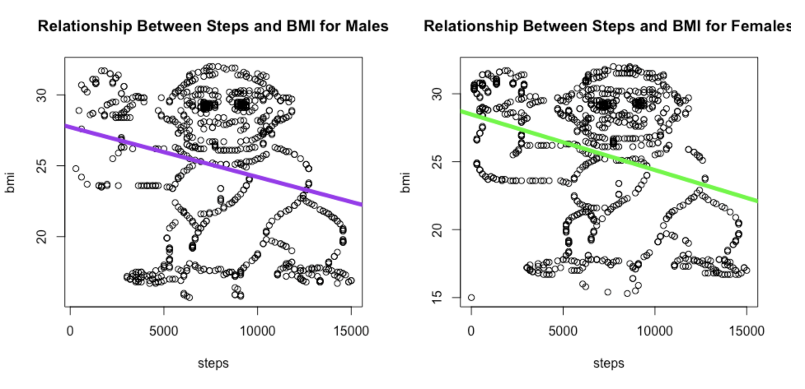
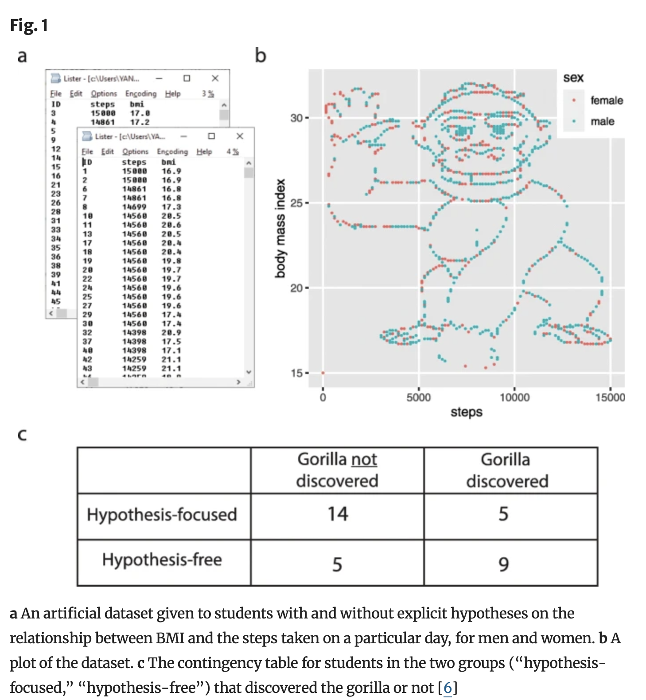
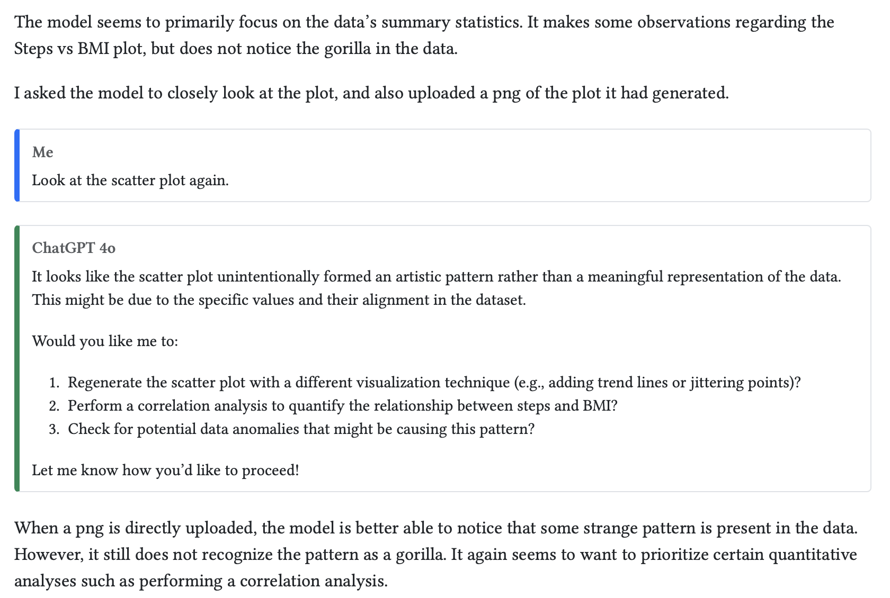
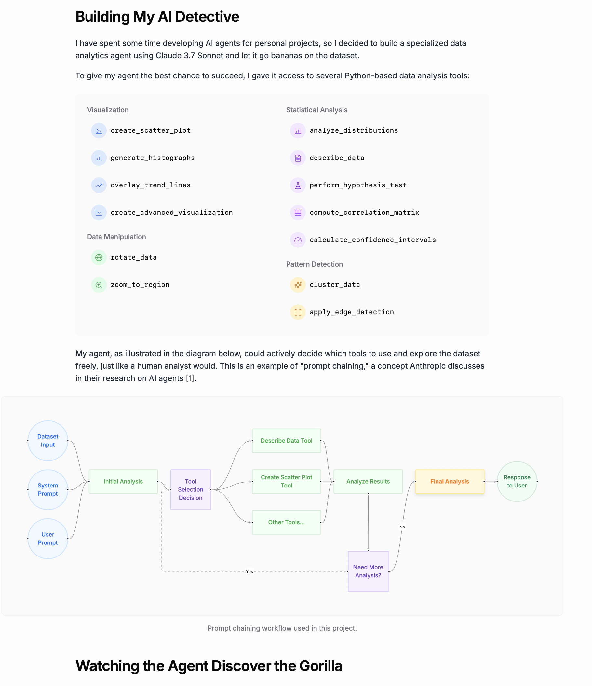
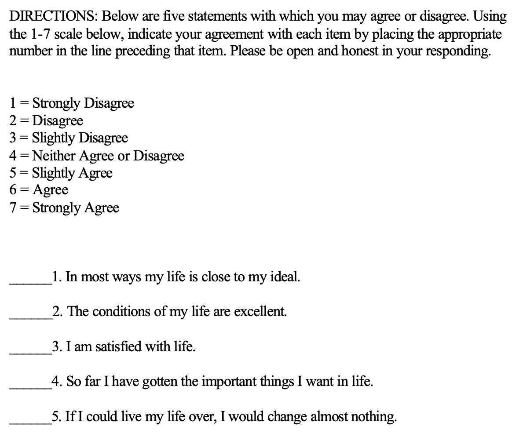
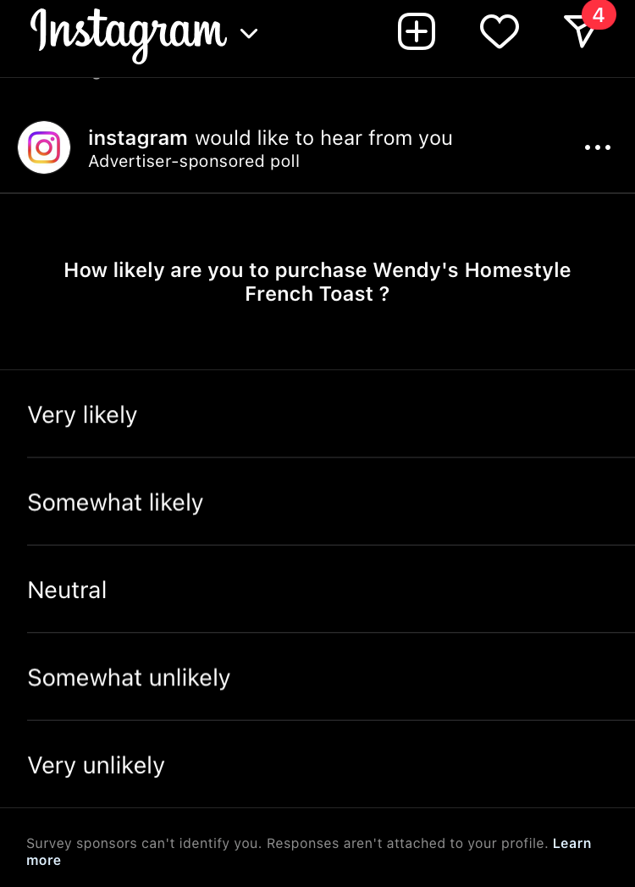
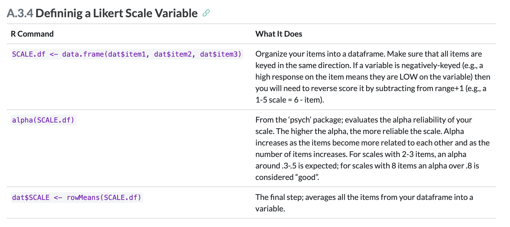

```{r}
d <- read.csv("~/Dropbox/!GRADSTATS/COMPSS212/Datasets/Onboarding Data/DATASET_MACSS_onboard_SP26.csv",
              stringsAsFactors = T)
dcode <- read.csv("~/Dropbox/!GRADSTATS/COMPSS212/Datasets/Onboarding Data/CODEBOOK_MACSS_onboard.csv",
              stringsAsFactors = T)
```

# Hello Again! {.smaller}

**Use the ONBOARDING survey (and codebook) to do the following!**

::::: columns
::: {.column width="50%"}
- DESCRIBE : what is a numeric variable that you are interested in?
- PREDICT : what is another variable that predicts this variable?
- ERROR : how good is this prediction? do you believe in this pattern? why might this pattern occur?
- CONTROL : how might we use this knowledge? what other questions do you have?
:::

::: {.column width="50%"}


:::
:::::

## PART 1 : Linear Models are Fundamental

### Linear Model Review {.smaller}

::::::::: panel-tabset
#### Describe (Numbers)

```{r}
par(mfrow = c(1,2))
hist(d$self.skills, col = "black", bor = "white", main = "Perception of Self Skills")
hist(d$class.skills, col = "black", bor = "white", main = "Perceptions of Class Skills")

```

#### Describe (Category)

```{r}
plot(d$can.boot, col = "black", bor = "white",
     xlab = "Can Student Bootstrap?")
```

#### Predict : A Model

::::: columns
::: {.column width="40%"}
```{r}
#| warning: false
#| fig-height: 4
#| fig-width: 4
#| fig-align: center

plot(jitter(self.skills) ~ jitter(class.skills), data = d)
mod <- lm(self.skills ~ class.skills, data = d)
abline(mod, lwd = 5)
```
:::

::: {.column width="60%"}
```{r}
library(jtools)
export_summs(mod)
```
:::
:::::

#### Error.

::::: columns
::: {.column width="50%"}
```{r}
#| fig-height: 7
#| fig-width: 8

par(mfrow = c(1,2))
plot(d$self.skills, pch = 19, main = "Black = The Mean")
abline(h = mean(d$self.skills, na.rm = T), lwd = 5)
plot(jitter(d$self.skills) ~ jitter(d$class.skills), pch = 19,
     main = "Red = The Model")
abline(mod, lwd = 5, col = 'red')

```
:::

::: {.column width="50%"}
$$\hat{Y} = a + b_1 * X_1 + {\epsilon}_i $$

$${\epsilon}_i = \hat{Y} - (a + b_1 * X_1)$$ Error = Actual Scores - Predicted Values

```{r}
#| echo: true

SST <- sum((mod$model$self.skills - mean(mod$model$self.skills))^2) 
SSM <- sum(mod$residuals^2)
SST
SSM
SST - SSM
(SST - SSM)/SST
summary(mod)$r.squared # relative difference
```
:::
:::::

#### Error : The "Four Reasons"

1.  Causation
2.  Reverse Causation
3.  Confound Variables
4.  Chance (next class!)

*Note : Correlation is not causation but causation will be correlated :)*

#### To Control

How do we use this knowledge??
:::::::::

## BREAK TIME :

### ACTIVITY : count the number of times the basketball is passed



### DISCUSS: The Monkey In Lab 1 {.smaller}

- did you see the gorilla in the data?
- reactions to the gorilla?
- how did you answer the question? \[linear model, comparison of means, etc?\]



### [RESEARCH](https://genomebiology.biomedcentral.com/articles/10.1186/s13059-020-02133-w)

::: r-fit-text
*When people were given a hypothesis, they were less likely to see the gorilla in the data then when left to "explore" the dataset on their own.*

{fig-align="center" width="70%"}
:::

### Does AI See the Gorilla?

[Blog Post from February 2025](https://chiraaggohel.com/posts/llms-eda/index.html)



### Does AI See the Gorilla?

[Blog Post from March 2025](https://www.hudsong.dev/ai-gorilla-pattern-detection)

{fig-align="center" width="50%"}

#### 

## PART 2 : Likert Scales

### Theory : Defining a Likert Scale

[Satisfaction With Life Scale](https://ppc.sas.upenn.edu/resources/questionnaires-researchers/satisfaction-life-scale)

:::::: r-fit-text
::::: columns
::: {.column width="40%"}

:::

::: {.column width="60%"}
**scale :** The variable that you want to measure as a continuous variable.

**items :** The specific question(s) in the scale.

- **positively keyed item :** measures the high end of the scale (“yes” = high on this variable.)

- **negatively keyed item :** measures the low end of the scale (“yes” = low on the variable.)

**response scale :** How people answer the scale items. Good to have a place for neutral.
:::
:::::
::::::

### DISCUSSION : Evaluating a Likert Scale {.smaller}

[Satisfaction With Life Scale](https://ppc.sas.upenn.edu/resources/questionnaires-researchers/satisfaction-life-scale)

:::::: r-fit-text
::::: columns
::: {.column width="40%"}

:::

::: {.column width="60%"}
**Does this seem like a valid way to measure satisfaction with life?**

- Self-Insight / Self-Enhancement / Self-Diminishment?
- Ways to establish reliability? validity (convergent and discriminant)?
- What other (better) methods might exist?
:::
:::::
::::::

### But You Don't Have To Take My Word For It...


### But You Don't Have To Take My Word For It...

{fig-align="center" width="80%"}

### ACTIVITY in R : let's define a scale in R from the onboarding survey.



## Lab 2 : Working With the Self-Esteem Dataset {.smaller}

| Likert Scale Item | Positive or Negative Key Item*"Yes" = High in Self-Esteem = Positive Key.* | Any Issues of Face Validity? |
|------------------------|------------------------|------------------------|
| Q1. I feel that I am a person of worth, at least on an equal plane with others. |  |  |
| Q2. I feel that I have a number of good qualities. |  |  |
| Q3. All in all, I am inclined to feel that I am a failure. |  |  |
| Q4. I am able to do things as well as most other people. |  |  |
| Q5. I feel I do not have much to be proud of. |  |  |
| Q6. I take a positive attitude toward myself. |  |  |
| Q7. On the whole, I am satisfied with myself. |  |  |
| Q8. I wish I could have more respect for myself. |  |  |
| Q9. I certainly feel useless at times. |  |  |
| Q10. At times I think I am no good at all. |  |  |

# [THE END : CHECK-OUT!](https://forms.gle/ABAuXNJqBmjjtZTB8)
