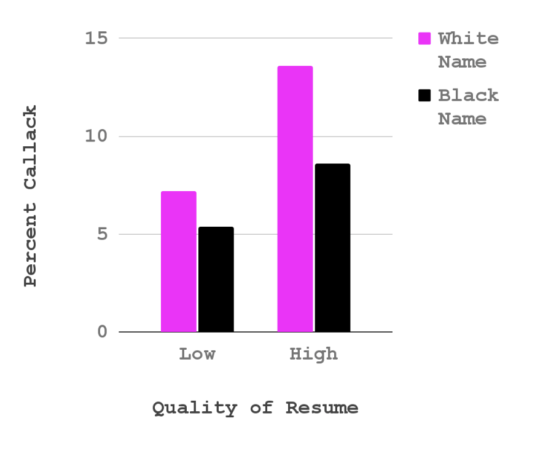
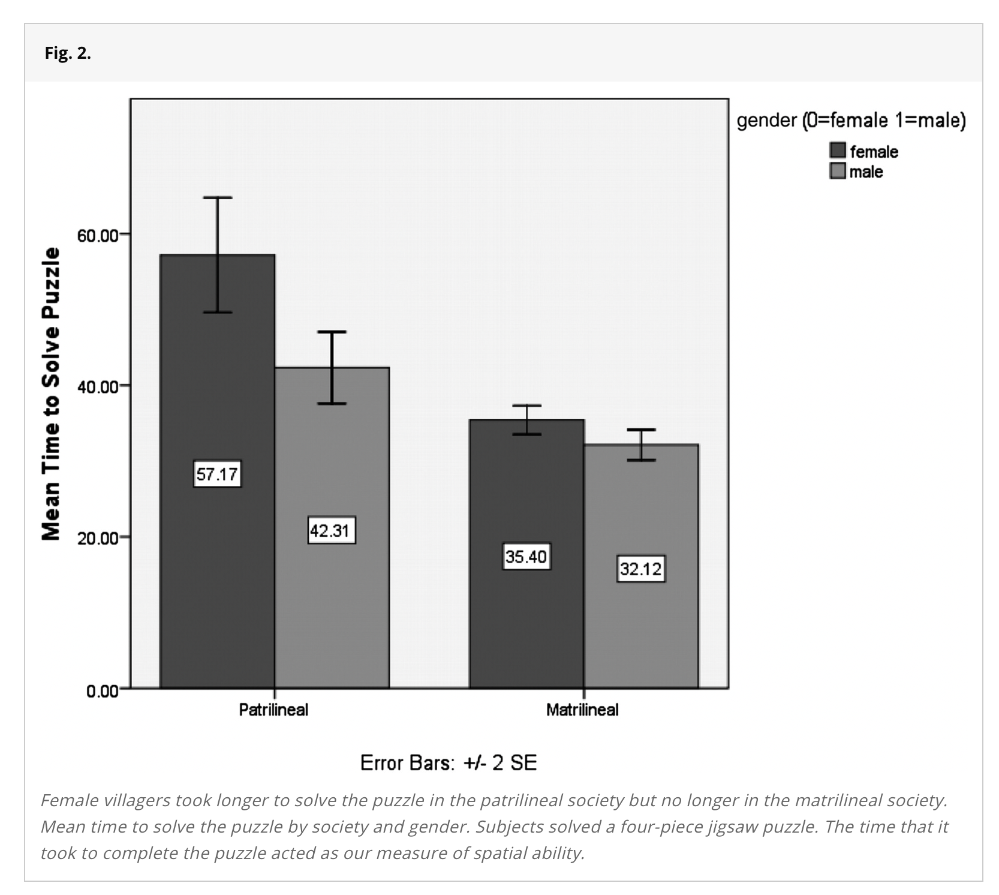
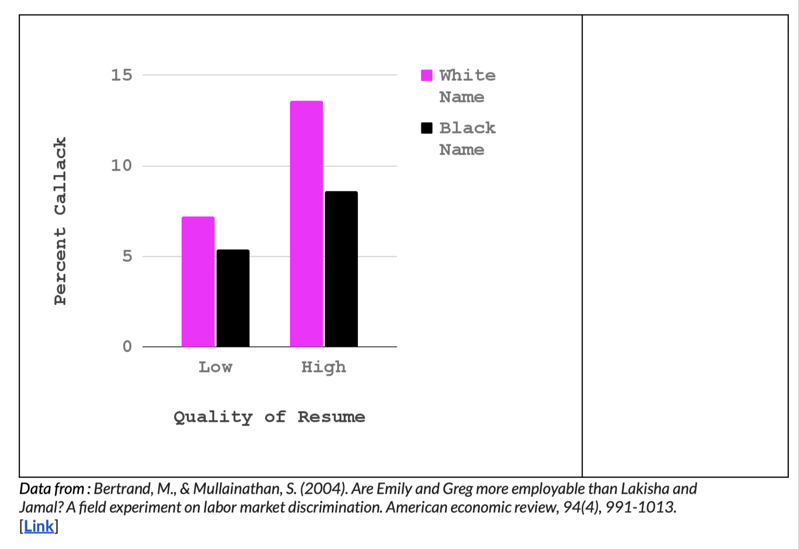

## Check-In : MR. NHST Review {.smaller}

::::::::: panel-tabset
#### Summary

```{r}
#| include: false
library(car)
library(gplots)
library(jtools)
library(ggplot2)
library(arm)

mod1 <- lm(salary ~ yrs.service, data = Salaries)
mod2 <- lm(salary ~ sex, data = Salaries)
modx <- lm(yrs.service ~ sex, data = Salaries)
mod3 <- lm(salary ~ yrs.service + sex, data = Salaries)
mod4 <- lm(salary ~ yrs.service * sex, data = Salaries)

mod1x <- arm::standardize(mod1, NULL, T)
mod2x <- arm::standardize(mod2, NULL, T)
mod3x <- arm::standardize(mod3, NULL, T)
mod4x <- arm::standardize(mod4, NULL, T)

```

Table 1. Predicting Salaries from Years of Service and Sex.

```{r}
#| echo: false
export_summs(mod1, mod2, mod3,
             coefs = c("Years of Service" = "yrs.service",
                       "Sex (0 = F; 1 = M)" = "sexMale"))
```

#### Description {.smaller}

**Salaries Dataset.** "The 2008-09 nine-month academic salary for Assistant Professors, Associate Professors and Professors in a college in the U.S. The data were collected as part of the on-going effort of the college's administration to monitor salary differences between male and female faculty members."

```         
-   salary : the salary of the professor, in cold, hard, US American Dollars.

-   yrs.service : the years of service the professor had at the college.

-   sex : whether the professor was Male or Female
```

#### Model 1 {.smaller}

::::: columns
::: {.column width="40%"}
Graph of Model 1

```{r}
#| fig-width: 5
#| fig-height: 5
#| echo: false

plot(salary ~ yrs.service, data = Salaries)
abline(mod1, lwd = 5)
```
:::

::: {.column width="60%"}
Diagnostic Plots

```{r}
#| fig-width: 5
#| fig-height: 5
#| echo: false
par(mfrow = c(2,2))
plot(mod1)
```
:::
:::::

#### Model 2 {.smaller}

::::: columns
::: {.column width="40%"}
Graph of Model 2

```{r}
#| fig-width: 5
#| fig-height: 5
#| echo: false

plotmeans(salary ~ sex, data = Salaries, connect = F)
```
:::

::: {.column width="60%"}
Diagnostic Plots

```{r}
#| fig-width: 5
#| fig-height: 5
#| echo: false
par(mfrow = c(2,2))
plot(mod2)
```
:::
:::::

#### Model 3 {.smaller}

Diagnostic Plots

```{r}
#| fig-width: 5
#| fig-height: 5
#| echo: false
par(mfrow = c(2,2))
plot(mod3)
```
:::::::::

## RECAP : Adding a Quadtratic Effect to Address issues of Heteroscedasticity

::: columns
\::: {.column width = "50"}

```{r}
mod3b <- lm(salary ~ yrs.service + I(yrs.service^2) + sex, data = Salaries)
export_summs(mod3, mod3b,model.names = c("Without Quad", "With Quad"))
```
:::

\::: {.column width = "50"}

```{r}
par(mfrow = c(2,2))
plot(mod3b)
```

\:::

\:::::::

## BREAK TIME

## COMMERCIAL BREAK : looking over Lab 4 (& discussing the results)

## Part 2 : Experiments

# Part 3 : Experiments {.smaller}

Why did google change???


### DEFINITION : Causality {.smaller}

::::: columns
::: {.column width="70%"}
1.  The cause and effect are contiguous in space and time.
2.  The cause must be prior to the effect.
3.  There must be a constant union betwixt the cause and effect. (“Tis chiefly this quality, that constitutes the relation.”)
4.  The same cause always produces the same effect, and the same effect never arises but from the same cause.
:::

::: {.column width="30%"}
```         
DISCUSS : 
Which parts of this definition rule out the other reasons for a pattern in the data??

Apply this definition to a true causal relationship. Does it hold up?
```
:::
:::::

### DEFINITION : Principles of an Experiment {.smaller}

::::: columns
::: {.column width="40%"}
```         
dependent variable. what the researchers want to predict or explain

experimental manipulation. change only one thing about the variable

extraneous variables as “noise”. other factors that might influence the outcome variable

random assignment. the group people are put in is random; this ensures that all other variables that might affect the result are evenly split across the two groups 

placebo effects. when individuals in the study change their behavior if they expect something to have an effect

external validity. how much does the experimental manipulation represent what someone might experience in real life?

construct validity. how much does the manipulation actually change the variable of interest?

experimenter expectancy effects. if experimenters know what will happen to participants, they may change their behavior in ways that affect the results
```
:::

::: {.column width="60%"}

:::
:::::

### KEY IDEA : Watch out for Misleading Control Variables {.smaller}

**RECAP : the manipulation (A/B Testing) :** researchers create multiple groups (conditions) and change ONE THING (the IV) about a person’s experience in each group & observe the result (the DV).

**KEY IDEA : the comparison group matters!**

- a 1.5 hour research methods class DECREASES boredom compared to…

- a 1.5 hour research methods class INCREASES boredom compared to…

### Science is Hard : Power Posing

- What is the experimental / control condotion?

- Is this a fair comparison / manipulation?

::::: columns
::: {.column width="50%"}

:::

::: {.column width="50%"}

:::
:::::

### Example : Gratitude Study {.smaller}

::::: columns
::: {.column width="40%"}
Read the prompt below. Answer the following questions.

1.  **ICE-BREAKER :** What's something that you are grateful for?
2.  What is the experimental / control condition?
3.  Is this a fair comparison / manipulation? What would be better?
:::

::: {.column width="60%"}

:::
:::::

## Part X : Introduction to Interaction Effects

### Some Examples {.smaller}

::: panel-tabset
#### resume data {.smaller}

{fig-align="center" width="60%"}

#### puzzle data {.smaller}

{fig-align="center" width="60%"}
:::

##  {.smaller}

### EXAMPLE : An Interaction Effect {.smaller}

::: panel-tabset
#### the extra slope {.smaller}

```{r}
mod1 <- lm(salary ~ yrs.service + I(yrs.service^2), data = Salaries)
mod2 <- lm(salary ~ sex, data = Salaries)
mod3 <- lm(salary ~ yrs.service + I(yrs.service^2) + sex, data = Salaries)
mod4 <- lm(salary ~ (yrs.service + I(yrs.service^2)) * sex, data = Salaries)
export_summs(mod1, mod2, mod3, mod4,
             coefs = c("Years of Service" = "yrs.service",
                       "Years ^ 2" = "I(yrs.service^2)",
                       "Sex (0 = F; 1 = M)" = "sexMale",
                       "Service * Sex (if Male)" = "yrs.service:sexMale",
                       "Service^2 * Sex" = "I(yrs.service^2):sexMale"))
```

#### a picture is worth 1000 words.

```{r}
#| echo: false
#| fig-width: 14
#| fig-height: 7
library(ggplot2)
library(ggthemes)
library(jtools)
ggplot(data = Salaries, aes(x = yrs.service, y = salary, color = sex)) + 
  geom_point(size = .5, alpha = .3, position = "jitter") + 
  labs(title = "The Interaction Effect", x = "Years of Service", y = "Salary", color = "Sex") +
  geom_smooth(method = lm, formula = y ~ poly(x, 2)) + theme_apa()
```

#### standardizing your variables?

```{r}
mod1x <- arm::standardize(mod1, NULL, T)
mod2x <- arm::standardize(mod2, NULL, T)
mod3x <- arm::standardize(mod3, NULL, T)
mod4x <- arm::standardize(mod4, NULL, T)

export_summs(mod1x, mod2x, mod3x, mod4x,
             coefs = c("Years of Service" = "z.yrs.service",
                       "Service^2" = "I(z.yrs.service^2)",
                       "Sex (0=F; 1=M)" = "c.sex",
                       "Service * Sex" = "z.yrs.service:c.sex",
                       "Service^2 * Sex" = "I(z.yrs.service^2):c.sex"))
```
:::

## DISCUSS : Interaction Effects {.smaller}

From the [Vision Board](https://docs.google.com/spreadsheets/d/11FZJ76JMBUkKYZRoWASrHhPIldmP7Pziz-WGnlIZuC4/edit?usp=sharing)

- Find someone who you haven't talked to :) or have talked to :)
- Consider an "effect" that you found before.
  - What is the pattern in the data?
  - What's another variable that might influence this pattern result?
  - What might the interaction effect (or lack of one) look like?

### More Interaction Effect Practice (as needed)

#### [**SEE PROFESSOR HANDOUT.**](https://www.dropbox.com/scl/fi/uhbe7e4allcig19npwp2a/Interaction_Practice.pdf?rlkey=yhlw9utyq4tfyn8fkg5i44kzg&dl=0)

#### {width="80%"}
