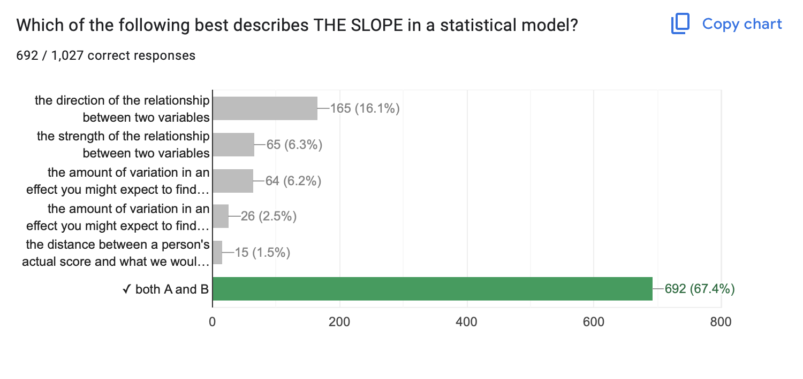
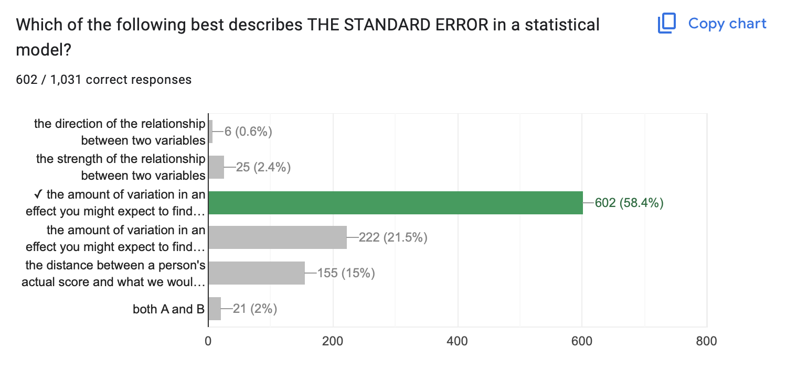
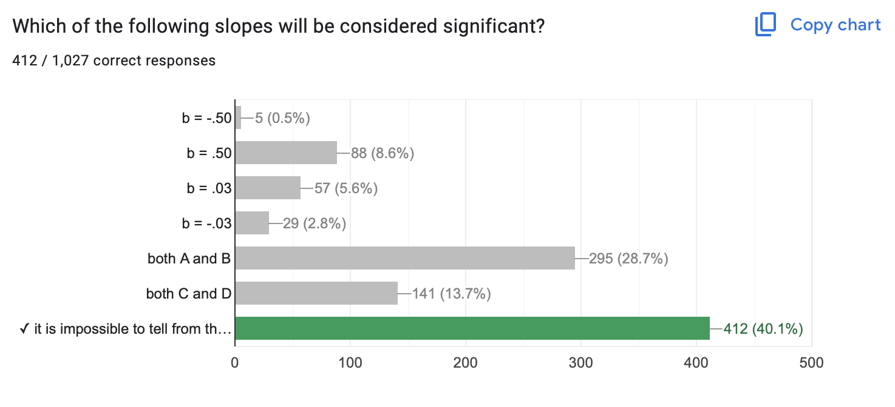
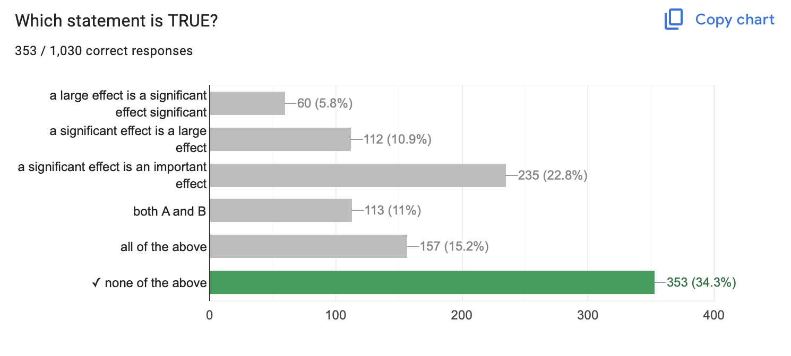
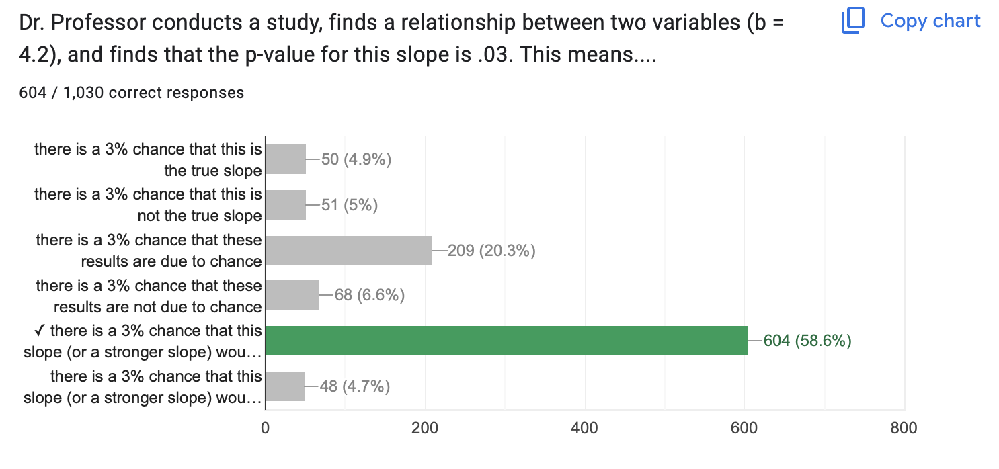
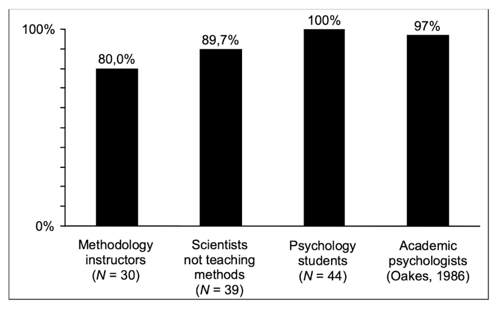

## Welcome Back :) {.smaller}

```{r}
#| include: false
library(gplots)
d <- read.csv("~/Dropbox/!WHY STATS/Chapter Datasets/Covid Behavior Data/covid_behavior_data.csv", stringsAsFactors = T)
```

[Check-In (No R Needed): Testing Theories](https://docs.google.com/forms/d/e/1FAIpQLSeQNQq1O8s_f0tx3l2FxIJo9Rt6zgmZA40T2AqLFdwjFtFtpA/viewform?usp=sf_link)

::::: columns
::: {.column width="60%"}
```{r}
mod1 <- lm(Handwash ~ gender, data = d)
summary(mod1)
```
:::

::: {.column width="40%"}
```{r}
#| message: false
#| warning: false
#| fig-width: 5
#| fig-height: 5
plotmeans(Handwash ~ gender, data = d,
          col = "white", barcol = "white", ylim = c(1,5))
```
:::
:::::

## The Vibe {.smaller}

{fig-align="center" width="80%"}

## Need This Energy{.center}





## NHST Review. {.smaller}

::: panel-tabset
### Slope

-   Direction & Strength of a Relationship
-   Hard to evaluate strength across models if the units differ too.



### Standard Error

-   The amount of variation in an effect you might expect to find due to chance if the null hypothesis were "true".



### Significance is Not...

-   ...about slope! Large slope & sampling error = NOT SIGNIFICANT



### Significance is Not

-   **...about size :** you can be VERY confident that a small effect is not due to sampling error.
-   **...about importance :** why does the effect matter?\
-   **...about truth :** our estimates of sampling error are all made up.



### Significance Is...

**A p-value of .03 means...there is a 3% chance that this slope (or a stronger slope) would be found due to chance if the true correlation was zero.**



### ...Confusing.

Haller, H., & Krauss, S. (2002). [Misinterpretations of significance: A problem students share with their teachers](https://www.metheval.uni-jena.de/lehre/0405-ws/evaluationuebung/haller.pdf). Methods of Psychological Research, 7(1), 1-20.

{fig-align="center" width="80%"}

### Other Questions?

{fig-align="center" width="80%"}
:::

## More Practice {.smaller}

Evaluate the relationships between the variables (slope, significance, importance)

:::::::::::::::::: panel-tabset
### Model 1.

Is there a relationship between narcissism (DV = NPI) and testosterone?

::::: columns
::: {.column width="60%"}
```{r}
h <- read.csv("~/Dropbox/!WHY STATS/Chapter Datasets/Hormone Data/hormone_dataset.csv", stringsAsFactors = T)
mod1 <- lm(NPI ~ test, data = h)
summary(mod1)
```
:::

::: {.column width="40%"}
```{r}
#| fig-width: 5
#| fig-height: 5

plot(NPI ~ test, data = h)
abline(mod1, lwd = 5)
```
:::
:::::

### Model 2.

Is there a relationship between narcissism (DV = NPI) and sex?

::::: columns
::: {.column width="60%"}
```{r}
library(gplots)
mod2 <- lm(NPI ~ sex, data = h)
summary(mod2)
```
:::

::: {.column width="40%"}
```{r}
#| fig-width: 5
#| fig-height: 5
plotmeans(NPI ~ sex, data = h, connect = F)
```
:::
:::::

### Model 3.

Is there a relationship between testosterone (DV = test) and sex?

::::: columns
::: {.column width="60%"}
```{r}
mod3 <- lm(test ~ sex, data = h)
summary(mod3)
```
:::

::: {.column width="40%"}
```{r}
#| fig-width: 5
#| fig-height: 5
plotmeans(test ~ sex, data = h, connect = F)
```
:::
:::::

### RECAP.

**In models 1-3, we wee**

::::: columns
::: {.column width="30%"}
1.  Testosterone is related to narcissism.
2.  Sex is related to testosterone.
3.  Sex and testosterone are related to each other......
:::

::: {.column width="70%"}
:::
:::::

### NEXT TIME

**In models 1-3, we wee**

::::: columns
::: {.column width="30%"}
1.  Testosterone is related to narcissism.
2.  Sex is related to testosterone.
3.  Sex and testosterone are related to each other......
:::

::: {.column width="70%"}
```{r}
mod4 <- lm(NPI ~ sex + test, data = h)
summary(mod4)
```
:::
:::::
::::::::::::::::::

## BREAK TIME : MEET BACK AT 3:45


# [Milestone #5 : Final Project Analyses](https://docs.google.com/document/d/1DxiIxm_sRtm8t5FEOWhOJluJOo6ZPUI_eZTS13K4CxA/edit?tab=t.0)

## GOAL : Define a Likert Scale

### RECAP : Likert Scale (Self-Esteem)

### IN R : Three Steps {.smaller}

::: panel-tabset
#### 0. Load Data, Etc.

```{r}
#| echo: true
d <- read.csv("~/Dropbox/!WHY STATS/Chapter Datasets/Self-Esteem Dataset/data.csv",
              stringsAsFactors = T,
              na.strings = "0", sep = "\t") # 0 = missing data!
head(d) # checking to make sure it loaded okay
summary(as.factor(d$Q1)) # making sure zeros got turned into NAs
nrow(d) # sample size
```

#### 1. Organize Items

```{r}
#| echo: true
poskey.df <- d[,c(1:2,4,6,7)] # pos-keyed items (from the codebook)
negkey.df <- d[,c(3,5,8:10)] # neg-keyed items (from the codebook)
negkeyR.df <- 5-negkey.df # reverse scoring the neg-keyed items
SELFES.DF <- data.frame(poskey.df, negkeyR.df) # bringing it all 2gether.

head(SELFES.DF)

```

#### 2. Check alpha

```{r}
#| echo: true
library(psych) # loading the library
psych::alpha(SELFES.DF) # alpha reliability.
```

#### 3. Average items

```{r}
#| echo: true
#| fig-width: 5
#| fig-height: 5
#| fig-align: center
d$SELFES <- rowMeans(SELFES.DF, na.rm = T) # creating the scale
hist(d$SELFES, col = 'black', bor = 'white', # the graph
     main = "Histogram of Self-Esteem", 
     xlab = "Self-Esteem Score", breaks = 15)
```
:::

### PLAN : Defining a Likert Scale {.smaller}

1.  What variables are measured with multiple items?
2.  Are any reverse scored? (subtract from sum of low + high range of response scale to negatively key)
3.  GOAL : one variable that combines (average or sums) the multiple items together.

### GOAL : Create a summary table. {.smaller}

```{r}
#| echo: true
library(jtools)
export_summs(mod1, mod2, mod4, error_pos = "right",
             coefs = c("Testosterone" = "test",
                       "Sex (0 = M; 1 = F)" = "sex"), digits = 3)
```

### PLAN : Defining Your Models. {.smaller}

1.  Write out your linear model.
2.  Define and graph your variables.
    -   do the data look good?
    -   how do your participants vary?
3.  Define your bivariate linear models.
    -   what's the pattern look like
    -   what's the slope and $R^2$ value?
4.  Define the multivariate model
    -   `mod3 <- lm(DV ~ IV1 + IV2, data = d)`
    -   NO GRAPH FOR THIS!
    -   can play around with jtools to create a summary table if time :)

## THE END.

{width="80%"}
