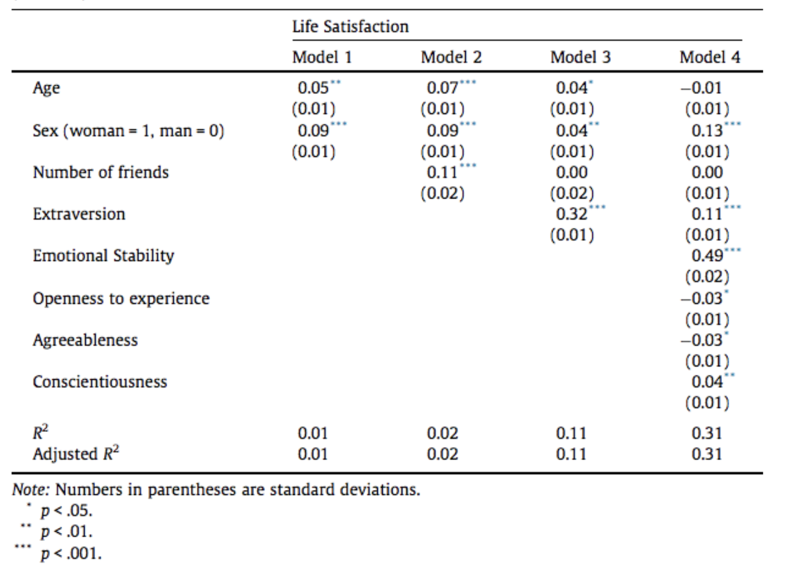
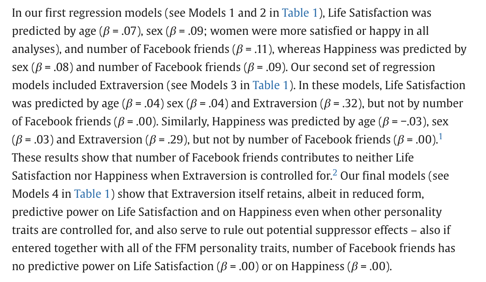
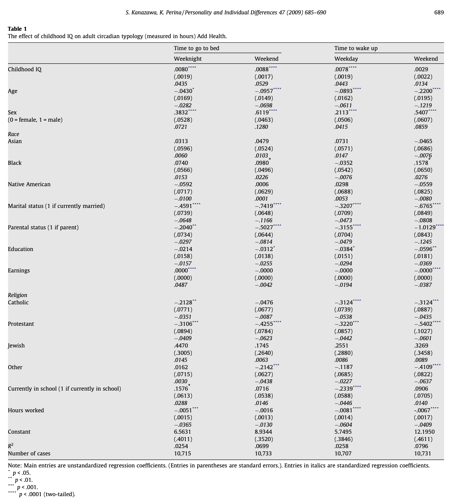

## [Check-In : Interpreting A Multivariate Regression Table](https://docs.google.com/forms/d/e/1FAIpQLSe4ksB7pNrEpdQcwRG-fOn5Ti5Q85a5ZFJwyC4EckVVhZkA6g/viewform?usp=header)

The data below are from a REAL-LIFE study, where researchers studied the relationship between Life Satisfaction, demographic variables, the number of facebook friends that a person had, and other personality variables.

These relationships were reported in the table below.



### Interpreting the Regression Table

-   Model 1 :

-   Model 2 :

-   Model 3 :

-   Model 4 :

### From Regression Table to Results Section



## A Big Regression Table

The study below predicted circadian typology (time a person went to bed) from a variety of other variables.

-   **ICE BREAKER :** If you could learn one skill all at once (like Neo in the Matrix; have y'all seen that movie???), what would it be??

-   **Evaluate the table above and think about multiple regression.**

    -   What are some patterns in the data below that seem important?

    -   How would you write about these results in a final paper result section?

    -   What is the multivariate regression you will include in your final project? why might this be interesting to test?



[Full Source](https://personal.lse.ac.uk/kanazawa/pdfs/paid2009.pdf)

## Optional : Chapter 12 (on Interaction Effects)

-   **Key Idea :** the effect of the IV on the DV *depends on* another IV.

-   **Example :** Average Time to Solve Puzzle \~ Sex \* Culture + Error


## Final Project Workshop


-   Reviewing Regression Tables —\> Writing Your Results

-   Reviewing Introduction Outlines

-   Reviewing Methods


## Chapter 10 Recap : Multiple Regression (Hair Length Predicts Height?!?!?????)

### Data Cleaning and Descriptive Statistics

```{r}
## Data Cleaning
library(gplots)
d <- read.csv("~/Dropbox/!WHY STATS/Class Datasets/101 - Class Datasets/Mini Data/mini_DATA.csv", stringsAsFactors = T)

d$height[d$height < 10 | d$height > 100] <- NA
levels(d$is.female)[1] <- NA
#levels(d$long.hair)[1] <- NA

par(mfrow = c(1,3))
hist(d$height)
plot(d$is.female, xlab = "Is Female?")
plot(d$long.hair, xlab = "Has Long Hair?")
```

### Activity and Discussion : Comparing Models

1.  **ICE-BREAKER :**

    1.  *let's keep it light mode :* if you HAD to get a tattoo, what would you get? where would you get it? would it face toward you or other people?

    2.  *bring on the heavy mode :* if you could change one thing about your childhood, what would you change?

2.  **MODEL INTERPRETATION :** What Do You Observe in Model 1? Model 2?

3.  **MODEL 3 :** What Do You Observe Changing About the Slopes from the Bivariate Model (Models 1 and Model 2) to the Multivariate Model (Model 3)?

4.  **Other Questions That You, the Students, Have?**

::: panel-tabset
#### Height \~ long.hair

```{r}
moda <- lm(height ~ long.hair, data = d)
summary(moda)
plotmeans(height ~ long.hair, data = d, connect = F)
```

#### Height \~ is.female

```{r}
modb <- lm(height ~ is.female, data = d)
summary(modb)
plotmeans(height ~ is.female, data = d, connect = F)
```

#### height \~ long.hair + is.female

```{r}
modc <- lm(height ~ long.hair + is.female, data = d)
## NO GRAPH FOR THE MULTIPLE REGRESSION
summary(modc)
```
:::

### IV1 and IV2 are related to each other, and each related to the DV)

```{r}
plot(d$long.hair ~ d$is.female)
```

### Multiple Regression : Visualized in Multi-Dimensional Space!

The code below may not work on your computer; see lecture recording for an interpretation / explanation!

``` r

#install.packages('rgl')
#install.packages('car')
library(car)
library(rgl)

scatter3d(as.numeric(d$is.female), # IV1 - must be numeric (if not already)
          d$height, # DV
          as.numeric(d$long.hair)) # IV2 - must be numeric (if not already)
```

### Reporting Effects in a Regression Table.

**Table 1.** Unstandardized Regression Coefficients; Predicting Height from Long.Hair and Is.Female.

|                             | Model 1 | Model 2 | Model 3 |
|-----------------------------|---------|---------|---------|
| Intercept                   |         |         |         |
| Long.Hair (0 = No; 1 = Yes) |         |         |         |
| Is.Female (0 = No; 1 = Yes) |         |         |         |
| $R^2$                       |         |         |         |

**There's a Package in R For This!**

```{r}
# install.packages("jtools") # a new package!!!
library(jtools) # make sure you installed the new package first.
export_summs(moda, modb, modc,
             coefs = c("Long Hair (0 = No, 1 = Yes)" = "long.hairYes",
                       "Is Female (0 = No, 1 = Yes)" = "is.femaleYes"))
```
