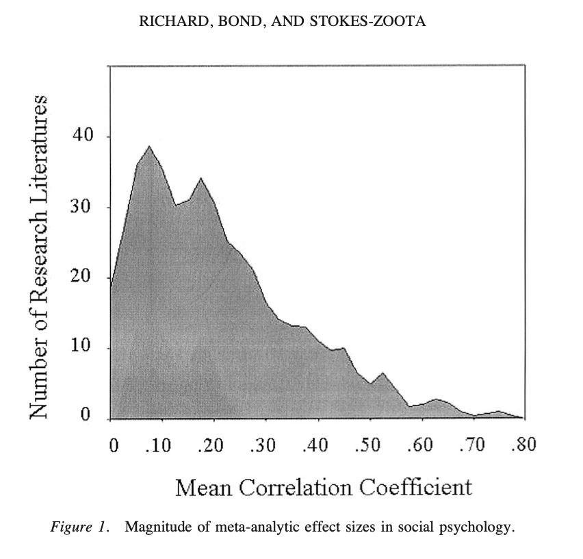
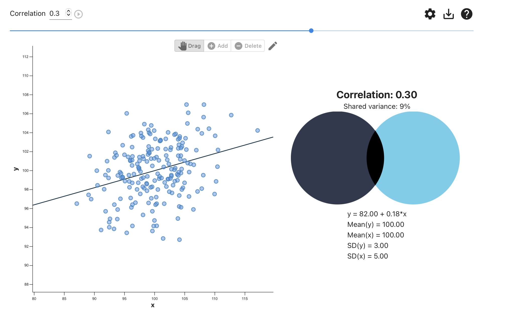
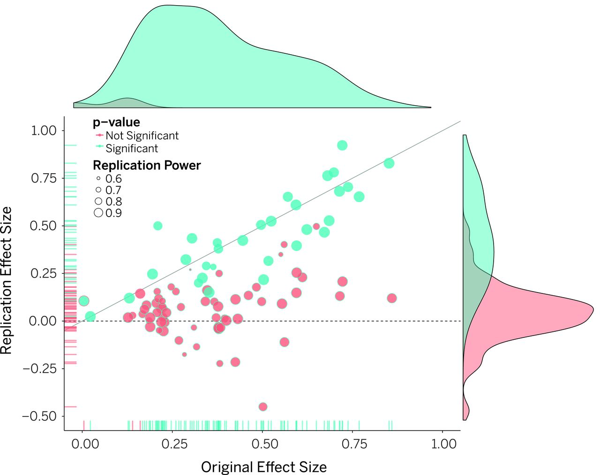
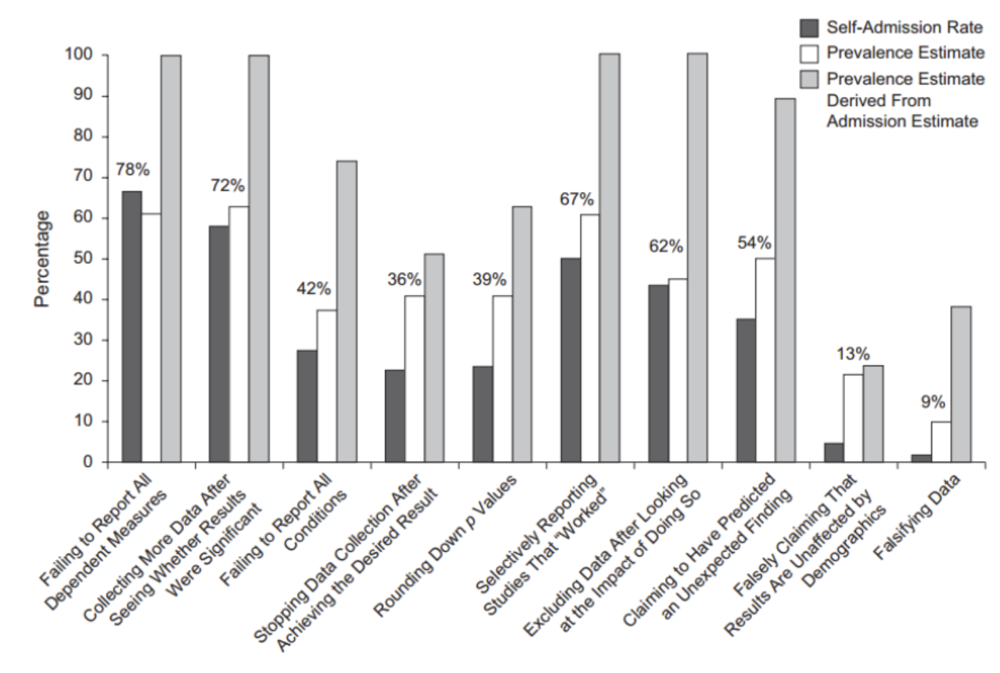
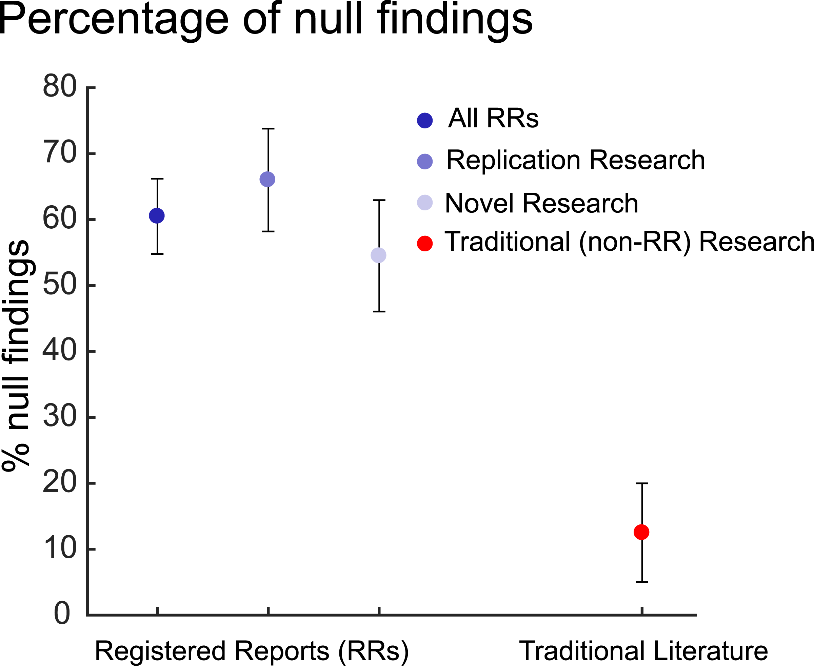
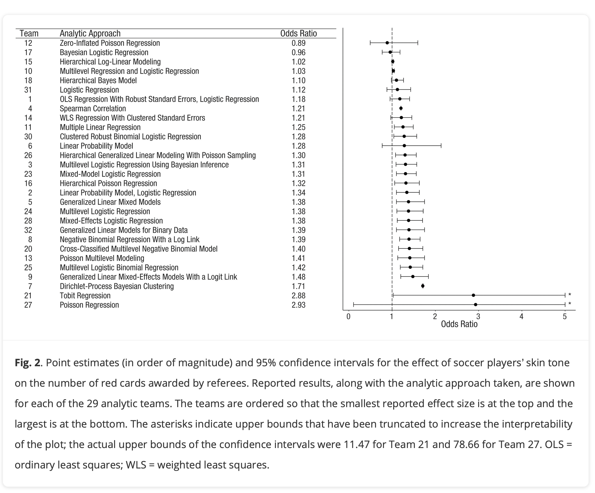
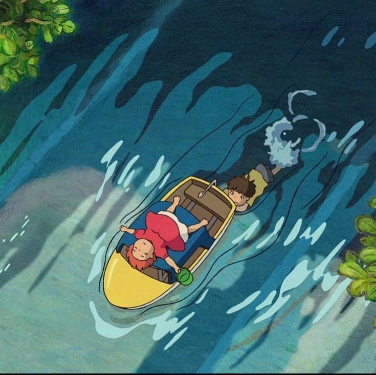
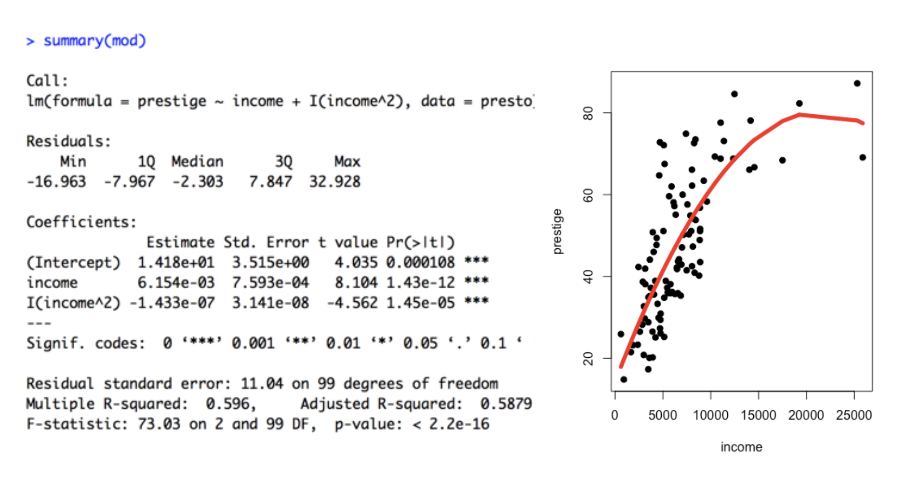
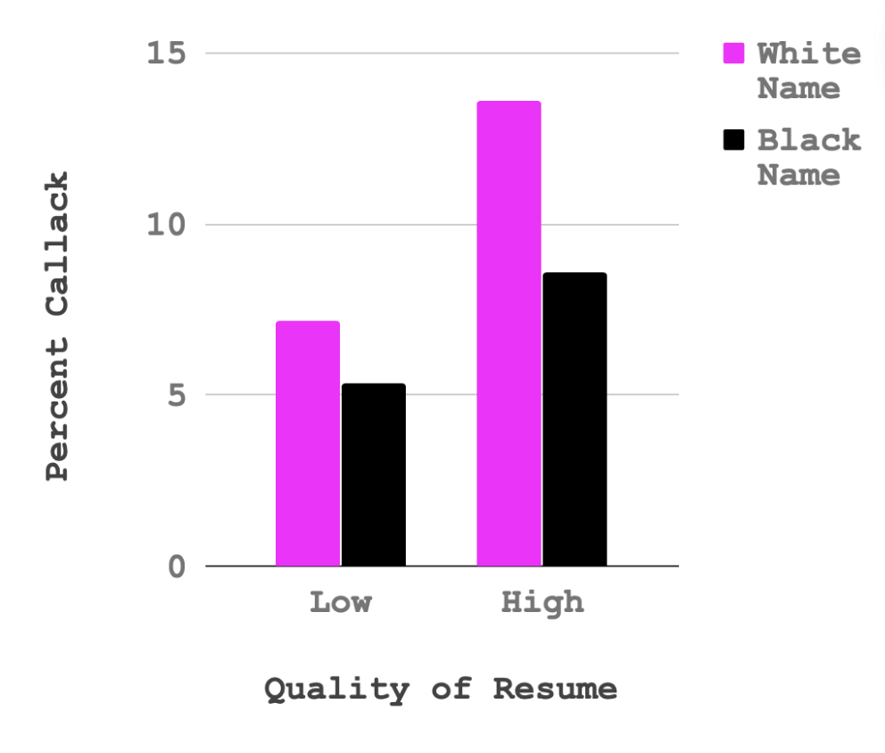
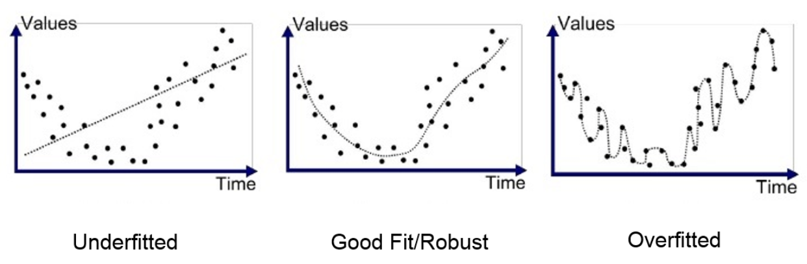

## [Check-In : The End is Near!](https://docs.google.com/forms/d/e/1FAIpQLSfU8f7uodD82JI3QIvpMgKwWDafG5zrtjQ2ZMXX4H0_BqwJYw/viewform?usp=header)

{fig-align="center" width="80%"} 

## The Rich Lyons ~*is our chancellor and the professor of this class has*~ Invited ~*me to give a*~ Distinguished GoBears Guest Lecture

-   Student Example Goes Here

## Final Final Project Stuff

### Professor Advice {.smaller}

##### 1. [**Use the rubric as a guide**](https://docs.google.com/document/d/1DxiIxm_sRtm8t5FEOWhOJluJOo6ZPUI_eZTS13K4CxA/edit?tab=t.0#bookmark=kix.b5sonortvquz)**.**

-   **Use paragraphs and headers to guide the reader.**

    -   Each new idea is a new paragraph. No solid wall of text please!
    -   Headers help orient your reader to the different contents.

-   **"Done is better than perfect".** Prioritize the most important things; set reasonable expectations for yourself and boundaries for the time that you have (e.g., lit review can be superficial; okay if you can't figure out how to create a scale, just

    -   **Make it clear how and where you are doing the work.** Label your sections with headers; make sure your tables and graphs are visible.
    -   **There is no "right" way to do the study.** We want to see evidence that you tried and are learning. (But see the rubric.)

### Professor Advice {.smaller}

#### 2. **Keep it simple.**

-   **Simple measures :**

    -   okay to use one measure of your DV even thought you had two.
    -   okay to simplify your categorical variable (e.g., "which of these 15 music types do you love the most" –\> "do you like experimental jazz (0 = no; 1 = yes)")

-   **Simple models :** DV \~ IV1 + IV2.

-   **Done is Better Than Perfect.**

    -   **Discussion Section :** summary of ways that you could have (or should have) been more complicated in the Discussion Section
    -   **Appendix :** List of [all]{.underline} your measures. Good practice to be fully transparent about what you measured in the study.

### Professor Advice {.smaller}

3.  **STUDENTS WANT TO KEEP THINGS COMPLEX???!**

    -   **OKAY!** All variables included in your models must...
        -   be supported in your introduction (why are you focusing on this variable, and why might / what past research suggests it be related to the DV?)
        -   be described in your measure section.
        -   be supported with enough data (each IV adds a dimension to a graph....need a lot of data for complex models.)

### Writing : Paper Structure

-   Title Page

-   Abstract

-   Introduction

-   Methods (Participants, Measures) --\> Results (Tables, Figures, Written)

-   Discussion Section

### Writing : The Abstract (TLDR of your paper)

**Components of an Abstract :**

-   1-2 sentences : what is your topic and why should we care?

-   1-2 sentences : what did you measure / do in your study?

-   1-2 sentences : what did you find?

-   1-2 sentences : why does this matter?

**Activity : Write an Abstract for Each Other**

-   Professor and Student Example Goes Here :

-   YOUR TURN!

### Writing : The Discussion Section

-   **Summary of Results (and Future Studies) :**

    -   What you found (NO STATS)

    -   Why this matters / how this knowledge could be used / what other questions you might ask in the future?

-   **Limitations and Future Directions**

    -   What would you do differently in your study?

    -   How could (or should) future research address these limitations, and why would that be important to do?

## [Four Validities This Semester](https://journals.sagepub.com/doi/pdf/10.1177/09637214211067779?casa_token=J2fnwbroJB0AAAAA:rTHf9SZpJvyTDvvajR8Fb9PmHCDqZicCgxrAfhLI7Nl-OnGfLZjrbe_oNobr-KZKSFMCQE--2e-A)

1.  Construct Validity
2.  External Validity
3.  Internal Validity
4.  Statistical Conclusion Validity

### 1. Construct Validity {.smaller}

-   Did we measure what we want to measure?
-   (If not, how might this influence the results?)
-   Discuss : how did your measures get at "the truth"? have "error"?

### 2. External Validity {.smaller}

::::: columns
::: {.column width="50%"}
Do our results generalize to other samples?

-   sampling error : do we trust the statistical testing?
-   sampling bias : who are the people who we studied? what differences might influence the results (and how)?
:::

::: {.column width="50%"}
:::
:::::

### 3. Internal Validity. {.smaller}

::::: columns
::: {.column width="50%"}
-   Is the relationship between the variables causal? reverse causal? 3rd variable?
-   (Is an experiment possible? What confounds would be most important to control??)
:::

::: {.column width="50%"}

:::
:::::

## 4. Statistical Conclusion Validity{.smaller}

-   Was your hypothesis supported by the data?
-   Was the relationship between two variables strong?
-   Was the relationship between two variables strong?


### 4. Statistical Conclusion Validity{.smaller}

:::{.panel-tabset}

#### Prediction (and Error)

Best estimates that the average correlation between two variables is *r \< .30*

[{fig-align="center" width="60%"}](https://journals.sagepub.com/doi/pdf/10.1037/1089-2680.7.4.331?casa_token=sPnTYYnQZGkAAAAA:_3gOMjwp8AeQzdcBG2yd3_2FQ3Yuh9Cie_f8GxIPN1n4p9fcjrniLIHbQtUTJZI20WaFNdmUgyPD)

#### r = .3

What a r = .3 looks like. \[[Source](https://rpsychologist.com/correlation/)\]

{fig-align="center" width="80%"}

#### r = .3??

A "correlation" / slope could look like any of the following graphs \[[Anscombe's Quartet](https://en.wikipedia.org/wiki/Anscombe%27s_quartet)\]

{fig-align="center" width="70%"}

#### r = .3??!?

**The Replication Crisis = Hard to Trust Any One Study.**

[{fig-alt="Diagonal line represents replication effect size equal to original effect size. Dotted line represents replication effect size of 0. Points below the dotted line were effects in the opposite direction of the original. Density plots are separated by significant (blue) and nonsignificant (red) effects." fig-align="center" width="60%"}](https://www.science.org/doi/10.1126/science.aac4716)

:::

### 4. Statistical Conclusion Validity {.smaller}

Are we adhering to “best practices” and doing the analyses correctly?

:::{.panel-tabset}

#### p-hacking

-   **p-hacking :** making changes to your model or data in order to "get" your p-values.

    -   **visit :** <https://stats.andrewheiss.com/hack-your-way/>

    -   **model : economic performance \~ political power + error**

        -   decide how to operationalize political power

        -   decide how to operationalize economic performance

        -   decide how to adjust your model
        
#### bad methods



#### open science

-   **Open-Science :** be transparent. share code and data; science is a process.

    -   [Center for Open Science](https://www.cos.io/open-science)

    -   [Open Science Foundation (OSF)](https://osf.io). Hosting data.

-   [link to pre-registration guides](https://www.cos.io/initiatives/prereg) 

#### pre-registration works

{width="60%"}

#### "Many Labs"

[be transparent & collaborative; science is a process.](https://journals.sagepub.com/doi/10.1177/2515245917747646) 

{fig-align="center" width="71%"}

:::

### X. IS Validity Possible? {.smaller}

1.  **is there a "truth" to people?** maybe there is no truth? maybe the endeavor is impossible (post-positivism), defined entirely by our processes (social constructivism), or bad (anti-positivism).

2.  **should there be a truth to people?** why does this matter? who will use this knowledge in practice (to help? to hurt?)

```         
“If you want knowledge, you must take part in the practice of changing reality. If you want to know the taste of a pear, you must change the pear by eating it yourself. If you want to know the structure and properties of the atom, you must make physical and chemical experiments to change the state of the atom. If you want to know the theory and methods of revolution, you must take part in revolution. All genuine knowledge originates in direct experience.” - Mao
```

## BREAK TIME : MEET BACK AT



## The Learning is Over; Would You Like to Learn More?

## Models Are Complicated

### 1. Quadratic Effects : A Regression Line Can Bend



### 2. Interaction Effects{.smaller}

[Chapter on Interaction Effects](https://catterson.github.io/ystats/chapters/11R_InteractionFX.html) The Regression Line Changes Depending on Some Other Variable

:::{.panel-tabset}

#### The Effect(s) Depend.

[{fig-align="center" width="50%"}](https://www.aeaweb.org/articles?id=10.1257/0002828042002561)

#### Fanon

-   **Frantz Fanon, Black Skin White Masks (1967) :** “To speak means to be in a position to use a certain syntax, to grasp the morphology of this or that language, but it means above all to assume a culture, to support the weight of civilization...Every colonized people--in other words, every people in whose soul an inferiority complex has been created by the death and burial of its local cultural originality--finds itself face to face with the language of the civilizing nation; that is, with the culture of the mother country. The colonized is elevated above his jungle status in proportion to his adoption of the mother country's cultural standards.”

:::

### 3. Overfitting : When You Get Too Complicated



### 4. *Generalized* Linear Models (e.g., "Logistic Regression")

### what's wrong?

::: panel-tabset

#### the graph

```{r}
#| fig-width: 5
#| fig-height: 5

h <- read.csv("~/Dropbox/!GRADSTATS/Datasets/Hormone Data/hormone_dataset.csv")
h$sexF <- as.factor(h$sex)
levels(h$sexF) <- c("Male", "Female")
h$sexF <- relevel(h$sexF, ref = "Female")

plot(sex ~ test_mean, data = h, xlab = "Testosterone", ylab = "Sex (1 = Male, 2 = Female)")
mod2 <- lm(sex ~ test_mean, data = h)
abline(mod2)
```

#### the model
```{r}
summary(mod2)
```

:::

### what's better?

::: panel-tabset
#### the graph

```{r}
#| fig-width: 5
#| fig-height: 5

h$sexR <- h$sex - 1
glmod <- glm(sexR ~ test_mean, data = h, family = "binomial")
plot(sexR ~ test_mean, data = h,
     xlab = "Testosterone",
     ylab = "Probability of Being Female")
curve(predict(glmod, data.frame(test_mean=x), type = "resp"), add = T, col = "red", lwd = 2)
```

#### the model

```{r}
summary(glmod)
```
:::


## 5. Multilevel Models (MLM). Conceptual Understanding

### Definition : Multilevel Models (MLM)

-   Hierarchical linear models, mixed effects models, random effects models, others?

    -   **Level 1 :** the smallest unit of analysis (where the DV is measured)

    -   **Level 2 :** organize non-independent responses at Level 1.

### Examples :

::: panel-tabset
#### Students in School

**non-independence :** students in a school are similar to each other

[{width="80%"}](https://www.analyticsvidhya.com/blog/2022/01/a-brief-introduction-to-multilevel-modelling/)

#### Repeated Measure Studies

**non-independence :** person at time 1 is still the same person at time 2

[{fig-align="center" width="80%"}](https://www.youtube.com/watch?v=itxBT5rnxJ0)
:::

### The Formulas

***The Linear Model***

$$\huge y = \beta_0 + \beta_1x_1 + ... + \beta_kx_k + \epsilon$$

{width="74%"}

### Why Are We Doing This? {.smaller}

1.  **The Assumption of Independence Has Been Violated! (MLM increases our power and reliability as scientists.)**
    -   Multiple measures of an individual gives you a more reliable estimate of what and who they are.
    -   A person serves as their own control, so can more precisely examinine how a person changes over time.
2.  **Model more complex phenomenon.**
    -   How people change over time (within-person variation).
    -   Simpson's Paradox

## How Do We Do This in R?

### Example : The Sleep Dataset {.smaller}

:::::::::::: panel-tabset
##### Details

From the `?sleep` dataset: "Data which show the effect of two soporific drugs (increase in hours of sleep compared to control)."

-   Extra : increase in hours of sleep
-   Group : drug given (1 = control; 2 = drug)
-   ID : patient ID

##### "Between Person"

::::: columns
::: {.column width="50%"}
```{r}
#| fig-width: 8
#| fig-height: 8
library(ggplot2)
ggplot(sleep, aes(y = extra, x = group)) + 
  geom_point(size=2) + 
  stat_summary(fun.data=mean_se, color = 'red', size = 1.25, linewidth = 2)
```
:::

::: {.column width="50%"}
```{r}
lmod <- lm(extra ~ as.factor(group), data = sleep)
summary(lmod)
```
:::
:::::

##### "Within-Person"

::::: columns
::: {.column width="50%"}
```{r}
#| fig-width: 6
#| fig-height: 6
ggplot(sleep, aes(y = extra, x = group, color = ID)) + 
  geom_point(size=2) + 
  geom_line(aes(group = ID), linewidth = 0.75)
```
:::

::: {.column width="50%"}
**Fixed Effects :** The "Average" across all the grouping variables.

```{r}
#install.packages("lme4")
library(lme4)
library(lmerTest)
library(Matrix)
mlmod <- lmer(extra ~ as.factor(group) + (1 | ID), data = sleep)
summary(mlmod)
```
:::
:::::

##### Random Effects

::::: columns
::: {.column width="50%"}
```{r}
#| fig-width: 6
#| fig-height: 6
ggplot(sleep, aes(y = extra, x = group, color = ID)) + 
  geom_point(size=2) + 
  geom_line(aes(group = ID), linewidth = 0.75)
```
:::

::: {.column width="50%"}
-   ICC = Intraclass Correlation Coefficient = how much the variation in our grouping variable (here : subject) explains total variation.

-   To calculate : take variance of intercept / total variance

    ```{r}
    2.8483 / (2.8483 + 0.7564)
    ```

-   OR :

    ```{r}
    library(performance)
    icc(mlmod)
    ```
:::
:::::
::::::::::::


### Statistics Exists Outside of Psych 101

#### Books and Blogs and YouTube!

-   **Books :**

    -   R for Data Science (Hadley Wickham) : <http://r4ds.had.co.nz/>

    -   Models Demystified : <https://m-clark.github.io/book.html>

-   **Blogs :**

    -   Andrew Gelman blog : <http://andrewgelman.com/> 

    -   Nelson, Simons, Simonsohn : [datacolada.org/](http://datacolada.org/)

-   **Twitter / BlueSky Follows :**

    -   [\@siminevazire](https://twitter.com/siminevazire) (personality & open science)

    -   [\@djnavarro](https://mobile.twitter.com/djnavarro) (cognitive sci and r art)

    -   [\@NeilLewisJr](https://twitter.com/NeilLewisJr) (psych and education)

### Practice The Thing You Want to Do!

-   **RA —\> Honors Thesis Pipeline.** Psych 199 positions are [posted on the psych website](https://psychology.berkeley.edu/students/undergraduate-program/independent-study), but also do direct reach out to grad students who are involved in research that interests you.

-   [**Other Supported Research Opportunities at Cal**](https://research.berkeley.edu)**.** Go bears.

-   [**Berkeley Undergraduate Research Journal.**](https://buj.studentorg.berkeley.edu)Maybe your final project goes here?

### FAREWELL!!

{fig-align="center" fig-width = 60%}
