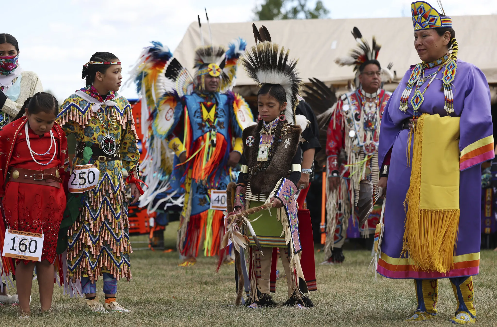
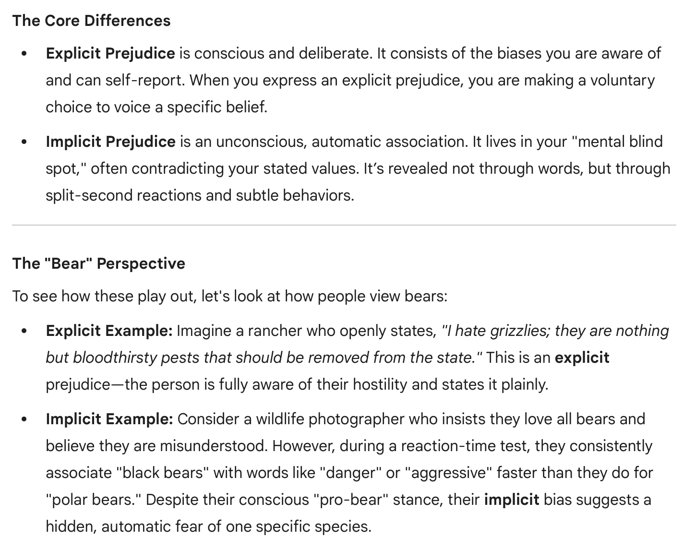
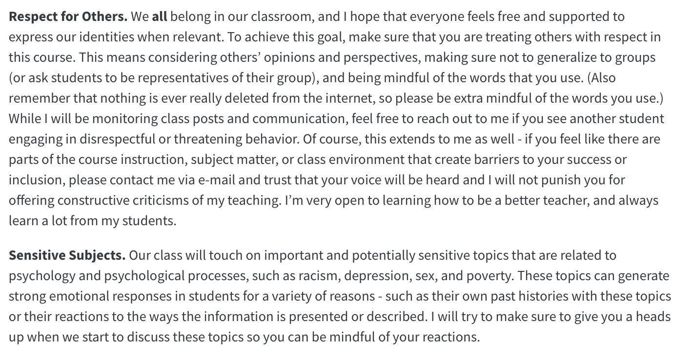
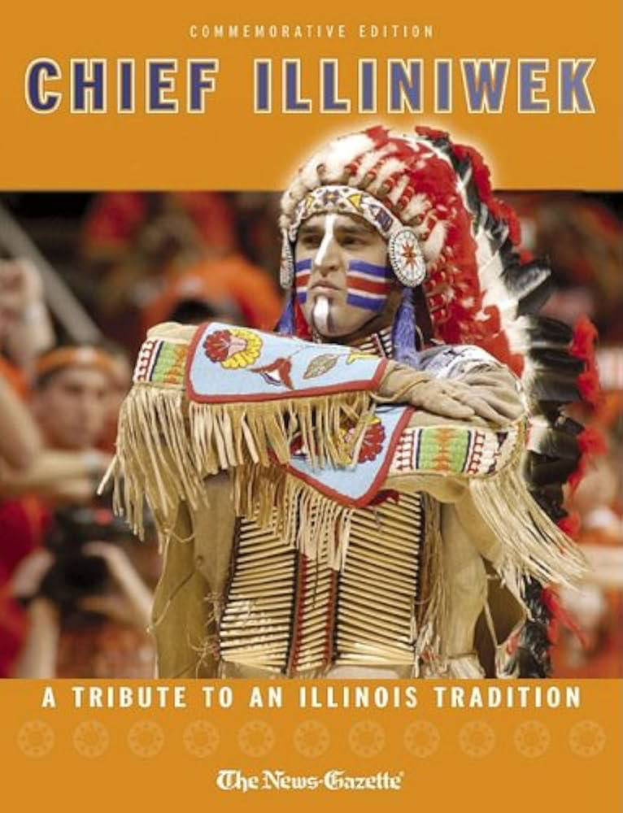
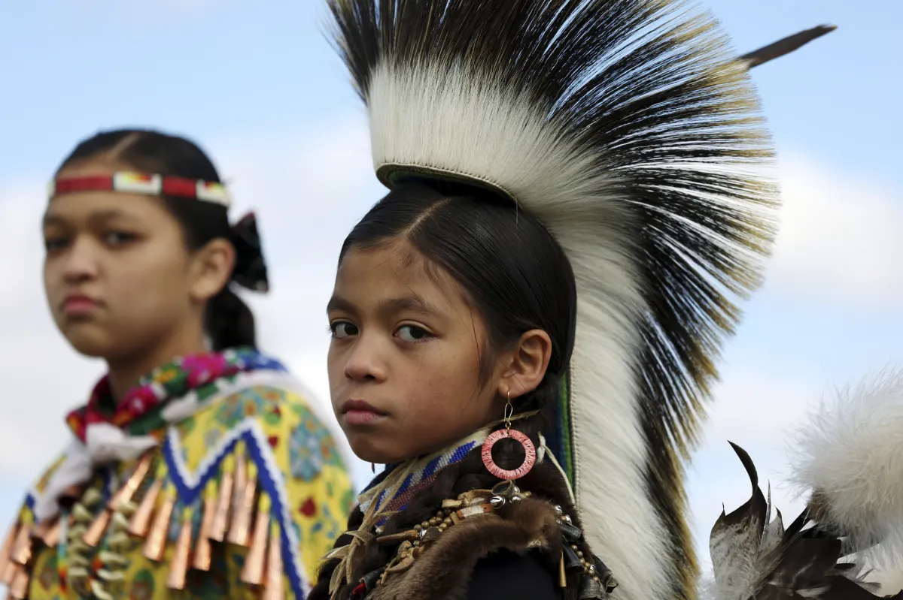
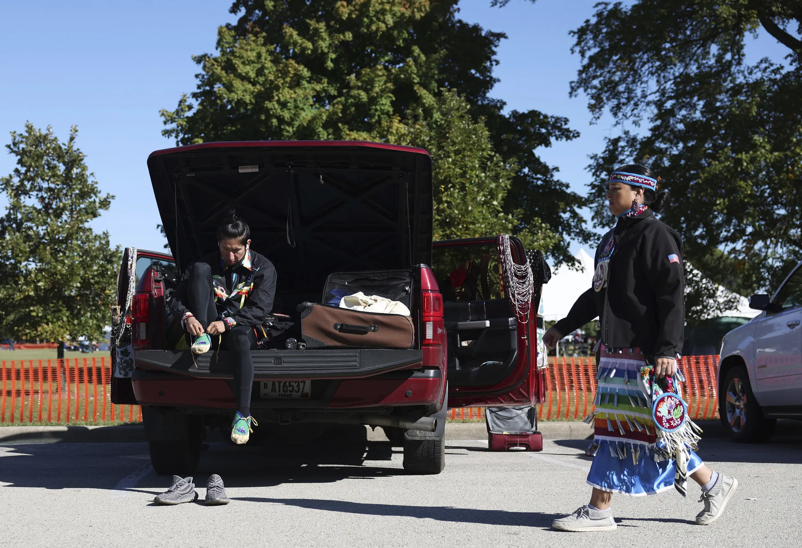
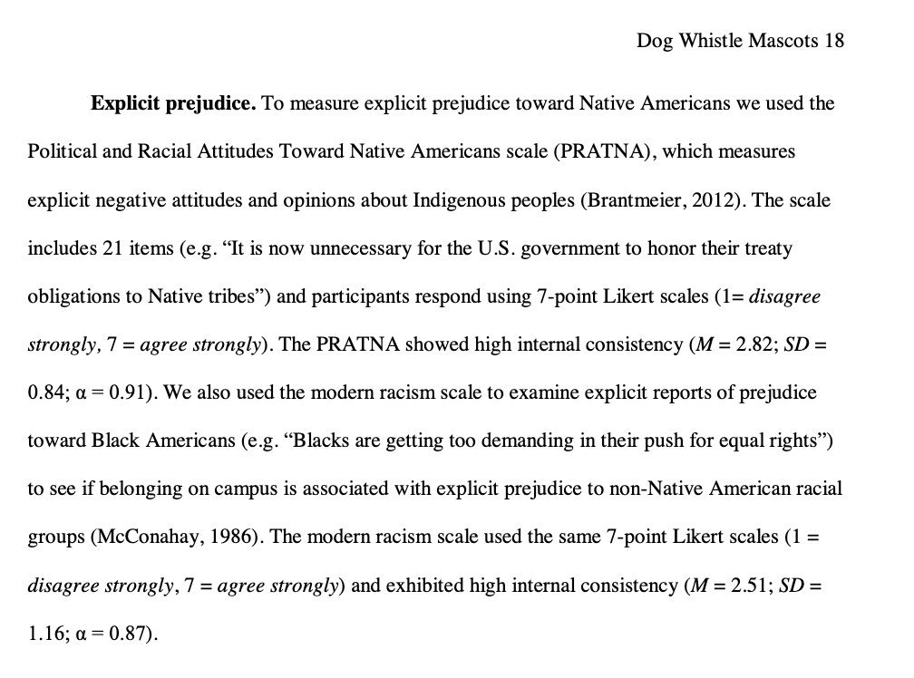
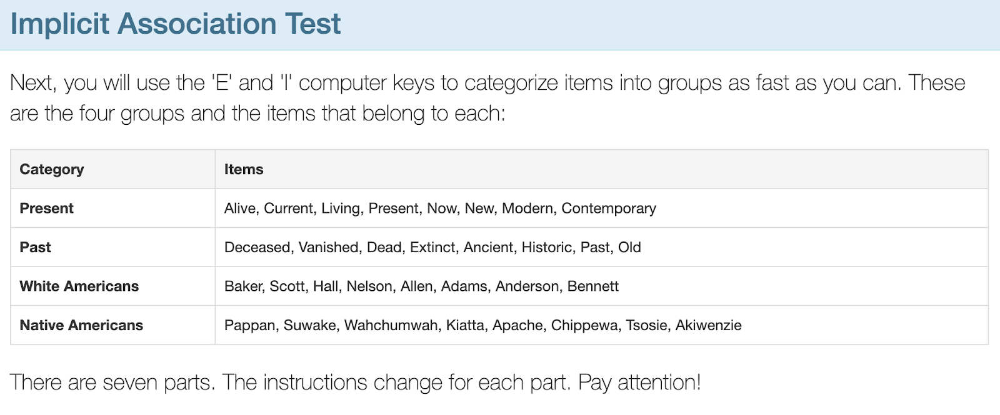
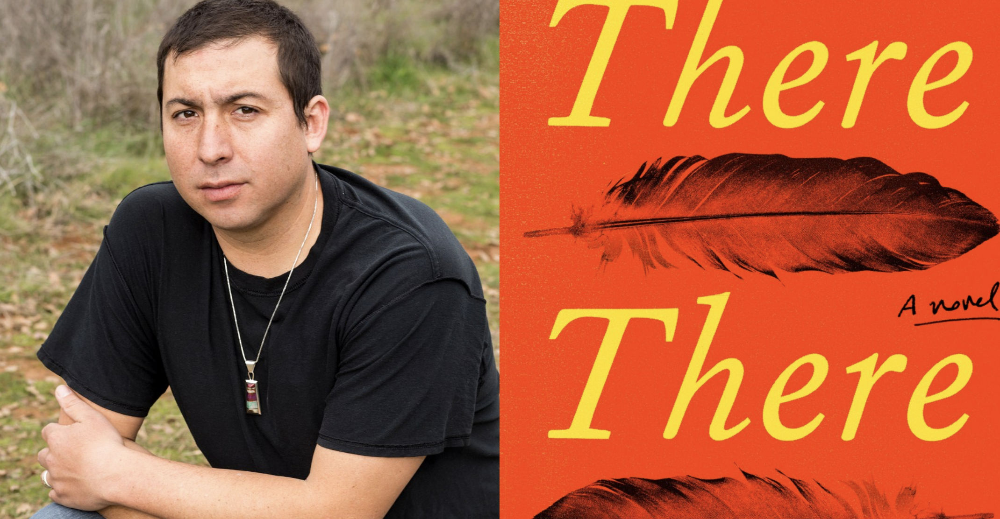
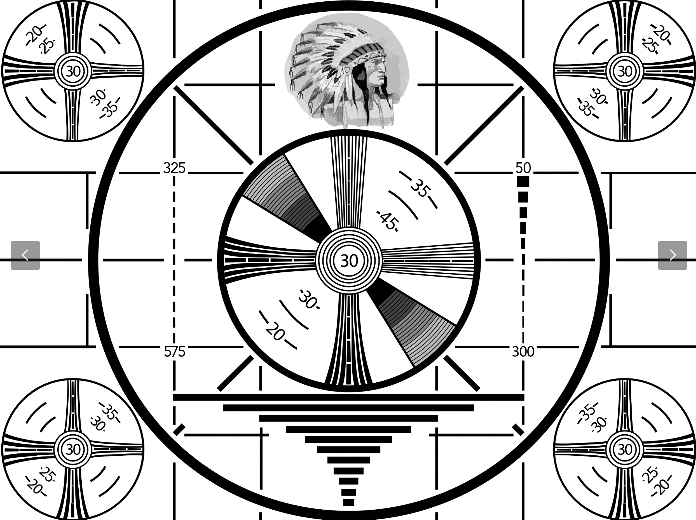

## [Check-In: the Mascot Dataset](https://docs.google.com/forms/d/e/1FAIpQLSdrgiekPpIjCHqi_ALSJoZseMKC3BfkUGx2eC3QCExESX8zoQ/viewform?usp=sf_link){.smaller}

:::: {.panel-tabset style="font-size: 16px"}
#### tabs for check-in

[{fig-align="center" width="50%"}](https://www.chicagotribune.com/2022/10/09/photos-the-69th-annual-chicago-powwow/)

#### AI Summary

{fig-align="center" width="60%"}

#### measures

::: r-fit-text
|  |  |
|------------------------------------|------------------------------------|
| **Variable** | **Description** |
| attitude | a scale created based on a 13-item survey about attitudes toward native american mascots at UIUC, measured with items such as “I wish the Chief were still the mascot” and “Chief Illiniwek is a racist symbol (negatively-keyed item)”. Higher numbers = more positive rating of the mascot. |
| IATscore | a continuous implicit measure of the person’s unconscious prejudice toward / against Native Americans, measured in terms of how fast people are to associate Native American (vs. White) names with Past (vs. Present) terms. Higher scores = more Present-White and Past-Native American bias. |
| prejudiceNatAm | a continuous explicit measure of the person’s conscious prejudice against Native Ameicans, measured with items such as, “Native Americans are a vanishing culture and there are few “real” Indians” and “It is now unnecessary for the U.S. government to honor their treaty obligations to Native tribes.” Higher numbers = more prejudice against Native Americans. |
: {tbl-colwidths="[30,70]"}
:::

#### syllabus guidelines



#### other guidelines {.smaller}

-   disagree with the point not the person.

-   no name-calling or labels; instead of “you’re racist”...focus on the specific opinion / belief.

-   root things in your experiences; realize that your experiences will bias you; seek to understand and listen from others.

-   not your responsibility to change another person's mind; not going to happen today.

-   keep it slow; let people finish their thought before starting a new one.
::::

## The Mascot Dataset

### Description of Research Question (and Problem) {.smaller}

::::: columns
::: {.column width="70%"}
-   **Researcher (& Berkeley alumnus) [Michael Kraus](http://www.michaelwkraus.com/) :** Informed by his experiences as a new faculty member at the University of Illinois at Urbana-Champaign (on unceded land of the [Illinois Confederation](https://en.wikipedia.org/wiki/Illinois_Confederation))

-   **Research Question :** Why do people differ in their beliefs? (theory : racism is one explanation.)
:::

::: {.column width="30%"}

:::
:::::

### KEY IDEA : you don't always need science to answer questions.

|  |  |
|------------------------------------------------|------------------------|
| [](https://www.chicagotribune.com/2022/10/09/photos-the-69th-annual-chicago-powwow/) | [](https://www.chicagotribune.com/2022/10/09/photos-the-69th-annual-chicago-powwow/) |
| [](https://www.chicagotribune.com/2022/10/09/photos-the-69th-annual-chicago-powwow/) | [](https://www.chicagotribune.com/2022/10/09/photos-the-69th-annual-chicago-powwow/) |

### DISCUSSION

::: {r-fit-text}
-   What previous experiences / exposure to Indigenous culture do you have? How might these experiences bias your belief about the topic?

-   What are the arguments you've heard for why native american mascots are / are not racist?

-   Do we need this science? Most indigenous groups say they do not want their culture represented as mascots.
:::

### Link to Data and Description of Variables

-   [Link to Mascot Dataset](https://www.dropbox.com/s/sknsv99q8gvlpfh/mascot_data.csv?dl=0) + [Full Codebook](https://www.dropbox.com/scl/fi/8kbh8zqcqcx6g9jurl8up/CODEBOOK-Mascot_Data.pdf?rlkey=ny3okktolmyezbwzim3aiw5sl&dl=0)
-   **Implicit and Explicit Prejudice in the Mascot Dataset**

:::: panel-tabset
#### Overview of Variables

::: r-fit-text
|  |  |
|-------------------------|-----------------------------------------------|
| **Variable** | **Description** |
| attitude | a scale created based on a 13-item survey about attitudes toward native american mascots at UIUC, measured with items such as “I wish the Chief were still the mascot” and “Chief Illiniwek is a racist symbol (negatively-keyed item)”. Higher numbers = more positive rating of the mascot. |
| IATscore | a continuous implicit measure of the person’s unconscious prejudice toward / against Native Americans, measured in terms of how fast people are to associate Native American (vs. White) names with Past (vs. Present) terms. Higher scores = more Present-White and Past-Native American bias. |
| prejudiceNatAm | a continuous explicit measure of the person’s conscious prejudice against Native Ameicans, measured with items such as, “Native Americans are a vanishing culture and there are few “real” Indians” and “It is now unnecessary for the U.S. government to honor their treaty obligations to Native tribes.” Higher numbers = more prejudice against Native Americans. |

: {tbl-colwidths="\[30,70\]"}
:::

#### Explicit Prejudice



#### Implicit Prejudice



Note : the IAT is not a perfect measure, and there’s a fair amount of debate about whether it is a reliable and valid measure as claimed (see here and here and here for academic examples of some of this debate). FWIW my hot take is that I believe a) implicit measures are really hard to quantify, b) the underlying mechanism that experiences shape our cognition is real, c) we live in a society that prioritizes white and male voices in various ways (history education; modern media; etc.), d) that A-C together would suggest it is very likely people would hold unconscious biases that reflect those in society, and E) it’s important to identify and name those biases if you want to address them. Happy to chat more; thx for attending my footnote talk. Anyway, [here’s a link to learn more or take a test for yourself](https://implicit.harvard.edu/implicit/takeatest.html).
::::

### Other Resources to Learn More About Indigenous Culture.

-   **Violence against indigenous peoples [in history](https://en.wikipedia.org/wiki/American_Indian_Wars) and [today](https://inthesetimes.com/features/native_american_police_killings_native_lives_matter.html) and [in our language](https://www.npr.org/sections/codeswitch/2013/09/09/220654611/are-you-ready-for-some-controversy-the-history-of-redskin)**

-   **History of [Indigenous peoples in California](https://guides.lib.berkeley.edu/IndigenousCABancroft) and [on Berkeley’s campus](https://cejce.berkeley.edu/nasd)**

-   Robin Wall Kimmerer’s [Braiding Sweetgrass : Indigenous Wisdom, Scientific Knowledge, and the Teaching of Plants](https://bookshop.org/books/braiding-sweetgrass/9781571313560)

## [Check-Out & Break, Meet at :](https://docs.google.com/forms/d/e/1FAIpQLSetVEXTeBDLiCVpOKKd4L0Wy4W0qkE2Nukhim5FvYJpLAyN2A/viewform?usp=sf_link)

Tommy Orange's [*THERE THERE*.](https://bookshop.org/books/there-there-9780525436140/9780525436140)

::: panel-tabset
#### Excerpt

Scroll to read.

```         
"In the dark times 
Will there also be singing? 
Yes, there will also be singing. 
About the dark times?" - Bertolt Brecht


There was an Indian head, the head of an Indian, the drawing of the head of a headdressed, long haired, Indian depicted, drawn by an unknown artist in 1939, broadcast until the late 1970s to American TVs everywhere after all the shows ran out. It's called the Indian Head Test Pattern. If you left the TV on, you'd hear a tone at 440 hertz—the tone used to tune instruments—and you'd see that Indian, surrounded by circles that looked like sights through rifle scopes. There was what looked like a bullseye in the middle of the screen, with numbers like coordinates. The Indian head was just above the bullseye, like all you'd need to do was nod up in agreement to set the sights on the target. This was just a test. 

In 1621, colonists invited Massasoit, chief of the Wampanoags, to a feast after a recent land deal. Massasoit came with ninety of his men. That meal is why we still eat a meal together in November. Celebrate it as a nation. But that one wasn't a thanksgiving meal. It was a land deal meal. Two years later there was another, similar meal, meant to symbolize eternal friendship. Two hundred Indians dropped dead that night from supposed unknown poison.

By the time Massasoit's son Metacomet became chief, there were no Indian-Pilgrim meals being eaten together. Metacomet, also known as King Phillip, was forced to sign a peace treaty to give up all Indian guns. Three of his men were hanged. His brother Wamsutta was, let's say, very likely poisoned after being summoned and seized by the Plymouth court. All of which lead to the first official Indian war. The first war with Indians. King Phillip's War. Three years later the war was over and Metacomet was on the run. He was caught by Benjamin Church, Captain of the very first American Ranger force and an Indian by the name of John Alderman. Metacomet was beheaded and dismembered. Quartered. They tied his four body sections to nearby trees for the birds to pluck. John Alderman was given Metacomet's hand, which he kept in a jar of rum and for years took it around with him—charged people to see it. Metacomet's head was sold to the Plymouth Colony for thirty shillings—the going rate for an Indian head at the time. The head was spiked and carried through the streets of Plymouth before it was put on display at Plymouth Colony Fort for the next twenty five years. 

In 1637, anywhere from four to seven hundred Pequot were gathered for their annual green corn dance. Colonists surrounded the Pequot village, set it on fire, and shot any Pequot who tried to escape. The next day the Massachusetts Bay Colony had a feast in celebration, and the governor declared it a day of thanksgiving. Thanksgivings like these happened everywhere, whenever there were, what we have to call: successful massacres. At one such celebration in Manhattan, people were said to have celebrated by kicking the heads of Pequot people through the streets like soccer balls.

The first novel ever written by a Native person, and the first novel written in California, was written in 1854, by a Cherokee guy named John Rollin Ridge. His novel, The Life and Adventures of Joaquin Murieta, was based on a supposed real-life Mexican bandit from California by the same name, who, in 1853, was killed by a group of Texas rangers. To prove they'd killed Murrieta and collect the five thousand dollar reward put on his head—they cut it off. Kept it in a jar of whiskey. They also took the hand of his fellow bandit Three Fingered Jack. The rangers took Joaquin's head and the hand on a tour throughout California, charged a dollar for the show. 

The Indian head in the jar, the Indian head on a pike were like flags flown, to be seen, cast broadly. Just like the Indian head test pattern was broadcast to sleeping Americans as we set sail from our living rooms, over the ocean blue green glowing airwaves, to the shores, the screens of the new world.
```

#### Tommy Orange

{fig-align="center" width="80%"}

#### RCA Test Pattern

{fig-align="center" width="80%"}
:::

## $R^2$ in Real-Life

What do these linear models tell us about the relationship between GPA, SAT (IVs) and freshman grades (DV)?

::::: columns
::: {.column width="70%"}

:::

::: {.column width="30%"}

:::
:::::

## Final Project : Milestone 2

Prof. looks over some examples of student surveys!
