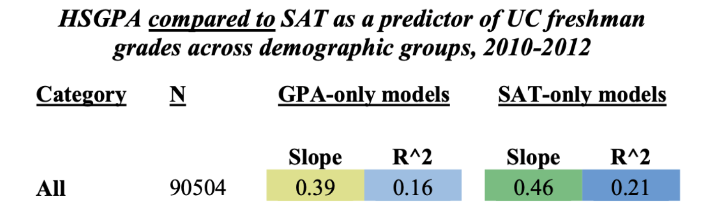
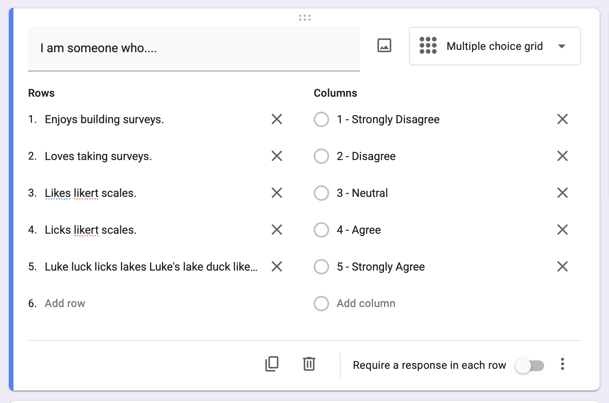
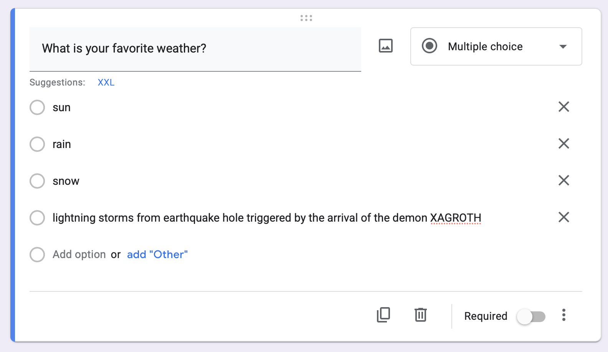
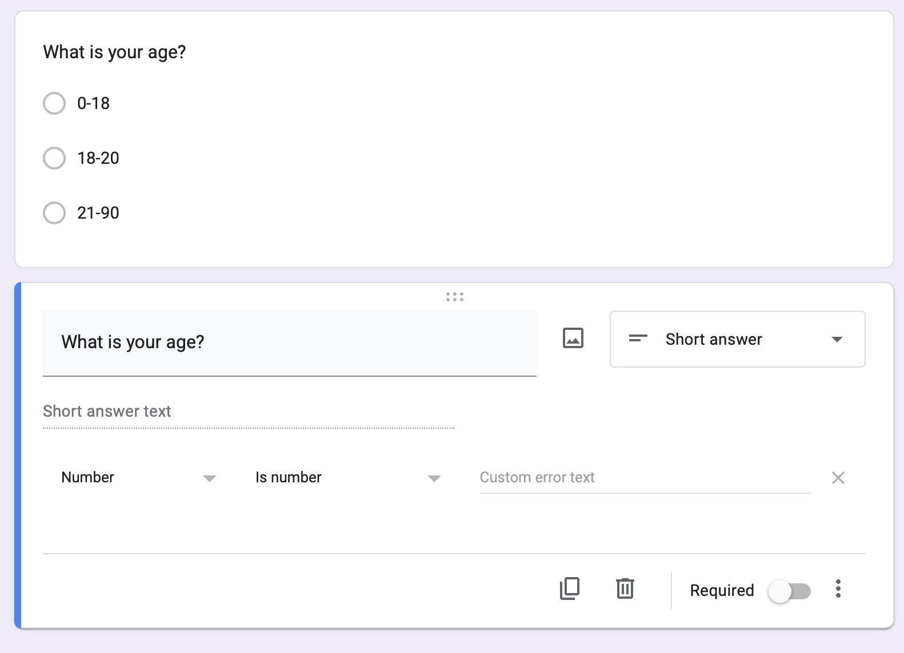

## [CHECK-IN : Is there a relationship between narcissism and age?](https://docs.google.com/forms/d/e/1FAIpQLSc7Q4AhxKUG0guX6vp3mqjXjsUdg1jrnMF89tIGTVxvSKdK2g/viewform?usp=dialog) {.smaller}

::::: columns
::: {.column width="60%"}
[**Link to Dataset**](https://www.dropbox.com/scl/fi/p1yc5kvkckkwok2v19jl5/narcissism_data.csv?rlkey=y0zwtllmfsie447eybxa4965u&dl=0)

-   **score** = narcissism score (40-item scale)
-   **age** = Entered as a free response. Ages below 14 have been ommited from the dataset.
-   **sex** = Chosen from a drop down list (1=male, 2=female, 3=other; 0=none was chosen).
:::

::: {.column width="40%"}

:::
:::::

## Check-In Spoilers. {.smaller}

:::::::::: r-fit-text
::::::::: panel-tabset
### variables

-   **score** = narcissism score (40-item scale)
-   **age** = Entered as a free response. Ages below 14 have been ommited from the dataset.
-   **sex** = Chosen from a drop down list (1=male, 2=female, 3=other; 0=none was chosen).

### read.csv()

```{r}
#| echo: true
d <- read.csv("~/Dropbox/!WHY STATS/Chapter Datasets/Narcissism Data/narcissism_data.csv", stringsAsFactors = T)
head(d)
```

### hist()

```{r}
#| echo: true
par(mfrow = c(1,2))
hist(d$score)
hist(d$age)
```

### hist()

```{r}
#| echo: true
#| fig-width: 8
#| fig-height: 4
d$age[d$age > 100 | d$age < 14] # outliers
d$age[d$age > 100 | d$age < 14] <- NA # they gone.
par(mfrow = c(1,2))
hist(d$score)
hist(d$age)
```

### lm()

::::: columns
::: {.column width="50%"}
**Defining the Model**

```{r}
#| echo: true
#| fig-width: 5
#| fig-height: 5
plot(d$score ~ d$age)
mod <- lm(d$score ~ d$age)
abline(mod, lwd = 5)
```
:::

::: {.column width="50%"}
**Interpreting The Model**

```{r}
#| echo: true
coef(mod)
summary(mod)$r.squared
```

**Professor Notes Go Here.**

```{=html}
<textarea rows="4" cols="50">
Type your text here...
</textarea>
```
:::
:::::

### scale()

::::: columns
::: {.column width="50%"}
**Defining the Model**

```{r}
#| echo: true
#| fig-width: 5
#| fig-height: 5
plot(scale(d$score) ~ scale(d$age))
modZ <- lm(scale(d$score) ~ scale(d$age))
abline(modZ, lwd = 5)
```
:::

::: {.column width="50%"}
**Interpreting The Model**

```{r}
#| echo: true

round(coef(modZ), 2)
summary(modZ)$r.squared
```

**Professor Notes Go Here.**

```{=html}
<textarea rows="4" cols="50">
Type your text here...
</textarea>
```
:::
:::::
:::::::::
::::::::::

## Question : Is there a relationship between gender and narcissism?

See Prof. R script and demo.

## [BREAK TIME : A Quick Study](https://docs.google.com/forms/d/e/1FAIpQLSfJC8RLLtQf0Px0yz1nJjx-8CGXFrMcuUg_b3od54kHHPCEHQ/viewform?usp=sf_link)

-   No talking, no looking up answers!
-   Will use data in lecture :)

{fig-align="center" width="485"}

## RECAP : $R^2$ In Real-Life

::::: columns
::: {.column width="50%"}

:::

::: {.column width="50%"}


**DISCUSS :** what do these linear models tell us about the relationship between GPA, SAT (IVs) and freshman grades (DV)?
:::
:::::

## Milestone #3 : Launching Your Study (Google Forms) {.smaller}

### Your Survey : DV is NUMERIC with MULTIPLE ITEMS {.smaller}

-   variable measured as likert scale = numeric

-   how to get multiple items for...

    -   hours of sleep

    -   do you like me Y/N

    -   other variables in this room?

### Your Survey : Likert Scales {.smaller}

::::: columns
::: {.column width="50%"}

:::

::: {.column width="50%"}
**Use a Multiple Choice Grid**

-   **Each row is an item.**
    -   All the items use the same "stem" ("I am someone who...")
    -   Do not *require* responses. Okay if folks skip, right?
        -   Attention Checks (e.g., "Mark Strongly Agree for this question.")
        -   BETTER : to keep the survey short; give authentic motivation.
-   **Each column is a response.** Use a 1-5 scale to make it easy / allow for neutral.
:::
:::::

### Your Survey : Categorical Variables {.smaller}

::::: columns
::: {.column width="50%"}

:::

::: {.column width="50%"}
-   **Include demographic variables like age and sex;** give people options to self-identify as something outside a forced binary!
-   **Keep categorical variables to just a few levels;** you will need a LOT of data to capture variation if there are too many levels! 3-4 groups per variable.
:::
:::::

### Your Survey : The Right Type of Variable! {.smaller}

::::: columns
::: {.column width="50%"}

:::

::: {.column width="50%"}
-   **Make sure categorical variables are not better measured numerically.** set "response validation" for any open-ended numbers you hope to collect to make data cleaning easier.

-   **Make sure each variable is measured independently of the others.** For example, if I want to measure the relationship between happiness and reading, I would want to measure these separately.

    -   I am happy.
    -   I like to read.
    -   ~~Reading makes me happy.~~ This mixes up the two variables (the DV and IV). It could be a cool measure on its own (love for reading scale?).
:::
:::::

### Other Questions?

## THE END.

{fig-align="center"}
