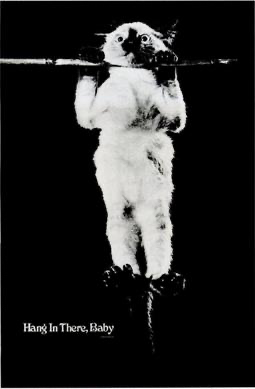
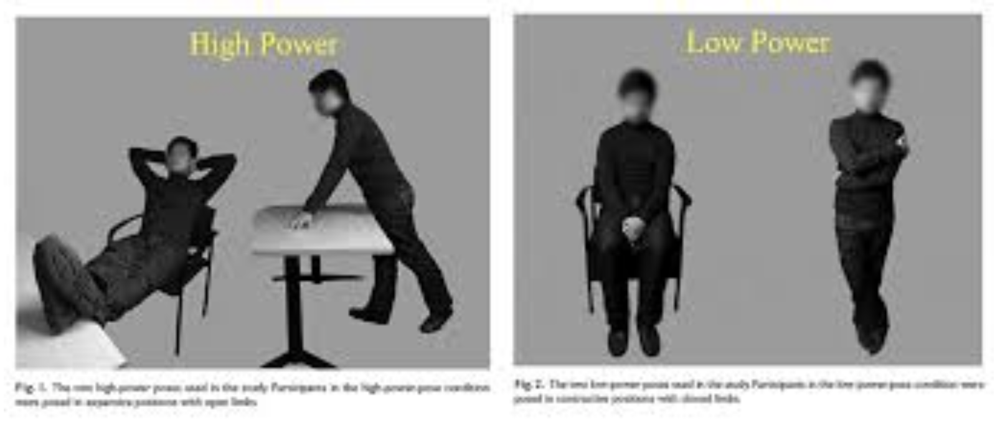
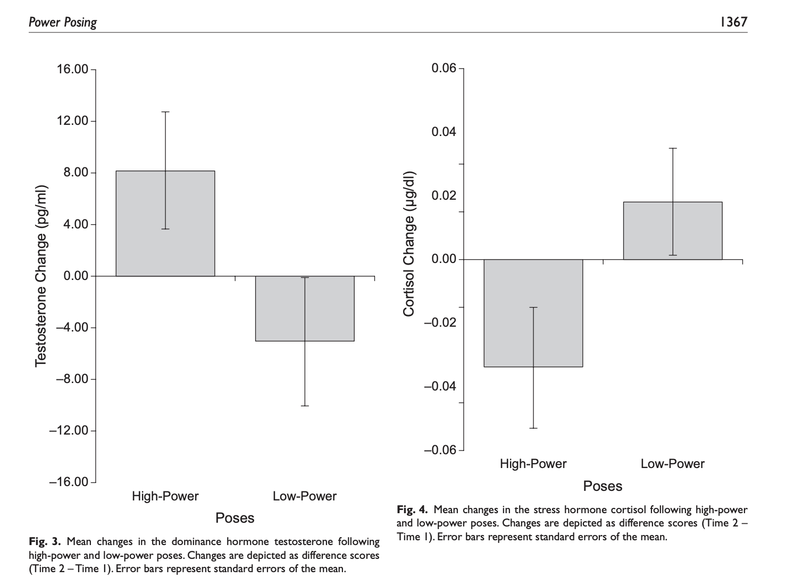
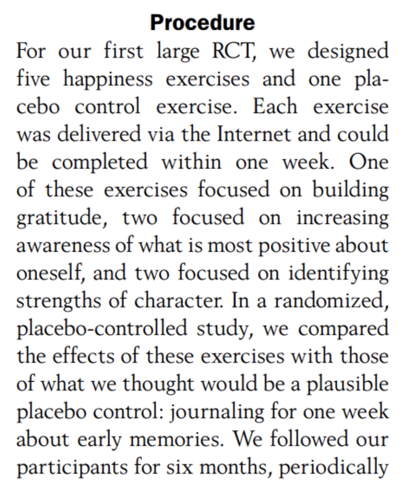
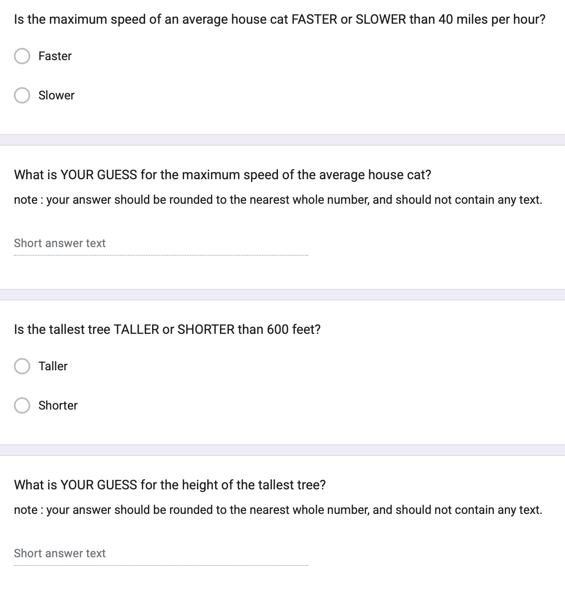
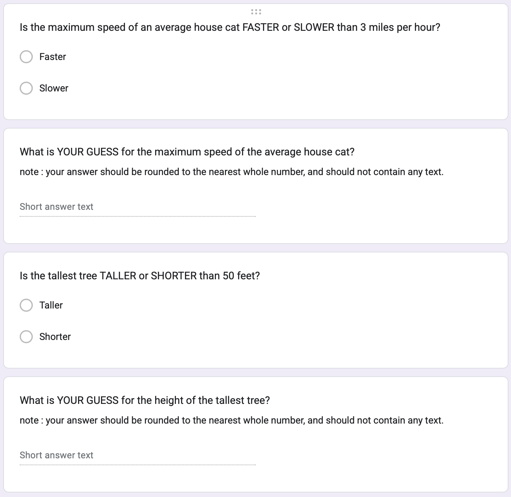
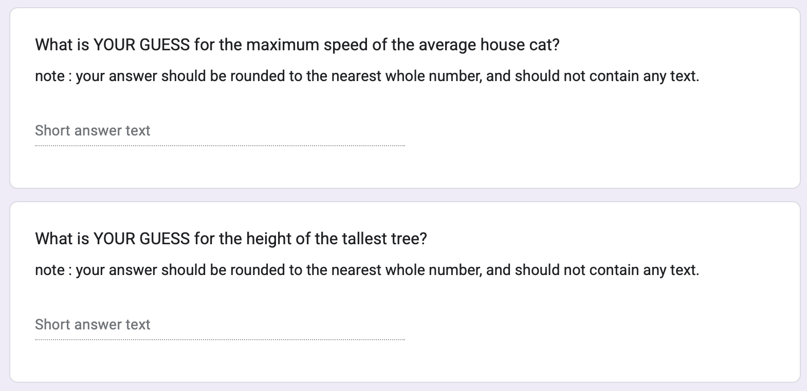
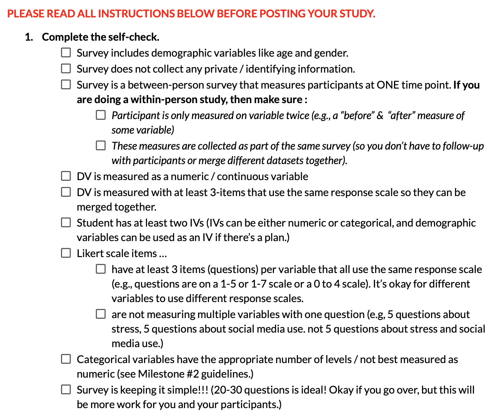
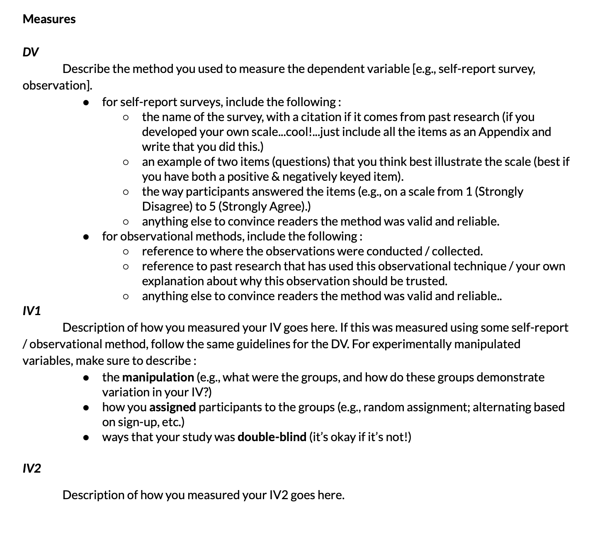
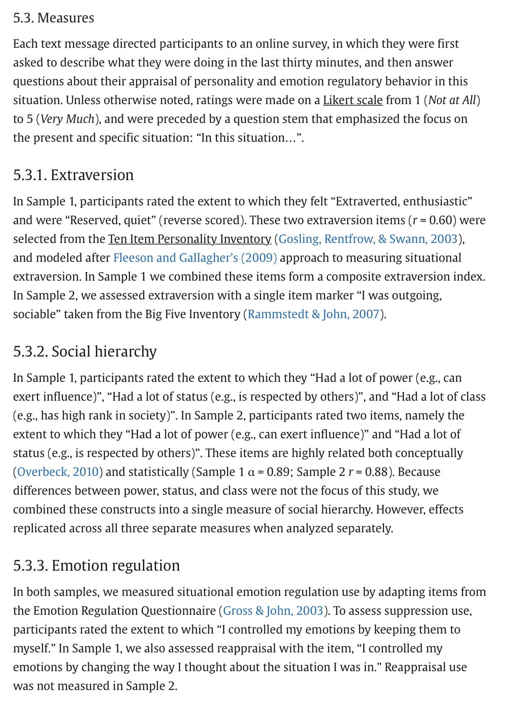

## [Check-In : Anchoring Data](https://forms.gle/mhvkqU1aRN89GAr18)

```{r}
#| include: false
#| eval: false

d <- read.csv("~/Dropbox/!WHY STATS/Class Datasets/101 - Class Datasets/Cat Data/anchor.csv", stringsAsFactors = T)

par(mfrow = c(1,2))
plot(d$howclass ~ d$howgo)
mod <- lm(d$howclass ~ d$howgo)
abline(mod)
summary(mod)$r.squared

plot(d$howclass ~ d$howproject)
mod2 <- lm(d$howclass ~ d$howproject)
abline(mod2)
summary(mod2)$r.squared

hist(d$catspeed)

```

:::::: r-fit-text
::::: columns
::: {.column width="60%"}
**Load the Anchoring Dataset;** use R to define two (separate) linear models to determine whether people's experience in the class (DV = howclass) is better predicted by:

1.  how students are doing in life (IV1 = howgo)
2.  how students are doing on the final project (IV2 = howproject).
:::

::: {.column width="40%"}

:::
:::::
::::::

## Check-In Review (see Prof. R Script)

## Experimental Methods

### The Definition of Causality {.smaller}

1.  The cause and effect are contiguous in space and time.
2.  The cause must be prior to the effect. (no reverse causation)
3.  There must be a constant union betwixt the cause and effect. (“Tis chiefly this quality, that constitutes the relation.”) (no random chance)
4.  The same cause always produces the same effect, and the same effect never arises but from the same cause. (not "just" some third variable)

### Manipulation : Watch out for Misleading Control Variables {.smaller}

**RECAP : the manipulation (A/B Testing) :**

-   researchers create multiple groups (conditions) and change ONE THING (the IV) about a person’s experience in each group & observe the result (the DV).

    -   **treatment / experimental condition :** the IV is present (the change happens)

    -   **control / comparison condition :** the IV is absent (the default experience / no change)

-   KEY IDEA : the comparison group matters!

    -   a 3 hour stats class DECREASES boredom compared to…

    -   a 3 hour stats class INCREASES boredom compared to…

### Real-Life Examples of Difficult Control Conditions

**Power Posing Study.** Is this a fair comparison / manipulation? Why / why not?

::::: columns
::: {.column width="50%"}
[](https://faculty.haas.berkeley.edu/dana_carney/power.poses.PS.2010.pdf)
:::

::: {.column width="50%"}

:::
:::::

### Gratitude Study {.smaller}

::::: columns
::: {.column width="40%"}
Read the prompt below. Answer the following questions.

1.  ICE-BREAKER : What's something that you are grateful for?
2.  What did the experimenters manipulate? Which of these were experimental and control conditions?
3.  What are some other things that differ between the experimental and control conditions (potential confounds)?
4.  What are some other (better) control conditions that you might include in this study?
:::

::: {.column width="60%"}
{fig-align="center"}
:::
:::::

## Anchoring as an Experiment

### Experimental Design : The Manipulation

| High Condition | Low Condition | Control Condition |
|----|----|----|
|  |  |  |

### Experimental Design (Other Terms) {.smaller}

::::: columns
::: {.column width="50%"}
| High Condition | Low Condition | Control Condition |
|----|----|----|
|  |  |  |
:::

::: {.column width="50%"}
-   **outcome =** THE DV = what was being measured after the manipulation?

-   **manipulation =** THE IV = what were ALL the things that the researcher changed about a person's experience (across experimental conditions)?

-   **random assignment =** were all possible confound variables balanced across conditions?

-   **double-blind =** did the study avoid demand characteristics (where experimenter might have influenced behavior when giving the study) & placebo effects (where participants might have acted in a certain way because they knew they were being experimented on)?

-   **generalizability =** did the study have external validity? what was the effect size ($R^2$)?

-   **ethics =** should researchers do this type of study? (Predict & Control)
:::
:::::

### Anchoring : Question --\> Theory --\> Data {.smaller}

-   **Question :** Will the number that people see BEFORE making their own rating influence their decision?

-   **Theory :**

    -   OPTION A: People who see a HIGHER number before making their own rating will make a HIGHER number than people who see the LOWER number.
    -   OPTION B : People who see a LOWER number before making their own rating will make a HIGHER number than people who see the HIGHER number.
    -   OPTION C : There will be NO DIFFERENCES between the groups.

### Linear Models {.smaller}

See Prof. R Code :)

# Milestone 3 : Launch Your Study & Draft Your Measures

### Milestone 3 : Launch Your Study

{fig-align="center" width="80%"}

### Milestone 3 : Draft Your Measures

::::: columns
::: {.column width="50%"}
Guidelines

{fig-align="center" width="80%"}
:::

::: {.column width="50%"}
Use Related Research as Examples

{fig-align="center" width="80%"}
:::
:::::

::::::

## THE END.

{fig-align="center"}
