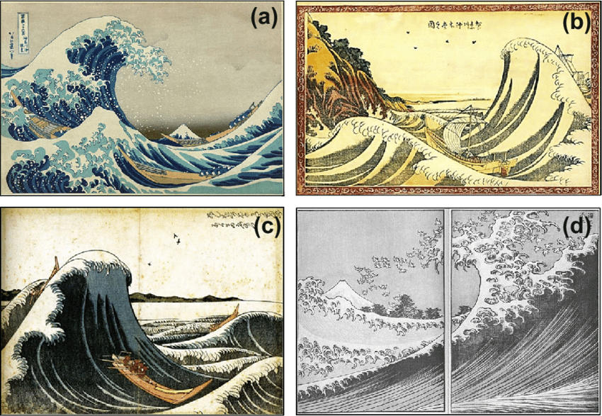
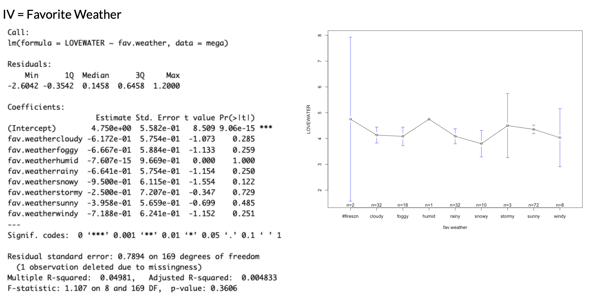

## [Check-In : Linear Model](https://docs.google.com/forms/d/e/1FAIpQLScmbsOlKn8jMCuGK1VtdvToa4dLVLkxyM56BKyFYlU78Ydd8w/viewform?usp=sf_link)

**Use the "cal_mini" dataset to test ONE of the following hypotheses.**

1.  People with larger shoe sizes (IV = shoesize) are more likely to love oski (DV = oskilove).
2.  People who love cal sports are more likely to love oski
3.  People who love butterflies are more likely to love oski.

**Make sure to do the following :**

1.  Load the dataset and check to make sure it loaded correctly.
2.  Graph your variables, and make sure the variables look good.
3.  Define, graph, and interpret your linear model.
4.  Report inferential statistics (with the summary() function).

{fig-align="center" width="516"}

```{r}
#| include: false
library(gplots)
d <- read.csv("~/Dropbox/!WHY STATS/Class Datasets/101 - Class Datasets/Mini Data/mini_DATA.csv", stringsAsFactors = T)
head(d)

hist(d$oski.love)
plot(d$oski.love ~ d$shoe.size)
levels(d$cal.sports)[1] <- NA
```

## Agenda & Announcements

1.  **R Exam : Grading In Progress!**
2.  **The Final Project**
    1.  **Milestone #4 Due Next Week.** Outline your introduction, and draft your method section.
    2.  **Data Exported?** Can keep collecting, but need to STOP collecting once we start analyzing data / doing linear models (next week!)
3.  **Brain Exam 2 is Next Week in Section**
    1.  **Same format as Brain Exam #1.**
    2.  **Skill :** interpreting regression output.
        1.  intercept & slope
        2.  NHST
4.  **Chapter 10.** On Multiple Regression. More regression! It is chill.
5.  **THE END IS NEAR.**
    1.  TODAY : Inferential Stats
    2.  NEXT WEEK : Multiple Regression + Review
    3.  THEN : Project Workshop (and Holiday?!)
    4.  FINALLY : Conclusion to Introduction \<3
    5.  BUT WAIT, THERE'S MORE : RRR Week Final Project Workshop

## We Are Having Fun \[SPOILER ALERT\]

::: panel-tabset
### Model 1

```{r}
summary(lm(d$oski.love ~ d$shoe.size))
```

### Model 2

```{r}
summary(lm(d$oski.love ~ d$cal.sports))
```

### Model 3

```{r}
summary(lm(d$oski.love ~ d$tuhobura))
```

### A Picture's Worth...

```{r}
#| fig-height: 5
#| fig-width: 15

par(mfrow = c(1,3))
plot(d$oski.love ~ d$shoe.size)
abline(lm(d$oski.love ~ d$shoe.size), col = 'blue', lwd = 2)
plotmeans(d$oski.love ~ d$cal.sports, connect = F, ylim = c(0,10))
plotmeans(d$oski.love ~ d$tuhobura, connect = F, ylim = c(0,10))
```
:::

## Chapter 8 Recap : NHST is Confusing!

+--------------------------------------+--------------------------------------------------------------------------------------------------------------------------------------------------------+
| **Chapter 8 Check-In Results**       | **Correct Answer (& Prof. Comments)**                                                                                                                  |
+--------------------------------------+--------------------------------------------------------------------------------------------------------------------------------------------------------+
|  | **A Slope is the Direction & Strength of Relationship**                                                                                                |
|                                      |                                                                                                                                                        |
|                                      | -   hard to evaluate strength across models if the units differ too.                                                                                   |
|                                      |                                                                                                                                                        |
|                                      | -   steeper slope (compared to another slope with similar units) = stronger relationship                                                               |
+--------------------------------------+--------------------------------------------------------------------------------------------------------------------------------------------------------+
|  | **The amount of variation in an effect you might expect to find due to chance if the null hypothesis were "true".**                                    |
+--------------------------------------+--------------------------------------------------------------------------------------------------------------------------------------------------------+
|   | **Impossible to Tell Significance from the Slope Alone**                                                                                               |
|                                      |                                                                                                                                                        |
|                                      | -   Large slope & sampling error = NOT SIGNIFICANT                                                                                                     |
+--------------------------------------+--------------------------------------------------------------------------------------------------------------------------------------------------------+
|  | **A Significant Effect is NOT necessarily....**                                                                                                        |
|                                      |                                                                                                                                                        |
|                                      | -   **large :** you can be VERY confident that a small effect is not due to sampling error.                                                            |
|                                      |                                                                                                                                                        |
|                                      | -   **important :** why does the effect matter?                                                                                                        |
|                                      |                                                                                                                                                        |
|                                      | -   **fool-proof :** our estimates of sampling error are all made up.                                                                                  |
+--------------------------------------+--------------------------------------------------------------------------------------------------------------------------------------------------------+
|  | **A p-value of .03 means...there is a 3% chance that this slope (or a stronger slope) would be found due to chance if the true correlation was zero.** |
+--------------------------------------+--------------------------------------------------------------------------------------------------------------------------------------------------------+


Haller, H., & Krauss, S. (2002). [Misinterpretations of significance: A problem students share with their teachers](https://www.metheval.uni-jena.de/lehre/0405-ws/evaluationuebung/haller.pdf). Methods of Psychological Research, 7(1), 1-20.

## Some More NHST Interpretation Examples

::: panel-tabset
### Model 1: Is there a relationship between narcissism (DV = NPI) and testosterone?

```{r}
h <- read.csv("~/Dropbox/!WHY STATS/Chapter Datasets/Hormone Data/hormone_dataset.csv", stringsAsFactors = T)
mod1 <- lm(NPI ~ test, data = h)
plot(NPI ~ test, data = h)
abline(mod1, lwd = 5)
summary(mod1)
```

### Model 2 : Is there a relationship between narcissism (DV = NPI) and sex?

```{r}
library(gplots)
mod2 <- lm(NPI ~ sex, data = h)
plotmeans(NPI ~ sex, data = h, connect = F)
summary(mod2)
```

### Model 3 : Is there a relationship between testosterone (DV = test) and sex?

```{r}
mod3 <- lm(test ~ sex, data = h)
plotmeans(test ~ sex, data = h, connect = F)
summary(mod3)
```
:::

### Some Pre-Recorded NHST Review Videos

-   **Note : I used last semester's dataset for these examples, so you will likely get different results if you try and replicate in this semester's class; a good example of how NHST doesn't really tell us whether the results are "truth" or not, or whether they will replicate, etc.**

-   [**Example 1 : LOVEWATER \~ smoke.pot**](https://www.loom.com/share/67776eb1a41f4b5eaa0ca5312d0663ad?sid=534835dc-c163-4604-b985-137b2bede4ac)

-   [**Examples 2 - 4 : faster explanations!**](https://www.loom.com/share/8b755a32fe094e9eb1fc0bd7f16991bd?sid=b0c120f4-4190-4115-9722-da0a19856006)




## NEXT TIME : Chapter 10 : Multiple Regression

**In the models above, we see....**

1.  Testosterone is related to narcissism.
2.  Sex is related to testosterone.
3.  Sex and testosterone are related to each other......
4.  so.......

```{r}
mod4 <- lm(NPI ~ sex + test, data = h)
summary(mod4)
```

## [Milestone #4](https://docs.google.com/document/d/1DxiIxm_sRtm8t5FEOWhOJluJOo6ZPUI_eZTS13K4CxA/edit?tab=t.0#bookmark=id.ebdtyorckpzc) : Introduction Outline

### **Introduction Deconstruction.**

#### Components of an Introduction

The introduction starts broad, but then quickly focuses on the variables in your model so readers can understand a) what your study is about and b) why you’re doing your study. 

|  |  |
|----|----|
| **Section** | **Brief Explanation** |
| **1. The Opening** | Describe the question you have, and explain why this question matters |
| **2. The Review** | Describe what past research and theory has to say on the question and your theory. Your goal is to give the reader the background they need to understand why you are doing your study; you don’t need to cover EVERY single issue on your topic.. |
| **3. The Critique** | Explain why the past research is not “the final truth”, and what other new questions might be important to consider (and why these questions matter). Only point out limitations with past research that you will address in your study; other limitations that you think future research will address should go in the discussion section. |
| **4. The Current Research** | Explain what specific questions your study will address. Be clear by stating each idea as a hypothesis with language like, “I predict” or “My first hypothesis”. |

#### Activity : Deconstruct an Introductin

Read an excerpt from the introduction[^1]; identify (in the margins) each of part of the introduction (“The Opening”, “The Review”, “The Critique”, and “The Current Research”)

[^1]: [Full article here](https://scholar.princeton.edu/sites/default/files/pfrymer/files/ajps12537_rev.pdf)


### Introduction Construction

#### Parts of an Outline

-   **The DV (the Opening / Past Research) :**

    -   **THE POINT :** What is your DV? \[Citation\]

        -   **THE EVIDENCE :** How have psychologists operationalized or studied this variable in the past? \[Citation\]

        -   **WHO CARES :** Why should we care about this topic?

-   **IV1 (Past Research) :**

    -   **THE POINT :** What is your independent variable?

        -   **THE EVIDENCE :**

            -   How do psychologists operationalize this variable?

            -   Summarize at least one past research study on this independent variable, and how this IV is (or might be) related to your DV. \[Citation\]

        -   **WHO CARES :** Why does this research matter to your topic?

    -   **ANOTHER POINT YOU COULD MAKE :** Are there any limitations with this past research that you will address in your study (this could set up IV2)?

        -   **THE EVIDENCE :** why (research or common sense) might these limitations interfere with our VALID KNOWLEDGE about the DV?

        -   **WHO CARES :** why should we care about these limitations?

-   **IV2 (The Critique / Past Research) :**

    -   **THE POINT :** What is another independent variable that might be related to your dependent variable?

    -   **THE EVIDENCE :** How has this variable been defined / studied in the past? \[Citation\]

    -   **WHO CARES :** Why might this variable be important to look at / change the relationship between IV1 and the DV? \[Citation or Logic Goes Here\]

-   **The Present Research (The Current Study) :**

    -   THE POINT : What is the goal of your research? Include your specific predictions in a summary table.

    -   THE EVIDENCE : What will your research do? You don’t need to fully explain the methods for your study, but instead should set up the broad ideas of what you hope to do.

    -   WHO CARES : How does your study advance past research?

|                                |                     |                 |
|--------------------------------|---------------------|-----------------|
| **Hypothesis**                 | **Null Hypothesis** | **Alternative** |
| Hypothesis 1 (DV \~ IV1)       |                     |                 |
| Hypothesis 2 (DV \~ IV2)       |                     |                 |
| Hypothesis 3 (DV \~ IV1 + IV2) |                     |                 |


[tsunami and rebirth](https://magazine.scu.edu/magazines/summer-2017/tsunami-and-rebirth/)
