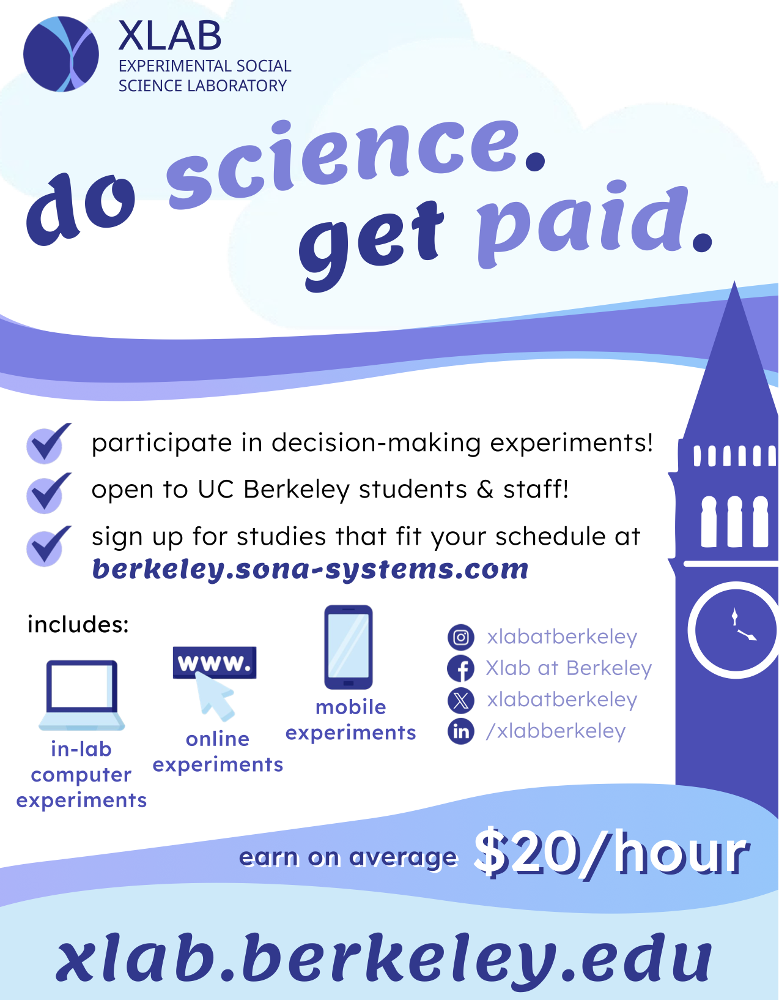
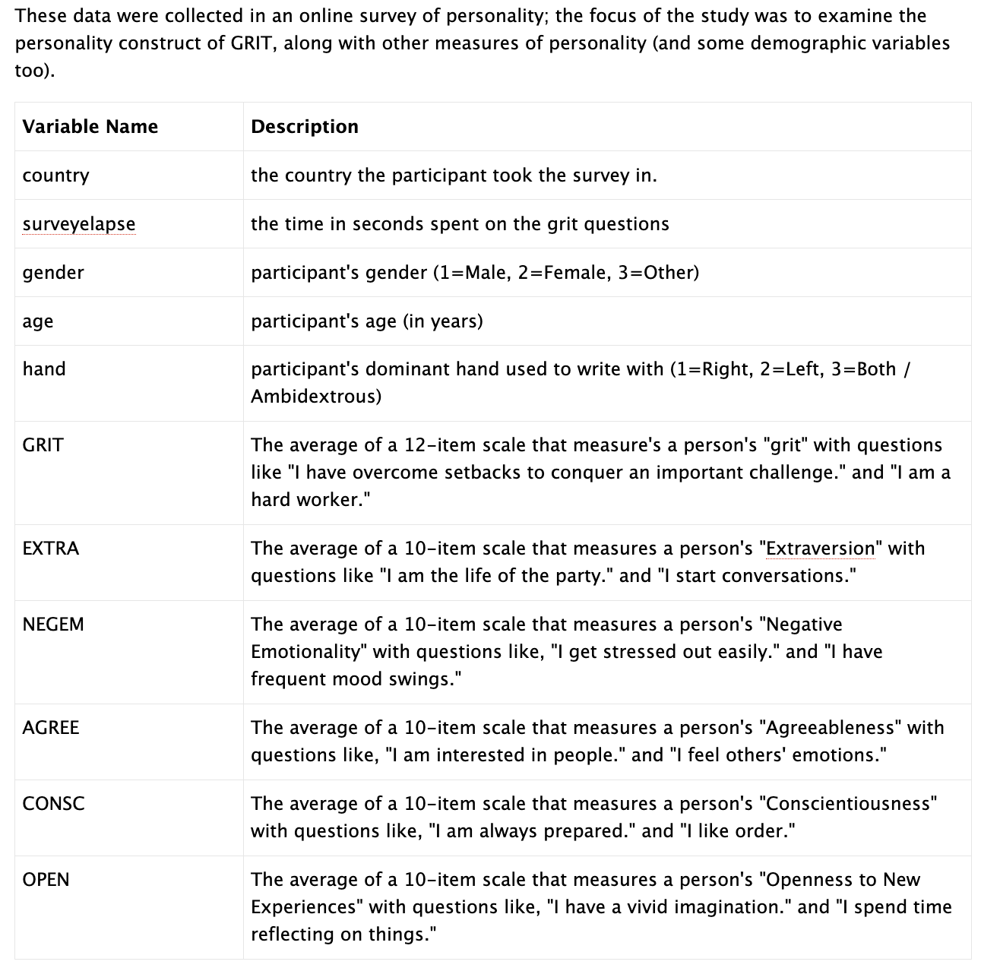

# Week 9 - Friday, March 20th

:::::: {.callout-note collapse="true"}
### Announcements and Agenda and Advertisement(s)

::::: columns
::: {.column width="50%"}
-   **THE END IS NEAR.** Four lectures (and an Exam) left. Feeling like less.
-   **R Exam is TWO WEEKS.** After Spring Break. See the [study guide](https://docs.google.com/document/d/1myT--E0ePbygFSa3bMxzCb0sb1LnmUOM8XuGlfmq0F4/edit?usp=sharing). Questions?
-   **Discussion Section (After Spring Break)**. Review.
:::

::: {.column width="50%"}
**Today, on Psych 101...**

-   **2:10 - 3:15.** Check-In Linear Model Review.
-   **3:15 - 3:25.** Break Time.
-   **3:25 - 4:00.** Introducing Milestone #3.
-   **4:00 - 5:00.** Project Workshop.
:::
:::::

hello.
::::::

### Class Slides and Materials

```{=html}
<iframe data-external="1" class="slide-deck" src="/calstats/Lectures/8_3LevelExperiment.html" width="800" height="500" title=""></iframe>
```

-   **Check-In. Model Review**. Good review!!
    -   [**Anchoring Data**](https://www.dropbox.com/scl/fi/54wl7ew0xpy4kr3ubkcw0/anchor.csv?rlkey=1yzdaxa8dhnxe8alw7o6igcah&dl=0). For the check-in and lecture activity.
-   [**R EXAM STUDY GUIDE**](https://docs.google.com/document/d/1myT--E0ePbygFSa3bMxzCb0sb1LnmUOM8XuGlfmq0F4/edit?usp=sharing)**.** It will be chill.
-   [**Professor Notes**](https://www.dropbox.com/scl/fo/gl6k038pu9duy75jvq1t0/ALCXZvj5iBfl0uCRfZfZiHM?rlkey=kon74xzou91hkhgx8tfjmdet5&dl=0)**.** My R scripts and other notes, saved in real-time.
-   [**Final Project Description & Rubric**](https://docs.google.com/document/d/1DxiIxm_sRtm8t5FEOWhOJluJOo6ZPUI_eZTS13K4CxA/edit?usp=sharing)**.** And here's the [Final Project Vision Board](https://docs.google.com/spreadsheets/d/1WMn8SH-yQC-5bNcnQR-Jp5RWkxutVlKNmxCgMDgompI/edit?usp=sharing).

# For Next Class.

## [Milestone #3](https://docs.google.com/document/d/1DxiIxm_sRtm8t5FEOWhOJluJOo6ZPUI_eZTS13K4CxA/edit?tab=t.0#bookmark=id.70lgolty5k8a). Launch Your Study :)

1.  **Self-Check.** Before you launch! Seatbelts!!
2.  **Post your study.** To Discord I think?
3.  **Submit a methods draft.** Use the template. Like a mad-lib.

## Review for the R Exam (Next Class - Friday, April 3rd)

-   **Dataset and Codebook below** : not required, but here's a link to [take the grit scale](https://angeladuckworth.com/grit-scale/) (a 10-item version) and here's a link to a [website from the 90s](https://www.outofservice.com/bigfive/) that gives "big five" personality feedback.


