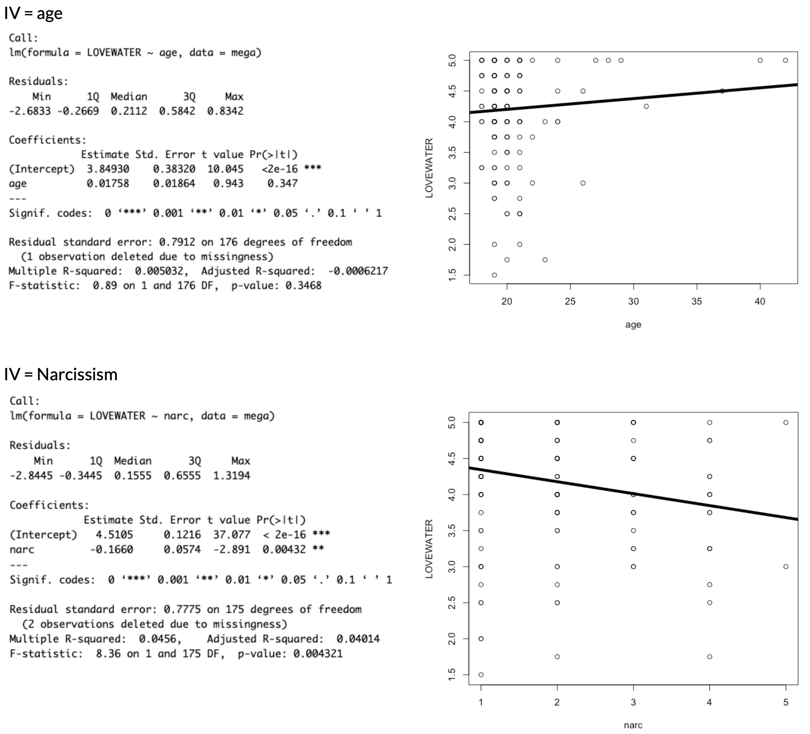

# Week 11 - Friday, April 17th

:::::: {.callout-note collapse="true"}
### Announcements and Agenda and Advertisement(s)

::::: columns
::: {.column width="50%"}
-   **THE END IS NEAR.** Three classes (and a brain exam and final project) left. Whew!
-   **Brain Exam is final week in section.** Will review in class and section. On interpreting regression (NHST and multiple regression). The learning has not stopped.
-   **Final Project :** really really great to have final project data collected and into R.
:::

::: {.column width="50%"}
**Today, on Psych 101...**

-   **2:10 - 3:00.** Check-In (NHST Review)
-   **3:00 - 3:30.** Introducing Multiple Regression.
-   **3:30 - 3:45.** BREAK TIME
-   **3:45 - 5:00.** Milestone #5.
:::
:::::
::::::

### Class Slides and Materials

```{=html}
<iframe data-external="1" class="slide-deck" src="/calstats/Lectures/11_NHSTMRPreview.html" width="800" height="500" title=""></iframe>
```

-   [**Check-In. NHST Review**](https://docs.google.com/forms/d/e/1FAIpQLSeQNQq1O8s_f0tx3l2FxIJo9Rt6zgmZA40T2AqLFdwjFtFtpA/viewform?usp=sf_link). No R required. Just brain. But the data come from the covid dataset.
-   [**Professor Notes**](https://www.dropbox.com/scl/fo/gl6k038pu9duy75jvq1t0/ALCXZvj5iBfl0uCRfZfZiHM?rlkey=kon74xzou91hkhgx8tfjmdet5&dl=0)**.** My R scripts and other notes, saved in real-time.
-   [**Final Project Description & Rubric**](https://docs.google.com/document/d/1DxiIxm_sRtm8t5FEOWhOJluJOo6ZPUI_eZTS13K4CxA/edit?usp=sharing)**.** And here's the [Final Project Vision Board](https://docs.google.com/spreadsheets/d/1WMn8SH-yQC-5bNcnQR-Jp5RWkxutVlKNmxCgMDgompI/edit?usp=sharing).

### Some Pre-Recorded NHST Review Videos

**Note : I recorded these videos in a previous semester (with different class data).** You will likely get different results if you try and replicate these results in this semester's class (though we likely had a different class dataset). a good example of how NHST doesn't really tell us whether the results are "truth" or not, or whether they will replicate.

#### Example 1 : Weather and Love for Water



{fig-align="left" width="80%"}

#### Example 2 : Love of Water and Age



{fig-align="left" width="80%"}

# For Next Class.

## [Milestone #5](https://docs.google.com/document/d/1DxiIxm_sRtm8t5FEOWhOJluJOo6ZPUI_eZTS13K4CxA/edit?tab=t.0). Final Proejct Regression Tables

1.  **Describe Your Variables.** Do the data look good?
2.  **Define Your Models.** What's the relationship? What does this look like? What do you see??

## [Chapter 10.](https://catterson.github.io/ystats/chapters/10R_MultipleRegression.html) On Multiple Regression.
