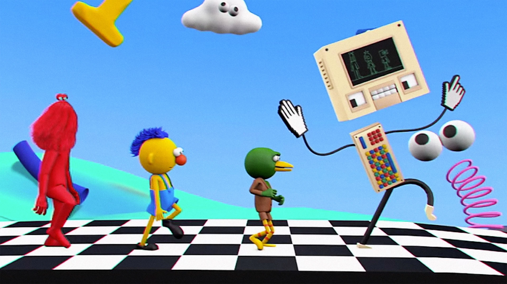
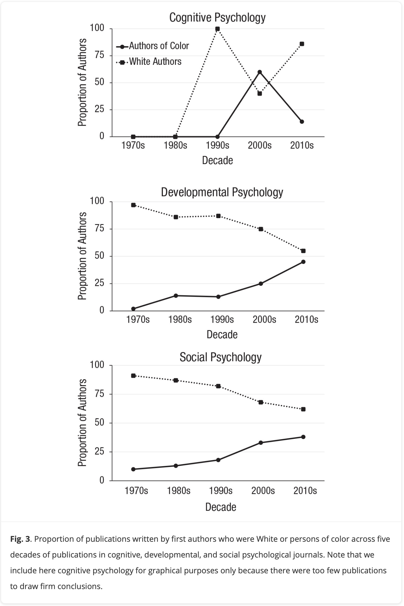
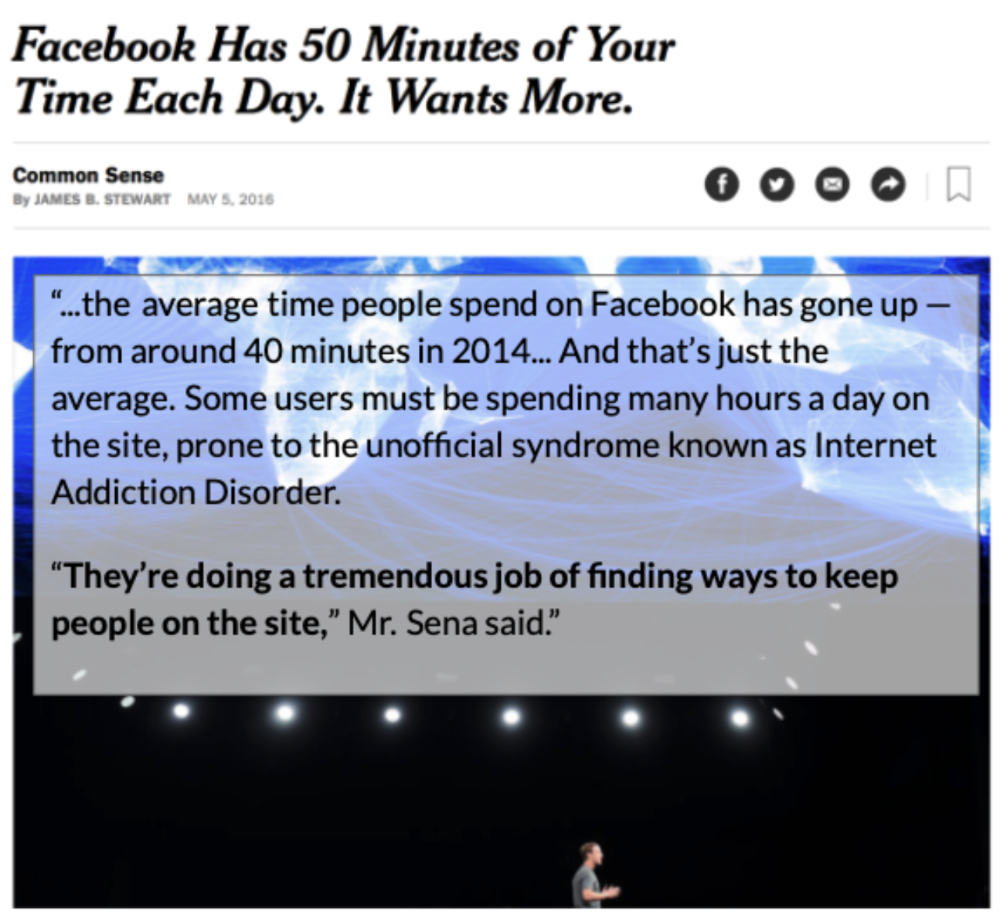
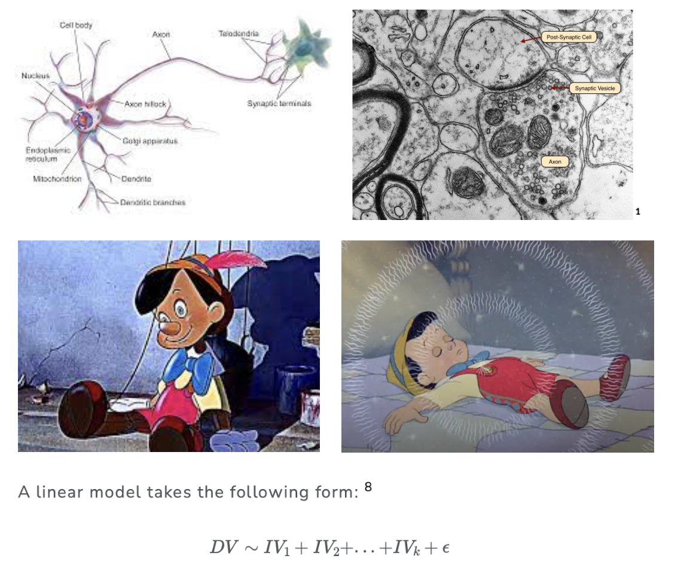
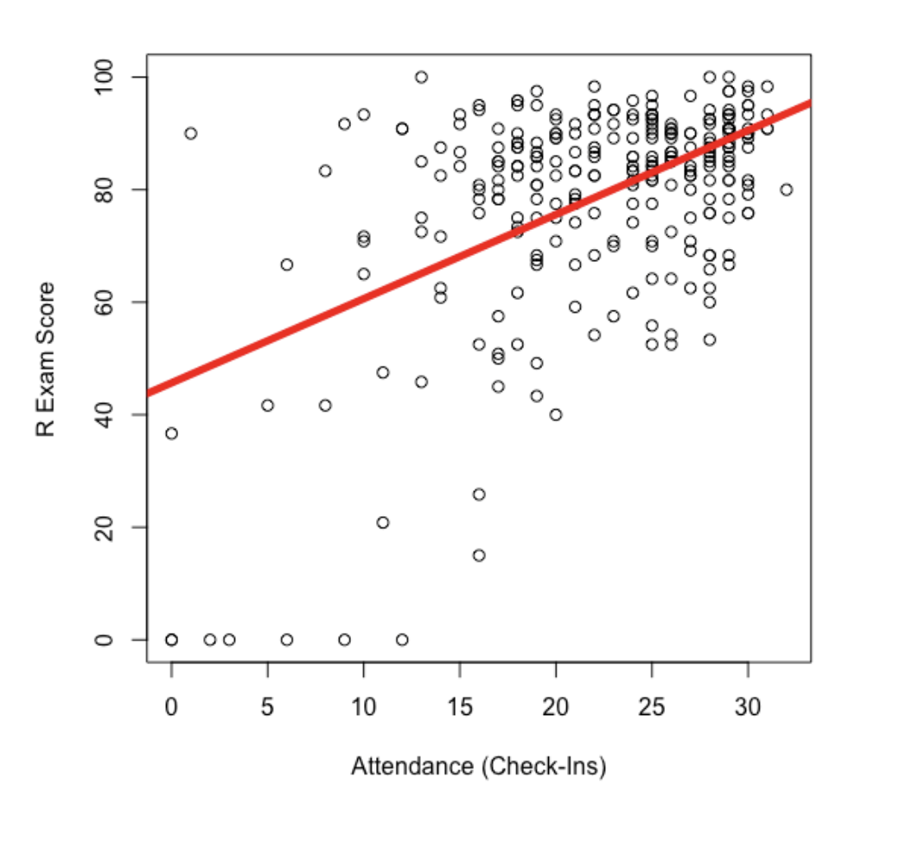
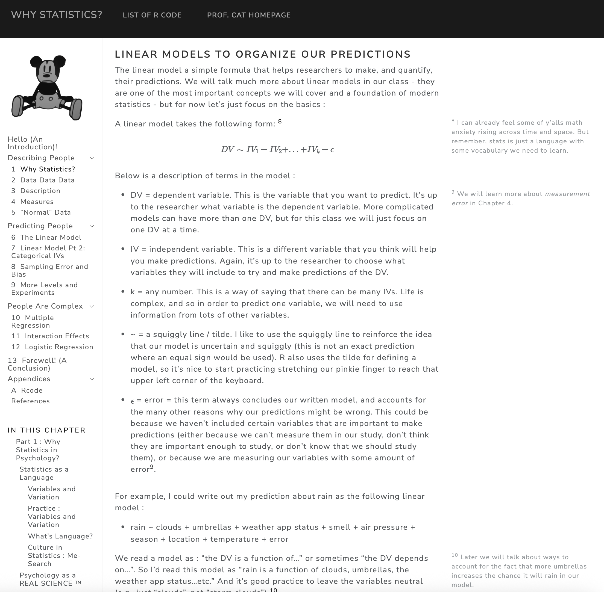
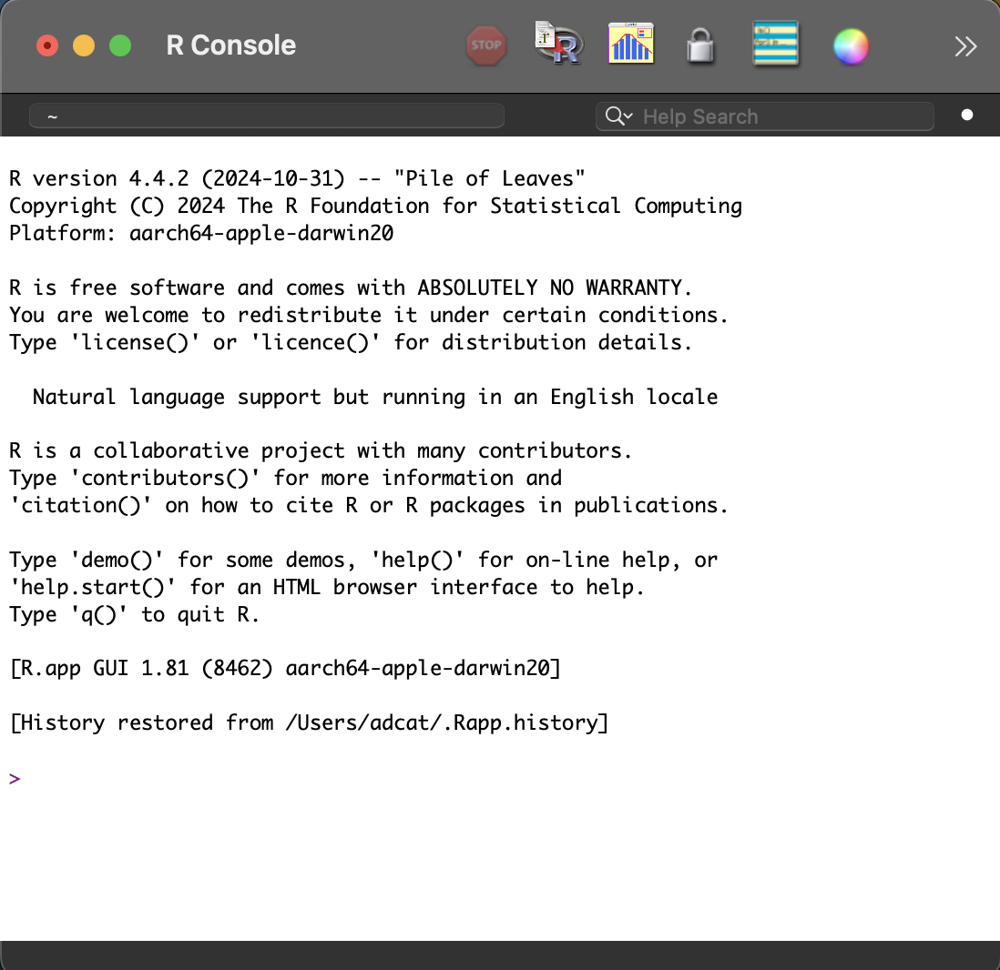
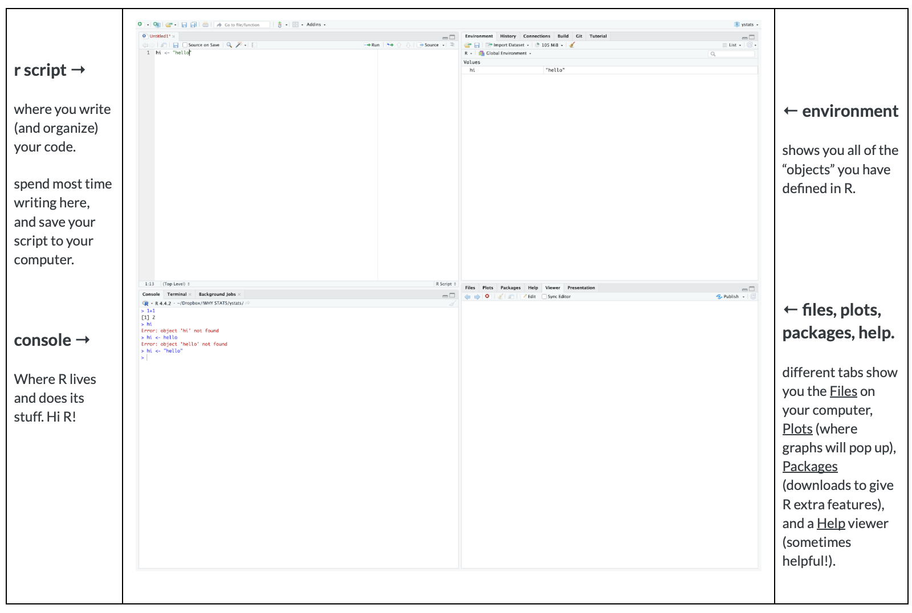

## Welcome to Psych 101

- [**take this quick check-in survey : tinyurl.com/hifirstclass**](https://docs.google.com/forms/d/e/1FAIpQLSdUFSyKnQBLoCZKxb9ZqzmwbEUo8gCqtwKAEaf-wJAfoVKlbA/viewform?usp=header)
- **we will get started soon!**

{fig-align="center"}

# Part 1 : Who and Why and What Statistics?

## Who Statistics?

### Professor : Arman (Daniel) Catterson

- **say :** Arman...Professor...Dr. Professor Catterson, PhD

- **from :** Austin, TX to UC Berkeley to stayin in the bay forever teaching stats here and at DVC.

  {fig-alt="an image of kermit the frog on a bicycle" fig-align="center" width="423"}

### Students : THIS CLASS IS FOR Y’ALL!!! {.smaller}

::::: columns
::: {.column width="60%"}
- attendance is critical, especially when you are behind.

- your voice is needed.

  - [**in psychology**](https://journals.sagepub.com/doi/10.1177/1745691620927709) : majority of authors (and editors who control research) are white.

  - **in the classroom :** we learn from each other.

    - clap once if you are here….

    - all talk at once :)

    - look around the room
:::

::: {.column width="40%"}

:::
:::::

### Buddy System {.smaller}

- everyone has a buddy

- talk to your buddy in this class

  - **ICE BREAKER :** Why did you sit in this seat on the first day of class? What went into that decision?

  - **Why Psych 101?** Why are psych majors are REQUIRED to take a stats class??

## Why Statistics? {.smaller}

### **Statistics as a language.**

- **What happens in a good language class?**

### **Variables and Variation.** {.smaller}

::::: columns
::: {.column width="60%"}
- **variation :** change, differences, growth, complexity

  - **zero variation.** everyone is the same. :(

  - **life is complex.** and statistics is about *defining* that complexity

- **variable :** a thing that varies.
:::

::: {.column width="40%"}
[{fig-alt="a colorful mural titled \"a future for everyone\" that depicts a variety of images and people" fig-align="center"}](https://www.monicacanilao.com/art/#installation)
:::
:::::

### **the ABCs of Psychology** {.smaller}

- **Affect :** the emotions you feel

- **Behavior :** the things you do

- **Cognition :** the ideas (or brain activation) you think

- **EXAMPLE : how can we think of happiness in terms of the ABCs?**

### **Goal of Science.**

- to describe variation

- to make [predictions]{.underline} \[see Chapter 1\]

{fig-align="center"}

## Scientific Predictions {.smaller}

Psychological scientists seek to better understand variation, in order to help make valid predictions in ways that help exert power over our environments.

::::: columns
::: {.column width="50%"}
Knowledge of Neurons

:::

::: {.column width="50%"}
Knowledge of Addiction

{fig-alt="These data (from a NYT article) are a little dated; couldn't find more recent data on this, but in reports to investors reports consistent growth in metrics like \"ad impressions\" and \"daily active users\"." width="581"}
:::
:::::

## Chapter 1 Preview : The Linear Model

{fig-align="center" width="739"}

### RECAP : Definition and Examples {.smaller}

- DV \~ IV1 + IV2 + IV3 + ... + ERROR

  - **list the variable that you want to predict (the DV)**

  - **list the variables that you think will help predict the DV (the IVs)**

- ACTIVITY : Define a linear model to predict differences in (choose one) :

  - screen time
  - having a good class
  - sleep quality

### KEY IDEA : Linear Models Help Organize and Quantify Prediction {.smaller}

- **organize :** a model specifies what information (IV) we think might help us predict the DV
- **quantify :** when we add statistics to our model (much later!), we will see…
  - **the direction of the prediction :** is there a positive or negative relationship between the IV and the DV?

  - **the “weight” of the prediction :** how much does each IV help us predict the DV?

    - what is the “best” predictor in our model?

    - what is the “worst” predictor in our model?

  - **the amount of error in our prediction :** how well does the model as a whole help us predict individual scores? how well does the model generalize to "reality"?

### A Real-Life Linear Model in the Wild.

## What Statistics?

### This Semester {.smaller}

::::: columns
::: {.column width="60%"}
- **Psych 101 :**

  - **flipped classroom.** Readings before class; class time to practice and discuss.

  - **We have a syllabus.** Any questions so far?
:::

::: {.column width="40%"}
{width="660"}
:::
:::::

### Authentic Assessments {.smaller}

1.  **Brain Exams :** You look at some statistical results (graphs, tables) and interpret what you see with only your human brain to help you.
2.  **R Exam :** You are given a dataset and a research question and asked to prepare a report with access to every possible tool you could want to use (see course AI policy).
3.  **Final Project :** You learn more about a [psychological variable]{.underline} you care about, design a study to answer a question about this variable, collect the data from friends and family (n = 10), analyze the data using R, and write everything up as a research report.
    - **Milestone #1 (in Section) :** What's a question you are interested in?

### AI Policy {.smaller}

::::: columns
::: {.column width="50%"}
- **AI as a tool** : you should be doing the learning.

- **be transparent :** let us know how you used / share your prompts (see syllabus)

- **imperfection is okay!** reach out for help if you are struggling.
:::

::: {.column width="50%"}

:::
:::::

# BREAK TIME : MEET BACK AT \_\_\_\_\_\_\_\_\_\_

{fig-align="center"}

# Part 2 : Why R?

## Visualization Activity

- Close your eyes

- Take a deep breath (inhale / exhale)

- Visualize an image based on the word that you hear me say.

- What do you observe?

## Why R?

- **free :** open source, no cost,

- **flexible :** can do many things (stats, graphs, authoring, works well with python tools)

- **famous :** lots of tutorials, guides, courses, AI knows it, respected in psychology / sciences.

## R is Your New Friend

### **The R Console :**

- where R does its work

- what's your first reaction to this image? what does your eye look at? gloss over?

{fig-align="center" width="473"}

### **RStudio :** Integrated Development Environment (IDE)

{fig-align="center"}

## Activities.

- Let's explore R (and when I say R, I mean to access & open RStudio.)

- Things to do :

  - create a script.

  - write a basic math problem that caused you trouble as a kid.

  - teach R something (use the assign function)

  - play around! it's okay to break things.

# [Check-Out : tinyurl.com/byefirstclass](https://docs.google.com/forms/d/e/1FAIpQLSez8jfYb9hi5fAQsLj4LYEfql3qK1oxxJrtEXxdqDSDo5ha6g/viewform?usp=publish-editor)

# BONUS TIME : So You Think You Want to Be a Researcher?

## Getting Research Experience as an RA

### **RA = Research Assistant**

- Mostly Unpaid Experiences

  - From the berkeley website…

  - “Cold calling” labs who are doing work you think is cool.

  - Chat with your TAs / Professors

- Some paid experiences exist!

  - [Busine\$\$ \$chool](https://haas.berkeley.edu/mors/faculty/)

  - [A list a student sent me that they found](https://docs.google.com/spreadsheets/d/1IX7f1N_VXUkSnnJPTpLg-pUto0427XBK_jxRxNFhmps/edit?gid=1345132026#gid=1345132026).

### Work You Do as an RA {.smaller}

- **work with data :** transcribing data; behavioral coding data; recruiting and participants to collect data; setting up psychophysiological recordings; cleaning data; etc.

- **other opportunities to gain skills you can demonstrate :**

  - reading & discussing papers

  - working with IRB (institutional review board - an ethics thing)

  - analyzing data → presenting research at a conference (poster) or submitting a paper for publication \[your golden ticket\]

  - general mentorship (how to apply to grad school; where to apply; who to talk to & e-mail; etc.)

  - NOTE : this work and these skills apply to other work outside of research applications \[time management; coordinating schedules; juggling responsibilities; etc.\]

### What You Get Out of This {.smaller}

- **Course credit (hah), a letter of recommendation, ability to write about experiences that you have had (see above).**

- **Vibes : is this \[work or lab\] for you?**

  - do you enjoy the work? are you going to look forward to showing up and doing the work / fulfilling the commitment? 

  - are you working with a horrible monster?

    - not responsive

    - inconsistent work / no plan for your work

    - kind of a bully (emotionally abusive → stealing your work) 

  - or are you working with someone who is super cool and a positive influence on mentoring young minds!?!?! \[YES!!!!\]
