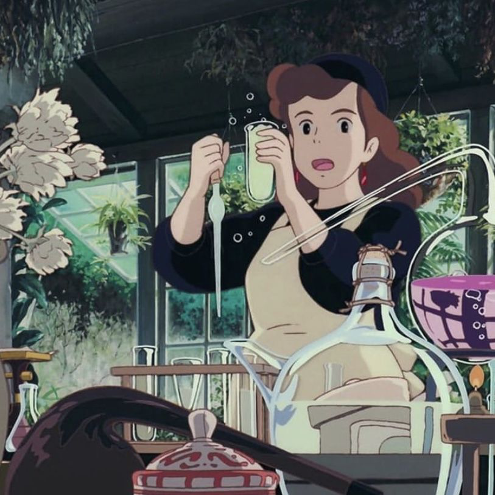
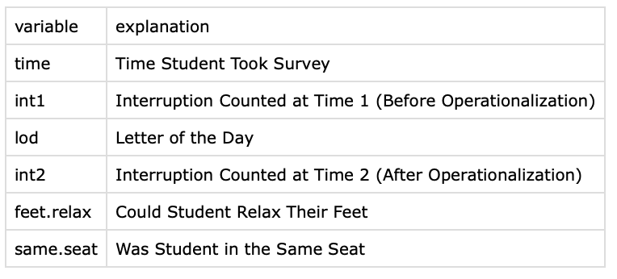
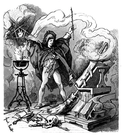

```{r}
#| eval: false
#| include: false
```

## [Check-In. tinyurl.com/interruptlifewithR](https://docs.google.com/forms/d/e/1FAIpQLSeHOpY9ubskHAQmCAVLRCD0tAy6Hd_feajTSHn9ilutA_S3qQ/viewform?usp=sf_link)

::::: columns
::: {.column width="40%"}


:::

:::{.column width="60%"}
{fig-align="center"}
:::

:::::

## PART 1 : Interruption Problems {.smaller}


::::: columns
::: {.column width="40%"}

**What analyses do we need to test the following predictions?**

1.  There would be fewer interruptions counted in time 2 (after operationalization) vs time 1 (before operationalization).
2.  There would be less variation in interruptions counted in time 2 vs time 1.

:::

:::{.column width="60%"}

{fig-align="center"}
:::

:::::


## BREAK TIME : MEET BACK AT (........){.smaller}

[CHECK-IN : tinyurl.com/miniclassexit](https://docs.google.com/forms/d/e/1FAIpQLScvBoQcnSzw_vi5cS5GazYaAAuH0HPcDIi2uCnZuhVWBSTVfg/viewform?usp=sf_link){.smaller}


## PART 2 : The Mean as Prediction {.smaller}

::::: columns
::: {.column width="60%"}
-   **How would you feel... GOOD / BAD / INDIFFERENT**
    -   ...if I told you that the average on the R Exam last semester was a 90%?
    -   ...if everyone you knew and loved called you "average"?
-   **Why would you feel this way?**
:::

::: {.column width="40%"}
[{fig-align="center"}](https://en.wikipedia.org/wiki/The_Sorcerer%27s_Apprentice)
:::
:::::

### LET'S PLAY : WHERE THE LINE? {.smaller}

Where would a vertical line best fit through these data?

::: panel-tabset
#### Where the Line?{.smaller}

```{r}
#| fig-width: 7
#| fig-height: 7
#| fig-align: center
m <- read.csv("~/Dropbox/!WHY STATS/0_Shared Folders/101 - Class Datasets/Interruption Data/interruption_DATASET.csv", stringsAsFactors = T)
plot(m$pace, ylab = "Pace of Class (1 = Too Slow; 5 = Too Fast)")
```

#### There the Line!{.smaller}

```{r}
#| fig-width: 7
#| fig-height: 7
#| fig-align: center
plot(m$pace, ylab = "Pace of Class (1 = Too Slow; 5 = Too Fast)")
abline(h = mean(m$pace, na.rm = T), col = 'red', lwd = 5)
```

#### What's Going On?{.smaller}

The histogram organizes the data, but you can see the same patterns in both graphs, where the mean of pace is `{r} mean(m$pace, na.rm = T)`

```{r}
#| fig-width: 14
#| fig-height: 7
#| fig-align: center
par(mfrow = c(1,2))
plot(m$pace, ylab = "Pace of Class (1 = Too Slow; 5 = Too Fast)")
abline(h = mean(m$pace, na.rm = T), col = 'red', lwd = 5)
hist(m$pace, xlab = "Pace of Class (1 = Too Slow; 5 = Too Fast)")
abline(v = mean(m$pace, na.rm = T), col = 'red', lwd = 5)
```

:::

### The Mean : Prediction and Error {.smaller}

-   How can you visualize each of these components?
-   How might you translate this equation into a simpler language?

::::: columns
::: {.column width="40%"}
```{r}
#| fig-width: 7
#| fig-height: 7
#| fig-align: center
plot(m$pace, ylab = "Pace of Class (1 = Too Slow; 5 = Too Fast)")
abline(h = mean(m$pace, na.rm = T), col = 'red', lwd = 5)
```
:::

::: {.column width="60%"}
$$
\Huge y_i = \bar{Y} + \epsilon_i
$$

-   $y_i$ = the individual’s ($_i$) actual score of a variable ($y$) we are trying to predict.
-   $\bar{Y}$ = our prediction (the mean, in this case)
-   $\epsilon_i$ = residual error
:::
:::::

### The Standard Deviation As Error {.smaller}

::::: columns
::: {.column width="40%"}
```{r}
#| fig-width: 7
#| fig-height: 7
#| fig-align: center
plot(m$pace, ylab = "Pace of Class (1 = Too Slow; 5 = Too Fast)")
abline(h = mean(m$pace, na.rm = T), col = 'red', lwd = 5)
```
:::

::: {.column width="60%"}

```{r}
#| echo: true

# defining residuals
residuals <- m$pace - mean(m$pace, na.rm = T)

# the first three residuals
head(residuals, 3) 

# the residuals add up to ZERO...
round(sum(residuals, na.rm = T), 2) 

# so we square them.
sum(residuals^2, na.rm = T) # sum of squared residuals

# and take the average to help make sense of this number
sqrt(sum(residuals^2, na.rm = T)/length(residuals)) 
sd(m$pace, na.rm = T) # average of residual
```


:::
:::::

### DISCUSSION : Standard Deviation

Why should we care about this statistics?

How does this help us as scientists??

How does this help us in real-life???

## Part 3 : Final Project Workshop

-   Looking at some literature reviews.

-   Refining our Linear Models.

-   Introducing the idea of a *moderator variable*
