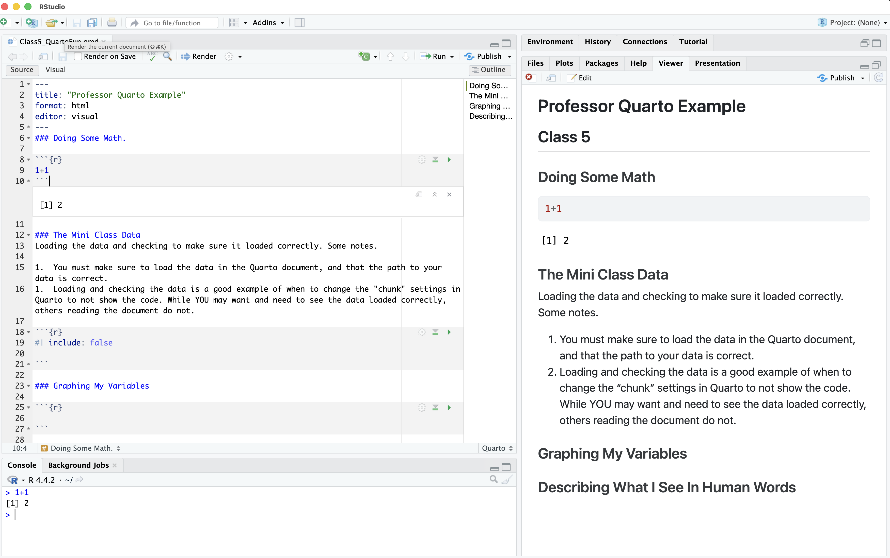

## [Check-In : Review Time!](https://forms.gle/a4c5quZMgwwyY8Bc8){.smaller}

```{r}
#| include: false
d <- read.csv("~/Dropbox/!WHY STATS/0_Shared Folders/101 - Class Datasets/Mini Data/mini_cal_data.csv", stringsAsFactors = T)
d$hrs.sleep[d$hrs.sleep > 24 | d$hrs.sleep < 0] <- NA
nrow(d)
```

::::: columns
::: {.column width="70%"}

```{r}
#| echo: true
hist(d$hrs.sleep, xlab = "Hours of Sleep", main = "")
round(mean(d$hrs.sleep, na.rm = T), 0)
round(sd(d$hrs.sleep, na.rm = T), 1)
min(d$hrs.sleep,na.rm = T)
```

:::

::: {.column width="30%"}

-   What is the shape, mean, and sd of this distribution?
-   What do these statistics tell you about the people in our class?
-   Is the minimum value an outlier? Why / why not?

:::
:::::

## Lab 4. Graphing Sleep and Height With Professor{.smaller}

1.  Choose two numeric variables from the dataset. Graph each variable side-by-side using the par() function. Change the arguments to make the graphs look nice, and remove any outliers.
2.  Report the descriptive statistics for each variable. Then, explain what each variable tells you about the individuals in the dataset.
3.  Report the minimum and maximum value in the dataset as a z-score.
4.  Describe what additional questions you have about each variable.

## Lab 4. Graphing Numeric Variables Without Professor{.smaller}

Work with a buddy.

1.  Choose two numeric variables from the dataset. Graph each variable side-by-side using the par() function. Change the arguments to make the graphs look nice, and remove any outliers.
2.  Report the descriptive statistics for each variable. Then, explain what each variable tells you about the individuals in the dataset.
3.  Report the minimum and maximum value in the dataset as a z-score.
4.  Describe what additional questions you have about each variable.


## IF TIME : Quarto : Why are we learning this?

-   An authentic skill (professor uses)

    -   Saves trouble of screenshotting : integrates code and text.
    -   some GSIs are introducing it :)

-   WARNING : professor still gets frustrated when using quarto. If you are feeling dread / maxxed out, then just use an Rscript + screenshot method. Okay?

## Quarto : From Source –\> Render

::: r-fit-text
-   What looks different about our R Script? What looks the same (or similar??)


:::


## [BREAK TIME Check-In](https://docs.google.com/forms/d/e/1FAIpQLSdl3nqWlDUGVV9ytbhhvF2_C5JWTA7r0Rjn31ltquuv5hDAaw/viewform?usp=sf_link)

# Final Project Time.

### Find a sheet of paper and pencil; draw this cube as precisely as possible.

{fig-align="center"}

### [Milestone #2](https://docs.google.com/document/d/1DxiIxm_sRtm8t5FEOWhOJluJOo6ZPUI_eZTS13K4CxA/edit?tab=t.0#bookmark=id.8eg84yu09e7c)

-   **Part 1 :** Outlining Your Introduction (and thinking about IV2)
-   **Part 2 (NEXT WEEK) :** Defining your measures.

### KEEP IT SIMPLE : but life is complex {.smaller}

1.  Start with your linear model; just focus on one DV and two IVs.
2.  Ways to think about IV2.
    -   **As a “Mediator”, “Confound”, or “Control” Variable.** Where the relationship between IV1 and the DV might be smaller, larger, or no different than IV2.  ***EXAMPLE :** I’d expect a stronger relationship between a person’s health (DV) and whether they  have running shoes or not (IV1) than whether they have a raincoat or not (IV2). I’d also expect the relationship between health and running shoes to go away when you also account for whether the person goes running (IV2).*
    -   **As a “Moderator” or “Interaction Effect”.** When the relationship between IV1 and the DV depends on the level of IV2. ***EXAMPLE :** the relationship between going for a run (IV1) and health (DV) depends on whether the person is running in a place with high or low air quality (IV2). If the air quality is bad, then running is negatively related to health. If the air quality is good, then running is positively related to health.* 

### Introduction Deconstruction. {.smaller}

::: r-fit-text
Start broad, but focus to your specific question!

|  |  |
|----|----|
| **Section** | **Brief Explanation** |
| **1. The Opening** | Describe the question you have, and explain why this question matters |
| **2. The Review** | Describe what past research and theory has to say on the question and your theory. Your goal is to give the reader the background they need to understand why you are doing your study; you don’t need to cover EVERY single issue on your topic.. |
| **3. The Critique** | Explain why the past research is not “the final truth”, and what other new questions might be important to consider (and why these questions matter). Only point out limitations with past research that you will address in your study; other limitations that you think future research will address should go in the discussion section. |
| **4. The Current Research** | Explain what specific questions your study will address. Be clear by stating each idea as a hypothesis with language like, “I predict” or “My first hypothesis”. |

: {tbl-colwidths="\[20,80\]"}
:::

### ACTIVITY : identify parts of an introduction. {.smaller}

::: r-fit-text
-   *“The Opening”, “The Review”, “The Critique”, and “The Current Research”* 
:::

## DEFINITION : patterns in writing

1.  **THE POINT :** What are you trying to say?

2.  **THE EVIDENCE :** What is some evidence that supports this point? This could be empirical (e.g., a summary of past research on the topic), but also logic or real-life experiential examples work here.

3.  **WHO CARES :** Why does this matter? How does this connect to your main thesis?

### THE EVIDENCE : logic vs. empirical evidence.

:::::: r-fit-text
::::: columns
::: {.column width="50%"}
*"Think first of swallowing the saliva in your mouth, or do so. Then imagine expectorating it into a tumbler and drinking it! What seemed natural and "mine" suddenly becomes disgusting and alien. Or picture your self sucking blood from a prick in your finger; then imagine sucking blood from a bandage around your finger! What I perceive as separate from my body becomes, in the twinkling of an eye, cold and foreign."*

-   Gordon Allport (1955). Becoming: basic considerations for a psychology of personality. Yale University Press.
:::

::: {.column width="50%"}
In a study of 45 female college students, a sweaty shirt was rated as more disgusting when it was associated with an outgroup than when associated with an ingroup (Reicher et al., 2016).

-   S.D. Reicher, A. Templeton, F. Neville, L. Ferrari, & J. Drury, Core disgust is attenuated by ingroup relations, Proc. Natl. Acad. Sci. U.S.A. 113 (10) 2631-2635, https://doi.org/10.1073/pnas.1517027113 (2016).
:::
:::::
::::::

### EXAMPLE : patterns in writing. {.smaller}

::: r-fit-text
-   *The Point, The Evidence, The Who Cares*


:::

## THE END.


