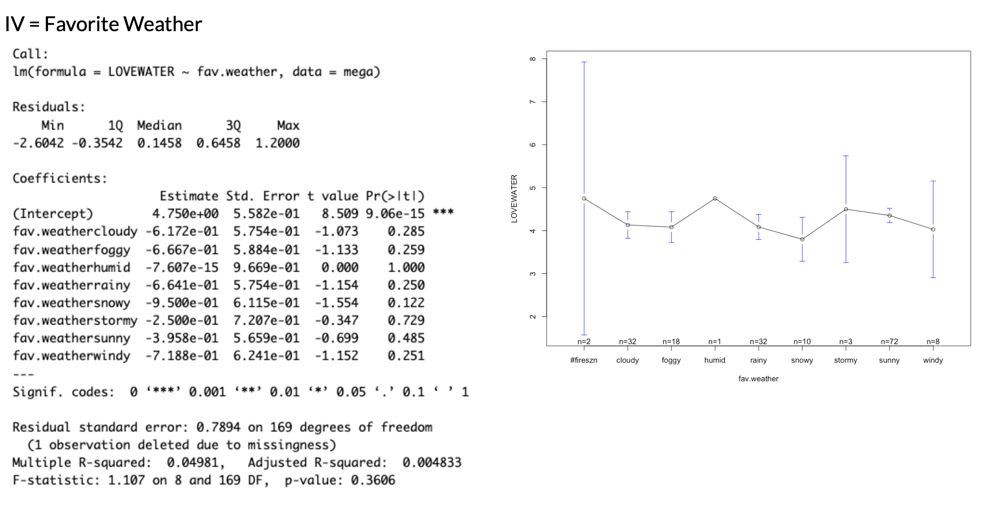
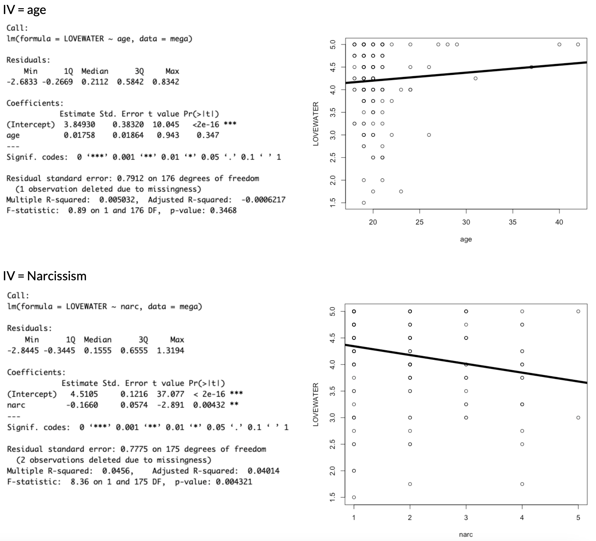

:::::: {.callout-note collapse="true"}
### Announcements and Agenda

::::: columns
::: {.column width="50%"}
-   **R Exam is GRADED.** Key + Learning From R Exam Assignment.
:::

::: {.column width="50%"}
**Today, on Psych 214...**

-   **8:55 - 10:00.** Check-In and NHST Review.
-   **10:00 - 10:10.** Break Time.
-   **10:10 - 11:00.** More NHST Review. Whew.
:::
:::::
::::::

### Class Slides and Materials!!

```{=html}
<iframe data-external="1" class="slide-deck" src="/dvcstats/slides/ch8.html" width="100%" height="500px" title=""></iframe>
```

-   [**Check-In. NHST Review**](https://docs.google.com/forms/d/e/1FAIpQLSdyVnc80GrkTtGyaESOJJjjlAUHAUfpgMeiVkpZRo2JhKEbgQ/viewform). No R needed!
-   **Professor R Scripts \[[Zoom Room](https://www.dropbox.com/scl/fo/ofchakmk3d1ep17u2r5r5/APTz8gRoQo9AHhw2XPY5TZs?rlkey=mdept9ym448grm4vya184bbrd&dl=0) + [Room Crew](https://www.dropbox.com/scl/fo/fa4okobq89jhhj0wthgy5/AHJsWr-fakA7N8JnlLZHKIs?rlkey=hfw992f7lj8nzfbcz6qp7n2og&dl=0)\]**

# For Next Week.

### Learning From the R Exam Revisions

-   Professor posted the R Exam Key.

-   Go through the assignment and learn from your mistakes.

### Watch some more pre-recorded NHST Review Videos

**Note : I recorded these videos in a previous semester (with different class data).** You will likely get different results if you try and replicate these results in this semester's class (though we likely had a different class dataset). a good example of how NHST doesn't really tell us whether the results are "truth" or not, or whether they will replicate.

#### Example 1 : Weather and Love for Water

::: {style="position: relative; padding-bottom: 56.25%; height: 0;"}
<iframe src="https://www.loom.com/embed/67776eb1a41f4b5eaa0ca5312d0663ad" frameborder="1" webkitallowfullscreen mozallowfullscreen allowfullscreen style="position: absolute; top: 0; left: 0; width: 100%; height: 100%;">

</iframe>
:::



#### Example 2 : Love of Water and Age

::: {style="position: relative; padding-bottom: 56.25%; height: 0;"}
<iframe src="https://www.loom.com/embed/8b755a32fe094e9eb1fc0bd7f16991bd" frameborder="0" webkitallowfullscreen mozallowfullscreen allowfullscreen style="position: absolute; top: 0; left: 0; width: 100%; height: 100%;">

</iframe>
:::

# 
