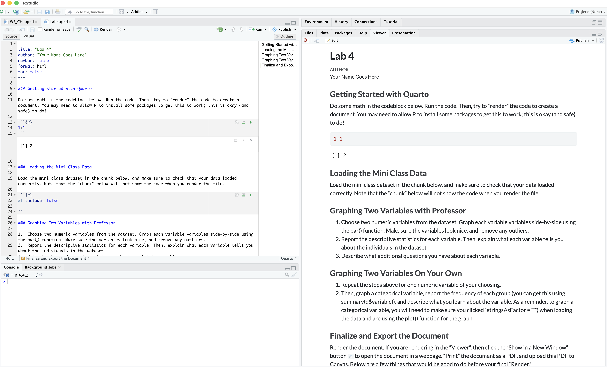
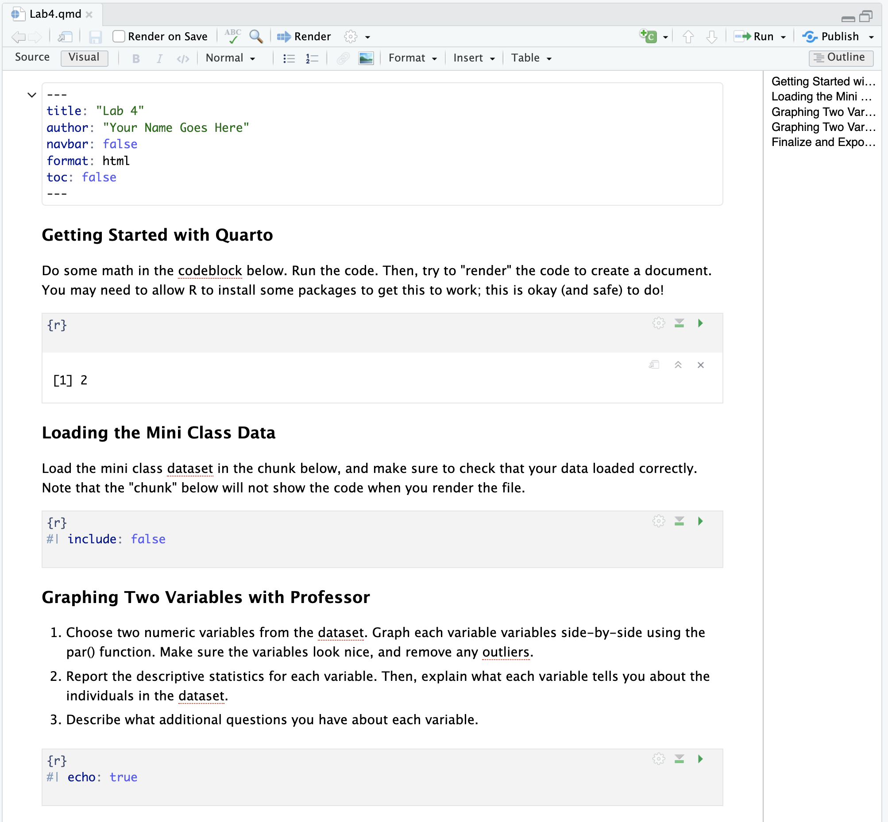

## [Check-In : Review Time!](https://docs.google.com/forms/d/e/1FAIpQLSdRQ2xhpR00TLlTpd8F4nt3h0JTqQ2q5RTXn2I2yOTpoTHVcw/viewform?usp=header){.smaller}

```{r}
#| include: false
d <- read.csv("~/Dropbox/!WHY STATS/0_Shared Folders/214 - Class Datasets/Mini Data/mini_DATA.csv", stringsAsFactors = T)
d$hrs.sleep[d$hrs.sleep > 24 | d$hrs.sleep < 0] <- NA
nrow(d)
```

::::: columns
::: {.column width="70%"}

```{r}
#| echo: true
hist(d$hrs.sleep, xlab = "Hours of Sleep", main = "")
mean(d$hrs.sleep, na.rm = T)
sd(d$hrs.sleep, na.rm = T)
```


:::

::: {.column width="50%"}


:::
:::::


## Lab 4. Graphing Numeric Variables With Professor{.smaller}

1.  Choose two numeric variables from the dataset. Graph each variable side-by-side using the par() function. Change the arguments to make the graphs look nice, and remove any outliers.

```{r}
names(d)
```

2.  Report the descriptive statistics for each variable. Then, explain what each variable tells you about the individuals in the dataset.
3.  Report the minimum and maximum value in the dataset as a z-score.
4.  Describe what additional questions you have about each variable.

## Lab 4. Graphing Numeric Variables Without Professor{.smaller}

Work with a buddy on the Vision Board...

1.  Choose two numeric variables from the dataset. Graph each variable side-by-side using the par() function. Change the arguments to make the graphs look nice, and remove any outliers.
2.  Report the descriptive statistics for each variable. Then, explain what each variable tells you about the individuals in the dataset.
3.  Report the minimum and maximum value in the dataset as a z-score.
4.  Describe what additional questions you have about each variable.

## Quarto : Why are we learning this?

-   **It's a Fancy RScript :**

-   **An authentic skill :** professor (and others) use because it saves trouble of screenshotting by integrating code and text together in one document.

-   **WARNING :** professor still gets frustrated when using quarto. If you are feeling dread / maxxed out, then just use an Rscript + screenshot method. Okay?

## Quarto : From Source –\> Render



## Quarto : The Visual Editor

::::: columns
::: {.column width="50%"}

:::

::: {.column width="50%"}
:::
:::::
