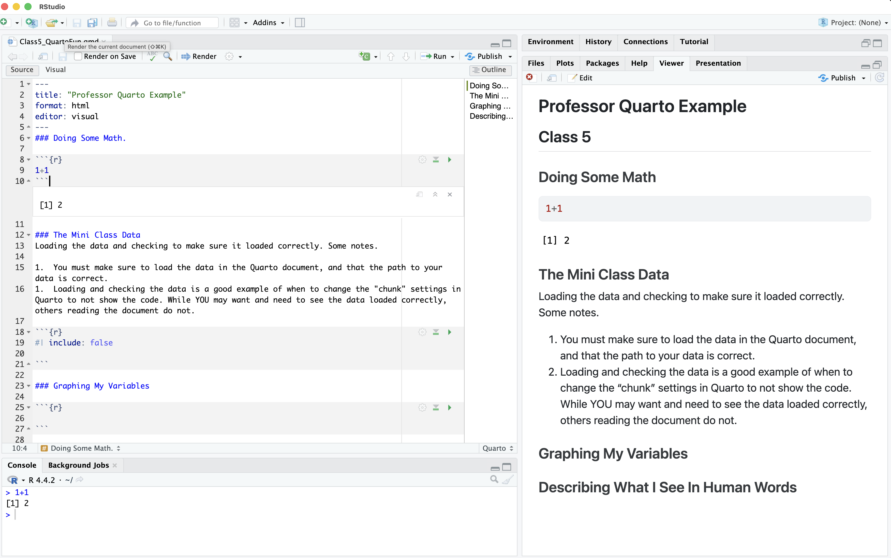

## [CHECK-IN : Linear Model Prep](https://docs.google.com/forms/d/e/1FAIpQLSe-830Xaq_jAfRomviIR6CrIaurGYB_hUJcRYbLFXQfeASI4A/viewform?usp=header)

:::: {.columns}

::: {.column width="50%"}
```{r}
#| fig-width: 5
#| fig-height: 5
d <- read.csv("~/Dropbox/!WHY STATS/Chapter Datasets/Our World in Happy Data/DATASET_happy_data.csv", stringsAsFactors = T)
plot(d$SWLS_24 ~ d$Child.Mortality, xlab = "Child Mortality", ylab = "World Happiness in 2024")
mod <- lm(d$SWLS_24 ~ d$Child.Mortality)
abline(mod, lwd = 5, col = 'red')
```

:::

::: {.column width="50%"}
```{r}
#| column: margin
knitr::kable(c(round(coef(mod), 2),
                   RSQUARED = round(summary(mod)$r.squared, 2)), col.names = "Linear Model")
```
:::

::::


## Steps for a Linear Model (in R)

-   Choose a dataset
-   Identify the variables (graph and make sure there are no outliers.)
-   Graph the relationship between the two variables
-   Define the model
-   Add the model to the scatterplot
-   Interpret the statistics : intercept, slope, and $R^2$


## BREAK TIME : MEET BACK AT \_\_\_\_\_\_\_\_\_\_\_\_\_

## Quarto : Why are we learning this?

-   An authentic skill (professor uses)

    -   Saves trouble of screenshotting : integrates code and text.
    -   some GSIs are introducing it :)

-   WARNING : professor still gets frustrated when using quarto. If you are feeling dread / maxxed out, then just use an Rscript + screenshot method. Okay?

## Quarto : From Source –\> Render

::: r-fit-text
-   What looks different about our R Script? What looks the same (or similar??)


:::

## 
