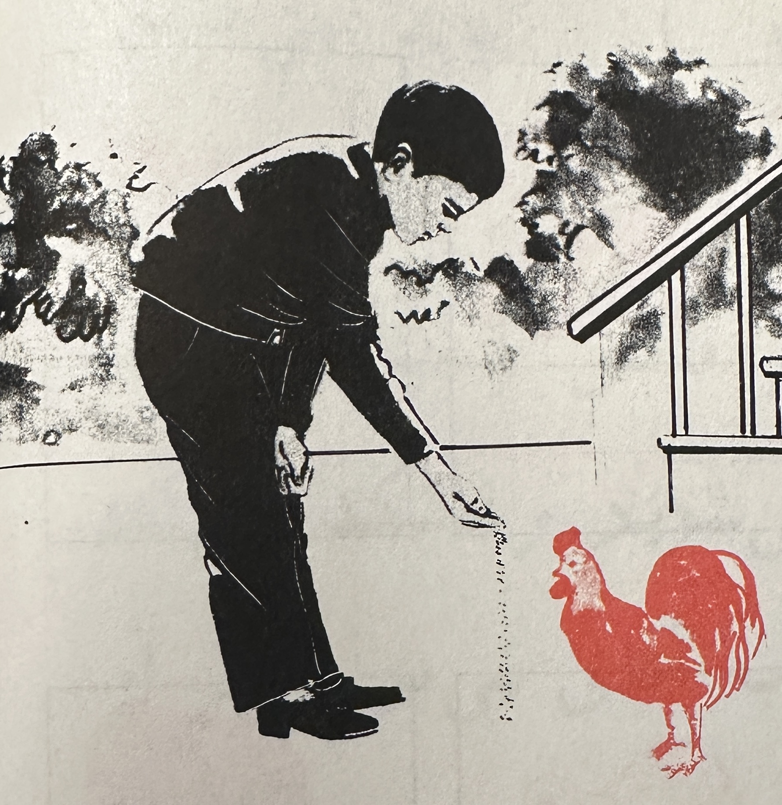

# Arman Daniel Catterson \| Website Version

## \@ DVC

- **Psych C1000 \|** Introduction to Psychology \[since 2016\]

- [**Psych 214 \|** Statistics in Psychology](/dvcstats/STATDVC.qmd) \[since 2020\]

- [**Psych 215 \|** Research Methods in Psychology](/rm/RMDVC.qmd) \[since 2016\]

- **Persian Club \|** من تخته بازی می کنم و بربری و چای می خورم

## \@ UC Berkeley

- [**PSYCH 101 \|** Statistics and Research Methods \[since 2015\]](/calstats/calstatsFA26.qmd)

- [**COMPSS 212 \|** Advanced Applied Statistics I \[Fall 2026\]](/COMPSS212/COMPSS212.qmd)

- **PSYCH 102 \|** Advanced Research Methods \[Fall 2025\]

- **PSYCH 205 \|** Graduate Statistics \[Spring 2025, Spring 2027\]

- **COMPSS 202 \|** Introduction to Applied Statistics \[Summer 2026\]

- **COMPSS 222 \|** Advanced Applied Statistics II \[Spring 2026\]

## thank you for visiting my webpage

{fig-align="center" width="285"}
