```{r}
#| include: false

library(psych)
d <- read.csv("~/Dropbox/!GRADSTATS/COMPSS222/Datasets/Class Datasets/MaCSS - Onboarding Data/DATASET_MACSS_onboard_SP26.csv", stringsAsFactors = T)
```

# Welcome to COMPSS222

-   [**Please complete this check-in!**](https://docs.google.com/forms/d/e/1FAIpQLSeeI7c61ROnyvAROV0cf7viiS42Wk2Vc3uDOJrAro6BLMXFEA/viewform?usp=publish-editor)

-   Use the onboarding dataset to answer a few questions.

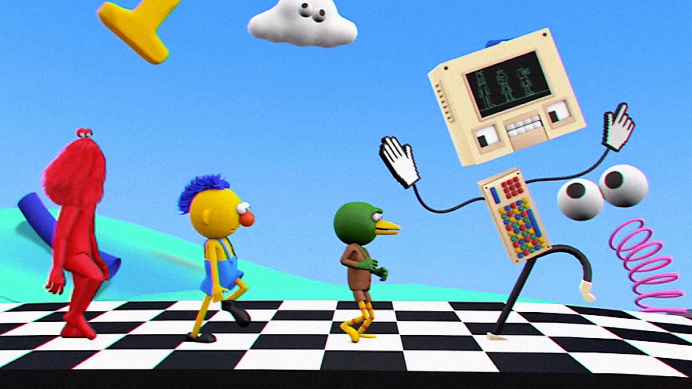{fig-align="center" width="80%"}

## Who Are You??

### The Professor : Arman Catterson

-   **who :** Arman…Professor…Professor Catterson…Dr. Catterson

-   **where :** from Texas to Berkeley to Google (briefly) to teaching statistics at the graduate and undergraduate level at Berkeley.

-   **what else :** parenting, bicycles, dnd, Mr. Liu's Noodle House.

{fig-align="center" width="40%"}

### The GSI : Max! (will arrive at 11:00 each week.)

-   Max Facts Go Here.

### The Students.

***Your voice is needed.***

-   **in data science!**

-   **in the classroom!** we learn from each other.

    -   clap once if you are here.

    -   sound you made when alarm went off this morning?

    -   [**the vision board**](https://docs.google.com/spreadsheets/d/11FZJ76JMBUkKYZRoWASrHhPIldmP7Pziz-WGnlIZuC4/edit?usp=sharing) **:** name, where's home?, capstone project, favorite place to eat?

## Why (Advanced Applied) Statistics II?

*Why is this class required?*

*Why is this degree or career path needed?????!?*

### Statistics as a Language... {.smaller}

| ...to describe | ...to predict | ...to control |
|----|----|----|
|  | [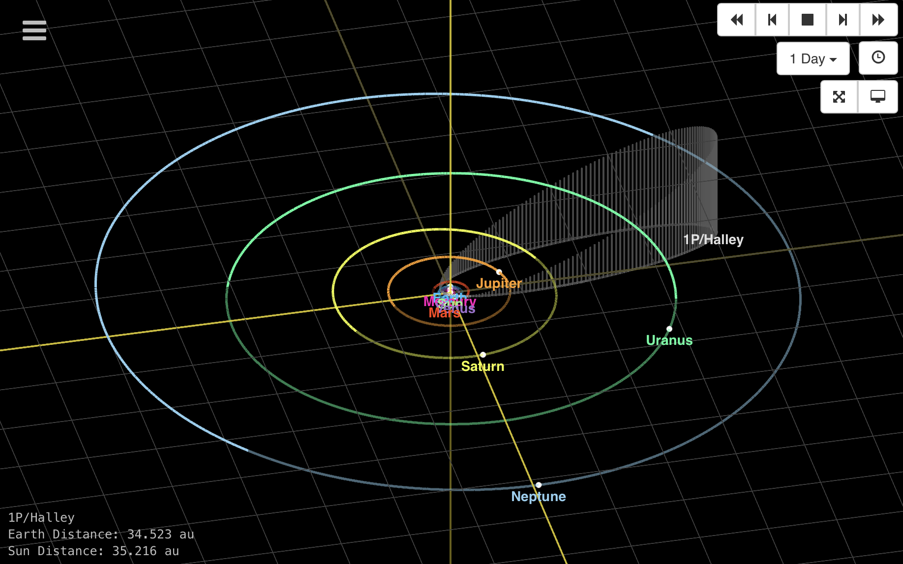](https://ssd.jpl.nasa.gov/tools/sbdb_lookup.html#/?des=1P&view=VOP) |  |

### KEY IDEA : this is hard and errors happen. {.smaller}

| ...error in description | ...error in prediction | ...error in controlling outcomes |
|----|----|----|
| {width="190"} |  |  |

### SOCIAL SCIENCE : REAL (TM) SCIENCE

| ...to describe | ...to predict | ...to control |
|----|----|----|
| 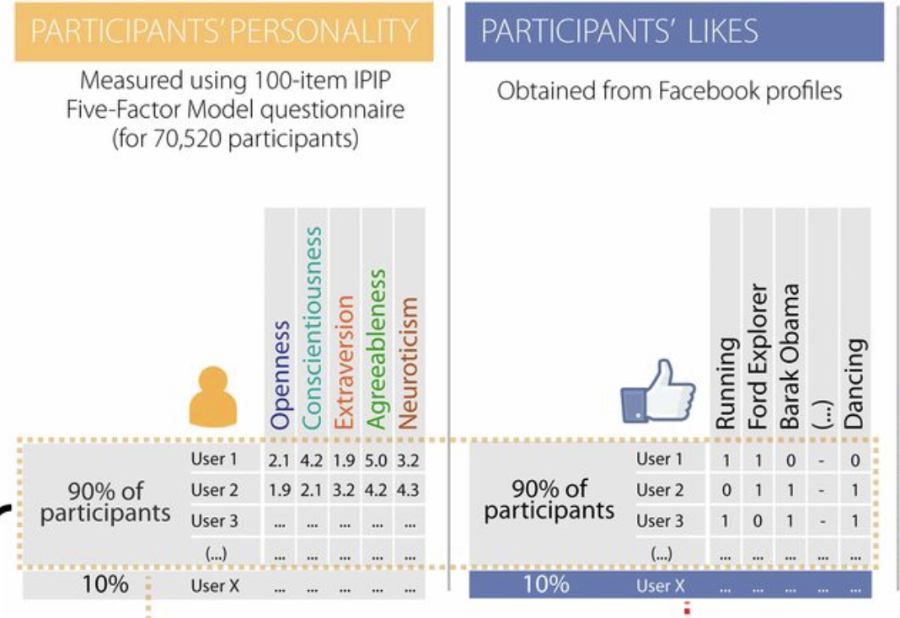 | 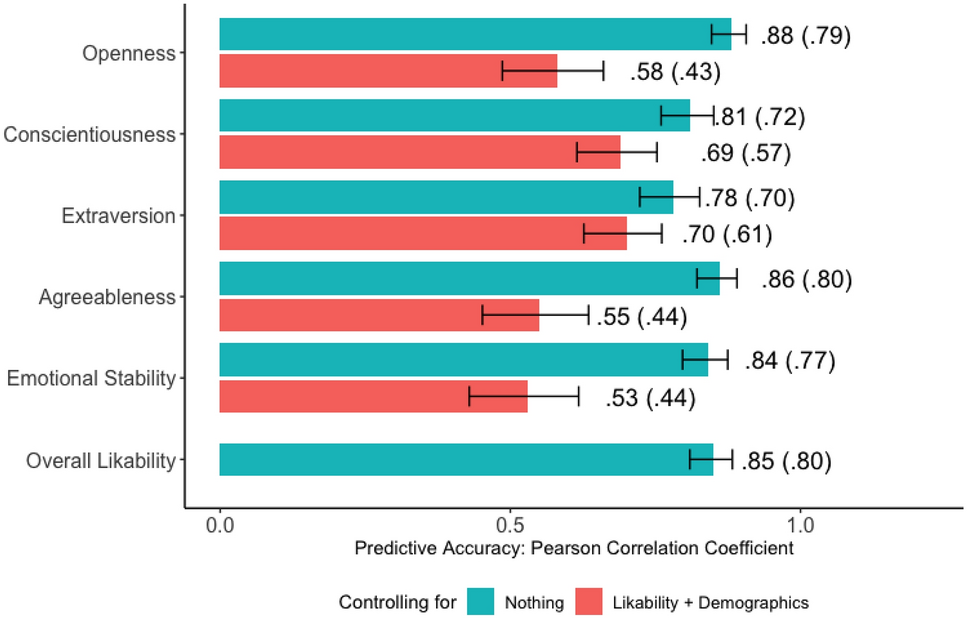 | 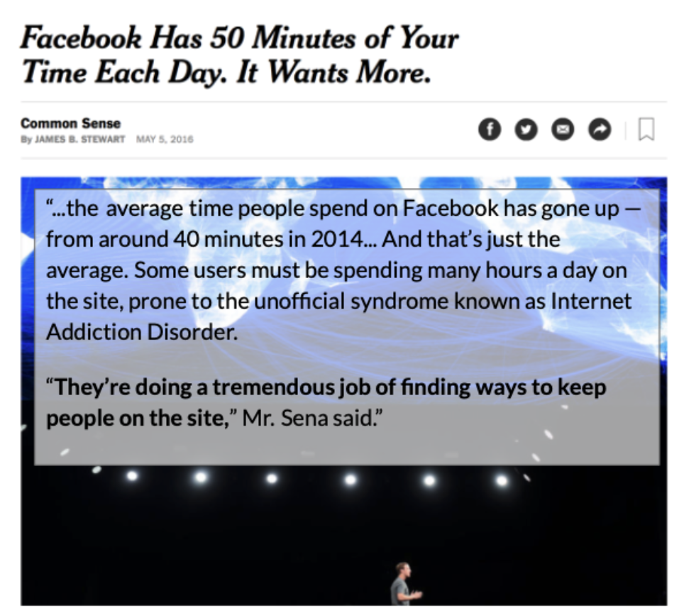 |

### On the Vision Board : {.smaller}

-   what are the variables you are trying to DESCRIBE in your capstone project?

-   how will you use this knowledge to make PREDICTIONS?

-   how might you use this knowledge to CONTROL OUTCOMES?

-   what are some places that ERROR might be introduced into your work?

## This Class. {.smaller}

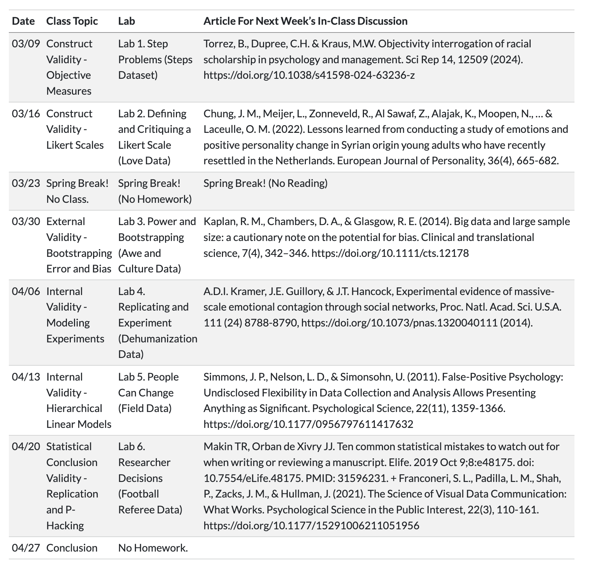{fig-align="center" width="62%"}

### Goals.

1.  **Review** and Extend Statistics Knowledge.
2.  **Practice** doing "Good Science" in Class.
3.  **Keep it Chill.** Been a long year and y'all have more to do.

### Assessments.

1.  Participation (Attendance & Vision Board & Discussions)
2.  Practice (Lab Assignments; graded for completion and effort)

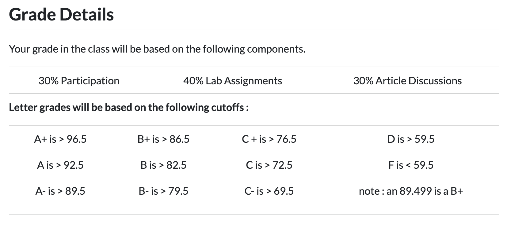{fig-align="center" width="82%"}

### Questions?

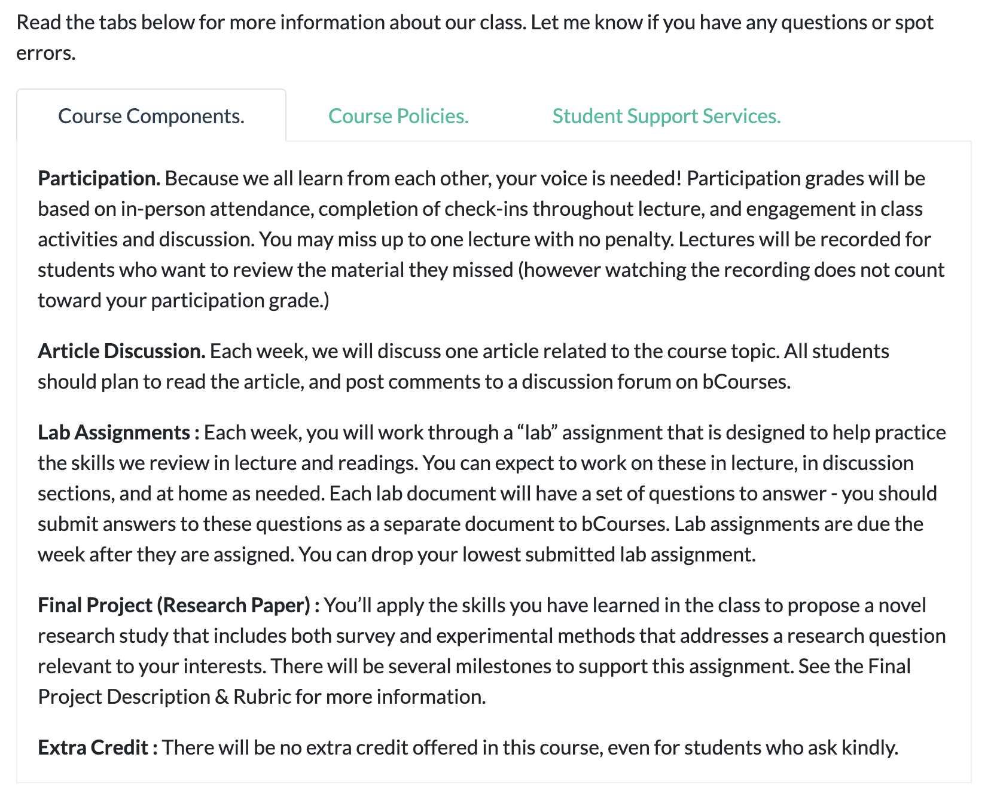

### But You Don't Have To Take My Word For It.... {.smaller}

```{r}
#| fig-width: 15
#| fig-height: 5
par(mfrow = c(1,3))
hist(d$fam.r, col = "black", bor = "white", 
     xlab = "Student Familiarity with R",
     xlim = c(0,10), main = "")
hist(d$fam.stat, col = "black", bor = "white", 
     xlab = "Student Familiarity with Statistics",
     xlim = c(0,10), main = "")
hist(d$fam.rm, col = "black", bor = "white", 
     xlab = "Student Familiarity with Methods",
     xlim = c(0,10), main = "")

knitr::kable(describe(d[,c(2:4)], skew = F), digits = 2, align = "c")

```

### ACTIVITY : the onboarding dataset {.smaller}

::::: columns
::: {.column width="40%"}
-   **choose TWO variables** you are interested in learning more about.
-   **graph EACH variable (univariate statistics only for now!)**
    -   what do you learn?
    -   report descriptive statistics *as needed.*
-   **evaluate your results:**
    -   think of new questions (and limitations)
    -   how do you use this knowledge?
:::

::: {.column width="60%"}
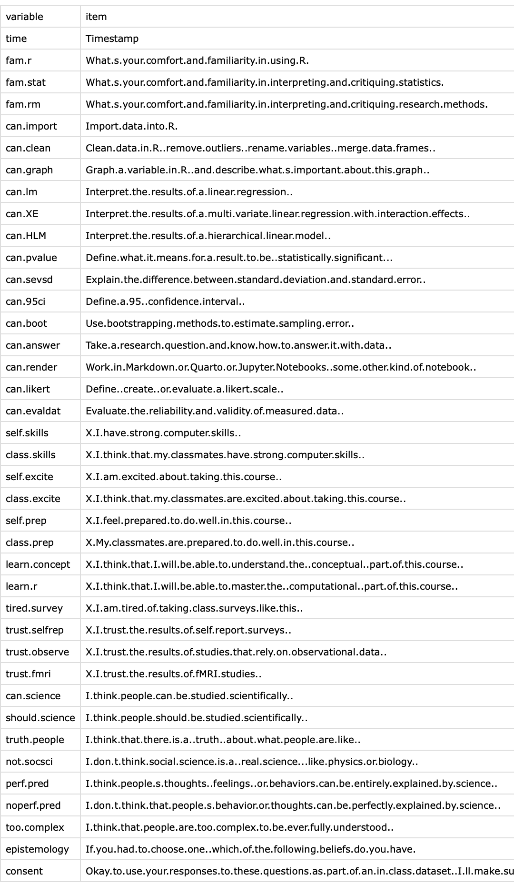{fig-align="center" width="40%"}
:::
:::::

### Student Work Review

## BREAK TIME, MEET BACK AT \_\_\_\_\_\_\_\_\_

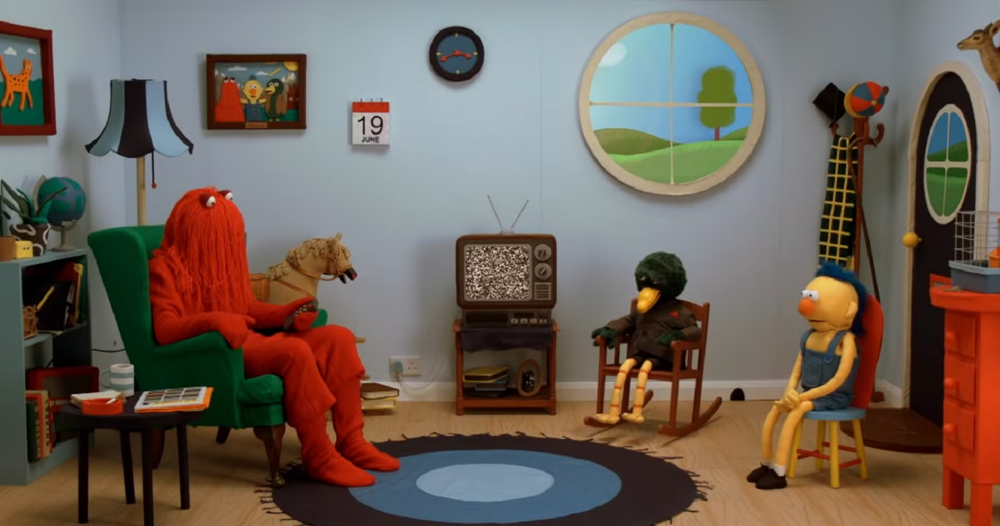

# Part 2 : Good Data

## Operationalization (an Eight Syllable Word)

-   A fancy definition (like a rich doctor).
-   Technical and precise (like a doctor who operates).
-   A *process* (an operation).

{fig-align="center" width="50%"}

### Operationalization in Real-Life

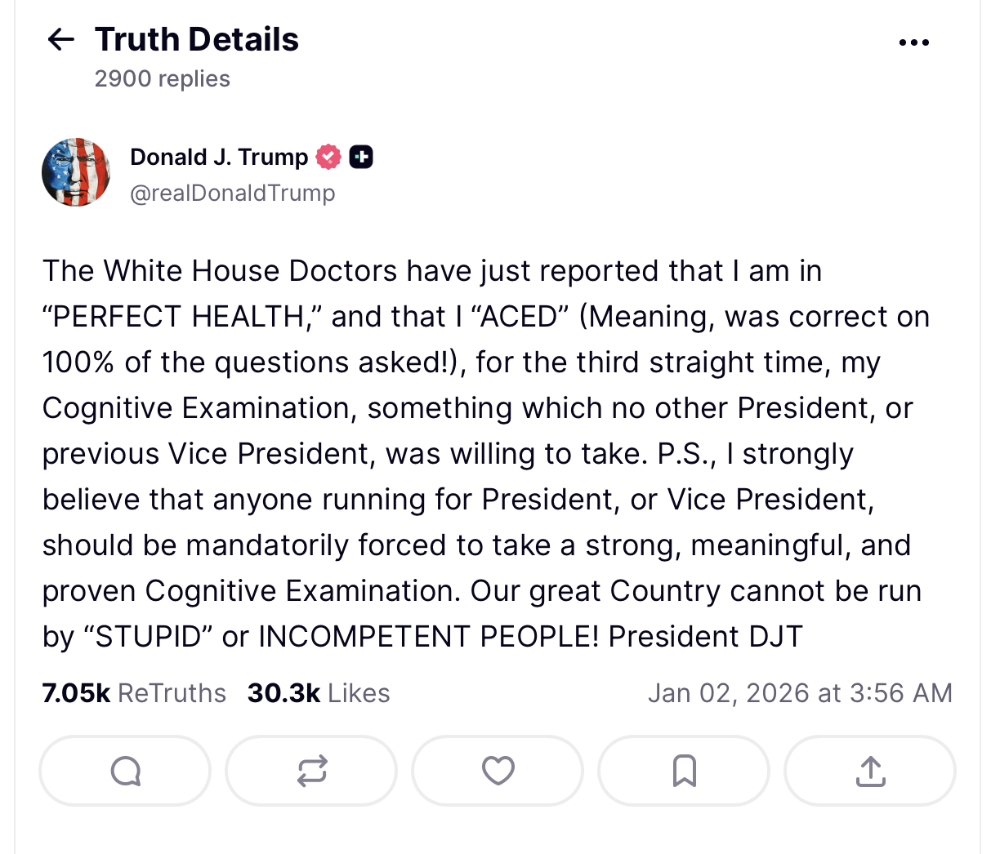{fig-align="center" width="60%"}

### Operationalization of "Cognitive Exam"

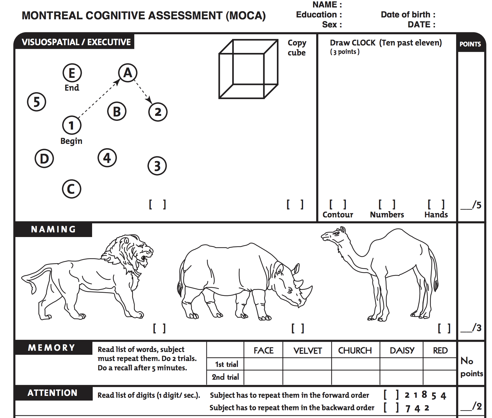{fig-align="center" width="60%"}

### ACTIVITY : Count the Interruptions. {.smaller}

**Count the Interruptions : [tinyurl.com/researchinterruptions](https://docs.google.com/forms/d/e/1FAIpQLSdDt9g2s4rELaKorXyprVgtOa0Smb8ooI_FIWNg2i7iXKpazA/viewform?usp=sf_link)**

-   Count the number of interruptions in the video (which professor will play soon).
-   Submit your answer, **then wait for the letter of the day.**

### ACTIVITY : Count the Interruptions. {.smaller}

{fig-align="center"}

### DISCUSSION : Operationalization

-   How was watching the video?

-   How many INTERRUPTIONS did you count?

-   How did you OPERATIONALIZE an INTERRUPTION?

### ACTIVITY : Count the Interruptions Again. {.smaller}

{fig-align="center"}

### DISCUSSION : How did the data change? {.smaller}

-   What differences between our counts at time 1 and time 2 would we expect there to be?

## Reliability and Validity

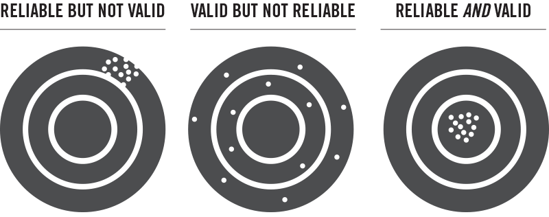{fig-align="center" width="60%"}

### Reliability and Validity (Specific Terms) {.smaller}

::: r-fit-text
|  |  |  |
|----|----|----|
| **Term** | **Example (Bathroom Scale)** | **Example (Interruption? Onboarding?)** |
| **face validity :** does our measure or result look like what it should look like? | data are numbers; range from 0 to 100s |  |
| **convergent validity :** is our measure similar to related concepts? | weight should increase with height...pant size. |  |
| **discriminant validity :** is our measure different from unrelated concepts? | weight should be unrelated to mouth position. |  |
| **test-retest reliability :** do we get the same result if we take multiple measures? | step on the scale multiple times; get same result. |  |
| **inter-rater reliability :** would another observer (or tool) make the same measurements? | step on multiple scales; get same answer. |  |
:::

### DISCUSSION : examples of these terms in social science research? {.smaller}

::: r-fit-text
|  |  |  |
|----|----|----|
| **Term** | **Example (Social Media "Likes")** | **Example (Your Capstone Project?)** |
| **face validity :** does our measure or result look like what it should look like? |  |  |
| **convergent validity :** is our measure similar to related concepts? |  |  |
| **discriminant validity :** is our measure different from unrelated concepts? |  |  |
| **test-retest reliability :** do we get the same result if we take multiple measures? |  |  |
| **inter-rater reliability :** would another observer (or tool) make the same measurements? |  |  |
:::

### ACTIVITES : examples of these terms in the onboarding dataset? {.smaller}

::: r-fit-text
|  |  |
|----|----|
| **Term** | **Example in Onboarding** |
| **face validity :** does our measure or result look like what it should look like? |  |
| **convergent validity :** is our measure similar to related concepts? |  |
| **discriminant validity :** is our measure different from unrelated concepts? |  |
| **test-retest reliability :** do we get the same result if we take multiple measures? |  |
| **inter-rater reliability :** would another observer (or tool) make the same measurements? |  |
:::

## DISCUSSION : Is It Possible to Be Objective?

```{r}
#| fig-width: 10
#| fig-height: 5
plot(d$epistemology, col = "black", bor = "white", main = "Epistemologies")
```

### Article for Next Week : Objectivity Interrogations


