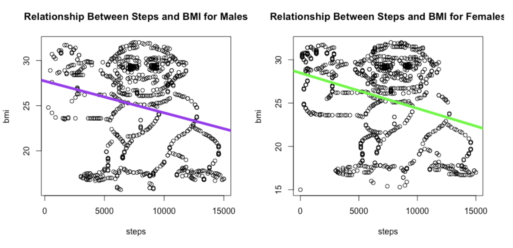
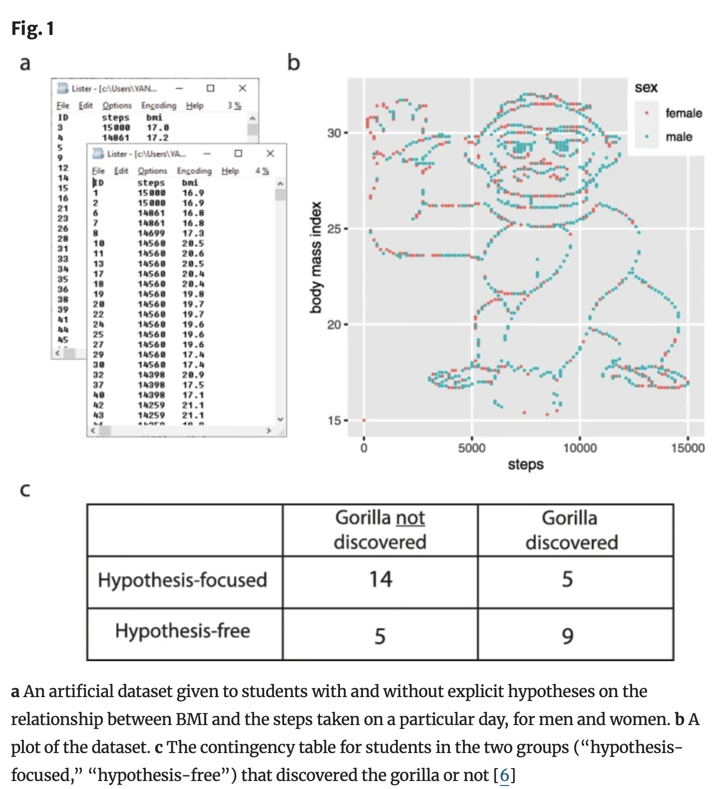
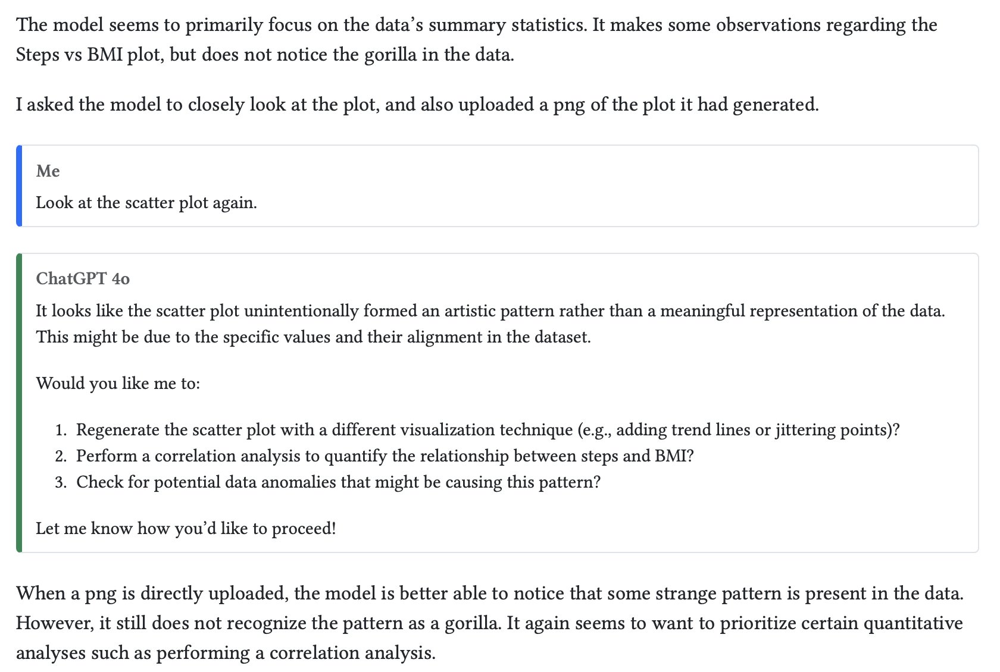
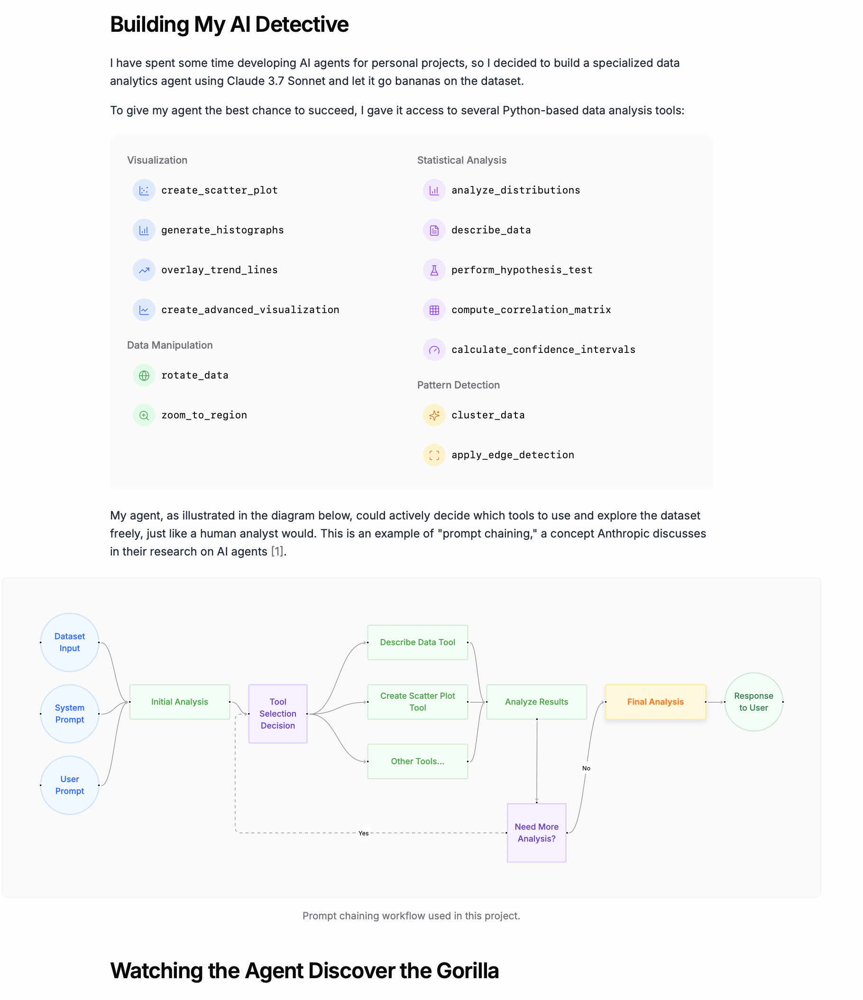
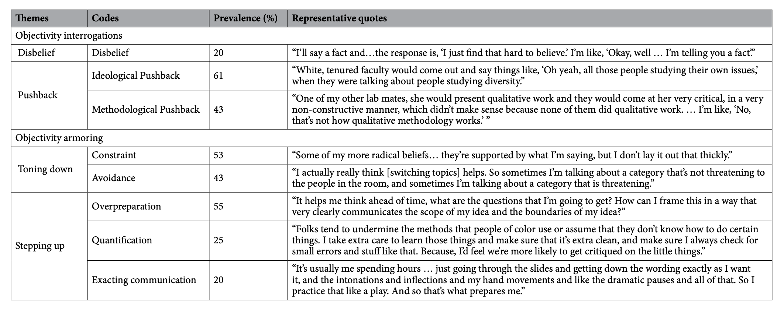
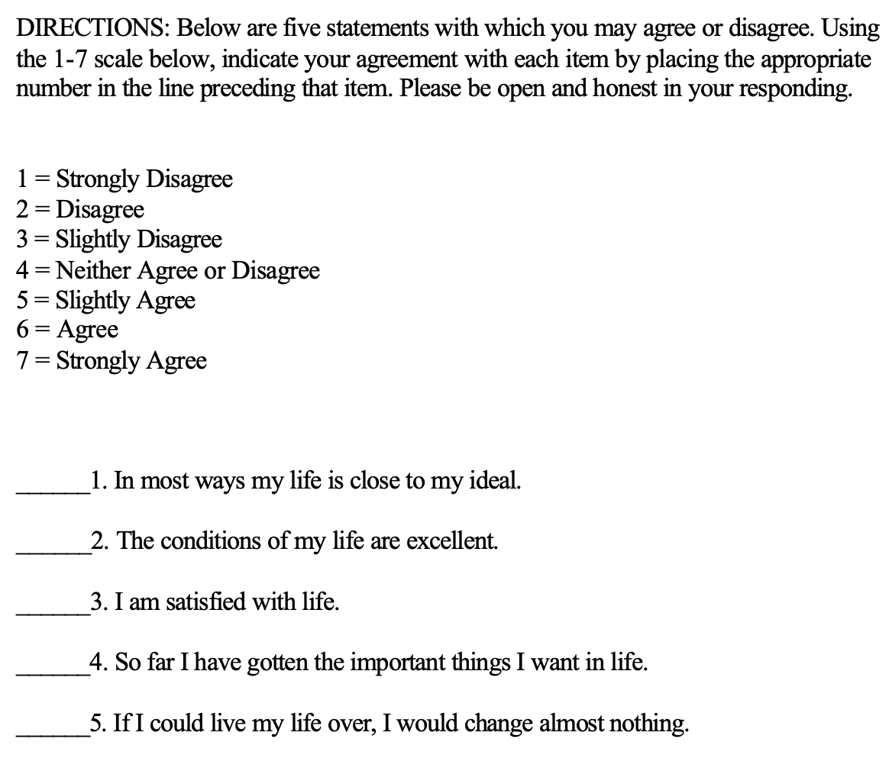
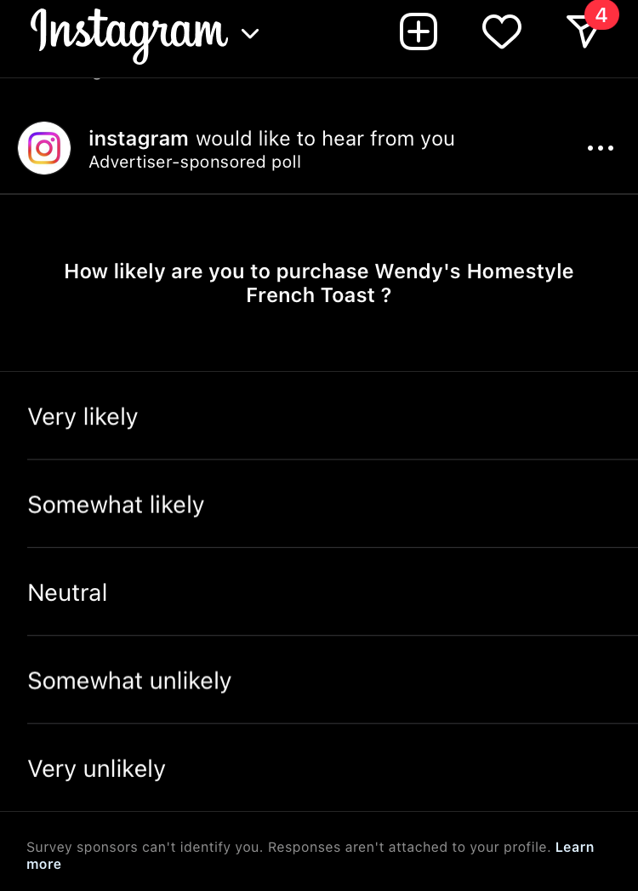

```{r}
#| include: false

## Hormone Dataset
library(psych)
library(ggplot2)
h <- read.csv("~/Dropbox/!GRADSTATS/COMPSS222/Datasets/Class Datasets/Hormone Data/haas_hormone_dataset.csv", stringsAsFactors = T)
nrow(h)


```

# Hello Again! {.smaller}

[**Please complete this check-in as a warm-up!**](https://docs.google.com/forms/d/e/1FAIpQLSdUuPUWN5_lkHw8DkudwT0--qu8eEFurLSYeJ227V37LC3g1A/viewform?usp=header)

::::: columns
::: {.column width="60%"}
**Use the [hormone dataset](https://www.dropbox.com/scl/fo/2f7kaifml4sq8mq1c7dfi/ALPLJarvk4vomfrddx2Buyg?rlkey=i62g4s3nzeldyvvffgviolobi&dl=0) to...**

-   DESCRIBE : what is the mean of narc_score & age? the % of male and female participants?
-   PREDICT : are there differences in the level of narcissism for males and females? why?
-   ERROR : how good is this prediction? do you believe in this pattern? why?
-   CONTROL : how might we use this knowledge? what other questions do you have?
:::

::: {.column width="40%"}
**Description of Variables**

-   age = age of the participant (in years)
-   narc_score = a measure of narcissism (how much the person thinks they are better than others)
-   sex = biological sex (1 = male, 2 = female)
:::
:::::

### ACTIVITY : count the number of times the basketball is passed



## Lab 1 Review.

### DISCUSS: The Monkey In Lab 1 {.smaller}

-   did you see the gorilla in the data?
-   reactions to the gorilla?
-   how did you answer the question? \[linear model, comparison of means, etc?\]



### [RESEARCH](https://genomebiology.biomedcentral.com/articles/10.1186/s13059-020-02133-w)

::: r-fit-text
*When people were given a hypothesis, they were less likely to see the gorilla in the data then when left to "explore" the dataset on their own.*

{fig-align="center" width="70%"}
:::

### Does AI See the Gorilla?

[Blog Post from February 2025](https://chiraaggohel.com/posts/llms-eda/index.html)



### Does AI See the Gorilla?

[Blog Post from March 2025](https://www.hudsong.dev/ai-gorilla-pattern-detection)

{fig-align="center" width="50%"}

# PART 1 : The Linear Model (It's All Lines)

### Check-In (And Linear Model) Review {.smaller}

::::::::: panel-tabset
#### Description (Number)

```{r}
par(mfrow = c(1,2))
wrongage <- h$age
hist(wrongage)
h$age[h$age < 0] <- NA
hist(h$age)
knitr::kable(cbind(mean = mean(wrongage, na.rm = T),
            mean = mean(h$age, na.rm = T)))
```

#### Description (Category)

```{r}
h$sexF <- as.factor(h$sex)
levels(h$sexF) <- c("Male", "Female")
h$sexF <- relevel(h$sexF, ref = "Female")
plot(h$sexF)
summary(h$sexF)
```

#### Predict : A Model

::::: columns
::: {.column width="40%"}
```{r}
#| warning: false
#| fig-height: 4
#| fig-width: 4
#| fig-align: center

ggplot(h, aes(x = sexF, y = narc_scale)) + 
  stat_summary(fun = mean, geom = "bar", width = .2) + 
  geom_smooth(method = "lm", aes(group = 1), se = FALSE) + 
  coord_cartesian(ylim = c(1, 5)) + 
  xlab("Sex of Participant") + ylab("Narcissism Score (1-5 Scale)") + 
  ggthemes::theme_base()

```
:::

::: {.column width="60%"}
```{r}
library(jtools)
mod1 <- lm(narc_scale ~ sexF, data = h)
export_summs(mod1)
```
:::
:::::

#### Predict : The "Four Reasons"

Which of these came to mind? Which are relevant?

1.  Causation
2.  Reverse Causation
3.  Confound Variables
4.  Chance (next class!)

*Note : Correlation is not causation but causation will be correlated :)*

#### To Define Error.

::::: columns
::: {.column width="50%"}
```{r}
#| fig-height: 7
#| fig-width: 8

par(mfrow = c(1,2))
plot(h$narc_scale, pch = 19, main = "Black = The Mean")
abline(h = mean(h$narc_scale, na.rm = T), lwd = 5)
plot(h$narc_scale, col = h$sexF, pch = 19, main = "Black = Female; Red = Male")
abline(h = coef(mod1)[1], col = 'black', lwd = 5)
abline(h = coef(mod1)[1] + coef(mod1)[2], col = 'red', lwd = 5)
```
:::

::: {.column width="50%"}
$$
\hat{Y} = a + b_1 * X_1 + {\epsilon}_i 
$$

$$
{\epsilon}_i = \hat{Y} - (a + b_1 * X_1)
$$ Error = Actual Scores - Predicted Values

```{r}
#| echo: true

SST <- sum((mod1$model$narc_scale - mean(mod1$model$narc_scale))^2) 
SSM <- sum(mod1$residuals^2)
SST
SSM
SST - SSM
(SST - SSM)/SST
summary(mod1)$r.squared # relative difference
```
:::
:::::

#### To Control

How do we use this knowledge??
:::::::::

## ACTIVITY : In the Vision Board.

**Predict narc_score from another variable in the hormone dataset (or the** [onboarding dataset (from last week)](https://www.dropbox.com/scl/fo/ln7vo5wta8u06mq0ha719/ADvvtqcFzK0TnvUQTtL-2U4?rlkey=h4johl6nr6ht451ci3ad8yv7v&dl=0)**?)**

-   DESCRIBE : your variables. What do you learn?
-   PREDICT : define the model. Why does it exist?
-   ERROR : evaluate the error ($R^2$; methods & measures too!) and compare this to the model from the check-in.
-   CONTROL : how might you use this knowledge?

# When Models Get Complicated

## Standardizing Variables {.smaller}

```{r}
#| echo: true
#| fig-height: 5
#| fig-width: 5

plot(h$narc_scale ~ scale(h$narc_scale), 
     xlab = "Narcissism Scale (Z-Scored)",
     ylab = "Narcissism Scale (Raw Units)")
```

## Standardizing Terms in a Model (Z-Score) {.smaller}

```{r}
library(arm)
mod1z <- standardize(mod1, NULL, TRUE)
export_summs(mod1, mod1z)
```

## Multiple Regression {.smaller}

:::::::::::: panel-tabset
#### narcissism \~ sex

Sex is related to narcissism...

::::: columns
::: {.column width="60%"}
```{r}
#| echo: true
#| message: false
#| warning: false
#| fig-height: 5
#| fig-width: 5
library(gplots)
plotmeans(narc_scale ~ sexF, data = h, connect = F)
```
:::

::: {.column width="40%"}
```{r}
export_summs(mod1, error_format = "", scale = T, transform.response = TRUE)
```
:::
:::::

#### narcissism \~ test1

Narcissism is also related to testosterone (a hormone).

::::: columns
::: {.column width="60%"}
```{r}
#| echo: true
#| message: false
#| warning: false
#| fig-height: 5
#| fig-width: 5

mod2 <- lm(narc_scale ~ test1, data = h)
plot(narc_scale ~ test1, data = h)
abline(mod2, lwd = 5, col = 'red')
```
:::

::: {.column width="40%"}
```{r}
export_summs(mod2, error_format = "", scale = T, transform.response = TRUE)
```
:::
:::::

#### test1 \~ sexF

But if testosterone is related to sex...

::::: columns
::: {.column width="60%"}
```{r}
#| echo: true
#| message: false
#| warning: false
#| fig-height: 5
#| fig-width: 5

modx <- lm(test1 ~ sexF, data = h)
plotmeans(test1 ~ sexF, data = h, connect = F)

```
:::

::: {.column width="40%"}
```{r}
export_summs(modx, error_format = "", scale = T, transform.response = TRUE)
```
:::
:::::

#### narcissism \~ sexF + test1

**How are they uniquely related?**

```{r}
mod3 <- lm(narc_scale ~ sexF + test1, data = h)
export_summs(mod1, mod2, mod3, error_format = "", scale = T, transform.response = TRUE)
```
::::::::::::

## ACTIVITY : In the Vision Board.

**Predict narc_score from two variables in the hormone dataset (or the** [onboarding dataset (from last week)](https://www.dropbox.com/scl/fo/ln7vo5wta8u06mq0ha719/ADvvtqcFzK0TnvUQTtL-2U4?rlkey=h4johl6nr6ht451ci3ad8yv7v&dl=0)**?)**

-   PREDICT : define the multivariate model. Why does it exist?
-   ERROR : evaluate the slopes ($r$ or $\beta$) and the change in error ($R^2$) across models.
-   CONTROL : how might you use this knowledge?

# PART 2 : Objectivity Interrogations

## RECAP : we (mostly) think it's possible to work toward validity

-   Anti-Positivism : Attempts to predict people with numbers is bad.

-   Positivism : We will someday make perfect predictions about people.

-   Post-Positivism : We will continually improve our predictions, but never get perfect.

-   Social Constructivism : There is no "truth" about people; we make it up.

```{r}
#| fig-width: 5
#| fig-height: 5
o <- read.csv("~/Dropbox/!GRADSTATS/COMPSS222/Datasets/Class Datasets/MaCSS - Onboarding Data/DATASET_MACSS_onboard_SP26.csv", stringsAsFactors = T)
plot(o$epistemology, col = "black", bor = "white", main = "Epistemologies")
```

## DISCUSS : Questions Y'all Had :)

-   how to tell the difference between normal academic criticism of a study and criticism that comes from bias against the researcher?

-   I'd love to see some interview snippts of white interviewees' answers. \[PROF AGREES : the fact they did not include is an example of low DISCRIMINANT VALIDITY, since would want to see evidence that white people are not talking about these things too.\]

-   Objectivity armoring...feels like it has a cultural dimension that we can explore in class as well. **\[PROF SAYS : YES!\]**

## DISCUSS : examples from your experiences? anticipation in the future?



## NEXT WEEK : Non-Empirical Paper

{fig-align="center" width="80%"}

# PART 3 : Likert Scales

## Theory : Defining a Likert Scale

[Satisfaction With Life Scale](https://ppc.sas.upenn.edu/resources/questionnaires-researchers/satisfaction-life-scale)

:::::: r-fit-text
::::: columns
::: {.column width="40%"}

:::

::: {.column width="60%"}
**scale :** The variable that you want to measure as a continuous variable.

**items :** The specific question(s) in the scale.

-   **positively keyed item :** measures the high end of the scale (“yes” = high on this variable.)

-   **negatively keyed item :** measures the low end of the scale (“yes” = low on the variable.)

**response scale :** How people answer the scale items. Good to have a place for neutral.
:::
:::::
::::::

## DISCUSSION : Evaluating a Likert Scale {.smaller}

[Satisfaction With Life Scale](https://ppc.sas.upenn.edu/resources/questionnaires-researchers/satisfaction-life-scale)

:::::: r-fit-text
::::: columns
::: {.column width="40%"}

:::

::: {.column width="60%"}
**Does this seem like a valid way to measure satisfaction with life?**

-   Self-Insight / Self-Enhancement / Self-Diminishment?
-   Ways to establish reliability? validity (convergent and discriminant)?
-   What other (better) methods might exist?
:::
:::::
::::::

## But You Don't Have To Take My Word For It...


## But You Don't Have To Take My Word For It...

{fig-align="center" width="80%"}

## ACTIVITY : let's define a scale you might use for the ACTION RESEARCH Project \[Vision Board\]

-   What is the variable?

-   Does a scale exist?

-   Can we write a scale?

## Small Example : in the Hormone Dataset

```{r}
plot(test1 ~ test2, data = h)
test.df <- cbind(h$test1, h$test2)
h$TESTAVG <- rowMeans(test.df, na.rm = T)
hist(h$TESTAVG, breaks = 20)
```

## Lab 2 : Working With the Self-Esteem Dataset {.smaller}

| Likert Scale Item | Positive or Negative Key Item*"Yes" = High in Self-Esteem = Positive Key.* | Any Issues of Face Validity? |
|----------------------------------|-------------------|--------------------|
| Q1. I feel that I am a person of worth, at least on an equal plane with others. |  |  |
| Q2. I feel that I have a number of good qualities. |  |  |
| Q3. All in all, I am inclined to feel that I am a failure. |  |  |
| Q4. I am able to do things as well as most other people. |  |  |
| Q5. I feel I do not have much to be proud of. |  |  |
| Q6. I take a positive attitude toward myself. |  |  |
| Q7. On the whole, I am satisfied with myself. |  |  |
| Q8. I wish I could have more respect for myself. |  |  |
| Q9. I certainly feel useless at times. |  |  |
| Q10. At times I think I am no good at all. |  |  |

# [THE END : CHECK-OUT!](https://docs.google.com/forms/d/e/1FAIpQLSd142WkIOaFZHO2nS4L5uOBqH-13h206qHgcfn6qgVCoXeLOg/viewform?usp=publish-editor)
