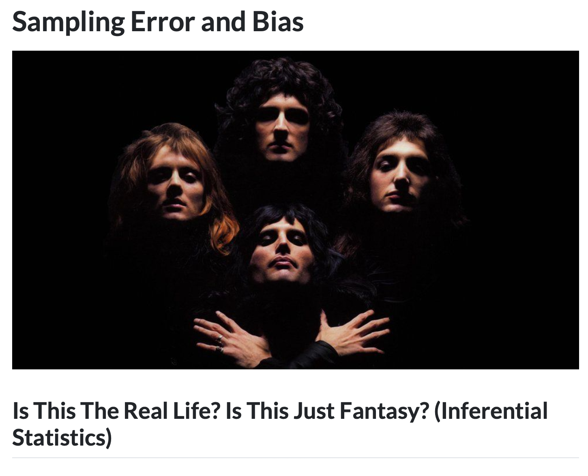
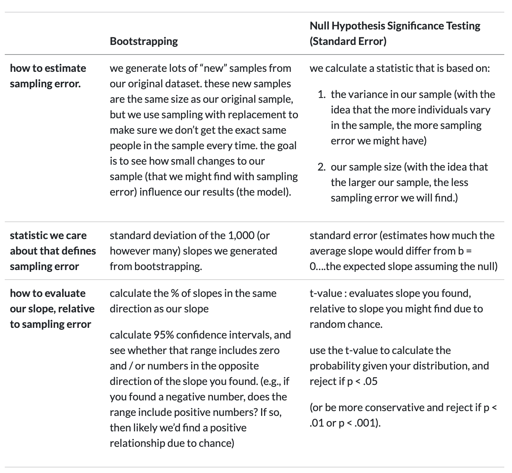

# [Check-In : Happy World](https://forms.gle/5ssbRwitkAYyefxY6)

```{r}
#| include: false
d <- read.csv("~/Dropbox/!WHY STATS/Chapter Datasets/Our World in Happy Data/DATASET_happy_data.csv", stringsAsFactors = T)
```


Use the world happiness dataset (and codebook) to determine whether (a) child mortality, (b) Life Expectancy, or (c) Population is a better predictor of happiness in 2024.

[{fig-align="center" width="80%"}](https://magazine.scu.edu/magazines/summer-2017/tsunami-and-rebirth/)

## RECAP : Linear Models{.smaller}

::: {.callout-note collapse="true"}
#### Potential Check-In Spoilers Below!

```{r}
#| echo: false
#| fig-height: 4
#| fig-width: 12

mod1 <- lm(d$SWLS_24 ~ d$Child.Mortality)
mod2 <- lm(d$SWLS_24 ~ d$LifeExpectancy)
mod3 <- lm(d$SWLS_24 ~ d$Population)

par(mfrow = c(1,3))
plot(d$SWLS_24 ~ d$Child.Mortality, xlab = "Child Mortality", ylab = "World Happiness in 2024")
abline(mod1, lwd = 5, col = 'red')

plot(d$SWLS_24 ~ d$LifeExpectancy, xlab = "Life Expectancy", ylab = "World Happiness in 2024")
abline(mod2, lwd = 5, col = 'red')

plot(d$SWLS_24 ~ d$Population, xlab = "Population",  ylab = "World Happiness in 2024")
abline(mod3, lwd = 5, col = 'red')
```

:::

## Assumptions in Regression {.smaller}

1.  Look over the "READ THIS : Regression Assumptions" in the Additional Reading for this week.
2.  We will walk through these together in class :)

## Dealing With Assumptions.{.smaller}

::: panel-tabset
### Model 1 : Adding a Quadratic Term

```{r}
#| fig-height: 4
#| fig-width: 4
mod1b <- lm(d$SWLS_24 ~ d$Child.Mortality + I(d$Child.Mortality^2))
library(ggplot2)
ggplot(d, aes(y = SWLS_24, x = Child.Mortality)) + 
  geom_point() + 
  geom_smooth(method = "lm", formula = y ~ poly(x, 2))
```

### Model 2 : Looks Fine :)

```{r}
#| fig-height: 4
#| fig-width: 4
par(mfrow = c(2,2))
plot(mod2)
```

### Model 3 : The Issue?

```{r}
#| fig-height: 4
#| fig-width: 4
hist(d$Population)
```

### Model 3 : Issue Resolved

```{r}
#| fig-height: 4
#| fig-width: 8
par(mfrow = c(1,2))
hist(d$Population)
hist(log(d$Population))
mod3b <- lm(d$SWLS_24 ~ log(d$Population))
plot(d$SWLS_24 ~ log(d$Population), xlab = "Population",  ylab = "World Happiness in 2024")
abline(mod3b, lwd = 5, col = 'red')
```

### Model 3 : Issue Resolved

```{r}
#| echo: true
#| fig-height: 5
#| fig-width: 5
plot(mod3b)
```


### Evaluating Models

```{r}
x <- data.frame(MOD1 = c(summary(mod1)$r.squared, summary(mod1b)$r.squared),
           MOD2 = c(summary(mod3)$r.squared, summary(mod3b)$r.squared))
row.names(x) <- c("R2 with no changes", "R2 with changes")
round(x, 2)
```
:::

# Part 2 : Inferential Statistics ("Statistical Significance")

### The Linear Model : Prediction (& Error) in Our Dataset {.smaller}

::::: columns
::: {.column width="40%"}
```{r}
#| echo: false
#| fig-width: 5
#| fig-height: 5
mod3b <- lm(d$SWLS_24 ~ log(d$Population))
plot(d$SWLS_24 ~ log(d$Population), xlab = "Population (Log-Transformed)", ylab = "World Happiness in 2024")
abline(mod3b, lwd = 5, col = 'red')
```
:::

::: {.column width="60%"}
There is a relationship between Life Expectancy and Happiness (b = .12). In countries with greater life expectancy, the countries report being higher in happiness AMONG PEOPLE SURVEYED IN OUR DATASET.

**Question : can we use the information IN OUR DATASET to make a claim about PEOPLE IN GENERAL????**
:::
:::::

### Inferential Statistics : Population and Sample {.smaller}

**Goal : use our data to learn something about *people in general*?**

::::: columns
::: {.column width="50%"}
**the population :** all the individuals who might be relevant to your research question. 
:::

::: {.column width="50%"}
**the sample :** the individuals who the researcher actually studies.

  
:::
:::::

### Sample Bias and Error {.smaller}

**Problem : our data are unlikely to perfectly represent the general population (so need to estimate influence of each.)**

::::: columns
::: {.column width="50%"}
**sampling bias** = predictable mistakes in sampling.

-   critical thinking skills

-   see if slope *depends on* another variable.

**sampling error** = random mistakes in sampling.

-   ~~run the study many many times~~

-   make up some numbers using statistics to estimate sampling error
:::

::: {.column width="50%"}
[{fig-align="center"}](https://pmc.ncbi.nlm.nih.gov/articles/PMC5457469/)
:::
:::::

## Estimating Sampling Error in R (Bootstrapping)

1.  See professor notes and demo in the R-Script.
2.  See bootstrapping videos (in notes below).
3.  Ask questions!!

## ACTIVITY : in the Vision Board{.smaller}

1.  Take a statistic that you calculated in Lab 2.
2.  Use bootstrapping to estimate sampling error for this statistic.
3.  Evaluate sampling error.
4.  Think about sampling bias - who is the population? who is in our sample? might the sample bias the results in some way?

## NHST : standard error, t-value, and the p-value. {.smaller}

::::::::::::::: panel-tabset
### 1. Slope (from our data!) {.smaller}

::::: columns
::: {.column width="40%"}
```{r}
#| echo: false
#| fig-width: 5
#| fig-height: 5
mod3b <- lm(d$SWLS_24 ~ log(d$Population))
plot(d$SWLS_24 ~ log(d$Population), xlab = "Population (Log-Transformed)", ylab = "World Happiness in 2024")
abline(mod3b, lwd = 5, col = 'red')
```
:::

::: {.column width="60%"}
```{r}
summary(mod3b)
```
:::
:::::

### 2. Standard Error {.smaller}

::::: columns
::: {.column width="40%"}
$$
\text{standard error (SE)} = \frac{\sigma}{\sqrt{n}}
$$

```{r}
#| echo: false
#| fig-width: 5
#| fig-height: 5

# Generate points for the t-distribution
df <- 143
x <- seq(-4, 4, length=200)
y <- dt(x, df)

# Plot the distribution
plot(x, y, type="l", lwd=2, col="blue", 
     main=paste("If Null, Expected Slope = 0 \n(but expect each sample to vary)"),
     ylab="Density (Total Probability)", xlab="Distribution of Sample Estimates (T-Distribution)")
abline(v = c(-1,1), lty = "dashed")
```
:::

::: {.column width="60%"}
```{r}
summary(mod3b)
```
:::
:::::

### 3. t-value {.smaller}

::::: columns
::: {.column width="40%"}
$$
t = \frac{b}{SE}
$$

```{r}
#| echo: false
#| fig-width: 5
#| fig-height: 5

p_value <- 0.0315
df <- 143
alpha <- p_value 
# Calculate critical t-values for two-sided
t_crit <- qt(1 - alpha/2, df)

# Generate points for the t-distribution
x <- seq(-4, 4, length=200)
y <- dt(x, df)

# Plot the distribution
plot(x, y, type="l", lwd=2, col="blue", 
     main=paste("T-Value = -.13 / .06 = -2.17"),
     ylab="Density (Total Probability)", xlab="T-Distribution")
abline(v=-t_crit, col="darkred", lwd=2, lty=2)
```
:::

::: {.column width="60%"}
```{r}
summary(mod3b)
```
:::
:::::

### 4. p-value {.smaller}

::::: columns
::: {.column width="40%"}
$p = Pr(Ts \geq |t_{\text{obs}}| \mid H_0)$

```{r}
#| echo: false
#| fig-width: 5
#| fig-height: 5

p_value <- 0.0315
df <- 143
alpha <- p_value 
# Calculate critical t-values for two-sided
t_crit <- qt(1 - alpha/2, df)

# Generate points for the t-distribution
x <- seq(-4, 4, length=200)
y <- dt(x, df)

# Plot the distribution
plot(x, y, type="l", lwd=2, col="blue", 
     main=paste("Two-Sided P-value =", p_value, "| df =", df),
     ylab="Density (Total Probability)", xlab="T-Distribution")

# Shade the right tail
x_right <- seq(t_crit, 4, length=100)
y_right <- dt(x_right, df)
polygon(c(t_crit, x_right, 4), c(0, y_right, 0), col="red", border=NA)

# Shade the left tail
x_left <- seq(-4, -t_crit, length=100)
y_left <- dt(x_left, df)
polygon(c(-4, x_left, -t_crit), c(0, y_left, 0), col="red", border=NA)

# Add t-score lines
abline(v=c(-t_crit, t_crit), col="darkred", lwd=2, lty=2)
#axis(1, at=c(-t_crit, t_crit), labels=c(round(-t_crit, 2), round(t_crit, 2)))
```
:::

::: {.column width="60%"}
```{r}
summary(mod3b)
```
:::
:::::
:::::::::::::::

### TLDR. {.smaller}

1.  We estimate how much sampling error there might be.
2.  We compare the slope we found to this guess about sampling error.
3.  If t-value is high (and p-value is low) then our slope is VERY DIFFERENT from sampling error and we can reject the null hypothesis.
4.  This is all made up : we might be making a mistake AND a "significant effect" doesn't mean large or important.

## Read More : Chapter on Inferential Statistics in *Why Statistics?*



## Bootstrapping v. NHST



# PART 3 : Objectivity Interrogations

## RECAP : we (mostly) think it's possible to work toward validity

-   Anti-Positivism : Attempts to predict people with numbers is bad.

-   Positivism : We will someday make perfect predictions about people.

-   Post-Positivism : We will continually improve our predictions, but never get perfect.

-   Social Constructivism : There is no "truth" about people; we make it up.

```{r}
#| fig-width: 5
#| fig-height: 5
o <- read.csv("~/Dropbox/!GRADSTATS/COMPSS222/Datasets/Class Datasets/MaCSS - Onboarding Data/DATASET_MACSS_onboard_SP26.csv", stringsAsFactors = T)
plot(o$epistemology, col = "black", bor = "white", main = "Epistemologies")
```

## DISCUSS : Questions Y'all Had :)

-   how to tell the difference between normal academic criticism of a study and criticism that comes from bias against the researcher?

-   I'd love to see some interview snippts of white interviewees' answers. \[**PROF AGREES : the fact they did not include is an example of low DISCRIMINANT VALIDITY, since would want to see evidence that white people are not talking about these things too.**\]

-   Objectivity armoring...feels like it has a cultural dimension that we can explore in class as well. **\[PROF SAYS : YES!\]**

## DISCUSS : examples from your experiences? anticipation in the future?


## NEXT WEEK : Non-Empirical Paper

-   Prof likes because :

    -   model of how to work with participants

    -   focused on a specific population and real-world research question

    -   friends with the lead author.

{fig-align="center" width="80%"}

# 
