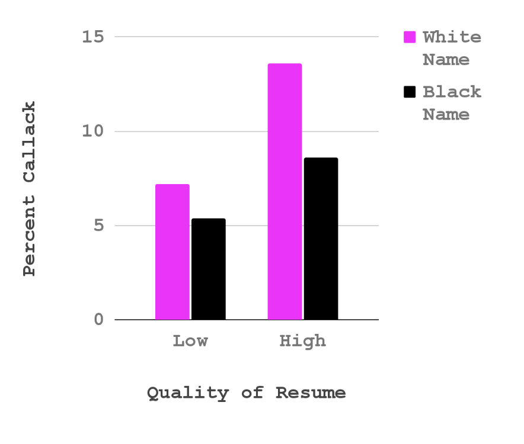
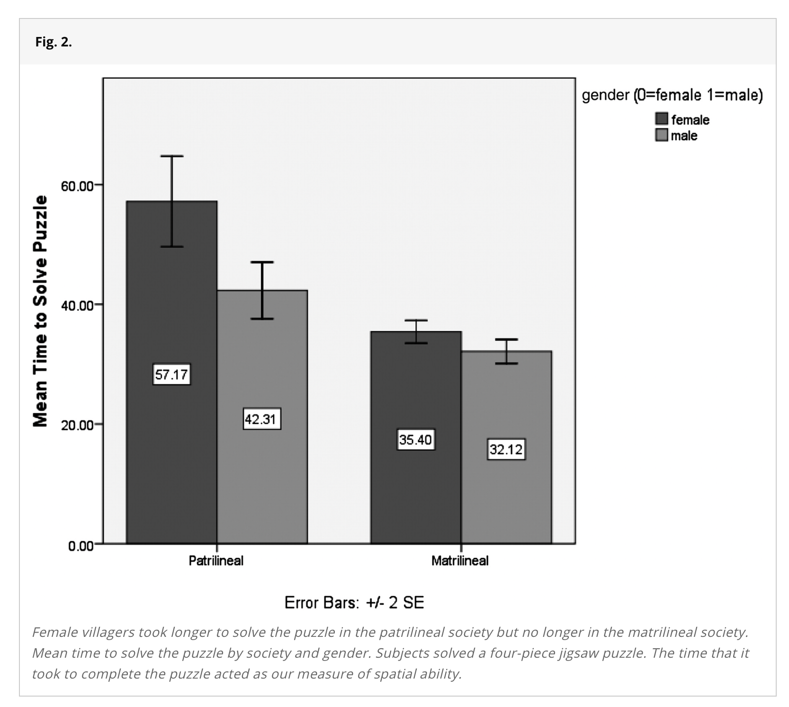
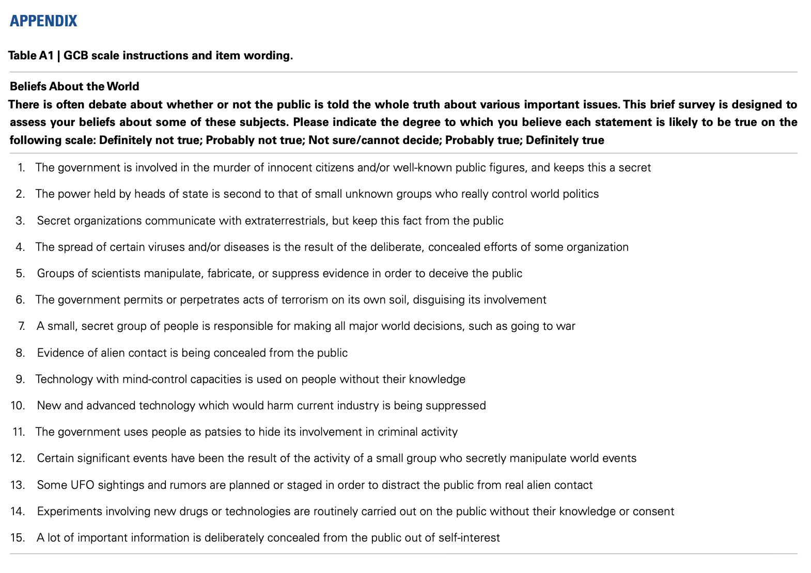

```{r}
#| include: false

## Hormone Dataset
library(jtools)
library(psych)
library(gplots)
library(ggplot2)
h <- read.csv("~/Dropbox/!GRADSTATS/COMPSS222/Datasets/Class Datasets/Hormone Data/haas_hormone_dataset.csv", stringsAsFactors = T)

h$age[h$age < 0] <- NA
h$sexF <- as.factor(h$sex)
levels(h$sexF) <- c("Male", "Female")
h$sexF <- relevel(h$sexF, ref = "Female")
plot(h$sexF)
summary(h$sexF)
```

### [Check-In (No R Needed)](){.smaller}

::::::::: panel-tabset
#### Model 1. {.smaller}

::::: columns
::: {.column width="50%"}
```{r}
#| fig-height: 5
#| fig-width: 5

mod1 <- lm(narc_scale ~ sexF, data = h)
plotmeans(narc_scale ~ sexF, data = h, connect = F, xlab = "Sex", ylab = "Narcissism (Scale)")
```
:::

::: {.column width="50%"}
```{r}
export_summs(mod1, error_pos = "right",
             coefs = c("Sex (Male)" = "sexFMale"), digits = 3)
```
:::
:::::

#### Model 1 (diagnostic).{.smaller}

```{r}
#| fig-height: 5
#| fig-width: 5
par(mfrow = c(2,2))
plot(mod1)
```

#### Model 2.{.smaller}

::::: columns
::: {.column width="50%"}
```{r}
#| fig-height: 5
#| fig-width: 5
mod2 <- lm(narc_scale ~ test1, data = h)
plot(narc_scale ~ test1, data = h, xlab = "Testosterone", ylab = "Narcissism (Scale)")
abline(mod2, lwd = 5, col = 'red')
```
:::

::: {.column width="50%"}
```{r}
export_summs(mod2, error_pos = "right",
             coefs = c("Testosterone" = "test1"), digits = 3)
```
:::
:::::


#### Model 2 (diagnostics){.smaller}
```{r}
#| fig-height: 5
#| fig-width: 5
par(mfrow = c(2,2))
plot(mod2)
```


:::::::::

# PART 1 : When Models Get Complicated

### Multiple Regression {.smaller}

:::::::::::: panel-tabset
#### Model 1. {.smaller}

Sex is related to narcissism.

::::: columns
::: {.column width="50%"}
```{r}
#| fig-height: 5
#| fig-width: 5

mod1 <- lm(narc_scale ~ sexF, data = h)
plotmeans(narc_scale ~ sexF, data = h, connect = F, xlab = "Sex", ylab = "Narcissism (Scale)")
```
:::

::: {.column width="50%"}
```{r}
export_summs(mod1, error_format = "", error_pos = "right",
             coefs = c("Sex (Male)" = "sexFMale"), digits = 3)
```
:::
:::::

#### Model 2.

Testosterone is related to narcissism...

::::: columns
::: {.column width="50%"}
```{r}
#| fig-height: 5
#| fig-width: 5
mod2 <- lm(narc_scale ~ test1, data = h)
plot(narc_scale ~ test1, data = h, xlab = "Testosterone", ylab = "Narcissism (Scale)")
abline(mod2, lwd = 5, col = 'red')
```
:::

::: {.column width="50%"}
```{r}
export_summs(mod2, error_format = "", error_pos = "right",
             coefs = c("Testosterone" = "test1"), digits = 3)
```
:::
:::::

#### IV1 \~ IV2

but if testosterone is related to sex...

::::: columns
::: {.column width="60%"}
```{r}
#| echo: true
#| message: false
#| warning: false
#| fig-height: 5
#| fig-width: 5

modx <- lm(test1 ~ sexF, data = h)
plotmeans(test1 ~ sexF, data = h, connect = F)

```
:::

::: {.column width="40%"}
```{r}
export_summs(modx, error_format = "", error_pos = "right")
```
:::
:::::

#### Model 3.

**How are they uniquely related?**

```{r}
mod3 <- lm(narc_scale ~ sexF + test1, data = h)
export_summs(mod1, mod2, mod3, error_format = "",  error_pos = "right", digits = 3,
             coefs = c("Testosterone" = "test1",
                       "Sex (Male)" = "sexFMale"))
```


#### Labeling Changes{.smaller}

1.  "Independent" Effect. The slope of the IV does not change when other variables are added to the model.
2.  "Suppression" Effect. The slope of the IV gets stronger (in either direction) when other variables are added to the model.
3.  "Mediation" Effect. The slope of the IV gets closer to zero when other variables are added to the model. *Careful : "mediation" often implies some causal relationship, and it is very hard (/impossible?) to estimate causal relationships without experimental methods. Some links below that go deeper into this.*

::::::::::::

## ACTIVITY : Professor Demo. {.smaller}

1.  Choose a DV from the conspiracy theory dataset.
2.  Identify two IVs that you think might predict or explain this variable.
3.  Do the data cleaning and statistics (linear models) needed to answer this question.

-   PREDICT : define the multivariate model. What do you see, and why do this pattern exist?
-   ERROR : evaluate the slopes ($r$ or $\beta$) and the change in error ($R^2$) across models.
-   CONTROL : how might you use this knowledge?

## ACTIVITY : In the Vision Board. {.smaller}

1.  Choose a DV from the conspiracy theory dataset.
2.  Identify two IVs that you think might predict or explain this variable.
3.  Do the data cleaning and statistics (linear models) needed to answer this question.
    -   PREDICT : define the multivariate model. What do you see, and why do this pattern exist?
    -   ERROR : evaluate the slopes ($r$ or $\beta$) and the change in error ($R^2$) across models.
    -   CONTROL : how might you use this knowledge?

## Interaction Effects {.smaller}

### What's Going On In This Graph? {.smaller}

```{r}
#| echo: true
#| fig-width: 10
#| fig-height: 6
#| fig-align: center

library(ggthemes)
ggplot(data = h, aes(x = test1, y = narc_scale, color = sexF)) + 
  geom_point(size = .5, alpha = .3, position = "jitter") + 
  labs(title = "The Interaction Effect", x = "Testosterone (Time 1)", y = "Narcissism", color = "Sex") +
  geom_smooth(method = lm) + theme_apa()
```

### Interaction Effect, Explained? {.smaller}

::::: columns
::: {.column width="30%"}
```{r}
#| echo: false

library(ggthemes)
ggplot(data = h, aes(x = test1, y = narc_scale, color = sexF)) + 
  geom_point(size = .5, alpha = .3, position = "jitter") + 
  labs(title = "The Interaction Effect", x = "Testosterone (Time 1)", y = "Narcissism", color = "Sex") +
  geom_smooth(method = lm) + theme_apa()
```
:::

::: {.column width="70%"}
```{r}
#| echo: true

library(arm)
mod4 <- lm(narc_scale ~ sexF * test1, data = h)
mod1z <- arm::standardize(mod1, NULL, TRUE)
mod2z <- arm::standardize(mod2, NULL, TRUE)
mod3z <- arm::standardize(mod3, NULL, TRUE)
mod4z <- arm::standardize(mod4, NULL, TRUE)
export_summs(mod1z, mod2z, mod3z, mod4z,
             error_format = "",  error_pos = "right")
```
:::
:::::

### More Examples {.smaller}

::: panel-tabset
#### resume data {.smaller}

[{fig-align="center" width="60%"}](https://www.aeaweb.org/articles?id=10.1257/0002828042002561)

#### puzzle data {.smaller}

[{fig-align="center" width="60%"}](https://www.pnas.org/doi/10.1073/pnas.1015182108)
:::

## ACTIVITY : In the Vision Board {.smaller}

**Think about an [*interaction effect*]{.underline} that might be relevant to your Capstone Project \<3**

-   What is some PATTERN in the data that you expect to see or would be interested to test?

-   How might some OTHER variable influence this pattern?

# PART 2 : Likert Scales

## The Theory {.smaller}

::::: columns
::: {.column width="50%"}
-   **scale :** The variable that you want to measure as a continuous variable.

-   **items :** The specific question(s) in the scale. Each item measures some aspect of the variable the researcher is interested in.

    -   **positively keyed items :** An item that measures the high end of the scale, where answering “yes” to the question means you are high on this variable.

    -   **negatively keyed items :** An item that measures the low end of the scale, where answering “yes” to the question means you are low on the variable.

-   **response scale :** How people answer the scale items.
:::

::: {.column width="50%"}
{fig-align="center" width="80%"}
:::
:::::

## Example : Conspiracy Beliefs

::: panel-tabset
#### load the data

```{r}
d <- read.csv("~/Dropbox/!GRADSTATS/COMPSS222/Datasets/Class Datasets/Conspiracy Data/data.csv", stringsAsFactors = T)
summary(d[,1:3])
d[d == 0] <- NA
summary(d[,1:3])

```

#### assess the items

```{r}
CONSP.df <- d[,1:15]
library(psych)
psych::alpha(CONSP.df)
```

#### define the scale

```{r}
d$CONSPIRACY <- rowMeans(CONSP.df, na.rm = T)
hist(d$CONSPIRACY)
```
:::

## Lab 4 : Self-Esteem Data (& Scale) {.smaller}

| Likert Scale Item | Item Evaluation |
|---------------------------------|--------------------|
| Q1. I feel that I am a person of worth, at least on an equal plane with others. |  |
| Q2. I feel that I have a number of good qualities. |  |
| Q3. All in all, I am inclined to feel that I am a failure. |  |
| Q4. I am able to do things as well as most other people. |  |
| Q5. I feel I do not have much to be proud of. |  |
| Q6. I take a positive attitude toward myself. |  |
| Q7. On the whole, I am satisfied with myself. |  |
| Q8. I wish I could have more respect for myself. |  |
| Q9. I certainly feel useless at times. |  |
| Q10. At times I think I am no good at all. |  |
