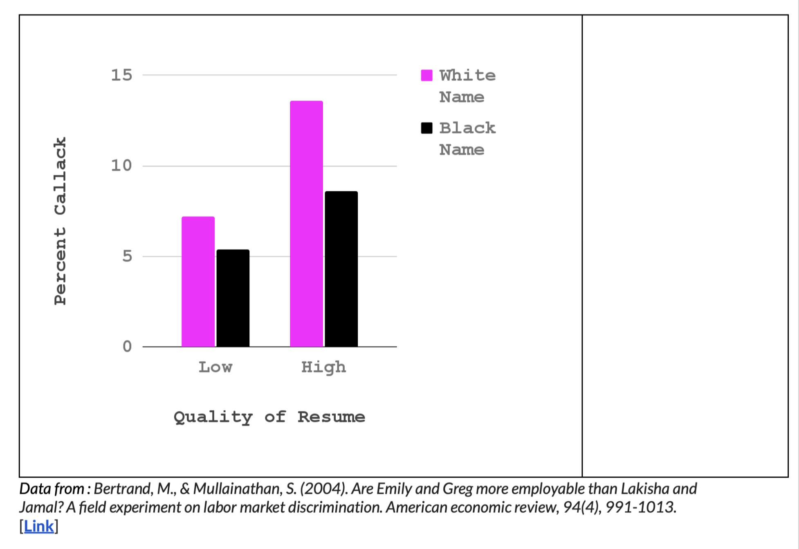
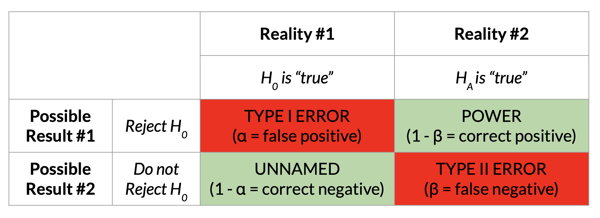

### NHST Review. {.smaller}

[CHECK-IN : Interpreting Regression](https://docs.google.com/forms/d/e/1FAIpQLSfzCFALIvkPydP2cDaWKQNOz6SIuMsiFp6cbCeunvAk0gL1Nw/viewform?usp=header). Click here, and use the tabs below to answer!

::::::::: panel-tabset
#### Summary

```{r}
#| include: false
library(car)
library(gplots)
library(jtools)
library(ggplot2)
library(arm)

mod1 <- lm(salary ~ yrs.service, data = Salaries)
mod2 <- lm(salary ~ sex, data = Salaries)
modx <- lm(yrs.service ~ sex, data = Salaries)
mod3 <- lm(salary ~ yrs.service + sex, data = Salaries)
mod4 <- lm(salary ~ yrs.service * sex, data = Salaries)

mod1x <- arm::standardize(mod1, NULL, T)
mod2x <- arm::standardize(mod2, NULL, T)
mod3x <- arm::standardize(mod3, NULL, T)
mod4x <- arm::standardize(mod4, NULL, T)

```

Table 1. Predicting Salaries from Years of Service and Sex.

```{r}
export_summs(mod1, mod2, mod3,
             coefs = c("Years of Service" = "yrs.service",
                       "Sex (0 = F; 1 = M)" = "sexMale"))
```

#### Description {.smaller}

**Salaries Dataset.** "The 2008-09 nine-month academic salary for Assistant Professors, Associate Professors and Professors in a college in the U.S. The data were collected as part of the on-going effort of the college's administration to monitor salary differences between male and female faculty members."

```         
-   salary : the salary of the professor, in cold, hard, US American Dollars.

-   yrs.service : the years of service the professor had at the college.

-   sex : whether the professor was Male or Female
```

#### Model 1 {.smaller}

::::: columns
::: {.column width="40%"}
Graph of Model 1

```{r}
#| fig-width: 5
#| fig-height: 5

plot(salary ~ yrs.service, data = Salaries)
abline(mod1, lwd = 5)
```
:::

::: {.column width="60%"}
Diagnostic Plots

```{r}
#| fig-width: 5
#| fig-height: 5
par(mfrow = c(2,2))
plot(mod1)
```
:::
:::::

#### Model 2 {.smaller}

::::: columns
::: {.column width="40%"}
Graph of Model 2

```{r}
#| fig-width: 5
#| fig-height: 5

plotmeans(salary ~ sex, data = Salaries, connect = F)
```
:::

::: {.column width="60%"}
Diagnostic Plots

```{r}
#| fig-width: 5
#| fig-height: 5
par(mfrow = c(2,2))
plot(mod2)
```
:::
:::::

#### Model 3 {.smaller}

Diagnostic Plots

```{r}
#| fig-width: 5
#| fig-height: 5
par(mfrow = c(2,2))
plot(mod3)
```
:::::::::

## RECAP : Interaction Effects {.smaller}

From the [Vision Board](https://docs.google.com/spreadsheets/d/11FZJ76JMBUkKYZRoWASrHhPIldmP7Pziz-WGnlIZuC4/edit?usp=sharing)

-   Find someone who you haven't talked to :) or have talked to :)
-   Evaluate the interaction effect :
    -   What does the interaction effect (or lack of one) mean?
    -   Does it seem significant?
    -   Does it seem large or important?

### EXAMPLE : Interaction Effects {.smaller}

::: panel-tabset
#### the extra slope {.smaller}

```{r}
mod1 <- lm(salary ~ yrs.service + I(yrs.service^2), data = Salaries)
mod2 <- lm(salary ~ sex, data = Salaries)
mod3 <- lm(salary ~ yrs.service + I(yrs.service^2) + sex, data = Salaries)
mod4 <- lm(salary ~ (yrs.service + I(yrs.service^2)) * sex, data = Salaries)
export_summs(mod1, mod2, mod3, mod4,
             coefs = c("Years of Service" = "yrs.service",
                       "Years ^ 2" = "I(yrs.service^2)",
                       "Sex (0 = F; 1 = M)" = "sexMale",
                       "Service * Sex (if Male)" = "yrs.service:sexMale",
                       "Service^2 * Sex" = "I(yrs.service^2):sexMale"))
```

#### a picture is worth 1000 words.

```{r}
#| echo: false
#| fig-width: 14
#| fig-height: 7
library(ggplot2)
library(ggthemes)
library(jtools)
ggplot(data = Salaries, aes(x = yrs.service, y = salary, color = sex)) + 
  geom_point(size = .5, alpha = .3, position = "jitter") + 
  labs(title = "The Interaction Effect", x = "Years of Service", y = "Salary", color = "Sex") +
  geom_smooth(method = lm, formula = y ~ poly(x, 2)) + theme_apa()
```

#### standardizing your variables?

```{r}
mod1x <- arm::standardize(mod1, NULL, T)
mod2x <- arm::standardize(mod2, NULL, T)
mod3x <- arm::standardize(mod3, NULL, T)
mod4x <- arm::standardize(mod4, NULL, T)

export_summs(mod1x, mod2x, mod3x, mod4x,
             coefs = c("Years of Service" = "z.yrs.service",
                       "Service^2" = "I(z.yrs.service^2)",
                       "Sex (0=F; 1=M)" = "c.sex",
                       "Service * Sex" = "z.yrs.service:c.sex",
                       "Service^2 * Sex" = "I(z.yrs.service^2):c.sex"))
```
:::

### More Interaction Effect Practice (as needed)

#### [**SEE PROFESSOR HANDOUT.**](https://docs.google.com/document/d/1YVzL5ud5UGy82KXqGrc-mjSRFJh7ocuQpXdIBmbvd0o/edit?usp=sharing)

#### {width="80%"}

## RECAP : Likert Scales {.smaller}

**Relevance to Capstone Projects?** clap on a scale from

**1 (not at all)** ——— 2 ——— 3 (neutral) ——— 4 ——— **5 (very much)**

**Issues :**

-   (zewei) responses may be biased (self-insight / self-enhancement)
-   (becky) double-barreled questions : "how often do you experience slow loading or broken links"

## Power Tests

### what's the point, professor? {.smaller}

-   **Power :** the probability that you would "correctly" observe the relationship between two variables if the relationship actually exists (*if the null hypothesis were NOT true*).

-   **Reasons to Calculate Power :**

    -   **Post-Hoc Power :** You did a study, and want to further contextualize your guess about how much sampling error influenced your results.

    -   **Power Planning :** You are planning to run a study, and want to know how many people to recruit to have the highest probability of observing the "true" effect (if it exists.)

### goal : you want power to be HIGH {.smaller}

DISCUSS : what could we do as researchers to increase power???

::: {.fragment}
::: {.callout-note}
## spoilers

**the effect size increases :** the bigger the difference, the more likely you'll detect it.

**your sample size increases :** the more people, the less sampling error, and the easier it is to have confidence that any difference you found is not just chance.

**you increase the threshold for rejecting the null hypothesis :** if the probability of rejecting the null hypothesis = 10%, then your power increases.

:::
:::


### a tour of null and alternative realities

-   see the additional slide deck in the class notes
-   explore the [power visualization](https://rpsychologist.com/d3/nhst/)



### calculating in R (by hand) {.smaller}

::: {.panel-tabset}
#### the model

```{r}
#|echo: true
plotmeans(salary ~ sex, data = Salaries)
mod2 <- lm(salary ~ sex, data = Salaries)
summary(mod2) # a function applied to the object
```

#### saving the metrics

```{r}
#|echo: true
sm <- summary(mod2) # saving this as an object
objects(sm) # there is more inside.
sm$coefficients # tadaa
sm$coefficients[2,3] # our t-value
mtval <- sm$coefficients[2,3]
```

#### distributions

-   the t-distribution approaches the normal distribution (with a 95% Interval cutoff of 1.96....) 
-   but we are not quite there so good to look up what the t-value actually is.

```{r}
#|echo: true

qt(.975, df = 147) # 
mcut <- qt(.975, 147) # saving this value
pt(mtval - mcut, df = 147) # our power.
```

#### calculating in R (a package)

similar to our calculation "by hand"

```{r}
#| echo: true
# install.packages("pwr")
library(pwr)
nm <- nrow(mod2$model)
mr <- summary(mod2)$r.squared^.5
pwr.r.test(n = nm, r = mr) 
```


:::

### ACTIVITY : calculate the power you had to detect the interaction effect from Lab 4.

### Using Power to Estimate Sample Size.

-   Power is a function of : effect size, sample size, and the alpha level (alpha = the Type I error that the researcher sets). 
-   You can use these terms to estimate the sample size needed for a given power (the convention is often 80%).

### Example : Estimating Sample Size{.smaller}

What sample size is needed for a slope of r = .23?

:::{.panel-tabset}
#### usingt `pwr` package{.smaller}
```{r}
#| echo: true
pwr.r.test(r = .23, power = .80, alternative = "two.sided")
```

#### visual from `pwr` package{.smaller}
```{r}
#| echo: true
p.ex <- pwr.r.test(r = .23, power = .80, alternative = "two.sided")
plot(p.ex)
```

:::

## NEXT TIME.

-   Lab 5. Answering a research question.
-   [Data for an in-class activity](https://docs.google.com/forms/d/e/1FAIpQLSfJC8RLLtQf0Px0yz1nJjx-8CGXFrMcuUg_b3od54kHHPCEHQ/viewform?usp=header)


