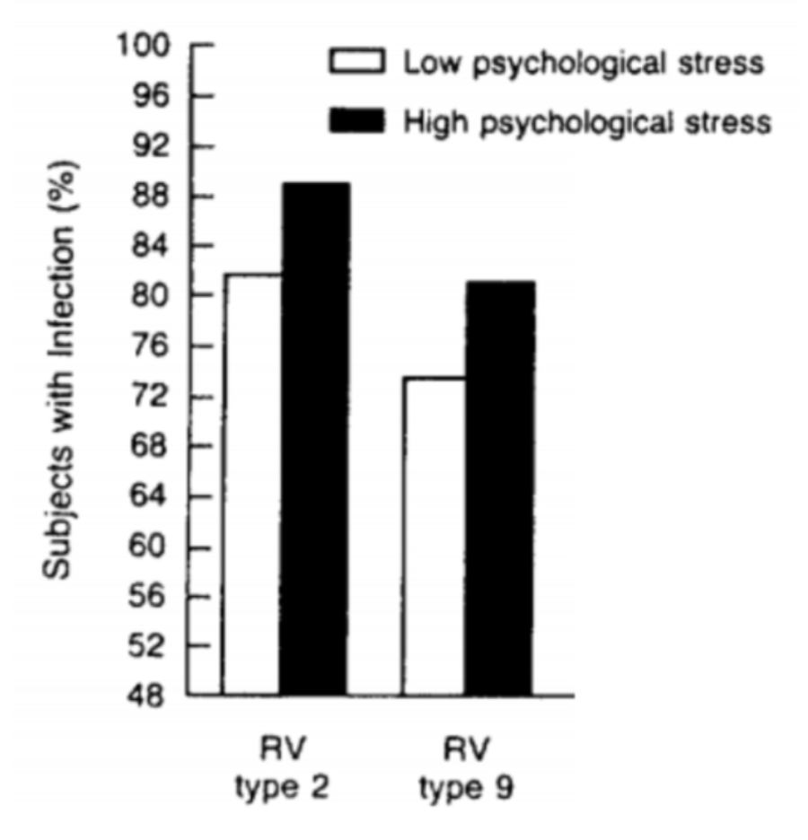
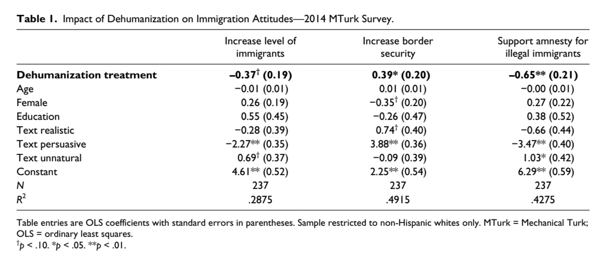
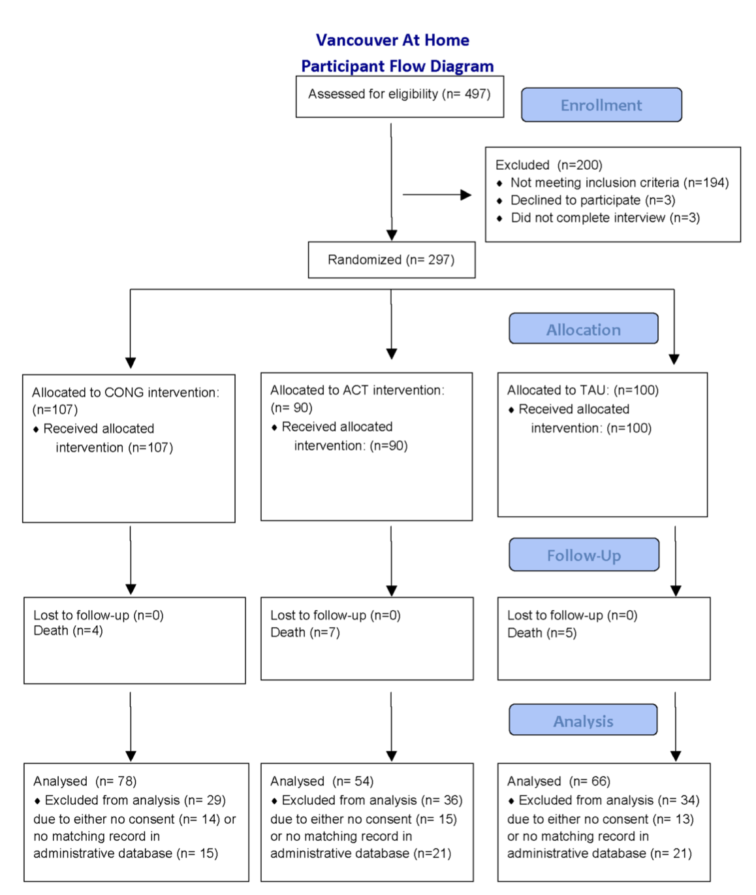
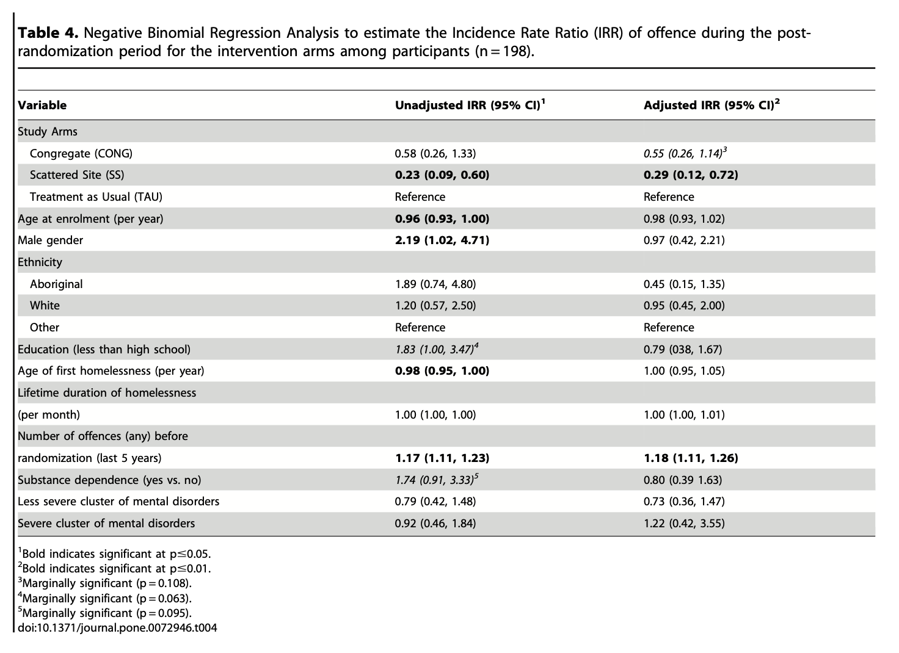
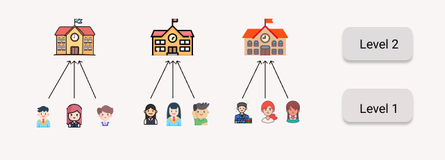
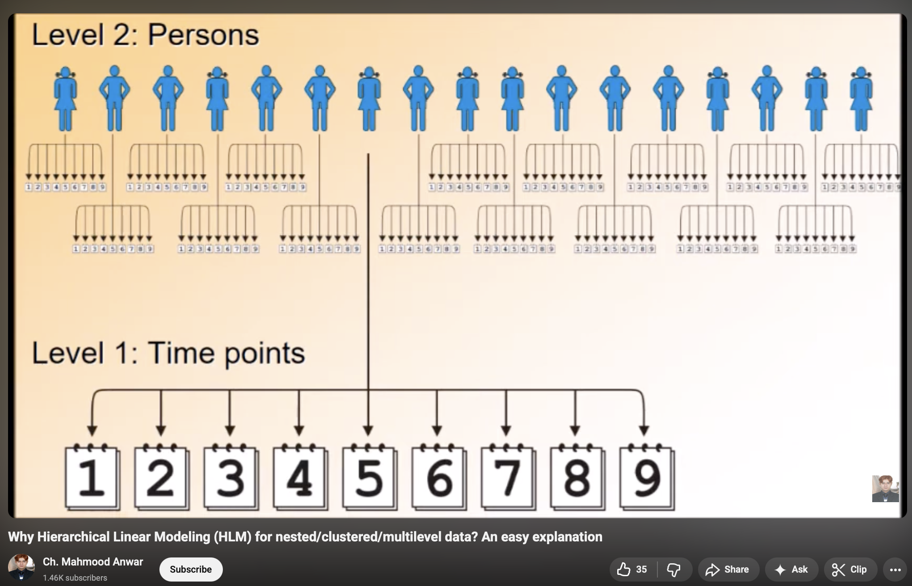
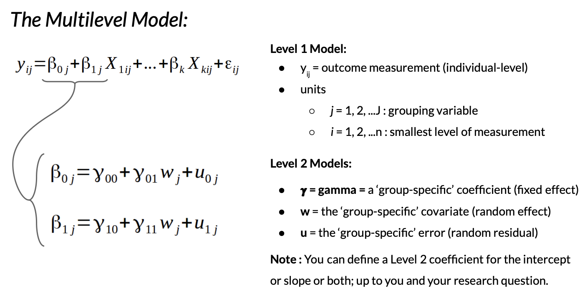

### Welcome to the End of COMPSS 222 {.smaller}

- [Check-In : Interpreting Models](https://forms.gle/pT82SgAh83tQUT7w6)

::: panel-tabset
### GRAPH A {.smaller}

{fig-align="center" width="40%"}

### GRAPH B {.smaller}

```{r}
#| echo: false
#| fig-width: 10
#| fig-height: 5


library(ggplot2)
library(jtools)
d <- read.csv("~/Dropbox/!GRADSTATS/COMPSS222/Datasets/Class Datasets/Grit Data/dataset_grit_cleaned.csv", stringsAsFactors = T)
d$age[d$age > 80] <- NA
d$gender <- as.factor(d$gender)
levels(d$gender) <- c("Male", "Female", NA)
ggplot(data = subset(d, !is.na(d$gender)), aes(x = age, y = NEGEM, color = gender)) + 
  geom_point(alpha = .5) +
  geom_smooth(method = "lm") + labs(title = "") + ylab("Negative Emotion") + xlab("age") + 
  facet_wrap(~ gender) + 
  theme_apa()

```

### MODEL B {.smaller}

```{r}
library(jtools)
library(ggplot2)
mod1 <- lm(NEGEM ~ age, data = d)
mod2 <- lm(NEGEM ~ gender, data = d)
mod3 <- lm(NEGEM ~ age + gender, data = d)
mod4 <- lm(NEGEM ~ age * gender, data = d)
export_summs(mod1, mod2, mod3, mod4, digits = 2, error_pos = "right")

```
:::

# RECAP : [Four Validities This Semester](https://journals.sagepub.com/doi/pdf/10.1177/09637214211067779?casa_token=J2fnwbroJB0AAAAA:rTHf9SZpJvyTDvvajR8Fb9PmHCDqZicCgxrAfhLI7Nl-OnGfLZjrbe_oNobr-KZKSFMCQE--2e-A)

1.  Construct Validity
2.  External Validity
3.  Internal Validity
4.  Statistical Conclusion Validity

### 1. Construct Validity {.smaller}

- Are we measuring what we want to measure?
- (If not, how might this influence the results?)

```{r}
#| fig-width: 15
#| fig-height: 5
par(mfrow = c(1,3))
hist(d$NEGEM, main = "", col = "black", bor = "white", xlab = "Negative Emotion")
hist(d$age, main = "", col = "black", bor = "white", xlab = "Age")
plot(d$gender, main = "", col = "black", bor = "white", xlab = "gender")
```

### 2. External Validity {.smaller}

::::: columns
::: {.column width="50%"}
Do our results generalize to other samples?

- sampling error : do we trust the statistical testing \[& power?\]
- sampling bias : who are these 4000 random people on the internet? what cultural differences might influence the results (and how)??
:::

::: {.column width="50%"}
:::
:::::

### 3. Internal Validity. {.smaller}

::::: columns
::: {.column width="50%"}
- Is the relationship between the variables causal?
- (If not, what other variables might explain the relationship?)
:::

::: {.column width="50%"}
effect of age.

- causal :
- reverse causal :
- 3rd variables :

effect of gender.

- causal :
- reverse causal :
- 3rd variables :
:::
:::::

### PRACTICE : 3/4 validities {.smaller}

- **on the vision board :** identify a question and theory you have (capstone or otherwise)
  - **Real-Life :** does steaming an egg make it easier to peel
  - **MaCSS / Project / Work / Other Life :** does acknowledging language differences improve the classroom experience?
- **construct validity :** how would you measure these variables?
- **external validity :** how much data would you need (power planning)? biases in your sample?
- **internal validity :** possible to do an experiment (manipulation / random assignment)?

## BREAK TIME.


## 4. Statistical Conclusion Validity. Are we adhering to “best practices” and doing the analyses correctly? {.smaller}

### 4. Conclusion Validity. Lab 5.

1.  Issues of **construct validity** and **external validity.**
2.  But also :
    1.  [I could not exactly replicate these results](https://www.dropbox.com/scl/fi/5p8ydrz60y0uo54nh36u6/Lab-5-Professor-Key.pdf?rlkey=3e8qfd56266c4wqcygy1lt77d&dl=0).
    2.  "Unclear" why the researcher defined these specific models...

{width="632"}

### 4. Statistical Conclusion Validity. {.smaller}

1.  [pre-register analyses.](https://www.cos.io/initiatives/prereg) (and don't cheat or "p-hack".)

{fig-align="center" width="71%"}

Allen C, Mehler DMA (2019) Correction: Open science challenges, benefits and tips in early career and beyond. PLOS Biology 17(12): e3000587. https://doi.org/10.1371/journal.pbio.3000587

### 4. Statistical Conclusion Validity. {.smaller}

1.  [pre-register analyses.](https://www.cos.io/initiatives/prereg) (and don't cheat or "p-hack".)

2.  **use the "right" methods.** science is hard. lots of tools to try and do the right thing.

```         
Common Statistical Mistakes. Any you are doing? Questions?? Feeling the pressure???

Absence of an adequate control condition/group

Interpreting comparisons between two effects without directly comparing them

Spurious correlations

Inflating the units of analysis

Correlation and causation

Use of small samples

Circular analysis

Flexibility of analysis

Failing to correct for multiple comparisons

Over-interpreting non-significant results
```

### 4. Statistical Conclusion Validity. {.smaller}

1.  [pre-register analyses.](https://www.cos.io/initiatives/prereg) (and don't cheat or "p-hack".)

2.  **use the "right" methods.** science is hard. lots of tools to try and do the right thing.

3.  [be transparent.](https://journals.sagepub.com/doi/10.1177/2515245917747646) share code and data; science is a process.

{fig-align="center" width="71%"}

# Logistic Regression

### what's wrong?

```{r}
#| fig-width: 5
#| fig-height: 5

h <- read.csv("~/Dropbox/!GRADSTATS/Datasets/Hormone Data/hormone_dataset.csv")
h$sexF <- as.factor(h$sex)
levels(h$sexF) <- c("Male", "Female")
h$sexF <- relevel(h$sexF, ref = "Female")

plot(sex ~ test_mean, data = h, xlab = "Testosterone", ylab = "Sex (1 = Male, 2 = Female)")
mod2 <- lm(sex ~ test_mean, data = h)
abline(mod2)
```

### what's better?

::: panel-tabset
#### the graph

```{r}
#| fig-width: 5
#| fig-height: 5

h$sexR <- h$sex - 1
glmod <- glm(sexR ~ test_mean, data = h, family = "binomial")
plot(sexR ~ test_mean, data = h,
     xlab = "Testosterone",
     ylab = "Probability of Being Female")
curve(predict(glmod, data.frame(test_mean=x), type = "resp"), add = T, col = "red", lwd = 2)
```

#### the model

```{r}
summary(glmod)
```
:::

### Real-Life Example{.smaller}

:::{.panel-tabset}

#### Study Design

[**Link to Article**](https://journals.plos.org/plosone/article/file?id=10.1371/journal.pone.0072946&type=printable) **:** Somers, J. M., Rezansoff, S. N., Moniruzzaman, A., Palepu, A., & Patterson, M. (2013). Housing First reduces re-offending among formerly homeless adults with mental disorders: results of a randomized controlled trial. PloS one, 8(9), e72946.



#### A Regression Table



:::

### [see chapter 12](https://catterson.github.io/ystats/chapters/12R_LogisticRegression.html)

## X. Prof More Radical Questions {.smaller}

1.  **tolerate “imperfect” results.** maybe there is no truth?

2.  **focus on the practice.** why does this matter? who will this help (in practice)? do I really believe this is real?

```         
“If you want knowledge, you must take part in the practice of changing reality. If you want to know the taste of a pear, you must change the pear by eating it yourself. If you want to know the structure and properties of the atom, you must make physical and chemical experiments to change the state of the atom. If you want to know the theory and methods of revolution, you must take part in revolution. All genuine knowledge originates in direct experience.” - Mao
```

# BYE!! THANKS!!!

[Exit Survey](https://forms.gle/jiYekePPHz7PR9XK8)


# WOULD YOU LIKE TO LEARN MORE???


# Multilevel Models (MLM). Conceptual Understanding

### Definition : Multilevel Models (MLM)

- Hierarchical linear models, mixed effects models, random effects models, others?

  - **Level 1 :** the smallest unit of analysis (where the DV is measured)

  - **Level 2 :** organize non-independent responses at Level 1.

### Examples :

::: panel-tabset
#### Students in School

**non-independence :** students in a school are similar to each other

[{width="80%"}](https://www.analyticsvidhya.com/blog/2022/01/a-brief-introduction-to-multilevel-modelling/)

#### Repeated Measure Studies

**non-independence :** person at time 1 is still the same person at time 2

[{fig-align="center" width="80%"}](https://www.youtube.com/watch?v=itxBT5rnxJ0)
:::

### The Formulas

***The Linear Model***

$$\huge y = \beta_0 + \beta_1x_1 + ... + \beta_kx_k + \epsilon$$

{width="74%"}

### Why Are We Doing This? {.smaller}

1.  **The Assumption of Independence Has Been Violated! (MLM increases our power and reliability as scientists.)**
    - Multiple measures of an individual gives you a more reliable estimate of what and who they are.
    - A person serves as their own control, so can more precisely examinine how a person changes over time.
2.  **Model more complex phenomenon.**
    - How people change over time (within-person variation).
    - Simpson's Paradox

## How Do We Do This in R?

### Example : The Sleep Dataset {.smaller}

:::::::::::: panel-tabset
##### Details

From the `?sleep` dataset: "Data which show the effect of two soporific drugs (increase in hours of sleep compared to control)."

- Extra : increase in hours of sleep
- Group : drug given (1 = control; 2 = drug)
- ID : patient ID

##### "Between Person"

::::: columns
::: {.column width="50%"}
```{r}
#| fig-width: 8
#| fig-height: 8
library(ggplot2)
ggplot(sleep, aes(y = extra, x = group)) + 
  geom_point(size=2) + 
  stat_summary(fun.data=mean_se, color = 'red', size = 1.25, linewidth = 2)
```
:::

::: {.column width="50%"}
```{r}
lmod <- lm(extra ~ as.factor(group), data = sleep)
summary(lmod)
```
:::
:::::

##### "Within-Person"

::::: columns
::: {.column width="50%"}
```{r}
#| fig-width: 6
#| fig-height: 6
ggplot(sleep, aes(y = extra, x = group, color = ID)) + 
  geom_point(size=2) + 
  geom_line(aes(group = ID), linewidth = 0.75)
```
:::

::: {.column width="50%"}
**Fixed Effects :** The "Average" across all the grouping variables.

```{r}
#install.packages("lme4")
library(lme4)
library(lmerTest)
library(Matrix)
mlmod <- lmer(extra ~ as.factor(group) + (1 | ID), data = sleep)
summary(mlmod)
```
:::
:::::

##### Random Effects

::::: columns
::: {.column width="50%"}
```{r}
#| fig-width: 6
#| fig-height: 6
ggplot(sleep, aes(y = extra, x = group, color = ID)) + 
  geom_point(size=2) + 
  geom_line(aes(group = ID), linewidth = 0.75)
```
:::

::: {.column width="50%"}
- ICC = Intraclass Correlation Coefficient = how much the variation in our grouping variable (here : subject) explains total variation.

- To calculate : take variance of intercept / total variance

  ```{r}
  2.8483 / (2.8483 + 0.7564)
  ```

- OR :

  ```{r}
  library(performance)
  icc(mlmod)
  ```
:::
:::::
::::::::::::
