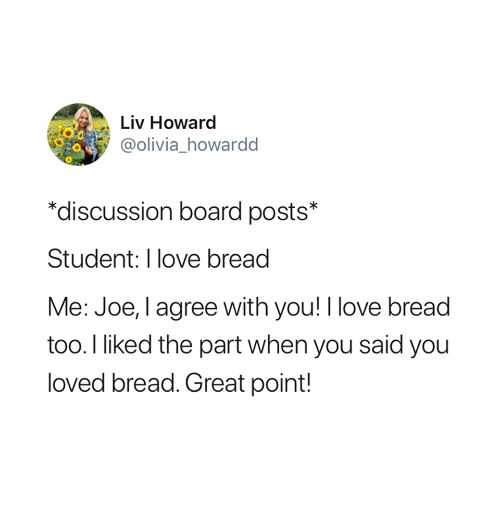

## Week 3 - Thursday, September 10th

:::{.callout-tip collapse = "true"}
#### Agenda and Announcements

::::: columns
::: {.column width="50%"}
- 10 Min : Welcome and Check-In
- 20 Min : Part 1 : Cognitive Biases in Real-Life and Science
- 40 Min : Part 2 : Academic Articles
- 15 Min : Part 3 : We only have \<15 minutes to Read an Article????
:::

::: {.column width="50%"}
- ***Office Hours in SSSC.***

  - **Wednesday** 11:00 - 12:30.

  - **Thursdays** 12:35 - 1:35.
:::
:::::

:::

### Class Slides

```{=html}
<iframe data-external="1" class="slide-deck" src="/rm/slides/3_readingscience.html" width="100%" height="500px" title="" border="5px"></iframe>
```

### Resources

- [Check-In: tinyurl.com/readingread](https://docs.google.com/forms/d/e/1FAIpQLSfaHXCHU3s_TthjHI-fDnNrjI7rWNTdquqyPRmlu8fEgncHHg/viewform?usp=sf_link)
- [Vision Board](https://docs.google.com/spreadsheets/d/14u3w5edvo6KSFRw2U9t1knDANFSGBWOvDjS7-ZGujos/edit?usp=sharing) + [Collaborative Notes](https://docs.google.com/presentation/d/1YBr9aKYz7cuGXYsu7OpUlOqz6G6RyaXemqB-TK5gYG4/edit?usp=sharing)

### Due Next Week before Class

1.  **Read the articles below.** Optional readings are not required; but lemme know if you read and have thoughts!
2.  **Complete Discussion 3**. Questions below, submit on Canvas.
3.  **Complete Reading Quiz 3**. on Canvas.

### Readings for Next Week (and Quiz 3)

1.  [**Objectivity Interrogations**](https://www.nature.com/articles/s41598-024-63236-z#Sec18). Professor hopefully passed out a physical copy of this in class where we did a quick read. Take a second pass and do a deeper reading of the article.

2.  [**Read about reliability and validity (just read PART ONE)**](https://catterson.github.io/ystats/chapters/5R_GoodMeasures.html#part-1-good-data-validity-and-reliability)**.** Focus on the main definition of reliability and validity, as well as the specific types. Then, watch the videos on phrenology, and how it failed tests of reliability and validity. Go ahead and do the check-in + watch the video review as practice for the quiz on these terms.

3.  **OPTIONAL :** For students looking for guidance (or more perspective) on reading research articles. TBH I wish I had read these papers in graduate school.

    - [**How to Read a Paper**](https://web.stanford.edu/class/ee384m/Handouts/HowtoReadPaper.pdf). I like this article because it emphasizes that there are different layers to reading a paper. Use this paper to help you read the next one :)

    - [**Ten simple rules for reading a scientific paper.**](https://pmc.ncbi.nlm.nih.gov/articles/PMC7392212/) This article comes from a biology perspective, but has a nice overview of the different parts to a research paper, and some of the broader questions to consider.

### Week 3 Reading Reflection.

**YOUR POST :** Submit answers to the [Vision Board](https://docs.google.com/spreadsheets/d/14u3w5edvo6KSFRw2U9t1knDANFSGBWOvDjS7-ZGujos/edit?usp=sharing) so we can more easily see this work together in class.

1.  **READING IS A PROCESS :** do a more deep reading of the "Objectivity Interrogations." What was a sentence you liked, a sentence you found confusing, or a question you have about the reading?

2.  **NICE TO MAKE CONNECTIONS.** Have you ever experienced any of the ideas described in the objectivity interrogation article in your real-life? If not, ask a friend (or AI I guess if you really don't wanna talk to someone...but nice to connect with a human?) if they have any examples to share.

3.  **LEARN ABOUT SCIENCE :** Read about reliability and validity, complete the check-in (practice quiz), and watch the video review. How did you do? What questions do you have about these terms?

4.  **SCAVENGER HUNT :** think of something that measures you (e.g., a pedometer). Why and when do you use this tool? Do you trust it? Why / why not?

5.  **REPLY.** Ask another student (who doesn't yet have a reply) some authentic question about their project (from Week 2) or reaction to Objectivity Interrogation. An authentic question is something you actually want to know...can be anything related to the class.

{fig-align="center" width="364"}
