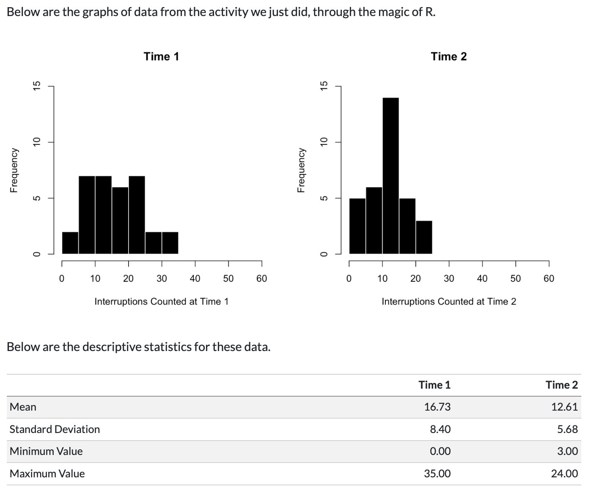
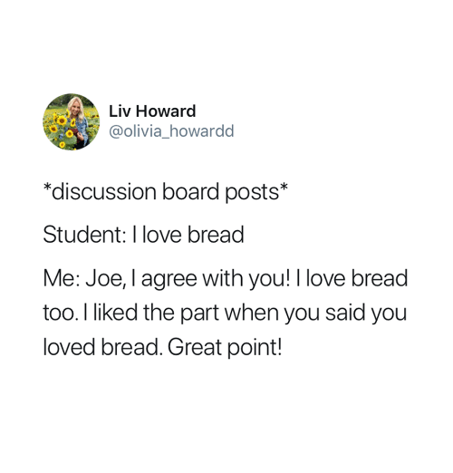

## Week 6 - Wednesday, March 4th

### Class Goals

1.  Practice navigating and reading / skimming a research article.
2.  Practice interpreting data (descriptive statistics and a histogram) from an article, as well as a behavioral coding activity.
3.  Evaluate observational methods in terms of reliability and validity (from the research article and FUN activity.)
4.  Students all learning; Professor not rushing; we all enriched and nourished by knowledge of research methods.

### Class Slides

```{=html}
<iframe data-external="1" class="slide-deck" src="/rm/slides/6_observation.html" width="100%" height="500px" title="" border="5px"></iframe>
```

### Useful Links

-   [Check-In Here : tinyurl.com/EARstudy](https://docs.google.com/forms/d/e/1FAIpQLSc-uDTPiZ47naHpFLkEqz0BCJo71uXkqG_MV7MpXpGNYbM0YA/viewform?usp=publish-editor)
-   [Article and supplementary materials for the check-in](https://www.dropbox.com/scl/fi/lg14jgxvcvyoxb5nhsd2s/mehl-2007-science.pdf?rlkey=4mquhtjj8pi8bdecdwsbfxi7z&dl=0).
-   [Vision Board](https://docs.google.com/spreadsheets/d/14u3w5edvo6KSFRw2U9t1knDANFSGBWOvDjS7-ZGujos/edit?usp=sharing)

## Agenda and Announcements {.smaller}

::::: columns
::: {.column width="30%"}
**Agenda :**

-   **15 Min :** Welcome and Check-In.
-   **30 Min :** Part 1 : Observing Words (Reading Research)
-   **30 Min :** Part 2 : Operationalization is an Eight Syllable Word
:::

::: {.column width="70%"}
**Announcements :**

-   **Office Hours Today.** Hanging out in LC-105 from 1:00 - 3:45.
-   **I AM BEING OBSERVED.** Say hi to Prof. Jones-Hagata.
-   **YOU ARE ALSO OBSERVING ME :** Will end early for y'all to fill out student evaluations (surveys).
-   **NEXT WEEK : Surveys.** The Science. The Myth. The Data? (Quiz 6) And returning to Dig Deeper Project (the article you found for assignment #2).
:::
:::::

### Due Next Week before Class

1.  **Read the articles below and use these to complete Discussion 6**. Post answers to Questions 3 and 4 on the Vision Board, but also submit ALL answers to the Canvas assignment (not a discussion post; the Vision Board will do this work). *Sorry this is confusing and maybe redundant thanks for your patience and participation on this journey.*
2.  **Take two personality surveys (for Quiz 6).** No multiple choice questions this week. Instead, Quiz 6 contains links to two different personality surveys that you should take. Save your responses for each survey and submit your responses to the anonymous Google Form. At the end of the Google Form, you'll get a secret code to submit for the Quiz (this ensures that the data will be anonymous.)

### Readings for Next Week (and Quiz 6)

1.  [**Reading on Likert Scales**](/rm/readings/LikertScales.qmd)**.** Likert scales are one of the most common ways researchers measure people, are foundational to much of psychology (even some fMRI research depends on them), and we will learn about them and how to critically evaluate them. Heads up - Likert is *technically* pronounced "Lick-ert" but nobody really says that because it sounds gross...everyone just calls it "Like-ert". But if someone tells you it's actually "Lick-ert" now you won't be surprised and can be like, "yeah, I know but that sounds gross and nobody says that" or you can say it "Lick-ert" and reject the social influence bias.

2.  [**More on Constructing Surveys**](https://kpu.pressbooks.pub/psychmethods4e/chapter/constructing-surveys/). You can skim much of this, but focus on a) context effects and item-order effects on survey responses, b) the BRUSO model of effective items, c) whether these authors tell you to say "Lick-ert" or "Like-ert".

3.  [**The McAdams Life Narrative Interview**](https://www.dropbox.com/s/n7s7jk3wutdeflx/McAdams_Narrative_Instructions.pdf?dl=0)**.** One of my favorite methods of assessment. It's rarely used in psychology, but I think demonstrates a very rich way of thinking about persons. The whole interview takes a few hours to conduct, and leaves you with zero numbers to analyze. You don't need to do the entire interview, but let us know if you do and how it goes \<3

4.  **OPTIONAL READINGS :** For students who would like to learn more.

    -   [**A Mega List of Personality Surveys**](https://ipip.ori.org/newIndexofScaleLabels.htm)**.** We'll look at this in class next week, but here's a long list of free personality surveys for researchers to use. Note that some variables (e.g., extraversion) have many different scales written for them. Personality psychologists often get into long-winded and sometimes heated debates about how best to measure a construct.
    -   [**The Paulhus & Vazire (2007) “Handbook Chapter” on Self-Reports**](https://www.dropbox.com/s/9erlgou7mbwerpr/5_Paulhus_Vazire_2007.pdf?dl=0)**.** A handbook is basically a textbook for researchers - not original research, but a summary of what researchers think (and have learned) about a topic. Meant for graduate students and other researchers who are first learning about a topic, or perhaps a highly-motivated college students with extra time who is still reading these words!

### Week 6 Discussion Questions.

**YOUR POST :** Use the readings to answer the following questions. Please submit answers to the graded Canvas assignment to help me keep track of your work. but when prompted please also copy / paste your work to our so we can more easily see (and expand upon) this work together in class.

1.  **FROM OUR WORK IN CLASS.** We counted the number of interruptions in a video before and after *operationalizing* an interruption. Look over the data from the class activity (see below!) Explain how our [*operationalization*]{.underline} task influenced the responses in terms of the *mean* and *standard deviation*, and how this relates to the concepts of reliability and validity. (*Do your best...will review next week! But want y'all to think about data.)*

    

2.  **Submit your results to the two personality surveys for Quiz 6.** Then, reflect on your experience taking the surveys. Which personality survey do you think described you best (and why)? Which personality survey do you think is the most scientific (and why)? What questions (if any) do you have about these surveys?

3.  **ON THE** [VISION BOARD](https://docs.google.com/spreadsheets/d/14u3w5edvo6KSFRw2U9t1knDANFSGBWOvDjS7-ZGujos/edit?usp=sharing)**.** Read through the McAdams Life Narrative Task. If you were to organize your life into chapters, what would those chapters be? (If you don't feel comfortable sharing your own life narrative, then think about the chapters for a character from a TV show or literature.)

4.  **We Love Bread (REPLY TO ANOTHER STUDENT'S POST ON THE VISION BOARD FOR QUESTION 3).** Choose someone who you don't know at all. Like, you look at the name and are like "wut". Based on their life narrative, how would you rate their personality in terms of Extraversion (on a scale from 0 to 100)?

{fig-align="center" width="364"}
