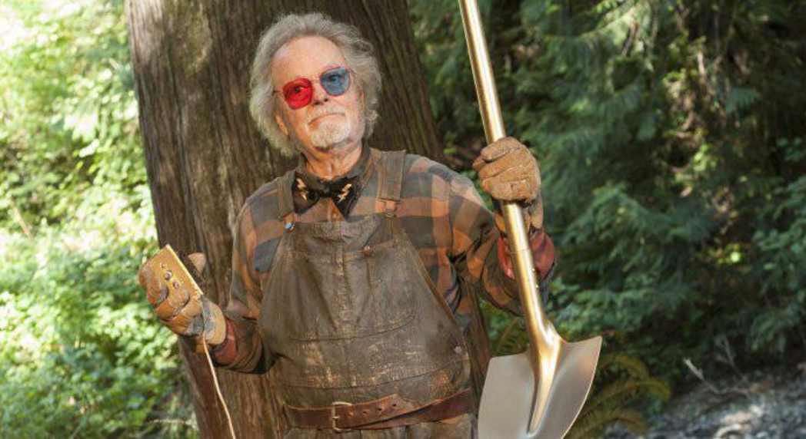

### **What’s the Point?** 

Compare and contrast how some psychological phenomenon (a “result” or “finding”) was written about in some “pop psychology” source to how it was written about in the original scientific research article that inspired the pop psych source. “Pop psychology” refers to non peer-reviewed summaries of scientific research, such as undergraduate textbooks, news articles, books, movies, TV shows, podcasts, or Tiktoks. Was there any important information that was lost between the original research article (which you should look up and read) and the way the research was reported for a broader audience? Did the news article or original research article make any claims that you don’t think are warranted?

### Getting Started

We will work on this throughout the first half of the semester. Take this one step at a time!

1.  **Find a specific psychological “finding” or “result” as reported in a pop psychology source.** Psychology findings are commonly written about in major news outlets like the [StudyFinds.org](http://studyfinds.org/), [New York Times](https://www.nytimes.com/topic/subject/psychology-and-psychologists?mcubz=0), [Vox Media](https://www.vox.com/psychology), [Time Magazine](http://time.com/tag/psychology/), [Vice](https://www.vice.com/en_us/topic/psychology), [Buzzfeed](https://www.buzzfeed.com/search?q=psychology), or podcasts. You could also find a claim as reported in TikTok, Instagram post, or whatever other social media source you are finding. The more specific the better; something like "A recent study from the School of Life found that taking classes at DVC leads to higher psychological well-being" would be more specific than "research over thirty decades says childhood trauma is related to adult well-being."
2.  **Find the specific research article that inspired this “pop psych” summary.** Use [Google Scholar](https://dvc.instructure.com/courses/29556/assignments/scholar.google.com), campus [library resources](https://library.dvc.edu/home), or something like [sci-hub](https://en.wikipedia.org/wiki/Sci-Hub) or [anna’s archive](https://en.wikipedia.org/wiki/Anna%27s_Archive). If you can't access an article using the library services or Google Scholar, and don't want to use one of the alternative sources, come to office hours and I can help you track it down.
3.  **Throughout the semester, we'll learn the skills needed to critique these two articles.** Specifically, you will evaluate (a) how well the pop psychology source captures the actual methods used by the research article, and (b) how well the scientific research article captures "the truth".

**Reminder: USE YOUR OWN VOICE.** To copy text or ideas from another source without appropriate reference is plagiarism. Fine to use other sources (including AI) to review or learn about key ideas, but you need to reference these sources and explain what you learned in your own voice. Students who plagiarize or use AI tools without attribution / as a replacement for their own work will receive a zero on the assignment and be reported to the Office of Student Conduct. Happy to chat if you have questions about what constitutes appropriate AI!

### Parts of the Paper

#### The Articles.

1.  What interested you in the pop-psychology article? How do some of the cognitive biases inform your initial perception of this article?
2.  Focus on one specific claim from the pop psychology article - write out the claim as a linear model.
3.  Find an original research article that is directly relevant to the specific claim from the news article (ideally this was referenced by the article, but you may need to do some digging.) Include the citation of the article in APA format. Evaluate the article - how influential does it appear to be (what’s the impact factor of the journal and how many times has it been cited?) Who are the authors, and what university do they come from?
4.  Scan the title and abstract - write out the claim as a linear model. Does this seem to match the news article? Why / why not?

#### Measures.

**Identify [one]{.underline} of the key variables from this study. Note that research studies often have many variables - just focus on one here - ideally the dependent variable!**

1.  What is the label for this variable?
2.  How did the researchers **measure** this variable? (e.g., did they use self-reports or observations?) How did the researchers describe how this measure was valid and reliable?
3.  Do you think this was a valid way to study the variable? Why / why not? Make sure to use specific terms of reliability and validity here (e.g., self-insight bias; test-retest reliability; etc.)
4.  Do you think the news article accurately reflected the strength of the measures of the study? Why / why not?

#### Methods.

1.  Were the methods the researchers used **experimental (did they manipulate variables)** or **correlational (did they observe or measure variables?**).
2.  **Reflect on the design.**
    -   [If Experimental :]{.underline} does this seem like a good experiment? Why / why not? Make sure to include terms of experimental design (e.g., treatment / control, random assignment, etc.
    -   [If Correlational :]{.underline} what are the four possible reasons why the researchers might have found this pattern in the data? Did the researchers account for these possibilities in their discussion section?
3.  Did the news article accurately reflect the methods of the study (e.g., or did it make it seem like there was a **causal** relationship when no experiment was conducted?)
4.  Do the researchers state that they've shared their materials or data anywhere?

#### Results

1.  What did the “pop psych” article report about the relationship between the variables? Did it comment on the “effect size” or “significance level” of the result at all?
2.  Paste a copy of the results table or a figure. What do you learn (if anything) from these data?
3.  What does the research article say about the statistics (look to the discussion section)? Does this help you understand the table at all?
4.  Do the authors state whether there’s a strong or weak relationship between the two variables? \[*Do your best to interpret; these statistics can be tricky to understand or interpret! Just want to see that you have tried here.*\]

#### Participants.

1.  Who is the **population** for this study, and what are some of the characteristics of the **sample** of people who were studied (e.g., sample size, demographics, recruitment strategies, etc.)?
2.  Do you think this was a **representative** or **biased sample** based on the researcher's question (and why / why not?)
3.  How might the results change if a different sample or population of people (or animals!) were studied??
4.  Did the “pop psych” or research article report the sample size or acknowledge any potential sampling biases?

#### Discussion and Conclusion

1.  What were some of the limitations of the research that the authors of the original study wrote about?
2.  Did the “pop psych” article discuss any of these limitations that the researchers wrote about in the discussion section?
3.  Do you feel like the authors sufficiently acknowledged all the limitations of their study?
4.  Overall, do you feel like the “pop psych” article was a valid representation of the actual data? Why / why not?

### Grading Rubric.

This paper is worth 20% of your grade in the course. There’s no page limit for the paper; just answer the questions. Short, simple sentences are GREAT. Please label and number each section to help me grade; thanks!

|  |  |  |  |  |  |
|--------------------|--------------|-------------|-------------|-------------|-------------|
|  | **4 points** | **3 points** | **2 points** | **1 point** | **0 points** |
| **The Articles.** | all parts mostly perfect | minor error(s) or omission | major error(s) or omission(s) | most parts wrong or missing | missing |
| **Measures.** | all parts mostly perfect | minor error(s) or omission | major error(s) or omission(s) | most parts wrong or missing | missing |
| **Methods.** | all parts mostly perfect | minor error(s) or omission | major error(s) or omission(s) | most parts wrong or missing | missing |
| **Participants** | all parts mostly perfect | minor error(s) or omission | major error(s) or omission(s) | most parts wrong or missing | missing |
| **Results.** | all parts mostly perfect | minor error(s) or omission | major error(s) or omission(s) | most parts wrong or missing | missing |
| **Discussion and Conclusion.** | all parts mostly perfect | minor error(s) or omission | major error(s) or omission(s) | most parts wrong or missing | missing |
