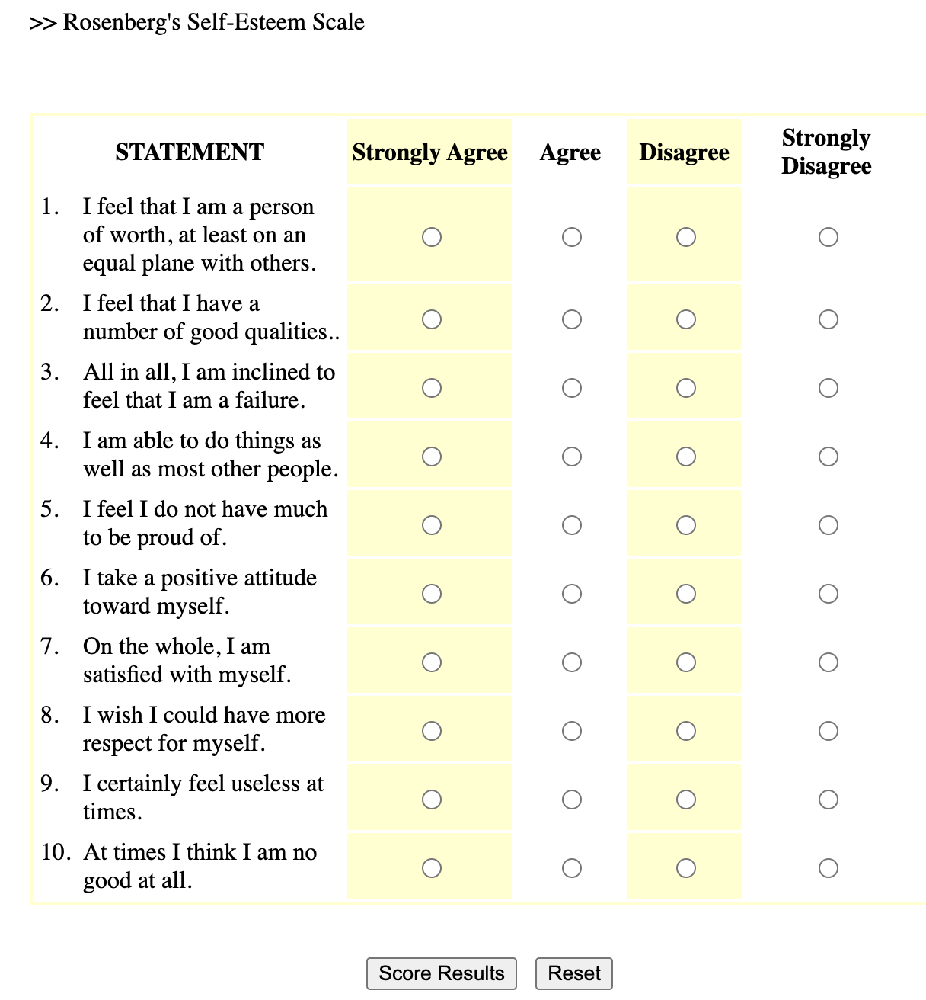
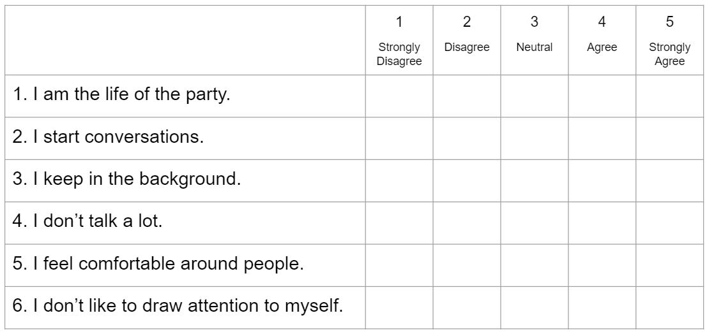

## The Likert Scale

### Definition & Theory

A likert scale is a common survey method psychologists use to measure continuous variation. Likert scales can be used for self-report surveys (where an individual answers questions about themselves), or given to observers (where an individual answers questions about another person - either someone they know, or someone they are actively observing). For example, to the right is an example likert scale - the Rosenberg Self-Esteem Scale[^1]. Here’s a link to [take the survey](https://www.wwnorton.com/college/psych/psychsci/media/rosenberg.htm) and get feedback if you'd like to take it for yourself.

[^1]: Rosenberg, M. (1965). Rosenberg Self-Esteem Scale (RSES) \[Database record\]. APA PsycTests. Here’s a link to [take the survey](https://www.wwnorton.com/college/psych/psychsci/media/rosenberg.htm) and get feedback.

    \

::: column-margin

:::

Below are some common terms we will use when describing likert scales. (There’s a video that goes over these terms with another example below too.)

|  |  |  |
|--------------|----------------------------------|------------------------|
| **Term** | **Definition** | **Usage / Example** |
| **Scale** | The variable that you want to measure as a continuous variable. | Self-esteem is often measured with the Rosenberg Self-Esteem Scale (1965) |
| **Item(s)** | The specific question(s) in the scale. Each item measures some aspect of the variable the researcher is interested in. | The Rosenberg Self-Esteem Scale (RSE; 1965) is a ten item scale, which means it has ten questions about self-esteem. |
| **Response Scale** | How people answer the scale items. People give a number rating on a fixed range of options with labels. Many 5-point scales include the following labels (1 = Strongly Disagree; 2 = Disagree; 3 = Neutral; 4 = Agree; 5 = Strongly Agree.) | The RSE was originally written to use a 4-point rating scale from 0 (Strongly Disagree) to 3 (Strongly Agree). When Professor includes the RSE in his studies, he might change the response scale to go from 0-4 to so it has an odd-number of answers to allow people to say they are “neutral”. |
| **Positively-Keyed Item** | An item that measures the high end of the scale, where answering “yes” to the question means you are high on this variable. | “On the whole, I am satisfied with my life” is a positively-keyed item, because answering 4 (Strongly Agree) means the person says they are high in self-esteem. |
| **Negatively-Keyed Item** | An item that measures the low end of the scale, where answering “yes” to the question means you are low on the variable. Researchers need to *reverse score* negatively keyed items, which means flipping the answers around (so all high scores mean the person is high on the variable.) | “I certainly feel useless at times” is a negatively-keyed item, because answering 4 (Strongly Agree) means the person says they are low in self-esteem. |

**Advantages of Likert Scales**

1.  **Likert scales are easy and flexible.** Surveys can be distributed online in large numbers, take a few minutes to complete, can be used as a self-report measure (e.g., you can answer questions about your own self-esteem) or observations (e.g., you can answer questions about your friend's self-esteem), can measure many different types of variables (e.g., here's [one list of open-source likert scales](https://ipip.ori.org/newIndexofScaleLabels.htm) that were developed to measure variables from "Achievement-Striving" to "Zest"), and provided structured data that are easy to analyze.

2.  **Likert scales measure complex phenomenon with multiple items.** Each item in a likert scale measures a slightly different aspect of a variable (*face validity*). Each response to a likert scale item is technically categorical; for example, your answer to "I feel useless" is either a 1 a 2 a 3 a 4 or a 5, with no space in between. However, when you average the multiple items of a likert scale together for each person, you generate a more continuous distrubution. For example, a person's average response to the ten-item self-esteem measure can vary within the 1-5 range by .1 increments. Remember, the ***normal distribution*** is a theoretical distribution that exists when there are multiple explanations for one variable that occur randomly in a population. The multiple items in a scale are one way to try and measure the multiple random explanations for variation. And indeed, as you'll see in our class demonstration, when you combine multiple categorical items into one variable, the distribution of the variable looks more normal than any individual item.

3.  **Likert scales allow researchers to quickly assess the reliability of their measure.** One form of reliability is how much similar measures are related to each other. **Cronbach's (alpha)** is a commonly-reported statistic that estimates the internal consistency (reliability) of a scale, and is based on (a) the similarity of people's responses to the items in a scale (the more similar, the higher the reliability) and (b) the number of items in a scale (sales with many items will tend to have higher cronbach than will likert scales with just a few items.) So, if people's responses to the ten self-esteem items are similar to each other, we would expect a high alpha reliability. (In fact, every time I've used the Rosenberg Self-Esteem scale in my research, I've found a very high alpha reliability.) There's no official "rule" for what's considered good or bad alpha, but below are some guidelines:

    -   α \> .8 = GREAT! Your scale is very reliable.

    -   α = .5 - .7 = OKAY!

    -   α \< .5 = UH OH

    A scale might have low reliability for a variety of reasons.

    -   ***your scale only has a few items:*** because α is influenced by the number of items in your scale, scales with a few items will almost certainly have a low alpha reliability.

    -   ***there was a problem with how you calculated your scale.*** maybe the scale was incorrectly calculated (e.g., you forgot to reverse-score the negatively-keyed items).

    -   ***the scale is measuring different things.*** if the items in your scale are measuring different variables, then you would expect there to be little consistency in how people answer the questions. For example,

### Video Example : The Extraversion Scale

Here’s another example of a likert scale - six items measuring extraversion adapted from the Big Five Inventory 2 (Soto & John, 2017).

::: {column-margin}

:::


