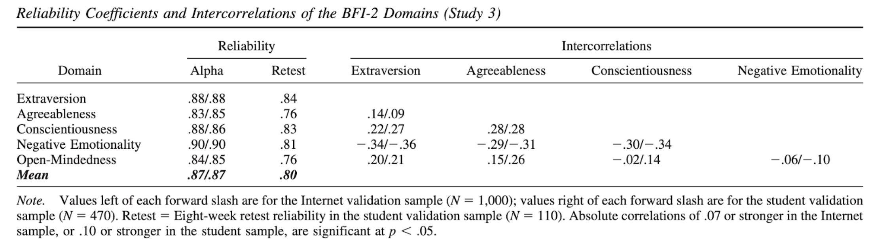

```{r}
#| include: false
## Data Cleaning
library(googlesheets4)
library(gt)
library(tidyverse)
library(psych)
options(knitr.kable.NA = "")
gs4_deauth()
d <- read_sheet("https://docs.google.com/spreadsheets/d/1FQT7SPCD9JR3nt4JHIFmBbTxtn4eIyyPvqdsj9SO4_A/edit?usp=sharing", sheet = "Form Responses 1")
names(d)
rename <- c("time", "MB_E", "MB_I", "MB_T", "MB_J", "MB_A",
            "O", "C", "E", "A", "N", 
            "followers", "hrs.sleep", "read.books", "siblings", "love.water")

codebook <- data.frame(rename, names(d))
write.csv(codebook, "~/Dropbox/RM/Datasets/Personality Data/CODEBOOK_personality.csv", row.names = F)

names(d) <- rename
d <- d[d$time > "2026-03-01",]
BF.DF <- with(d, data.frame(E, O, N, C, A))
MB.DF <- with(d, data.frame(MB_E, MB_I, MB_A, MB_J, MB_T))
bfd <- round(describe(MB.DF)[c(3,4,5,8,9)], 2)
mbd <- round(describe(BF.DF)[c(3,4,5,8,9)], 2)

row.names(mbd) <- c("Extraverted", "Intuitive", "Assertive", "Judging", "Thinking")
row.names(bfd) <- c("Extraversion", "Openness", "Negative Emotion", "Conscientiousness", "Agreableness")
```

# Descriptive Statistics

## The Big Five

The "Big Five" refer to the way personality psychologists conceptualize the five broadest categories of personality. You can [read more about the Big Five here](https://www.verywellmind.com/the-big-five-personality-dimensions-2795422).

#### Descriptive Statistics

```{r}
#| echo: false
knitr::kable(bfd) ## THE BIG FIVE DESCRIPTIVE STATISTICS
```

#### Graphs

::: panel-tabset
#### Extraversion

```{r}
#| echo: false
#| fig-height: 5
#| fig-width: 5
#| fig-align: center
hist(d$E, col = 'black', bor = 'white', main = "Big Five - Extraversion",  xlim = c(0,100), xlab = "Score (0 - 100)")
```

#### Openness

```{r}
#| echo: false
#| fig-height: 5
#| fig-width: 5
#| fig-align: center
hist(d$O, col = 'black', bor = 'white', main = "Big Five - Openness",  xlim = c(0,100), xlab = "Score (0 - 100)")
```

#### Negative Emotionality

```{r}
#| echo: false
#| fig-height: 5
#| fig-width: 5
#| fig-align: center

hist(d$N, col = 'black', bor = 'white', main = "Big Five - Negative Emotionality",  xlim = c(0,100), xlab = "Score (0 - 100)")

```

#### Conscientiousness

```{r}
#| echo: false
#| fig-height: 5
#| fig-width: 5
#| fig-align: center
hist(d$C, col = 'black', bor = 'white', main = "Big Five - Conscientiousness",  xlim = c(0,100), xlab = "Score (0 - 100)", breaks = 5)
```

#### Agreeableness

```{r}
#| echo: false
#| fig-height: 5
#| fig-width: 5
#| fig-align: center
hist(d$A, col = 'black', bor = 'white', main = "Big Five - Agreeableness",  xlim = c(0,100), xlab = "Score (0 - 100)")
```
:::

## The Myers-Brigg

### Descriptive Statistics

```{r}
#| echo: false
#| fig-align: center
knitr::kable(mbd) 
```

### Graphs

::: panel-tabset
#### Extraverted

```{r}
#| echo: false
#| fig-height: 5
#| fig-width: 5
#| fig-align: center

hist(d$MB_E, col = 'black', bor = 'white', main = "Myers-Brigg - Extraverted", xlim = c(0,100), xlab = "Score (0 - 100)")
```

#### Intuitive

```{r}
#| echo: false
#| fig-height: 5
#| fig-width: 5
#| fig-align: center

hist(d$MB_I, col = 'black', bor = 'white', main = "Myers-Brigg - Intuitive",  xlim = c(0,100), xlab = "Score (0 - 100)")
```

#### Assertive

```{r}
#| echo: false
#| fig-height: 5
#| fig-width: 5
#| fig-align: center

hist(d$MB_A, col = 'black', bor = 'white', main = "Myers-Brigg - Assertive",  xlim = c(0,100), xlab = "Score (0 - 100)")
```

#### Judging

```{r}
#| echo: false
#| fig-height: 5
#| fig-width: 5
#| fig-align: center

hist(d$MB_J, col = 'black', bor = 'white', main = "Myers-Brigg - Judging",  xlim = c(0,100), xlab = "Score (0 - 100)")
```

#### Thinking

```{r}
#| echo: false
#| fig-height: 5
#| fig-width: 5
#| fig-align: center

hist(d$MB_T, col = 'black', bor = 'white', main = "Myers-Brigg - Thinking",  xlim = c(0,100), xlab = "Score (0 - 100)")
```
:::

# Predictive Statistics

## Question 1.

Is there a relationship between the Myers-Brigg and Big Five Measures of Extraversion?

:::::: panel-tabset
### Where's the Line?

```{r}
#| echo: false
#| fig-height: 5
#| fig-width: 5
plot(d$MB_E ~ d$E, col = "black", pch = 19, xlab = "Big Five Extraversion", ylab = "Myers-Brigg Extraversion")
```

### There's the Line.

```{r}
#| echo: false
#| fig-height: 5
#| fig-width: 5

plot(d$MB_E ~ d$E, col = "black", pch = 19, xlab = "Big Five Extraversion", ylab = "Myers-Brigg Extraversion")
modE <- lm(d$MB_E ~ d$E)
abline(modE, lwd = 5, col = 'red')
```

### What's Going On?

::::: columns
::: {.column width="50%"}
```{r}
#| echo: false
#| fig-height: 5
#| fig-width: 5

plot(d$MB_E ~ d$E, col = "black", pch = 19, xlab = "Big Five Extraversion", ylab = "Myers-Brigg Extraversion")
modE <- lm(d$MB_E ~ d$E)
abline(modE, lwd = 5, col = 'red')
```
:::

::: {.column width="40%"}
A Linear Model

```{r}
#| echo: false
round(coef(modE), 2)
```
:::
:::::
::::::

## Question 2.

Which measure (Big Five or Myers-Brigg) is a better predictor of real-life?

::: panel-tabset
### Predicting Followers

```{r}
#| echo: false
#| fig-height: 5
#| fig-width: 10

par(mfrow = c(1,2))
plot(d$followers ~ d$E, col = "black", pch = 19, xlab = "Big Five Extraversion", ylab = "Followers on Instagram")
mod1 <- lm(d$followers ~ d$E)
abline(mod1, lwd = 5, col = 'blue')

plot(d$followers ~ d$MB_E, col = "black", pch = 19, xlab = "Myers-Brigg Extraversion", ylab = "Followers on Instagram")
mod2 <- lm(d$followers ~ d$MB_E)
abline(mod2, lwd = 5, col = 'blue')
```

### Predicting Sleep

```{r}
#| echo: false
#| fig-height: 5
#| fig-width: 10
d$order <- row.names(d)
par(mfrow = c(1,2))
#d$hrs.sleep[d$hrs.sleep > 100] <- NA
b5 <- d$order ~ d$C
plot(b5, col = "black", pch = 19, xlab = "Big Five Conscientiousness", ylab = "Order Student Took Survey")
abline(lm(b5), lwd = 5)

mb <- d$order ~ d$MB_A
plot(mb, col = "black", pch = 19, xlab = "Myers-Brigg Assertiveness", ylab = "Order Student Took Survey")
abline(lm(mb), lwd = 5)
```

### Predicting Book Reading

```{r}
#| echo: false
#| fig-height: 5
#| fig-width: 10
par(mfrow = c(1,2))
x <- d$read.books ~ d$O
plot(x,, pch = 19, xlab = "Big Five Openness", ylab = "Number of Books Currently Reading")
abline(lm(x), lwd = 5)

y <- d$read.books ~ d$MB_T
plot(y, col = "black", pch = 19, xlab = "Myers-Brigg Thinking", ylab = "Number of Books Currently Reading")
abline(lm(y), lwd = 5)
```
:::

## But You Don't Have To Take My Word For It....

### The Big Five Are Reliable?



### The Big Five are Valid?!

::::: columns
::: {.column width="50%"}
```{r}
#| echo: false

library(ggplot2)
## SOURCE : https://www.ncbi.nlm.nih.gov/pmc/articles/PMC4499872/
## Personality and Longevity
DAT <- data.frame(var = c('SES', 'IQ', 'C', 'E', 'N', 'A'),
                  est = c(.02, .06, .09, .07, -.05, .04),
                  ci = c(.006, .03, .035, .04, .03, .02))
DAT$var <- as.factor(DAT$var)
DAT$var <- factor(DAT$var, levels(DAT$var)[c(4, 6, 1:3, 5)])

ggplot(DAT, aes(x = var, y = est)) + 
  geom_bar(position = position_dodge(), stat = 'identity') +
  geom_errorbar(aes(ymin = est-ci, ymax = est+ci),
                width = .2, position = position_dodge(.9)) + 
  xlab("Variable") + ylab("Correlation") + theme_bw()
```
:::

::: {.column width="50%"}
```{r}
#| echo: false

## Personality and Divorce
DAT <- data.frame(var = c('SES', 'N', 'A', 'C'),
                  est = c(-.05, .17, -.18, -.13),
                  ci = c(.03, .05, .09, .04))
DAT$var <- as.factor(DAT$var)
DAT$var <- factor(DAT$var, levels(DAT$var)[c(4,1:3)])
ggplot(DAT, aes(x = var, y = est)) + 
  geom_bar(position = position_dodge(), stat = 'identity') +
  geom_errorbar(aes(ymin = est-ci, ymax = est+ci),
                width = .2, position = position_dodge(.9)) + 
  xlab("Variable") + ylab("Correlation") + ggtitle("Personality and Divorce") + theme_bw()

```
:::
:::::

# [The Big Five are Free.](https://www.colby.edu/academics/departments-and-programs/psychology/research-opportunities/personality-lab/the-bfi-2/)
