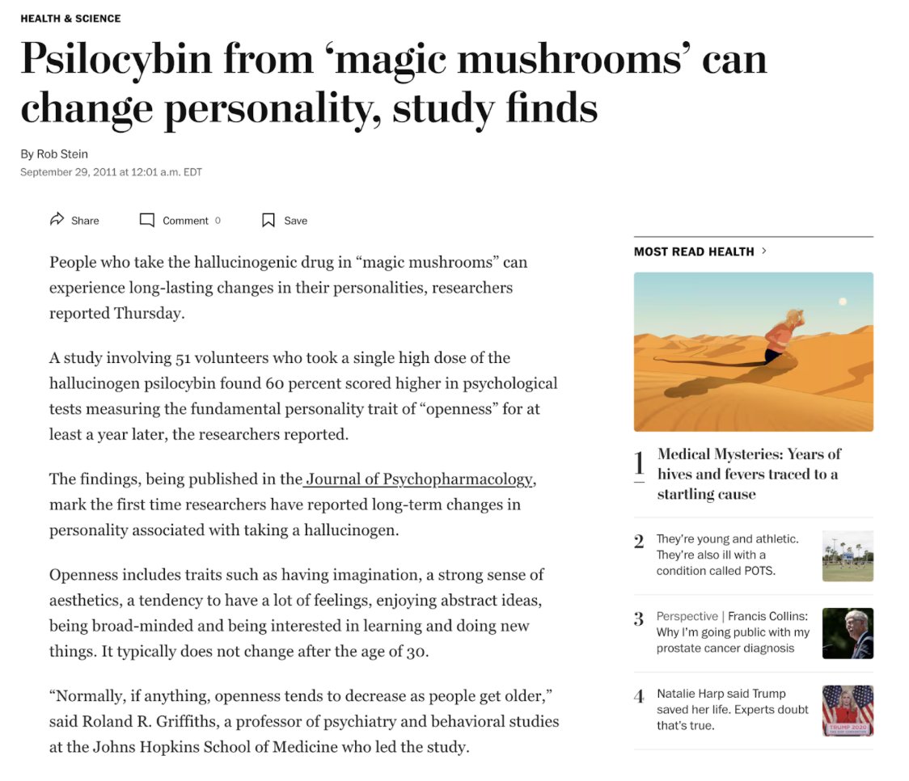
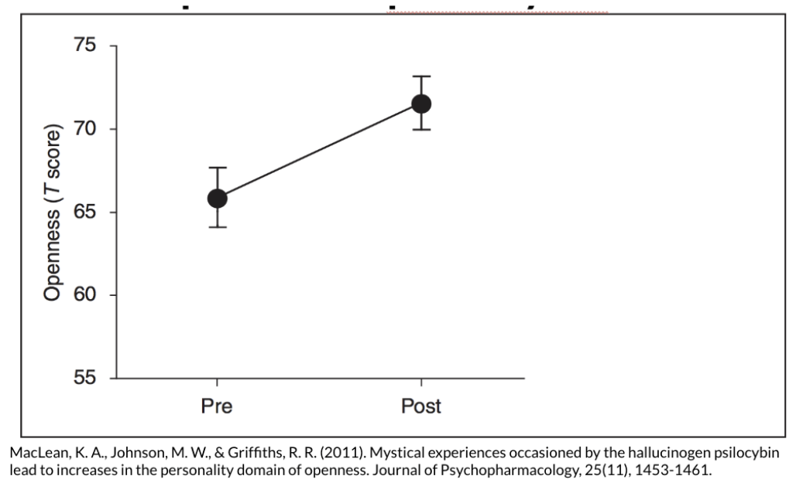
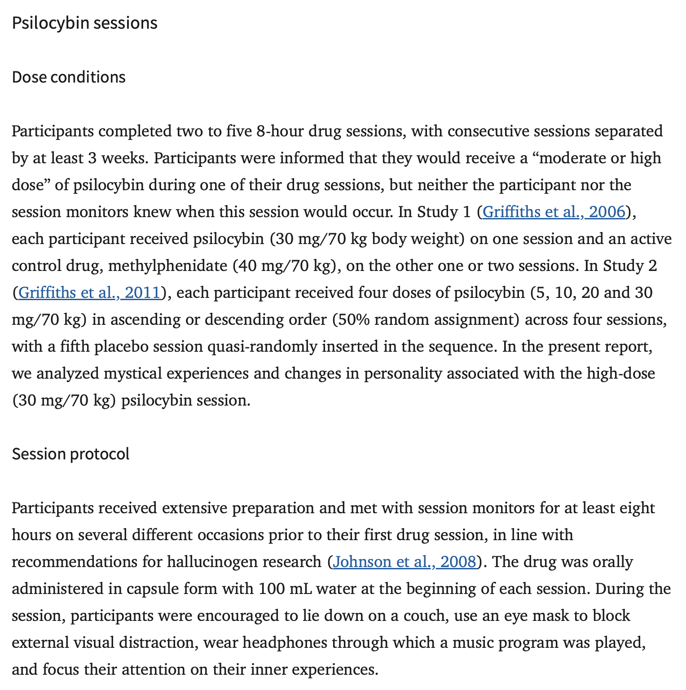
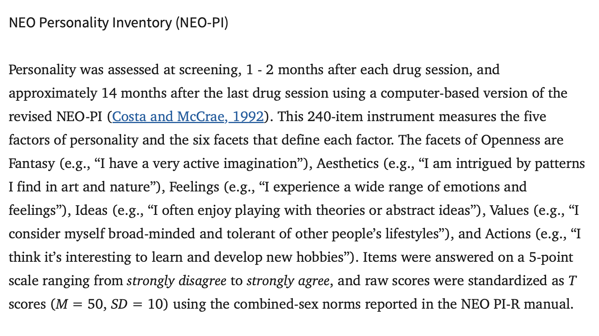
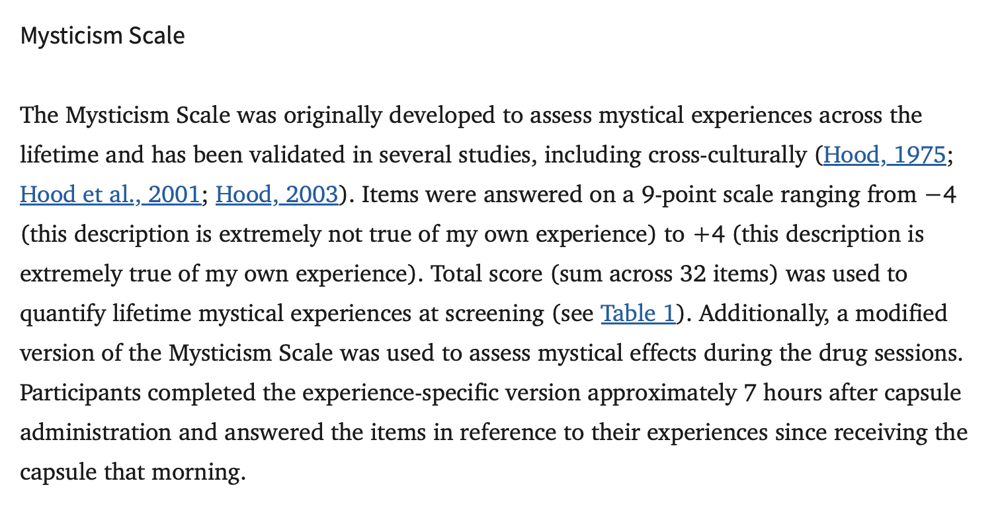
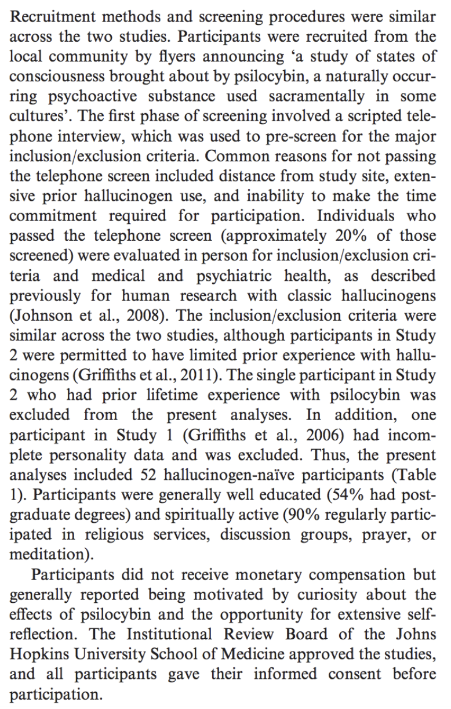
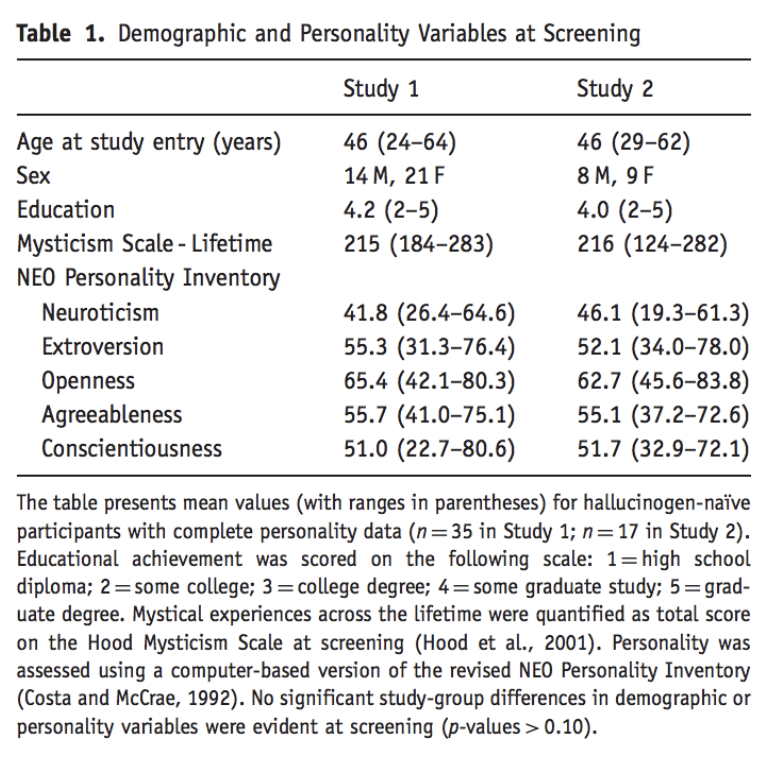
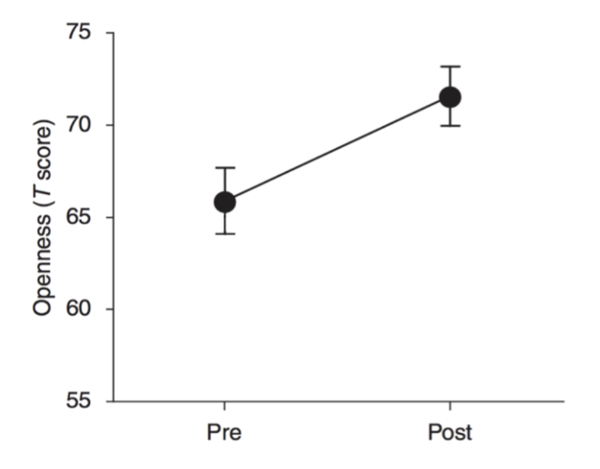
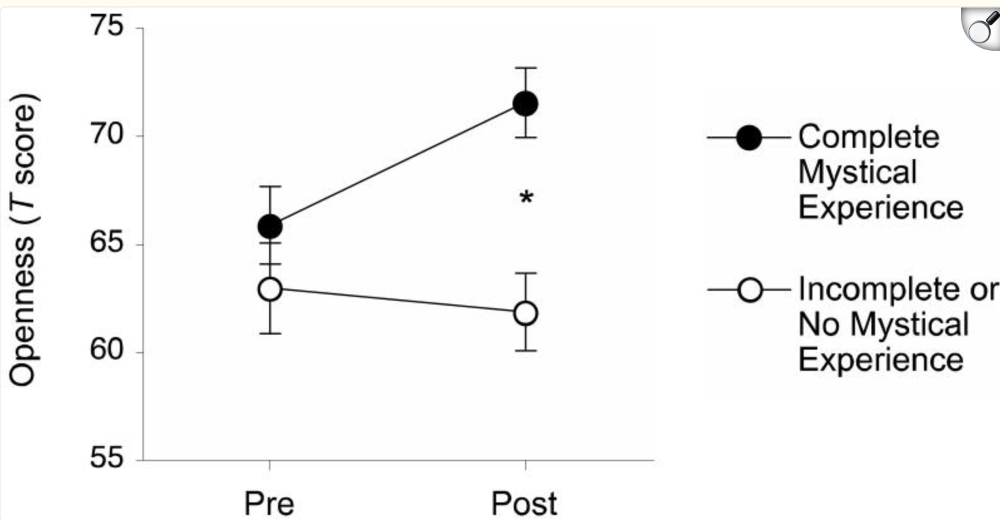

## [Check-In](https://docs.google.com/forms/d/e/1FAIpQLSdtsLSxF2GlbyTzJmdoIpn-BwxMrS0Jqi0D5pDIr832GULggw/viewform?usp=header)

[Scientific Article](https://www.ncbi.nlm.nih.gov/pmc/articles/PMC3537171/#:~:text=In%20participants%20who%20had%20mystical,experiences%20in%20adult%20personality%20change.)

::::: columns
::: {.column width="50%"}

:::

::: {.column width="50%"}

:::
:::::

## Mushroom Science : The Manipulation  {.smaller}

+---------------------------------------------------+-----------------------------+
| {width="80%"} | -   control / manipulation? |
|                                                   |                             |
|                                                   | -   double-blind?           |
|                                                   |                             |
|                                                   | -   generalizability?       |
|                                                   |                             |
|                                                   | -   random assignment?      |
+---------------------------------------------------+-----------------------------+

## Mushroom Science : The Measure {.smaller}

+---------------------------------------------------+------------------+
| {width="80%"}  | -   validity?    |
|                                                   |                  |
| {width="80%"} | -   reliability? |
+---------------------------------------------------+------------------+

## Mushroom Science : The Sample {.smaller}

+---------------------------------------------------+---------------------------------------------------+
| {width="80%"} | {width="80%"} |
+---------------------------------------------------+---------------------------------------------------+

## The Effect Depends... {.smaller}

**On the Vision Board :**

-   have you ever had a mystical / transcendental experience (drug or non-drug)?

-   what is some other factor (about people or the situation) that would change the relationship between taking the drug and openness to new experiences?

## The Effect Depends... {.smaller}

## Other Things To Chat About? {.smaller}

-   the article?

-   sampling bias / sampling error?

-   life, the universe, and everything?

## Part 2 : Dig Deeper Assignment {.smaller}

-   **Professor Reviews the [RESEARCH METHODS VISION BOARD](https://docs.google.com/spreadsheets/d/14u3w5edvo6KSFRw2U9t1knDANFSGBWOvDjS7-ZGujos/edit?usp=sharing).**

    -   Population : everyone in the world or smaller / more focused?
    -   WEIRD Sample :
        -   Western?
        -   Educated?
        -   Industrialized?
        -   Rich?
        -   Democratic?

## Writing Dig Deeper

**Final Product :** write a short summary compare / contrasting the news article and the research article.

-   include at least one thing on the rubric from each category.

-   THE POINT / THE EVIDENCE / WHO CARES

-   Professor demonstrates and then you write.

# NEXT WEEK : Final Project Time

-   Submit Dig Deeper \[DONE\]

-   Maybe read an article to discuss? \[OR NAH\]

