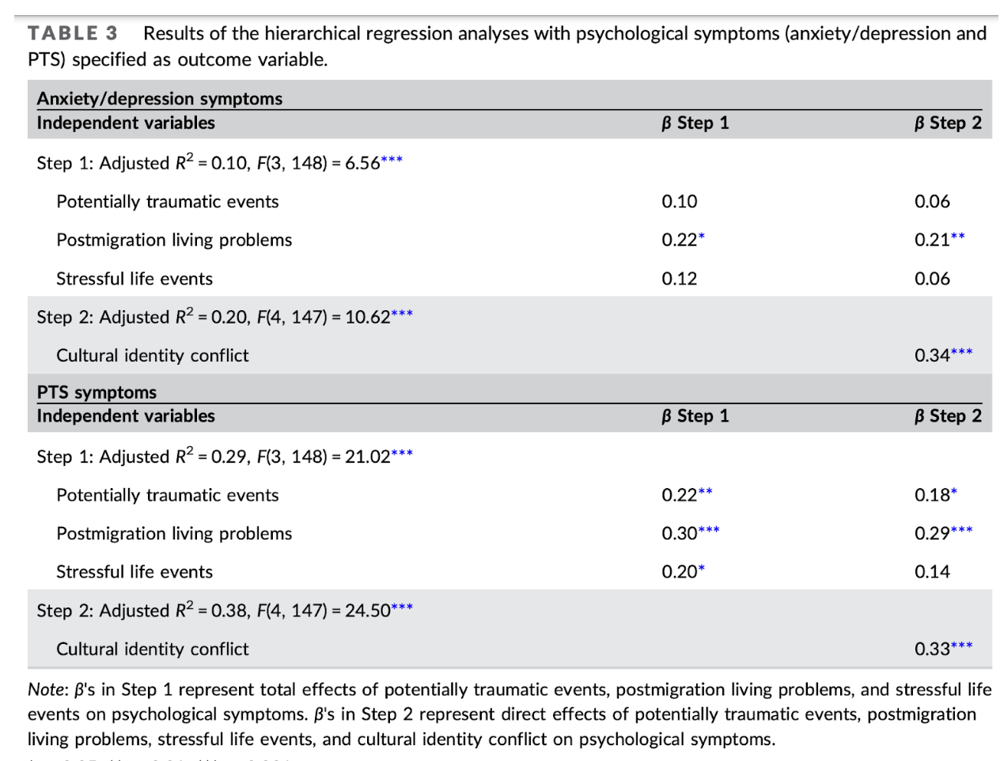
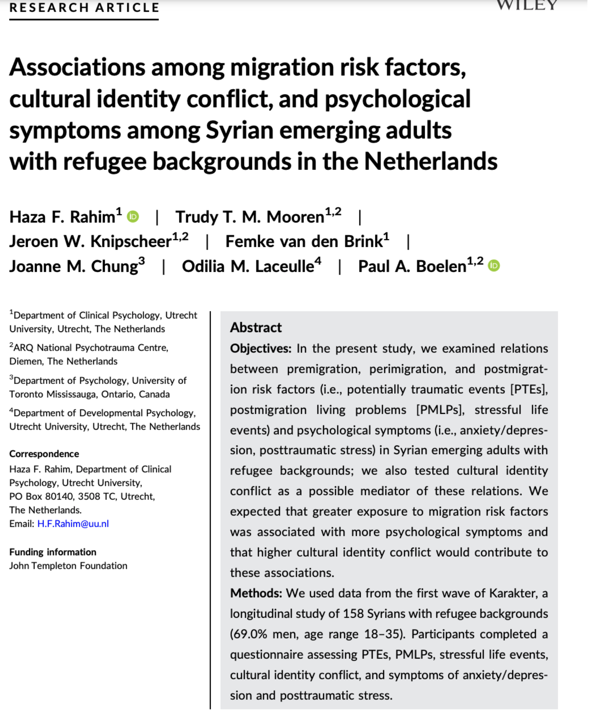
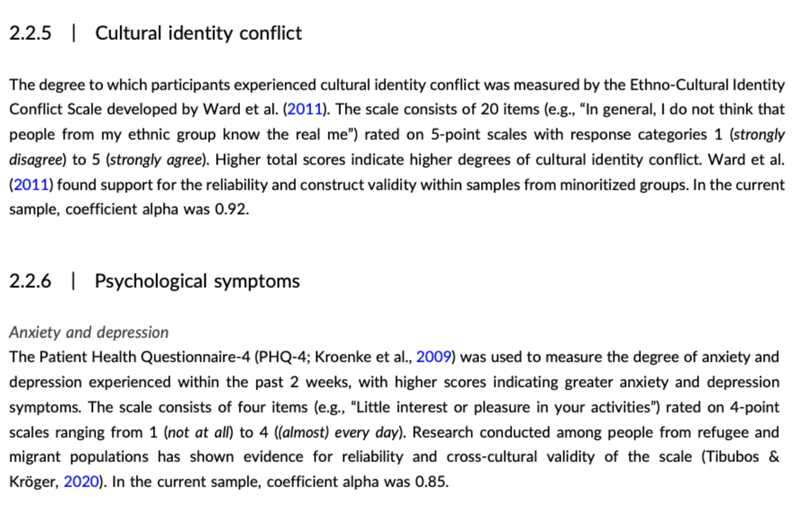
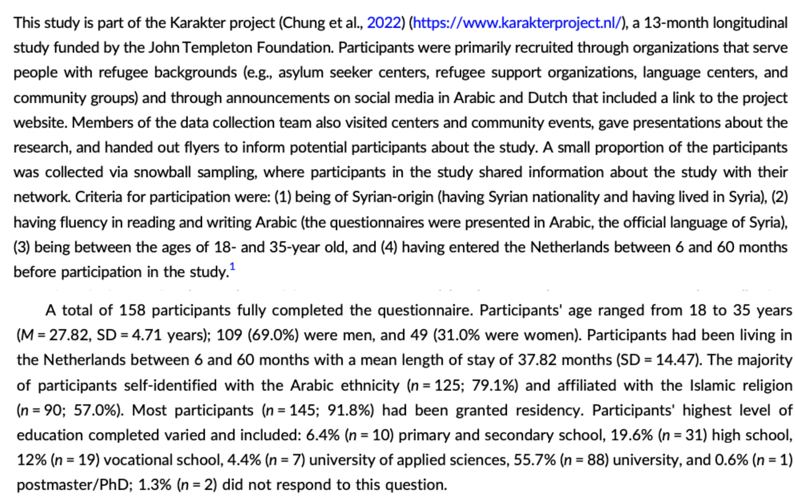

## [Check-In : Refugee Study](tinyurl.com/researchdissection)

::::: columns
::: {.column width="70%"}

:::

::: {.column width="30%"}
-   scan the abstract
-   scan the methods
-   scan the results (table 3)
:::
:::::

## Person Science : The Model {.smaller}

+------------------------------------------+-----------------------+
|      | ::: notes             |
|                                          | :::                   |
+------------------------------------------+-----------------------+

## Person Science : The Measure(s) {.smaller}

+-------------------------------------------------+------------------+
|             | -   validity?    |
|                                                 |                  |
|                                                 | -   reliability? |
+-------------------------------------------------+------------------+

## Person Science : <https://osf.io/y76dw/overview> {.smaller}

+------------------------------------+--------------------------------------------+
|  | -   What is the sample size?               |
|                                    |                                            |
|                                    | -   What is the population for this study? |
|                                    |                                            |
|                                    | -   Who was in the sample?                 |
|                                    |                                            |
|                                    | -   Might the sample bias the results?     |
+------------------------------------+--------------------------------------------+

## Person Science : The Effects {.smaller}

+--------------------------------------+-------------------------------------+
|  | -   the patterns?                   |
|                                      |                                     |
|                                      | -   how large are the effects??     |
|                                      |                                     |
|                                      | -   what's with all the stars???    |
+--------------------------------------+-------------------------------------+

## Person Science : The Effect Depends... {.smaller}

+--------------------------------------+---------------------------------------------------------------------+
|  | **how might you extend this knowledge?**                            |
|                                      |                                                                     |
|                                      | -   what are some potential consequences of these data?             |
|                                      |                                                                     |
|                                      | -   what are some other factors that might influence these results? |
|                                      |                                                                     |
|                                      | **what (new) linear models might answer these questions?**          |
+--------------------------------------+---------------------------------------------------------------------+

## Part 2 : Dig Deeper Assignment {.smaller}

-   **Professor Reviews the [RESEARCH METHODS VISION BOARD](https://docs.google.com/spreadsheets/d/14u3w5edvo6KSFRw2U9t1knDANFSGBWOvDjS7-ZGujos/edit?usp=sharing).**

## Part 3 : It's Project Time {.smaller}

-   [**Final Project Description and Rubric**](https://docs.google.com/document/d/1QJKm9s8WUXAoYACf_pC9QIWdYyfEOHQNMnP4unkXGYI/edit?usp=sharing)

-   **Milestone #1 : Research a Topic and Find a "Seed" Article**

    -   do a lit review on google scholar...learn from a quick scan of the titles and abstracts.

    -   find and summarize at least five articles to add to your [annotated bibliography](https://docs.google.com/spreadsheets/d/1w_c0ME7PDWmNIoxU5S4mla7uvB9lZyvMt4uIXccrqrE/edit?usp=sharing) (you do not need to read everything!)

    -   find ONE SPECIFIC STUDY that seems most relevant to your topic

-   **NEXT WEEK :** gonna share these seed articles, plant them, let them germinate \[SPRING TIME\]

