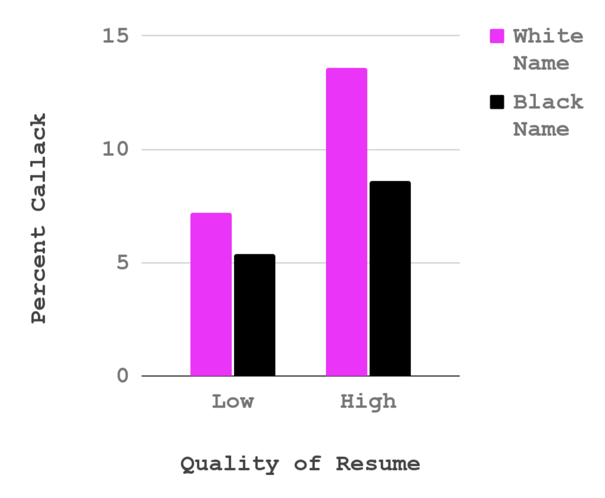
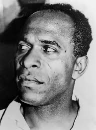
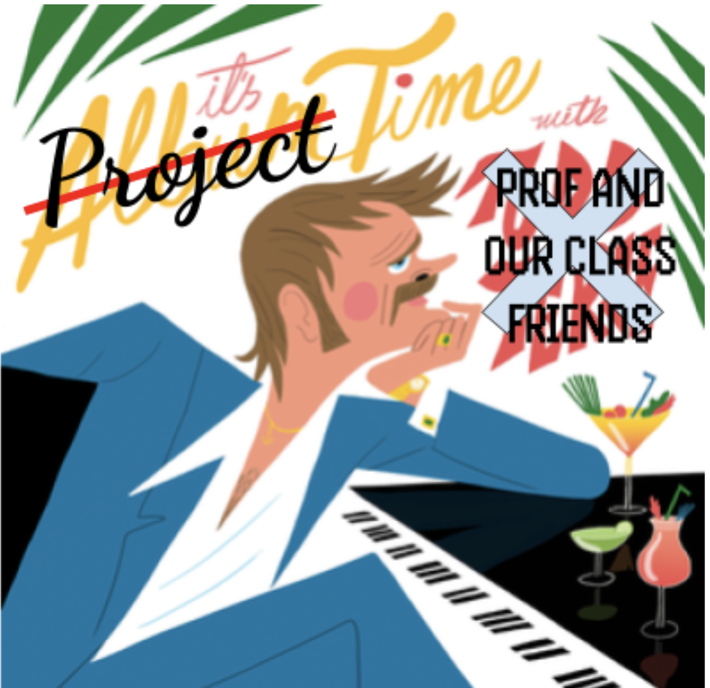
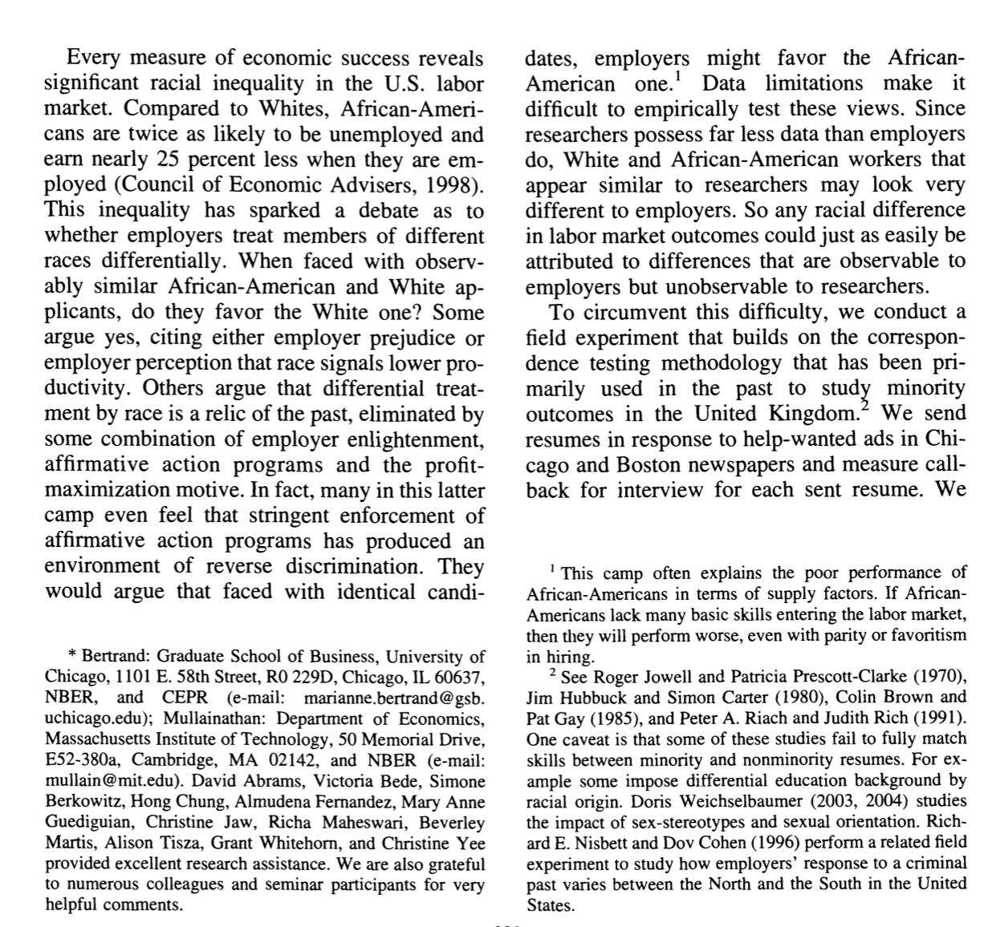

## Data on Resumes{.smaller}

[Check-In : Resume Study](https://docs.google.com/forms/d/e/1FAIpQLSfCxa3eYx90UC3OUw03dDMBzisPn27M4cNPSjp-sdgJQQinIw/viewform?usp=sf_link)

::::::::: panel-tabset
#### Data

::::: columns
::: {.column width="50%"}

:::

::: {.column width="50%"}
:::
:::::

#### Fanon

::::: columns
::: {.column width="60%"}
“To speak means to be in a position to use a certain syntax, to grasp the morphology of this or that language, but it means above all to assume a culture, to support the weight of civilization...Every colonized people--in other words, every people in whose soul an inferiority complex has been created by the death and burial of its local cultural originality--finds itself face to face with the language of the civilizing nation; that is, with the culture of the mother country. The colonized is elevated above his jungle status in proportion to his adoption of the mother country's cultural standards.”

**Frantz Fanon, Black Skin White Masks (1967)**
:::

::: {.column width="20%"}

:::
:::::
:::::::::

## Check-In Review {.smaller}

::::: columns
::: {.column width="60%"}

:::

::: {.column width="40%"}
The effect of resume quality on callback percentage *depends on* perceived race of name.

- for low quality resume
- for high quality resume
:::
:::::

## Check-In Review {.smaller}

::::: columns
::: {.column width="60%"}

:::

::: {.column width="40%"}
The effect of perceived race of name on callback percentage *depends on* resume quality.

- for white names
- for black names
:::
:::::

## PART 1 : SKETCHING AN [INTERACTION EFFECT](https://catterson.github.io/ystats/chapters/11R_InteractionFX.html#the-effect-of-using-implementation-intentions-on-task-completion-depends-on-the-type-of-goal)

- [**Final Project Description and Rubric**](https://docs.google.com/document/d/1QJKm9s8WUXAoYACf_pC9QIWdYyfEOHQNMnP4unkXGYI/edit?usp=sharing)

## PART 2 : INTRODUCTIONS

## ACTIVITY : Find a sheet of paper and pencil; draw this cube as precisely as possible.

{fig-align="center" width="46%"}

### Introduction Deconstruction. {.smaller}

::: r-fit-text
Start broad, but focus to your specific question!

|  |  |
|-------------|-----------------------------------------------------------|
| **Section** | **Brief Explanation** |
| **1. The Opening** | Describe the question you have, and explain why this question matters |
| **2. The Review** | Describe what past research and theory has to say on the question and your theory. Your goal is to give the reader the background they need to understand why you are doing your study; you don’t need to cover EVERY single issue on your topic.. |
| **3. The Critique** | Explain why the past research is not “the final truth”, and what other new questions might be important to consider (and why these questions matter). Only point out limitations with past research that you will address in your study; other limitations that you think future research will address should go in the discussion section. |
| **4. The Current Research** | Explain what specific questions your study will address. Be clear by stating each idea as a hypothesis with language like, “I predict” or “My first hypothesis”. |
:::

## ACTIVITY : identify parts of an introduction. {.smaller}

::::: columns
::: {.column width="70%"}
{fig-align="center" width="80%"}
:::

::: {.column width="30%"}
1.  The Opening
2.  The Review
3.  The Critique
4.  The Current Research
:::
:::::

## DEFINITION : patterns in writing

1.  **THE POINT :** What are you trying to say?

2.  **THE EVIDENCE :** What is some evidence that supports this point? This could be empirical (e.g., a summary of past research on the topic), but also logic or real-life experiential examples work here.

3.  **WHO CARES :** Why does this matter? How does this connect to your main thesis?

## ACTIVITY : identify parts of an introduction. {.smaller}

::::: columns
::: {.column width="70%"}
{fig-align="center" width="80%"}
:::

::: {.column width="30%"}
1.  **THE POINT :** What are you trying to say?

2.  **THE EVIDENCE :** What is some evidence that supports this point? This could be empirical (e.g., a summary of past research on the topic), but also logic or real-life experiential examples work here.

3.  **WHO CARES :** Why does this matter? How does this connect to your main thesis?
:::
:::::

## THE EVIDENCE : logic vs. empirical evidence. {.smaller}

:::::: r-fit-text
::::: columns
::: {.column width="50%"}
*"Think first of swallowing the saliva in your mouth, or do so. Then imagine expectorating it into a tumbler and drinking it! What seemed natural and "mine" suddenly becomes disgusting and alien. Or picture your self sucking blood from a prick in your finger; then imagine sucking blood from a bandage around your finger! What I perceive as separate from my body becomes, in the twinkling of an eye, cold and foreign."*

- Gordon Allport (1955). Becoming: basic considerations for a psychology of personality. Yale University Press.
:::

::: {.column width="50%"}
In a study of 45 female college students, a sweaty shirt was rated as more disgusting when it was associated with an outgroup than when associated with an ingroup (Reicher et al., 2016).

- S.D. Reicher, A. Templeton, F. Neville, L. Ferrari, & J. Drury, Core disgust is attenuated by ingroup relations, Proc. Natl. Acad. Sci. U.S.A. 113 (10) 2631-2635, https://doi.org/10.1073/pnas.1517027113 (2016).
:::
:::::
::::::

### EXAMPLE : patterns in writing. {.smaller}

::: r-fit-text
*The Point, The Evidence, The Who Cares*

{fig-align="center" width="80%"}
:::

## NEXT WEEK : More Project Time {.smaller}

- [**Final Project Description and Rubric**](https://docs.google.com/document/d/1QJKm9s8WUXAoYACf_pC9QIWdYyfEOHQNMnP4unkXGYI/edit?usp=sharing)

- **Milestone #2 :**

  - bring a sketch of what you think the pattern in the data might look like (and/or paste an image of this to the vision board)

  - outline the argument for your introduction \[link to your paper on the vision board\]

