## Check-In : Anonymous Survey


### The Scientific Poster {.smaller}

::::: columns
::: {.column width="50%"}
-   Grab a poster.
-   Chat with a buddy.
-   Look over the [poster template](https://docs.google.com/presentation/d/12vZTjpoXdL0tRVkxrvv1aVmKC657HUuzKng0mg9COPI/edit?usp=sharing)
:::

::: {.column width="50%"}
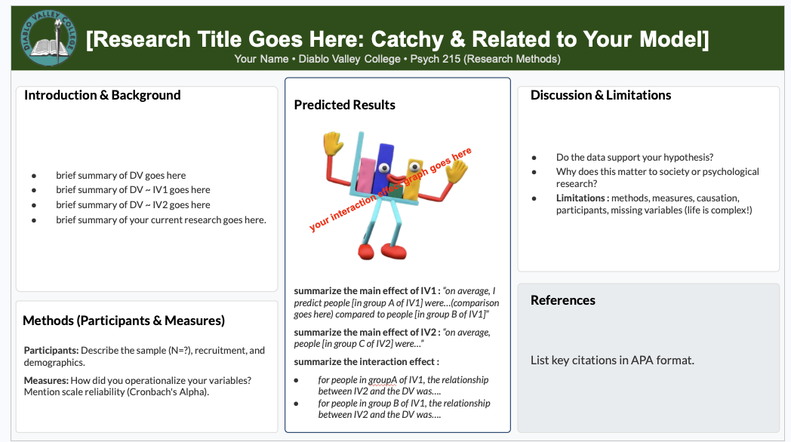
:::
:::::

## PART 1 : Summarizing Your Project in Poster Form {.smaller}

::::: columns
::: {.column width="70%"}
-   [**Final Project Description and Rubric**](https://docs.google.com/document/d/1QJKm9s8WUXAoYACf_pC9QIWdYyfEOHQNMnP4unkXGYI/edit?usp=sharing)

-   [**Poster Template**](https://docs.google.com/presentation/d/12vZTjpoXdL0tRVkxrvv1aVmKC657HUuzKng0mg9COPI/edit?usp=sharing)
:::

::: {.column width="30%"}

:::
:::::

## [Four Validities This Semester](https://journals.sagepub.com/doi/pdf/10.1177/09637214211067779?casa_token=J2fnwbroJB0AAAAA:rTHf9SZpJvyTDvvajR8Fb9PmHCDqZicCgxrAfhLI7Nl-OnGfLZjrbe_oNobr-KZKSFMCQE--2e-A)

1.  Construct Validity
2.  External Validity
3.  Internal Validity
4.  Statistical Conclusion Validity

## RESEARCH SAYS...

-   "These findings suggest there are contexts in which suppression use may not be maladaptive, and demonstrate the benefits of studying emotion processes in real-life." - [Catterson, Eldesouky, & John (2018)](https://www.dropbox.com/scl/fi/4emfhfjarbxb066t2jqjk/Catterson_Eldesouky_2017.pdf?rlkey=ilnbia0ii1d2tu5rypl0jg7pv&dl=0)

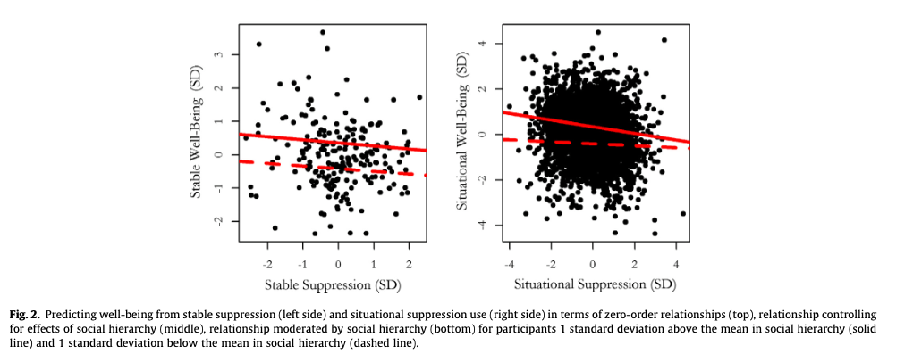

### 1. Construct Validity {.smaller}

::::: columns
::: {.column width="50%"}
-   Did you measure what you want to measure?
-   (If not, how might this influence the results?)
-   Discuss : how did your measures get at "the truth"? have "error"?
:::

::: {.column width="50%"}
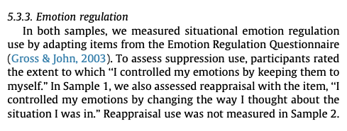
:::
:::::

### 2. External Validity {.smaller}

::::: columns
::: {.column width="30%"}
Do our results generalize to other samples?

-   sampling error : do we trust the statistical testing?
-   sampling bias : who are the people who we studied? what differences might influence the results (and how)?
:::

::: {.column width="70%"}
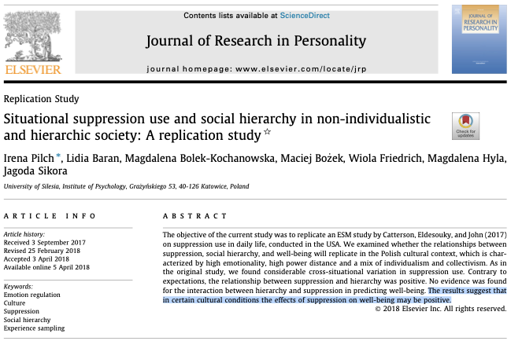

[- Pilch et al. (2018)](https://www.dropbox.com/scl/fi/b2osihpstkal9rtoy5fhr/Pilch_etAl_CattersonReplication_2018.pdf?rlkey=nt1v7rg3seqlpj9ell40zyf0o&dl=0)
:::
:::::

### 3. Internal Validity. {.smaller}

::::: columns
::: {.column width="30%"}
-   Is the relationship between the variables causal? reverse causal? 3rd variable?
-   (Is an experiment possible? What confounds would be most important to control??)
:::

::: {.column width="70%"}
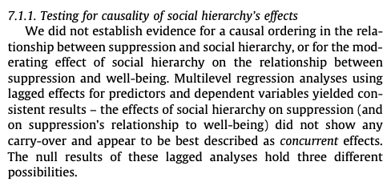

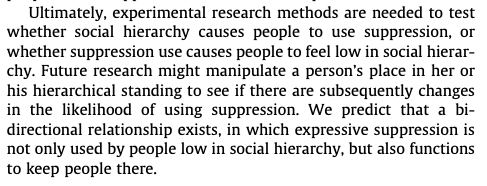
:::
:::::

## 4. Statistical Conclusion Validity {.smaller}

::::: columns
::: {.column width="50%"}
-   Was your hypothesis supported by the data?
-   Was the relationship between two variables strong?
-   Was the relationship between two variables strong?
:::

::: {.column width="50%"}
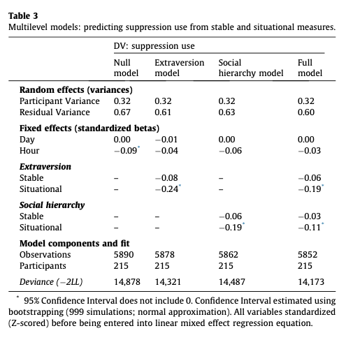
:::
:::::

### 4. Statistical Conclusion Validity {.smaller}

::: panel-tabset
#### Prediction (and Error)

Best estimates that the average correlation between two variables is *r \< .30*

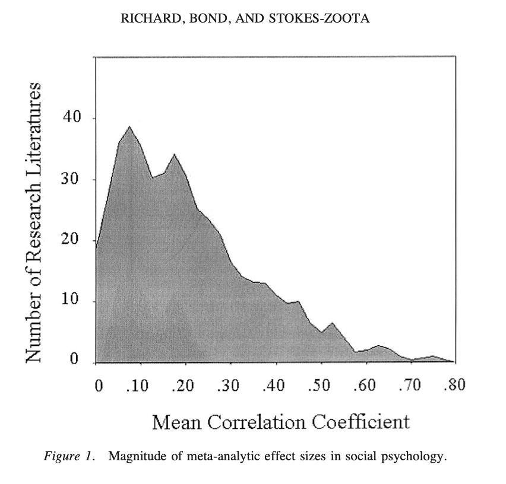{fig-align="center" width="60%"}

#### r = .3

What a r = .3 looks like. \[[Source](https://rpsychologist.com/correlation/)\]

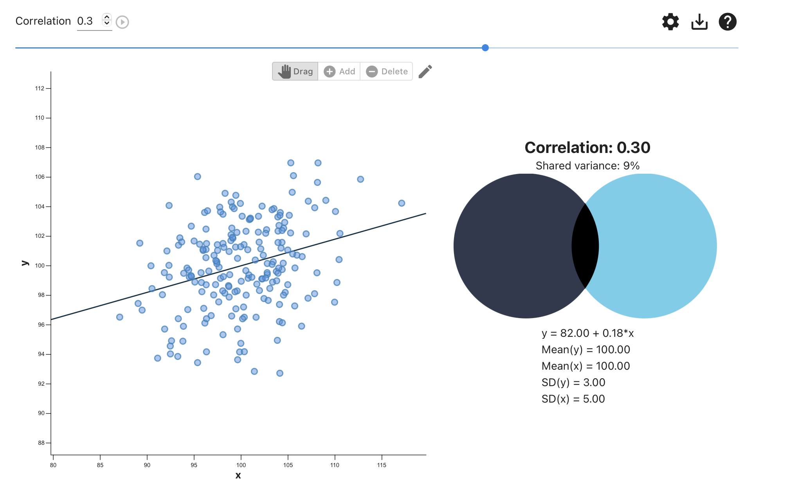{width="60%"}

#### r = .3??

A "correlation" / slope could look like any of the following graphs \[[Anscombe's Quartet](https://en.wikipedia.org/wiki/Anscombe%27s_quartet)\]

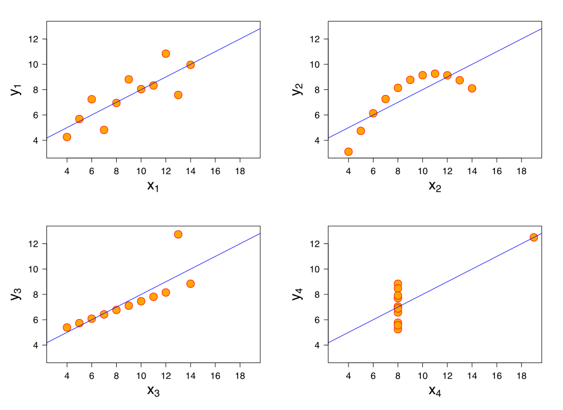{fig-align="center" width="60%"}

#### r = .3??!?

**The Replication Crisis = Hard to Trust Any One Study.**

{fig-align="center" width="60%"}
:::

### 4. Statistical Conclusion Validity {.smaller}

Are we adhering to “best practices” and doing the analyses correctly?

::: panel-tabset
#### p-hacking

-   **p-hacking :** making changes to your model or data in order to "get" your p-values.

    -   **visit :** <https://stats.andrewheiss.com/hack-your-way/>

    -   **model : economic performance \~ political power + error**

        -   decide how to operationalize political power

        -   decide how to operationalize economic performance

        -   decide how to adjust your model

#### bad methods

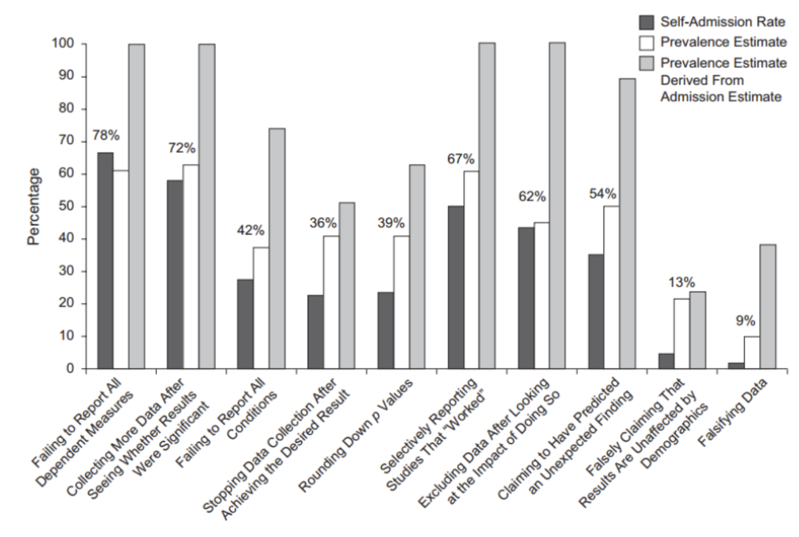{fig-align="center" width="60%"}

#### open science

-   **Open-Science :** be transparent. share code and data; science is a process.

    -   [Center for Open Science](https://www.cos.io/open-science)

    -   [Open Science Foundation (OSF)](https://osf.io). Hosting data.

-   [link to pre-registration guides](https://www.cos.io/initiatives/prereg)

#### pre-registration works

{fig-align="center" width="60%"}

#### "Many Labs"

[be transparent & collaborative; science is a process.](https://journals.sagepub.com/doi/10.1177/2515245917747646)

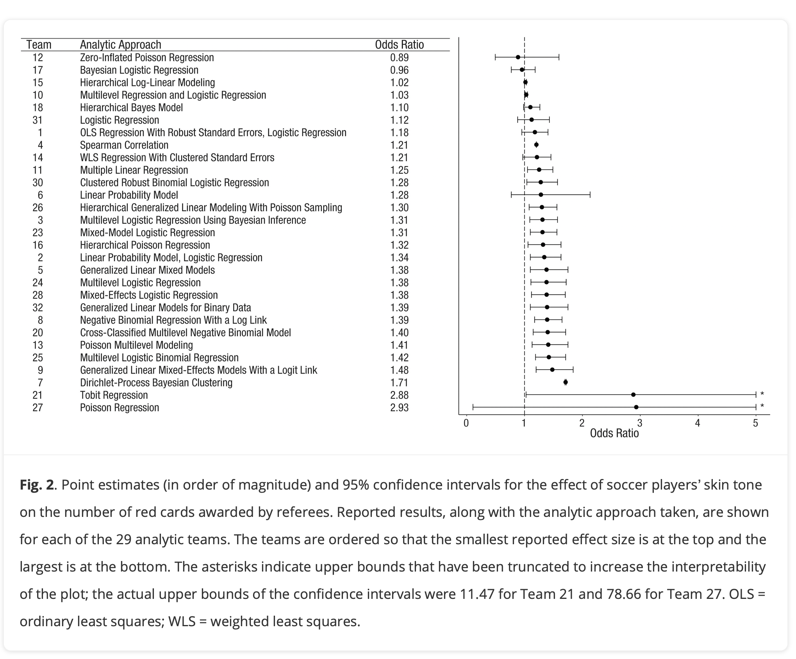{width="60%"}
:::

### X. IS Validity Possible? {.smaller}

1.  **is there a "truth" to people?** maybe there is no truth? maybe the endeavor is impossible (post-positivism), defined entirely by our processes (social constructivism), or bad (anti-positivism).

2.  **should there be a truth to people?** why does this matter? who will use this knowledge in practice (to help? to hurt?)

```         
“If you want knowledge, you must take part in the practice of changing reality. If you want to know the taste of a pear, you must change the pear by eating it yourself. If you want to know the structure and properties of the atom, you must make physical and chemical experiments to change the state of the atom. If you want to know the theory and methods of revolution, you must take part in revolution. All genuine knowledge originates in direct experience.” - Mao
```

## THE END : Farewell! {.smaller}

{fig-align="center" width="60%"}
