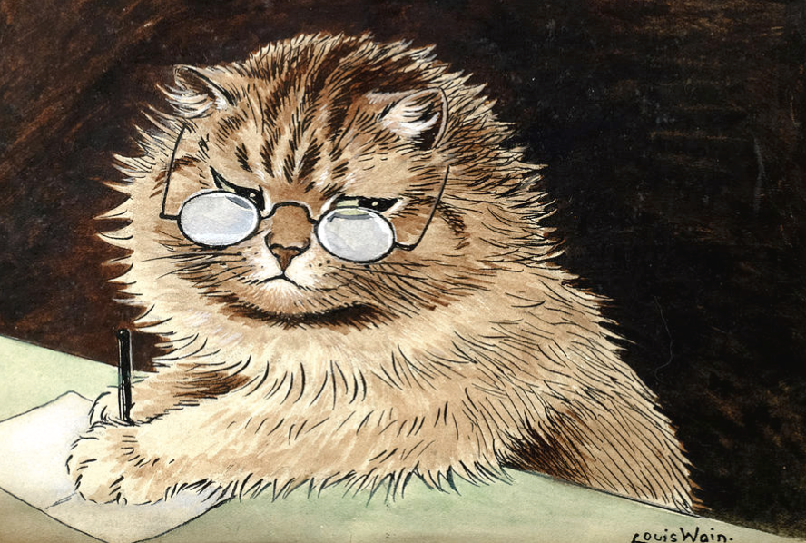
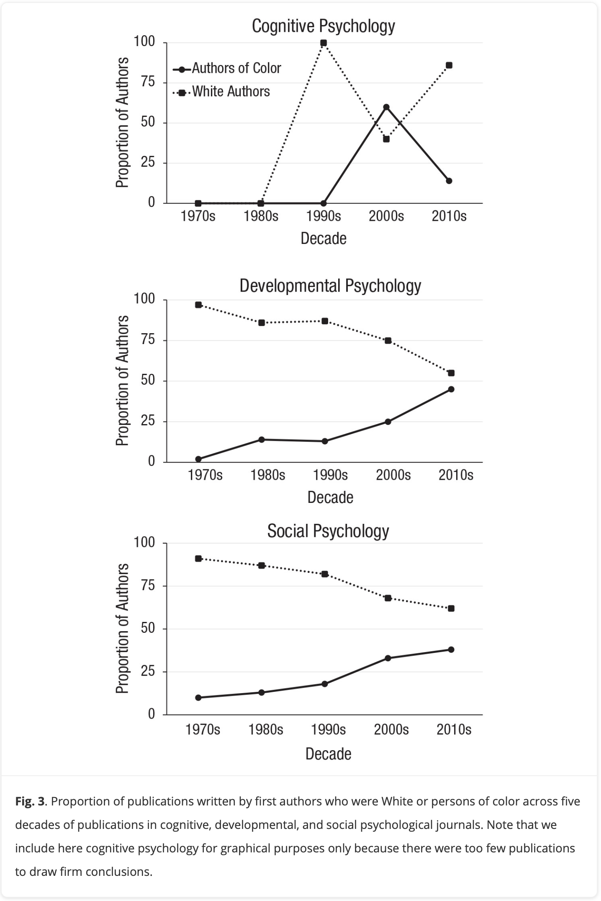
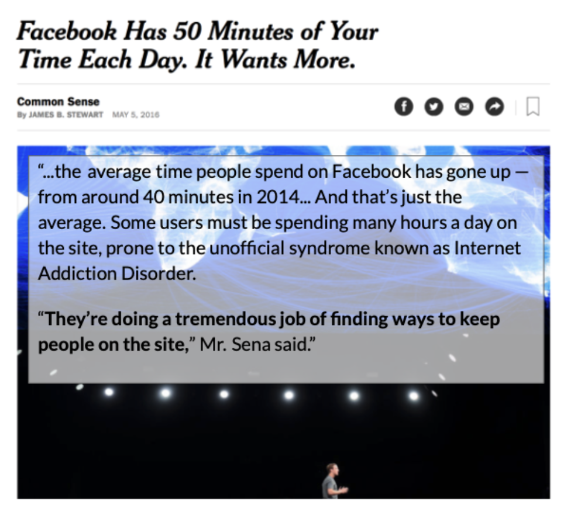

# Welcome to Psych 215!!

- **Take this short survey (phone or computer) :** tinyurl.com/helloRM

- **Then log into your computer :** use your Insite ID

{fig-align="center"}

## Agenda and Announcements {.smaller}

::::: columns
::: {.column width="50%"}
**Agenda :**

- 10 Min : Welcome and Check-In
- 30 Min : Part 1 : Research in Psychology
- 30 Min : Part 2 : Sources of Knowledge
- 10 Min : Recap & Next Week
:::

::: {.column width="50%"}
**Announcements :**

- *These notes are on Canvas*. Let me know how access goes.

- *Waitlist students!* Talk to me after class.

- *Office Hours in SSSC.* 12:35 - 1:35. Across the street.
:::
:::::

# Part 1 : Research in Psychology

## Professor : Arman (Daniel) Catterson

- **say :** Arman…Professor…Professor Catterson…Dr. Professor Catterson, PhD

- **from :** Austin, TX to UC Berkeley to stayin in the bay forever teaching here full-time and also at Berkeley as a continuing lecturer (sit in on my stats class if you'd like to feel out the cal vibes!)

{fig-align="center" width="445"}

## Students : THIS CLASS IS FOR Y’ALL!!! {.smaller}

- **your voice is needed in the classroom :** we learn from each other.

  - clap once : If You Are Here; \[Tacos v. Burritos\]; \[Pineapple on Pizza\]; \[Psychology a Science (Like Physics)\]

  - all talk at once : "NO THANK YOU, PROFESSOR"; "I NEED HELP PROFESSOR"

  - with your buddy : what's a belief that you hold? (Examples : breakfast is the most important meal of the day; attendance is important to learning; Large amounts of taxpayer money should be redirected from military spending to funding public education, healthcare, and housing.)

- **attendance is critical.** especially when you are behind.

## Your Voice is Needed in PSYCHOLOGY {.smaller}

- What do you notice about [the graph](https://journals.sagepub.com/doi/10.1177/1745691620927709)?
- What questions do you have?
- How do we use this knowledge?

## Psychology as a Science ^TM^

> "Psychology is a diverse discipline, grounded in science, but with nearly boundless applications in everyday life. Some psychologists do basic research, developing theories and testing them through carefully honed research methods involving observation, experimentation, and analysis. Other psychologists apply the discipline’s scientific knowledge to help people, organizations, and communities function better." - From the [American Psychology Association (APA, January 26th)](https://www.apa.org/about)

### Variables and Variation

- **Variation :** changes, differences, complexity. Our scientific knowledge tries to understand this variation.
- **Variable :** a thing that varies.
- **DISCUSSION :** what are some things that vary in this room?

### The ABCs of Psychology.

- **A = AFFECT =** an emotion that you feel.
- **B = BEHAVIOR =** a thing that you do.
- **C = COGNITION =** a thought that you have.

**CLASS DISCUSSION :** consider the variables we listed out. How can we consider them in terms of AFFECT, BEHAVIOR, and COGNITION?

## Wait, but What is Science?

### Science is [Prediction]{.underline}

::::: columns
::: {.column width="50%"}
**prediction :** an educated guess about the future based on knowledge.

- **Valid :** when your prediction is right.

- **Error :** your prediction is wrong (“life is complex!”)
:::

::: {.column width="50%"}

:::
:::::

### Science is Control

::::: columns
::: {.column width="60%"}
control : how scientists try to change the future based on their scientific predictions.
:::

::: {.column width="40%"}

:::
:::::

### CLASS DISCUSSION : Prediction & Control in Real Life

- What are some examples of predictions that you made today (about people)?

- What information informed these predictions?

- How did you use this knowledge to try and control outcomes?

- Was your prediction valid?

### Vision Board \[see Canvas for the link\]

**On Your Own. Spend a few minutes typing out answers under your name.**

- What's a research topic that you would be interested in learning more about if you were a psychologist?

- What is the variable that is the focus of this question?

### REPLY on the Vision Board \[see Canvas for the link\]

**Find a buddy (another student in the class) and chat with them.**

- Consider the person's research topic - what is the AFFECT, BEHAVIOR, and COGNITIVE aspect of this variable?

<!-- -->

- How might you use knowledge about this variable to make predictions and / or control outcomes?

# Part 2 : Sources of Knowledge

### Thinking About Our Methods of Knowing

- **Type out your belief** in the [RESEARCH METHODS VISION BOARD](https://docs.google.com/spreadsheets/d/14u3w5edvo6KSFRw2U9t1knDANFSGBWOvDjS7-ZGujos/edit?usp=sharing).

- **Find a belief on the list that...**

  - You agree with
  - You disagree with (be kind!).
  - We are different! We are the same!!

### Intuition {.smaller}

*The first method of knowing is intuition. When we use our intuition, we are relying on our guts, our emotions, and/or our instincts to guide us. Rather than examining facts or using rational thought, intuition involves believing what feels true. The problem with relying on intuition is that our intuitions can be wrong because they are driven by cognitive and motivational biases rather than logical reasoning or scientific evidence. While the strange behavior of your friend may lead you to think s/he is lying to you it may just be that s/he is holding in a bit of gas or is preoccupied with some other issue that is irrelevant to you. However, weighing alternatives and thinking of all the different possibilities can be paralyzing for some people and sometimes decisions based on intuition are actually superior to those based on analysis.*

- **DEFINITION :** In your own words, how would you define this epistemology? 

- **EXAMPLE :** What’s an example of this epistemology?

- **CONSEQUENCES :** What’s a way that this epistemology helps people? What are some ways that this epistemology might mislead people?

- **QUESTIONS :** What other questions or comments about this epistemology do you have?

### Read and Share {.smaller}

- Number off 1 - 3 and [read from your textbook.](https://opentext.wsu.edu/carriecuttler/chapter/methods-of-knowing/)

  - 1 = Authority

  - 2 = Rationalism

  - 3 = Empiricism

- Discuss with your buddy.

  - **DEFINITION :** In your own words, how would you define this epistemology? 

  - **EXAMPLE :** How can you APPLY this epistemology to the professor's example? Your example? Add this to the VISION BOARD.

  - **CONSEQUENCES :** What’s a way that this epistemology helps people? Might mislead people?

  - **QUESTIONS :** What other questions or comments about this epistemology do you have?

# NEXT WEEK : Bias

## DISCUSSION : What words or ideas come to mind when you think of the word "bias"

## TO DO : Read!

1.  **Readings.**
    1.  *Scientific method in five easy steps*
    2.  *Why Clever People Believe Stupid Things*
    3.  *More on the Replication Crisis.*
2.  **Reading Quiz + Discussion**
3.  **Attend class next week :)**

## BYE.

