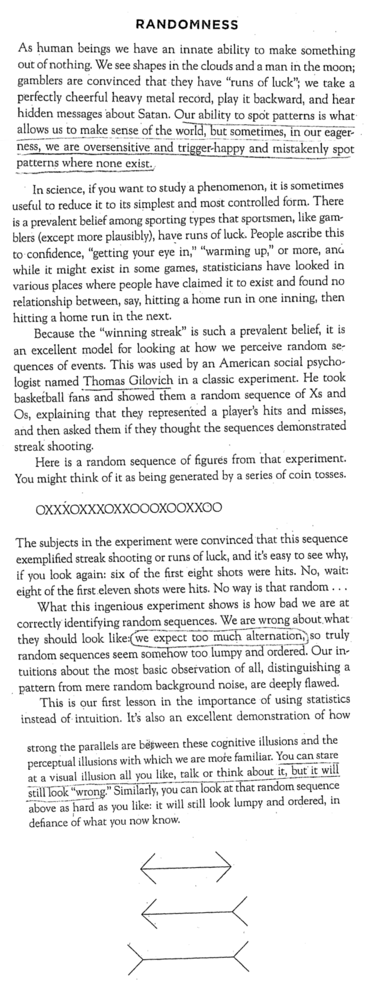
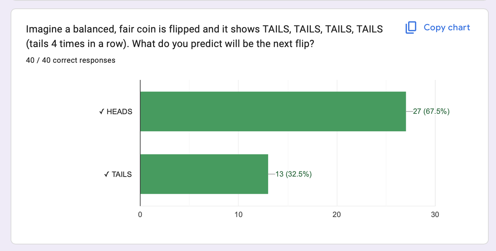
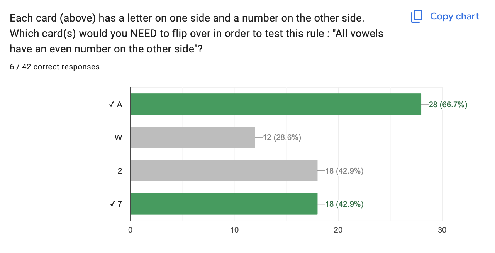

# Week 2 {.smaller}

**Check-In Here :** [**tinyurl.com/hibiases**](https://docs.google.com/forms/d/e/1FAIpQLSc6wy7of8-Mx8VZRXJmxF1hEisdoK-ZeKCJgx192n85xIOtdw/viewform?usp=sf_link)

{fig-align="center"}

## Agenda and Announcements

## Check-In Review

| Epistemology | Example Pro-Belief in Horoscopes | Example Anti-Belief in Horoscopes |
|-------------------|---------------------------|---------------------------|
| Intuition |  |  |
| Authority |  |  |
| Rationalism |  |  |
| Empiricism |  |  |

# Part 1 : Can Psychology Be a Valid Science?

## RECAP : Goal of Science to Predict & Control

### Research Questions : Writing Linear Models {.smaller}

::::: columns
::: {.column width="50%"}
- **Linear Model** : an equation that simplifies our question & theory.

  - DV \~ IV1 + IV2 + ... + IVk + ERROR
  - DV = what you want to predict or control (focus of your study)
  - IV = all the variable(s) you think might help predict the DV.
  - ERROR = life is complex! our predictions will be imperfect
:::

::: {.column width="50%"}
- **EXAMPLE :** WHAT PREDICTS \[choose one\]

  - a good class?

  - screen time on social media?

  - sleep quality?
:::
:::::

### ACTIVITY : [RESEARCH METHODS VISION BOARD](https://docs.google.com/spreadsheets/d/14u3w5edvo6KSFRw2U9t1knDANFSGBWOvDjS7-ZGujos/edit?usp=sharing)

  - Add your name, dream vacation to Tab 2.
  
  - Write out your horoscope prediction as a linear model.

### Research Questions : Hypotheses {.smaller}

::::: columns
::: {.column width="50%"}
- **Hypotheses** : falsifiable predictions based on your theory.

  - H0 = null hypothesis = if the theory is NOT SUPPORTED, then I expect…

  - HA, = alternative hypothesis = if the theory is SUPPORTED, then I expect...
:::

::: {.column width="50%"}
- **EXAMPLE :** what is the null and alternative hypothesis for ONE of the variables in our model?
:::
:::::

### ACTIVITY : [RESEARCH METHODS VISION BOARD](https://docs.google.com/spreadsheets/d/14u3w5edvo6KSFRw2U9t1knDANFSGBWOvDjS7-ZGujos/edit?usp=sharing)

  - Write out your research question & theory (from Week 1) as a *LINEAR MODEL*.

  - Define a null & alternative hypothesis based on one DV and one IV from this model.

### Paradigms of Inquiry {.smaller}

Read the four statements below; which perspective do you believe about psychology? What do you think most psychologists believe? Why?

- POSITIVISM : there is a REAL TRUTH about what makes people think, feel, and act that we can someday learn.

- POST-POSITIVISM : reality exists, but we may not be able to ever understand REAL TRUTH because our ability to study reality will always be influenced by people.

- SOCIAL CONSTRUCTIVISM : reality and “truth” are made up by people (and scientists); scientific knowledge is just a reflection of our society’s pre-existing beliefs.

- ANTI-POSITIVISM / CRITICAL THEORY : there is no reality or “truth” to what people are like/ using science to understand “truth” removes autonomy from people (it turns people into machines).

### DISCUSS : The Replication Crisis in Psychology {.smaller}

- How did this make you feel? Why?

- How should we use this knowledge (as students? as researchers?)

- What ideas or solutions do you think would work?

  - POSITIVISM : there is a REAL TRUTH about what makes people think, feel, and act that we can someday learn.

  - POST-POSITIVISM : reality exists, but we may not be able to ever understand REAL TRUTH because our ability to study reality will always be influenced by people.

- What other questions do you have?

# Part 2 : Cognitive Biases

What comes to mind when you think of a bias?

## ACTIVITY : Reading About Cognitive Biases {.smaller}

::::: columns
::: {.column width="30%"}
- How would you describe "Randomness" in your own words?

- Can you think of another example (from your own life?)

- What's a sentence that confused you / something you would want to know more about?
:::

::: {.column width="60%"}

:::
:::::

## EXAMPLE : PATTERNS IN RANDOMNESS {.smaller}

## EXAMPLE : Positive Evidence Bias

## THIS WEEK : read about the other biases.

::::: columns
::: {.column width="30%"}
- Positive Evidence

- Previous Beliefs

- Availability

- Social Influence

- Regression to the Mean
:::

::: {.column width="60%"}
**For Each Bias**

- What's a clear definition? How would you explain to a 5-year old?

- What's an example from real-life (e.g., a Casino)

- How might this bias influence / be relevant to science? your own life?
:::
:::::

# NEXT WEEK : Science Business.

## BYE.

