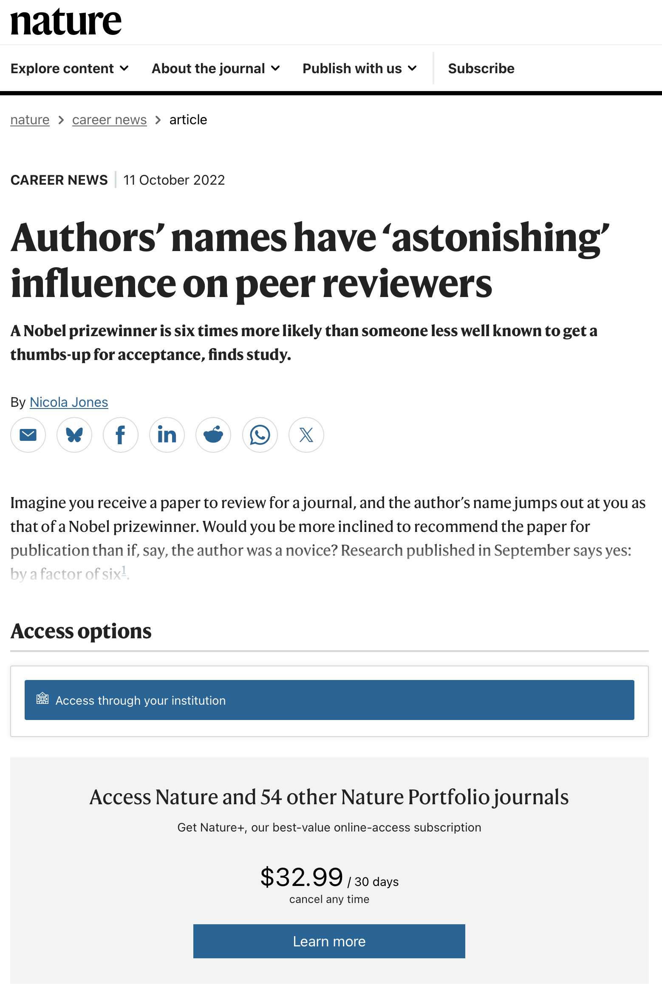
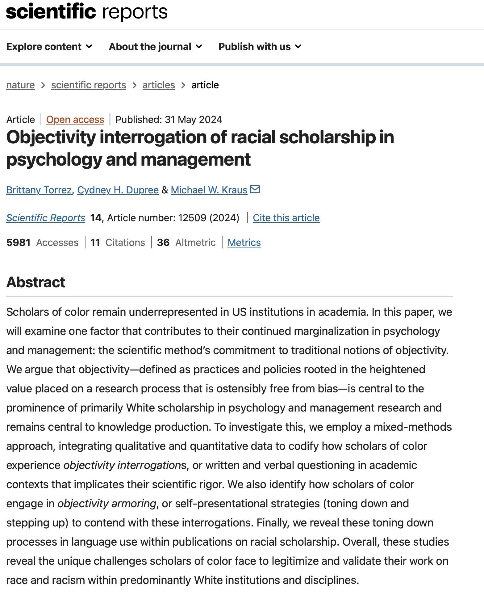

# Hi Class, It is Week 3 {.smaller}

-   **Check-In Here : [tinyurl.com/readingread](https://docs.google.com/forms/d/e/1FAIpQLSfaHXCHU3s_TthjHI-fDnNrjI7rWNTdquqyPRmlu8fEgncHHg/viewform?usp=sf_link)**

{width="456"}

## [Week 2 Vision Board Review](https://docs.google.com/spreadsheets/d/14u3w5edvo6KSFRw2U9t1knDANFSGBWOvDjS7-ZGujos/edit?usp=sharing) {.smaller}

-   Models & Me-Search

## [Week 2 Vision Board Review](https://docs.google.com/spreadsheets/d/14u3w5edvo6KSFRw2U9t1knDANFSGBWOvDjS7-ZGujos/edit?usp=sharing) {.smaller}

-   Cognitive Biases

# Part 1 : People (and Scientists) Are Biased

## ACTIVITY : Identifying Biases in Horoscopes {.smaller}

**Find examples of each of the different cognitive biases:** *Patterns in Randomness, Positive Evidence, Previous Beliefs, Availability, Social Influence, Regression to the Mean.*



## DISCUSSION : Biases in Science {.smaller}

::::: columns
::: {.column width="60%"}
-   How might the scientific method PREVENT these biases?
-   How might the scientific method PROMOTE these biases?
:::

::: {.column width="40%"}
-   Patterns in Randomness
-   Positive Evidence
-   Previous Beliefs
-   Availability
-   Social Influence
-   Regression to the Mean.
:::
:::::

## EXAMPLE : biases in peer-review? {.smaller}

# Part 2 : Scientific Business

## RECAP : questions? {.smaller}

-   **The People Involved:**

    -   **author :** the person(s) who writes the article

    -   **affiliations :** where the authors come from

    -   **editor :** a person who sends the article to review, and ultimately decides whether to accept / reject an article for publication.

    -   **peer reviewers :** other scientists who comment on the article and give feedback before it is published (unpaid, anonymous, and uncredited on the paper)

-   **Types of Scientific Articles**

    -   **original report :** one or more studies where researchers collect original data to answer a specific question(s)

    -   **replication :** a copy of a previous original report (with new people)

    -   **literature review :** summarizes main ideas from past research to find common themes

    -   **meta-analysis :** summarizes data from past studies to find common themes.

-   **Ways To Evaluate an Article :**

    -   **citation count :** the number of times that other people reference a specific article.

    -   **impact factor :** the average number of times the average article in a journal has been cited in an average year

    -   **jargon :** the specific words psychologists use to define variables.

    -   **APA Citation (or “Citation in APA Format”) :** a super specific way of referencing an article that you do NOT need to memorize because computers do this for us.

# PART 3 : READING AN ARTICLE {.smaller}

::::: columns
::: {.column width="60%"}

:::

::: {.column width="40%"}
**WE DON'T HAVE TIME TO READ, PROFESSOR!**

-   How are you feeling as you look at this document?
-   Abstract --\> Headers --\> What looks interesting?
:::
:::::

# NEXT WEEK : WE HAD TIME TO READ, PROFESSOR! {.smaller}

1.  Continue your literature review. Cool!

2.  Do a closer reading of the "Objectivity Interrogation" article. Okay not to understand everything; we will discuss!

3.  Learn about reliability and validity and why phrenology was hella racist bad science.

4.  Byeeeeee.

