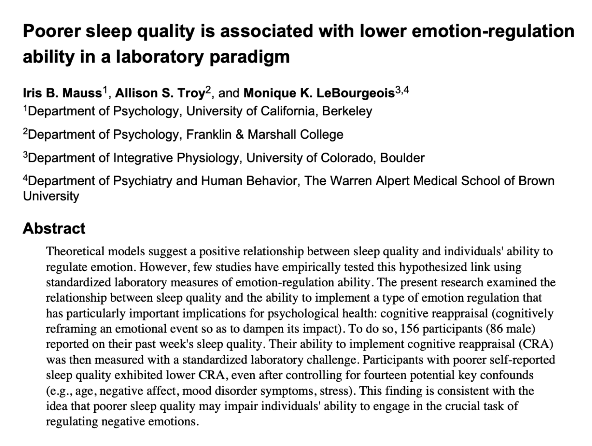
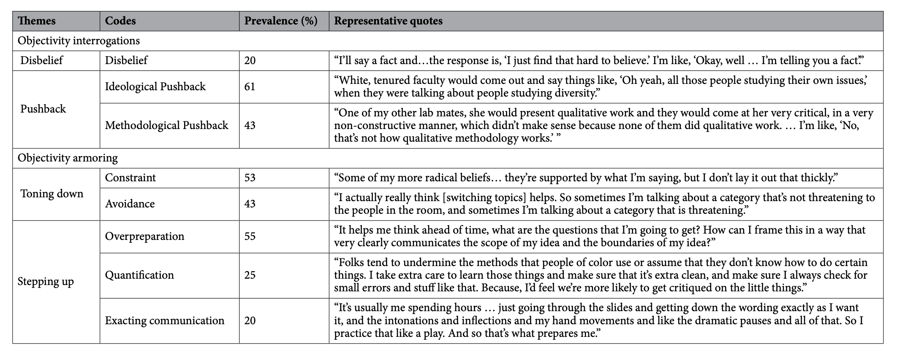
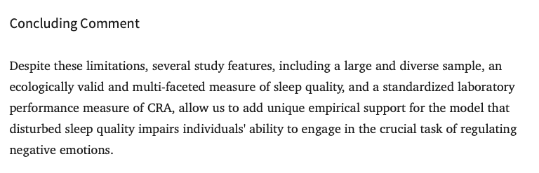
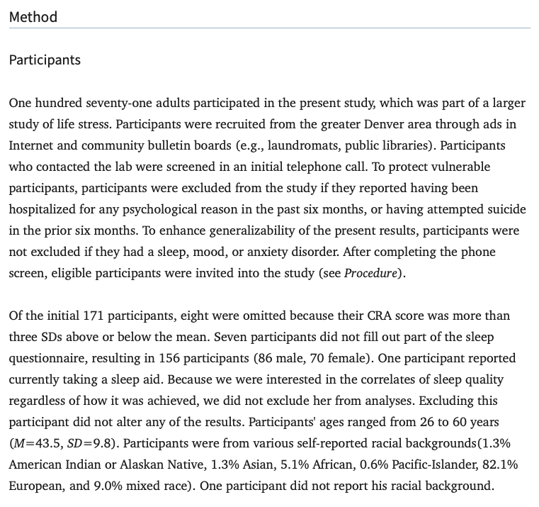
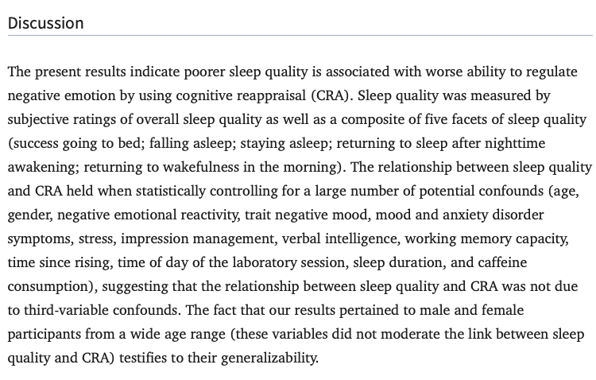

## [Week 4 Check-In Here.](https://docs.google.com/forms/d/e/1FAIpQLSfZcU6M-4l-IuRSlh6VpHcmgnH1fUjgkOFTCIJmApYCTpPLeA/viewform?usp=header)

::: r-fit-text
{fig-align="center" width="80%"}
:::

## Part 1 : Reliability and Validity

### Key Terms {.smaller}

::::: columns
::: {.column width="50%"}
Questions about the terms or ideas from the reading?

Reactions to the racism of phrenology (Had you heard about this? How do we use this knowledge? What does this tell us about science?)
:::

::: {.column width="50%"}
- **face validity** : does our measure or result look like what it should look like?

- **convergent validity** : is our measure similar to related concepts? (does one measure give the same information as another similar measure?)

- **discriminant validity** : is our measure different from unrelated concepts? (Does one measure give different information as another different measure?)

- **test-retest reliability** : do we get the same result if we take multiple measures?

- **inter-rater reliability** : would another observer (or test or machine) make the same measurements?
:::
:::::

### ACTIVITY : A Pedometer {.smaller}

::::: columns
::: {.column width="50%"}
How would you evaluate a pedometer (step counter) in terms of reliability or validity?

:::

::: {.column width="50%"}
- **face validity** : does our measure or result look like what it should look like?

- **convergent validity** : is our measure similar to related concepts? (does one measure give the same information as another similar measure?)

- **discriminant validity** : is our measure different from unrelated concepts? (Does one measure give different information as another different measure?)

- **test-retest reliability** : do we get the same result if we take multiple measures?

- **inter-rater reliability** : would another observer (or test or machine) make the same measurements?
:::
:::::

### ACTIVITY : Your Own Measure {.smaller}

::::: columns
::: {.column width="50%"}
In the vision board, work with your buddie(s) to choose ONE measure, and write about how you would evaluate it in terms of reliability and validity.

:::

::: {.column width="50%"}
- **face validity** : does our measure or result look like what it should look like?

- **convergent validity** : is our measure similar to related concepts? (does one measure give the same information as another similar measure?)

- **discriminant validity** : is our measure different from unrelated concepts? (Does one measure give different information as another different measure?)

- **test-retest reliability** : do we get the same result if we take multiple measures?

- **inter-rater reliability** : would another observer (or test or machine) make the same measurements?
:::
:::::

# Part 2 : Discussing Objectivity Interrogations {.smaller}

## What was reading this article like?

- Quick scan vs. long read?
- Confusing ideas or sentences, clarified?

## DISCUSS : Defining and Debating Objectivity

**Clap for No / Yes / Unsure**

- Do you think it's possible for psychologists to be objective?
- Do you think psychologists should try to be objective?
- Do you think objectivity should require a lack of personal identity or agenda?

## Interrogations in Research or Real-Life

**When Peer-Reviewers are "Just Asking Questions"**

### EXAMPLE : Objectivity in Sleep Research

### EXAMPLE : Objectivity in Sleep Research

### EXAMPLE : Objectivity in Sleep Research

## THE END.
