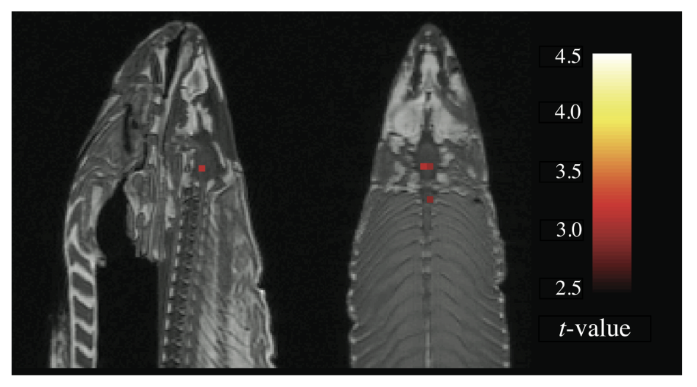
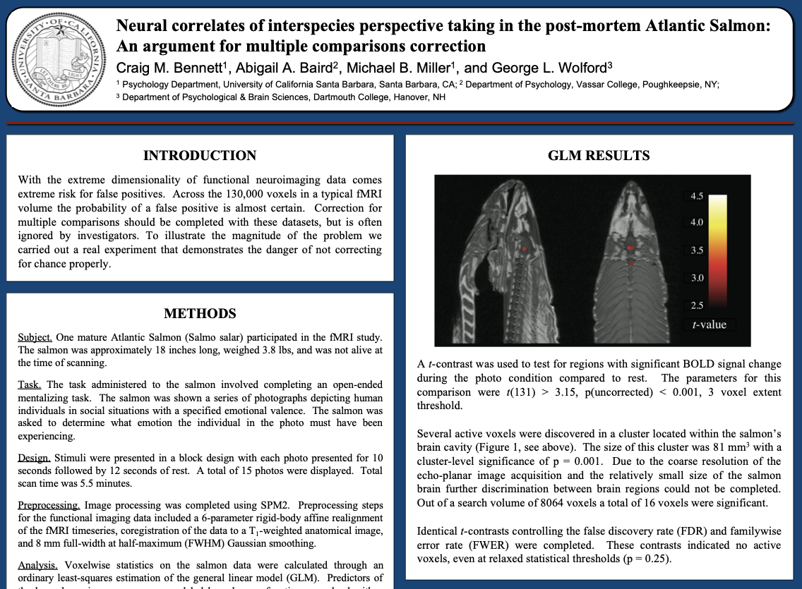
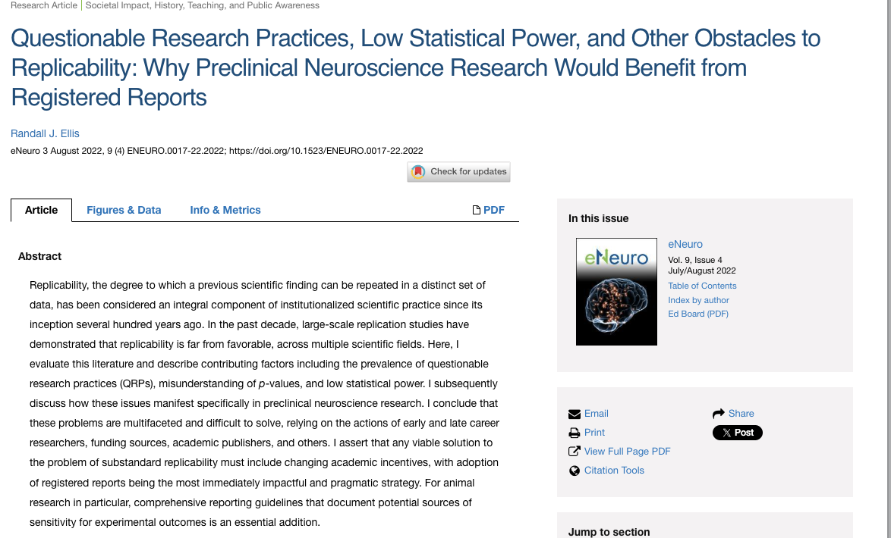
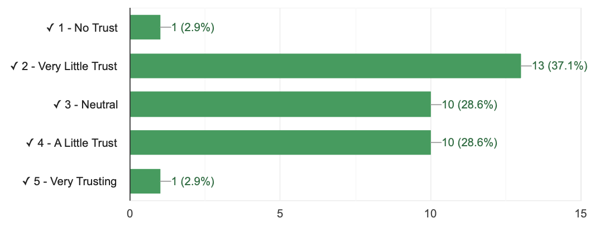
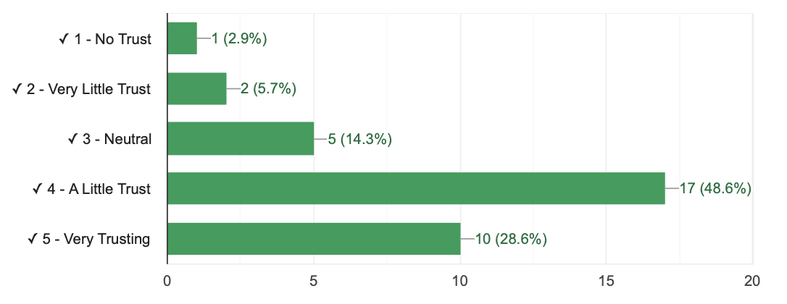
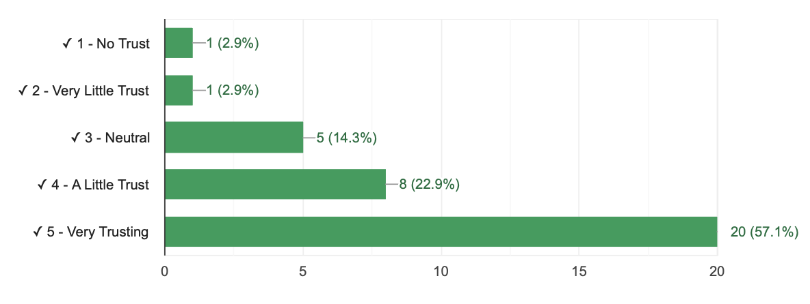
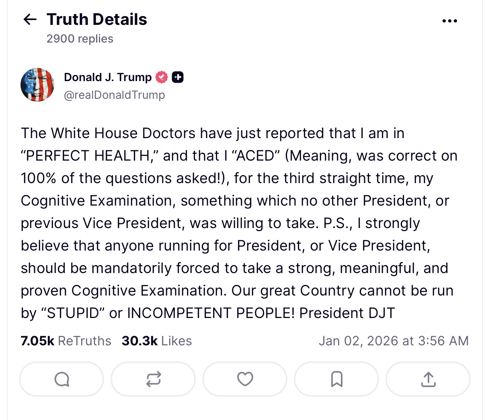
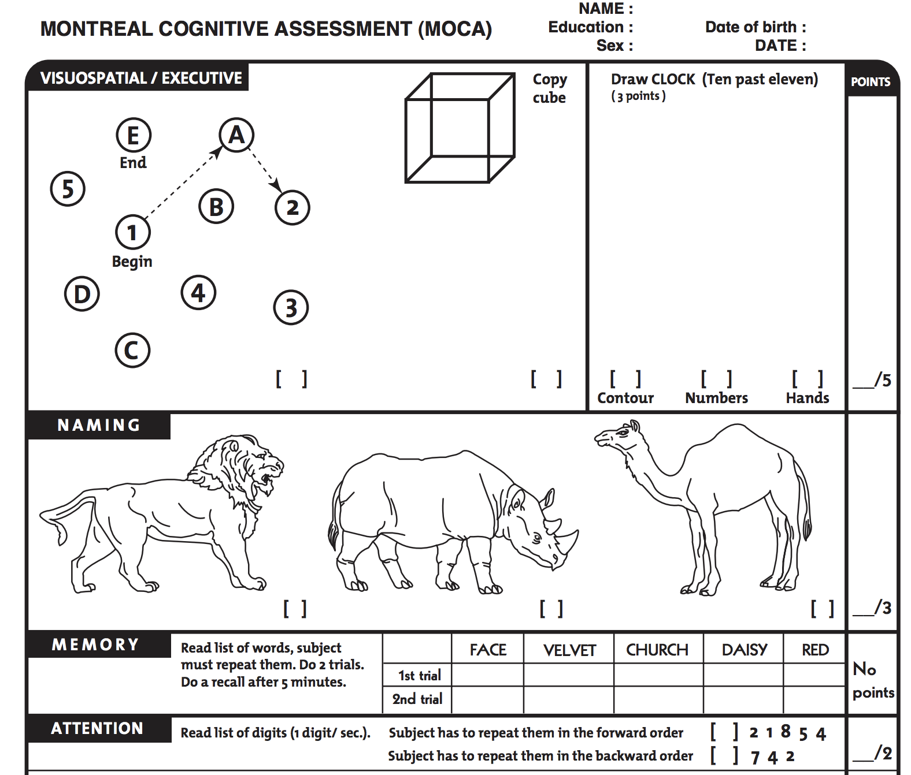

# [Check-In : Fish Science](https://docs.google.com/forms/d/e/1FAIpQLSe5DoHHaE-LL4iZ6hOFU0UQ93pBmB7rISijSPUFylGOwBOm4Q/viewform?usp=sf_link){.smaller}

::::: columns
::: {.column width="60%"}

:::

::: {.column width="40%"}
- Lots of jargon! Work to translate into simple language where possible.
- Focus on "THE POINT". Okay to lose some of the details.
- Ask for help / highlight points of confuson.
:::
:::::

# Part 1 : Check-In Review {.smaller}

## Reading an Article

::::: columns
::: {.column width="30%"}

:::

::: {.column width="70%"}
- Okay, how you feeling about this one.
- Ways to translate the title?
- Methods of making this make sense?
:::
:::::

## Validity and Reliability in Dead Fish

::::: columns
::: {.column width="30%"}

:::

::: {.column width="70%"}
**Validity : Are we measuring the TRUTH?**

- **convergent :** our measure should be related to things it should be related to.

- **discriminant :** our measure should be UNrelated to things it should be UNrelated to.
:::
:::::

## Validity and Reliability in Dead Fish

::::: columns
::: {.column width="30%"}

:::

::: {.column width="70%"}
**Reliability : Are we getting repeatable measures?**

- **test-retest :** multiple tests with the same measure should yield the same result (if the subject did not change.)

- **inter-rater :** multiple measures should yield the same result
:::
:::::

## KEY IDEA : NEUROSCIENCE CAN BE BIASED {.smaller}

## KEY IDEA : NEUROSCIENCE CAN BE BIASED {.smaller}

| Trust in Self-Reports | Trust in Behavioral Data | Trust in fMRI |
|------------------------|------------------------|------------------------|
|  |  |  |

## Reading : Observations (vs. Self-Reports)

If you look like you are smiling & brain activation says you are happy, but you feel miserable....

- you are happy

- you are not happy

# Commercial Break.

What comes to mind when you think of the phrase "Cognitive Examination"?

# Part 2 : [Operationalization]{.underline} is an Eight Syllable Word

- Say this word outloud.

- What comes to mind when you see or hear this word?

## DEFINITION : Operationalization

- A fancy definition (like a rich doctor).
- Technical and precise (like a doctor who operates).
- A *process* (an operation).

{fig-align="center" width="162"}

### A "Cognitive Examination" in Popular Press.

{fig-align="center" width="60%"}

### "Cognitive Examination" Operationalized {.smaller}

{fig-align="center" width="60%"}

## Deep Breath. No Talking.

## ACTIVITY : Count the Interruptions. {.smaller}

**Count the Interruptions : [tinyurl.com/researchinterruptions](https://docs.google.com/forms/d/e/1FAIpQLSdDt9g2s4rELaKorXyprVgtOa0Smb8ooI_FIWNg2i7iXKpazA/viewform?usp=sf_link)**

- Count the number of interruptions in the video (which professor will play soon).
- Submit your answer, **then wait for the letter of the day.**

## ACTIVITY : Count the Interruptions. {.smaller}

{fig-align="center"}

## BUDDY DISCUSSION

- How was watching the video?

- How many INTERRUPTIONS did you count?

- How did you OPERATIONALIZE an INTERRUPTION? What are some ways we could strengthen this OPERATIONALIZATION?

- Can you say OPERATIONALIZATION three times fast?

## CLASS & DISCUSSION. {.smaller}

- **Clap if you and your buddy got the exact same number.**

- **This is an issue of...**

  - *inter-rater reliability*
  - *test-retest reliability*
  - *convergent validity*
  - *discriminant validity*
  - *face validity*

## DISCUSS : Behavioral Coding

- SPAFF on the VISION BOARD

  - Function of an Interruption

  - Indicators of an Interruption

  - Physical Cues of an Interruption

  - Counter-Indicators of an Interruption

## ACTIVITY : Consequences of Operationalization

**SUBMIT AS PART OF DISCUSSION 6.** We counted the number of interruptions in a video before and after *operationalizing* an interruption. Look over the data from the class activity (see the lecture recording if you missed!) Explain how our operationalization task influenced the responses in terms of the *mean* and *standard deviation*, and how this relates to the concepts of reliability and validity.

## BYE.

