::: r-fit-text
## [Check-In Here : tinyurl.com/EARstudy](https://docs.google.com/forms/d/e/1FAIpQLSc-uDTPiZ47naHpFLkEqz0BCJo71uXkqG_MV7MpXpGNYbM0YA/viewform?usp=publish-editor){.smaller}

**Please help everyone read by keeping a silent environment!**

-   what's the point / takeaway from the article?

-   reading a table of statistics?!!

-   OKAY NOT TO UNDERSTAND EVERYTHING!

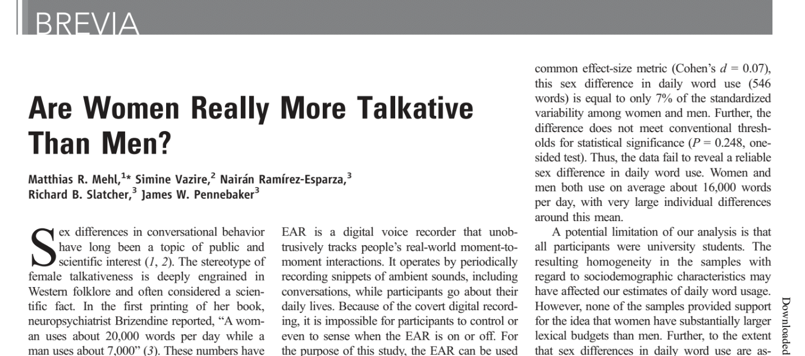
:::

# Part 1 : Observing Words (Reading Research)

### Check-In : Reading Research

-   how's it feeling? *(easier, harder, no change)*

-   immediate comments or questions?

### Check-In : We Love Data

::: panel-tabset
#### Table {.smaller}

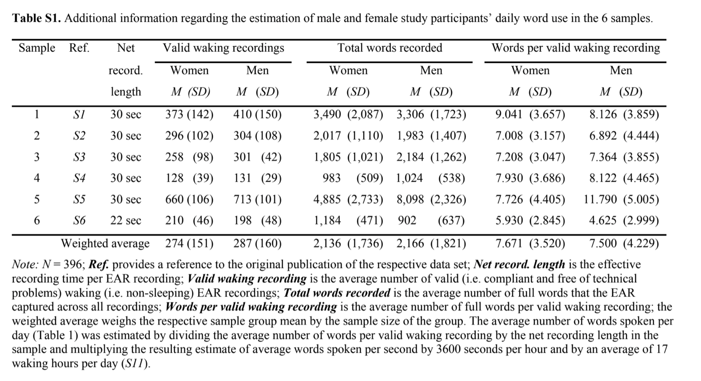{width="80%"}

#### Histogram {.smaller}

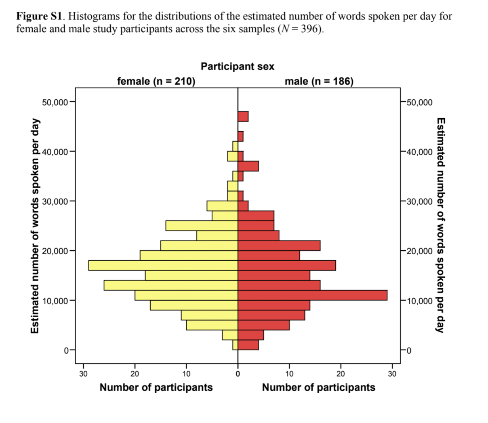{width="60%"}
:::

### supplemental materials : good measures?

::: panel-tabset
#### the ear

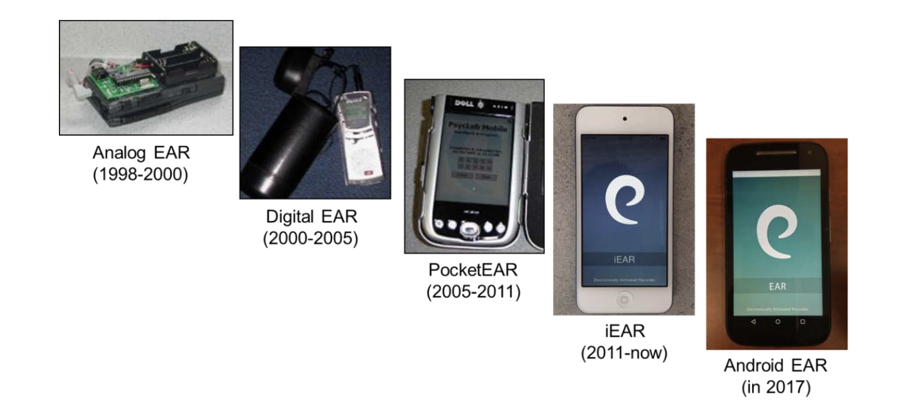{width="80%"}

#### pg 2

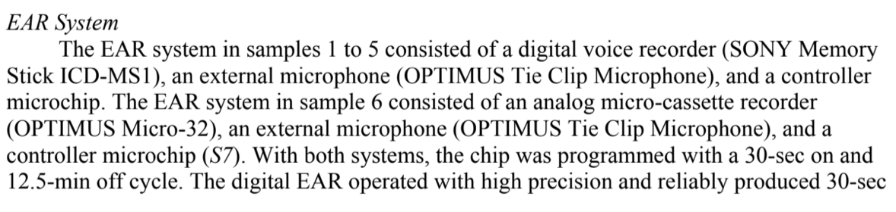{width="80%"}

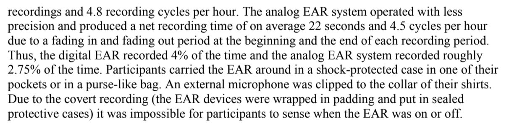{width="80%"}

#### pg 3

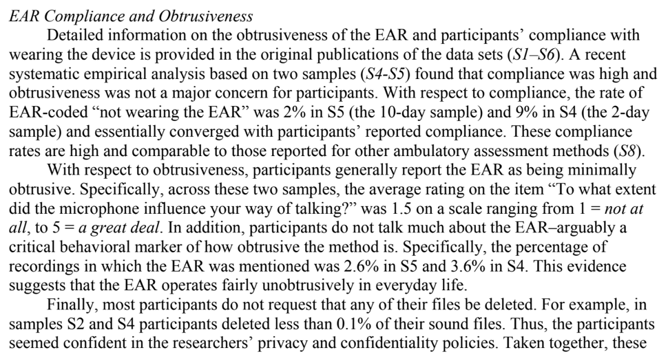{width="80%"}

#### pg 4

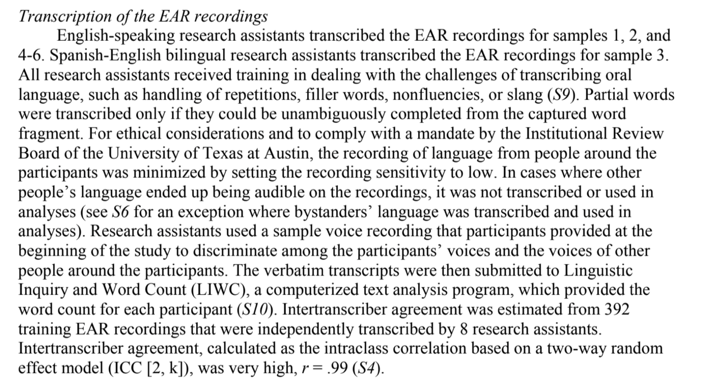{width="80%"}
:::

### Reading Review : Observational Methods

(Other) better methods of counting the number of words men & women speak?

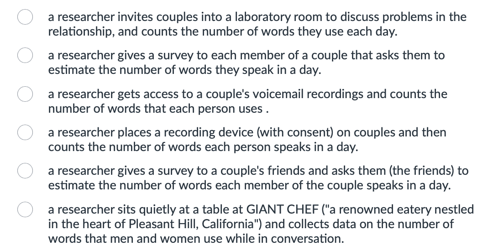{fig-align="center" width="466"}

### Reading : evaluating the "three rules" (vision board)

1.  **"...as selected from a collection of possible alternatives"**
2.  **"...as if written to follow a script"**
3.  **"...as if you were an actor"**
    1.  *did these help you form valid observations? how / why?*
    2.  *do you think they would (or could) lead to bias? how / why?*

### Reading : Observations (vs. Self-Reports)

If you look like you are smiling & brain activation says you are happy, but you feel miserable....

-   you are happy

-   you are not happy

| Trust in Self-Reports | Trust in Behavioral Data | Trust in fMRI |
|------------------------|------------------------|------------------------|
| 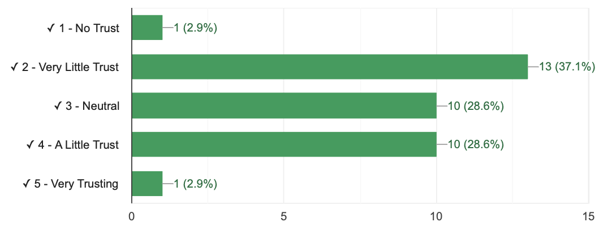 | 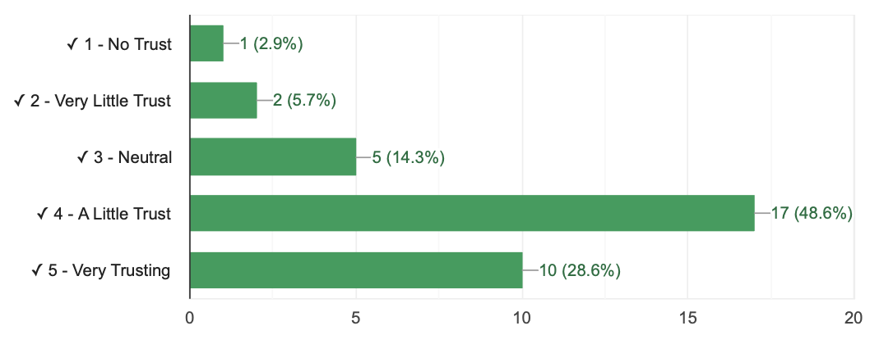 | 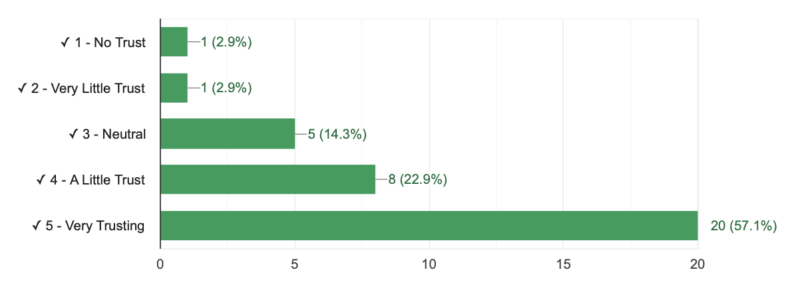 |

# Commercial Break.

What comes to mind when you think of the phrase "Cognitive Examination"?

# Part 2 : [Operationalization]{.underline} is an Eight Syllable Word

-   Say this word outloud.

-   What comes to mind when you see or hear this word?

## DEFINITION : Operationalization

-   A fancy definition (like a rich doctor).
-   Technical and precise (like a doctor who operates).
-   A *process* (an operation).

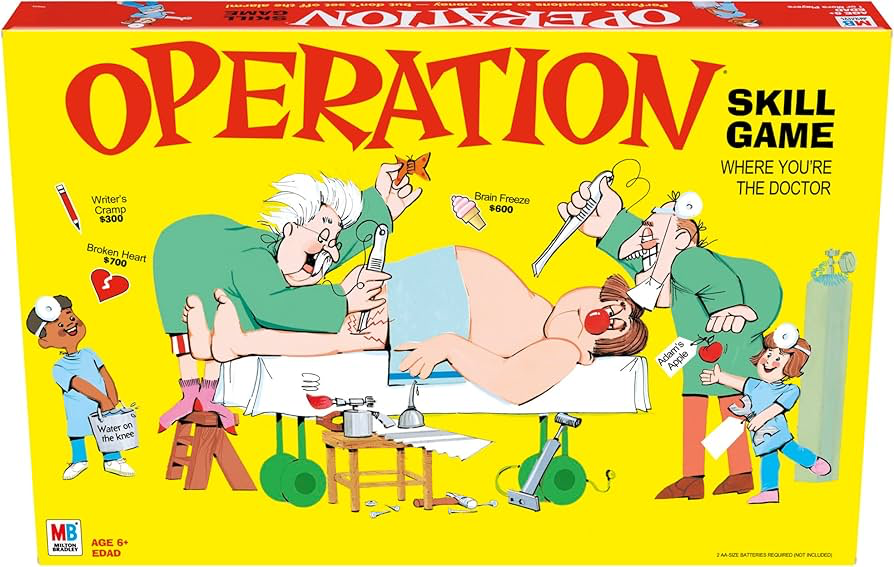{fig-align="center" width="162"}

### A "Cognitive Examination" in Popular Press.

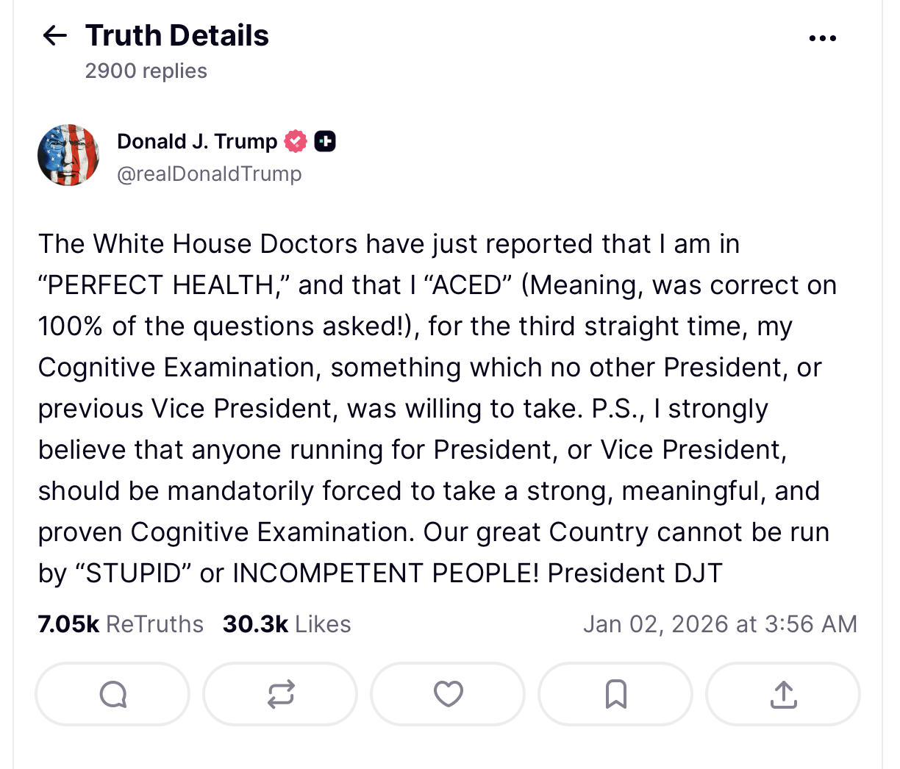{fig-align="center" width="60%"}

### "Cognitive Examination" Operationalized {.smaller}

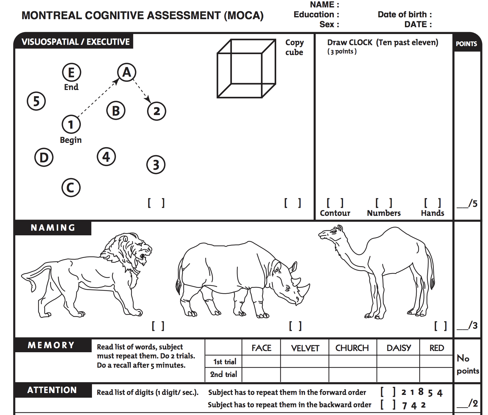{fig-align="center" width="60%"}

## Deep Breath. No Talking.

## ACTIVITY : Count the Interruptions. {.smaller}

**Count the Interruptions : [tinyurl.com/researchinterruptions](https://docs.google.com/forms/d/e/1FAIpQLSdDt9g2s4rELaKorXyprVgtOa0Smb8ooI_FIWNg2i7iXKpazA/viewform?usp=sf_link)**

-   Count the number of interruptions in the video (which professor will play soon).
-   Submit your answer, **then wait for the letter of the day.**

## ACTIVITY : Count the Interruptions. {.smaller}

{fig-align="center"}

## BUDDY DISCUSSION

-   How was watching the video?

-   How many INTERRUPTIONS did you count?

-   How did you OPERATIONALIZE an INTERRUPTION? What are some ways we could strengthen this OPERATIONALIZATION?

-   Can you say OPERATIONALIZATION three times fast?

## CLASS & DISCUSSION. {.smaller}

-   **Clap if you and your buddy got the exact same number.**

-   **This is an issue of...**

    -   *inter-rater reliability*
    -   *test-retest reliability*
    -   *convergent validity*
    -   *discriminant validity*
    -   *face validity*

## DISCUSS : Behavioral Coding

-   SPAFF on the VISION BOARD

    -   Function of an Interruption

    -   Indicators of an Interruption

    -   Physical Cues of an Interruption

    -   Counter-Indicators of an Interruption

## SPEAKING OF OBSERVATIONS...

-   Y'all observe me; department wants your feedback.
-   Why does college not trust professor's self-reports of their own teaching (we are great).

## Readings / Links

## Bye {.smaller}

-   Readings : On Surveys and Likert Scales
-   Discussion Questions :


```{r}
# https://docs.google.com/spreadsheets/d/1Vw8ezL6BeXRronRFLAZUEpUZoETND_hra80u-RQFCGM/edit?usp=sharing

```
