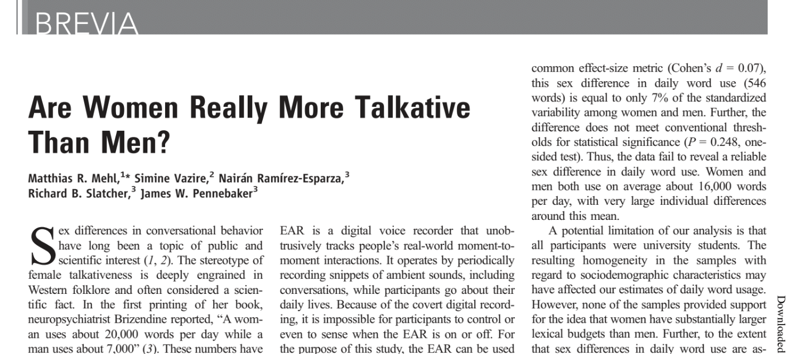
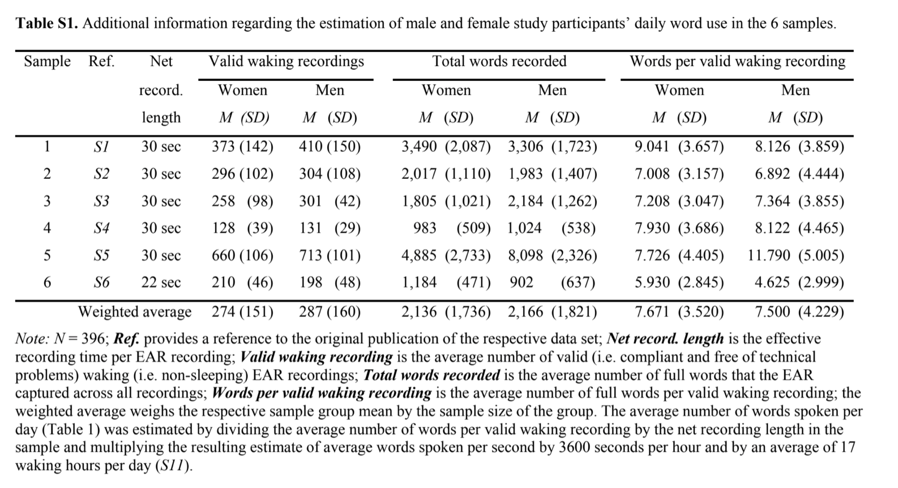
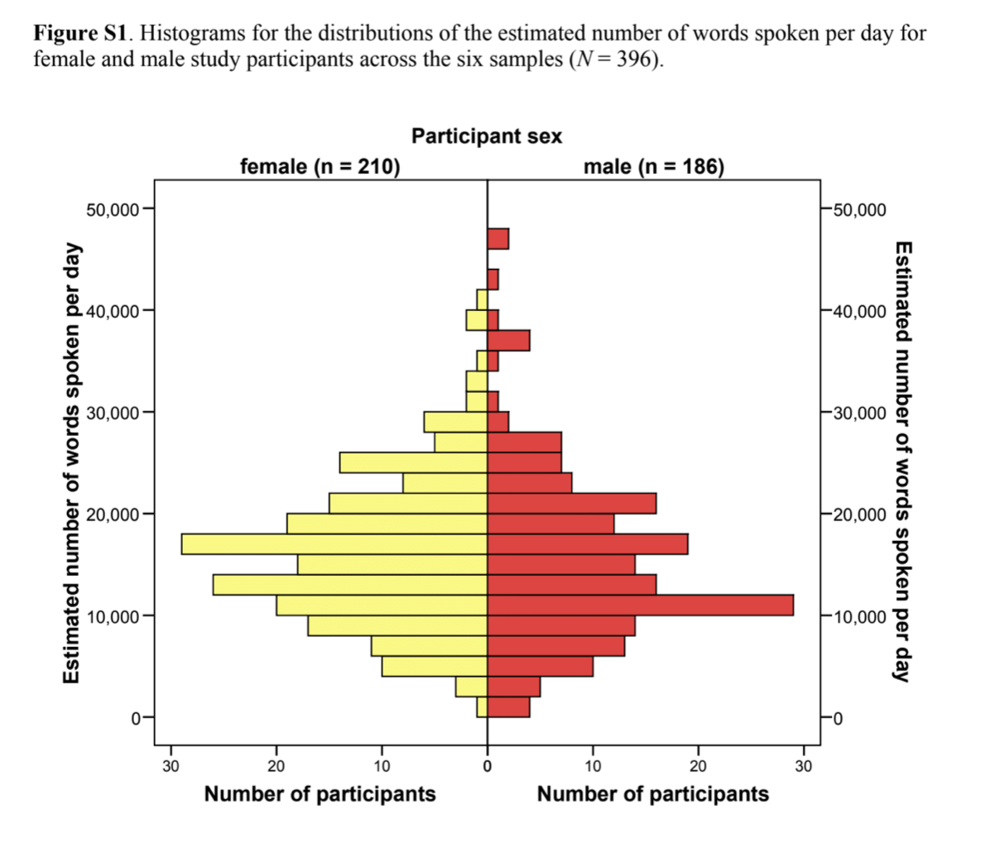
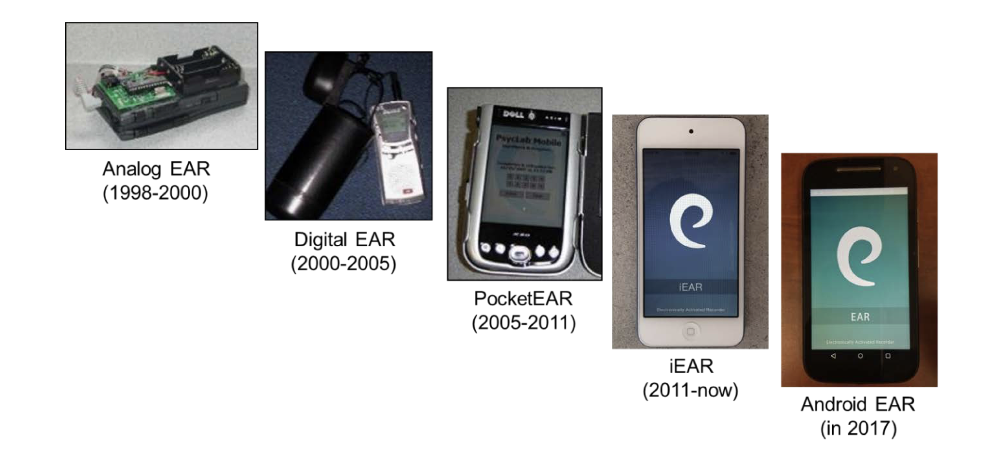
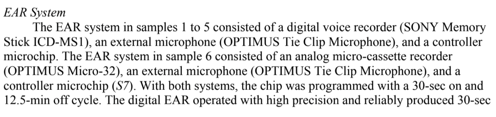
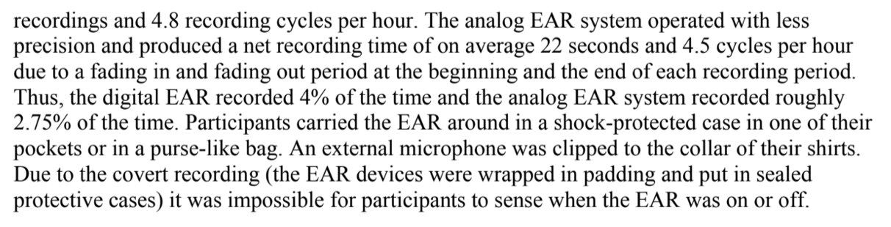
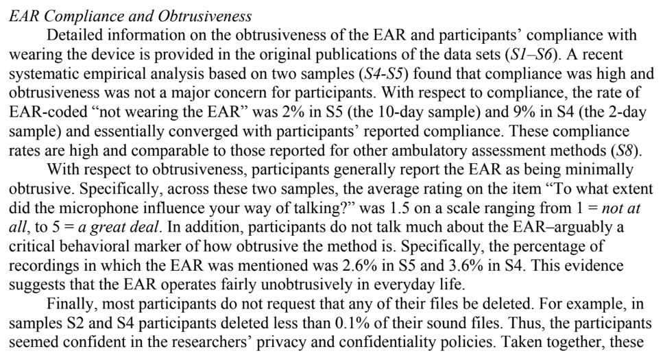
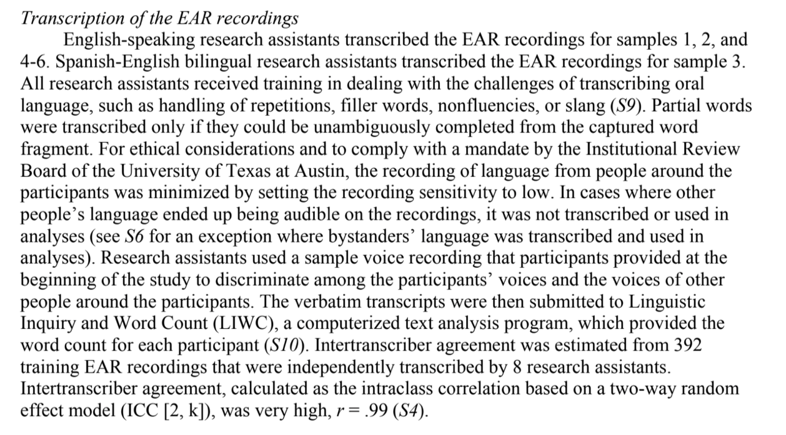
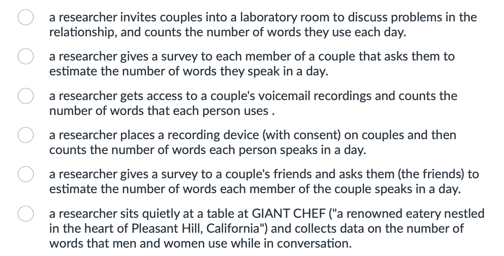

::: r-fit-text
## [Check-In Here : tinyurl.com/EARstudy](https://docs.google.com/forms/d/e/1FAIpQLSc-uDTPiZ47naHpFLkEqz0BCJo71uXkqG_MV7MpXpGNYbM0YA/viewform?usp=publish-editor){.smaller}

**Please help everyone read by keeping a silent environment!**

-   what's the point / takeaway from the article?

-   reading a table of statistics?!!

-   OKAY NOT TO UNDERSTAND EVERYTHING!

:::

# Part 1 : Observing Words (Reading Research)

### Check-In : Reading Research

-   how's it feeling? *(easier, harder, no change)*

-   immediate comments or questions?

### Check-In : We Love Data

::: panel-tabset
#### Table {.smaller}

{width="80%"}

#### Histogram {.smaller}

{width="60%"}
:::

### supplemental materials : good measures?

::: panel-tabset
#### the ear

{width="80%"}

#### pg 2

{width="80%"}

{width="80%"}

#### pg 3

{width="80%"}

#### pg 4

{width="80%"}
:::

### Reading Review : Observational Methods

(Other) better methods of counting the number of words men & women speak?

{fig-align="center" width="466"}

## Bye {.smaller}

