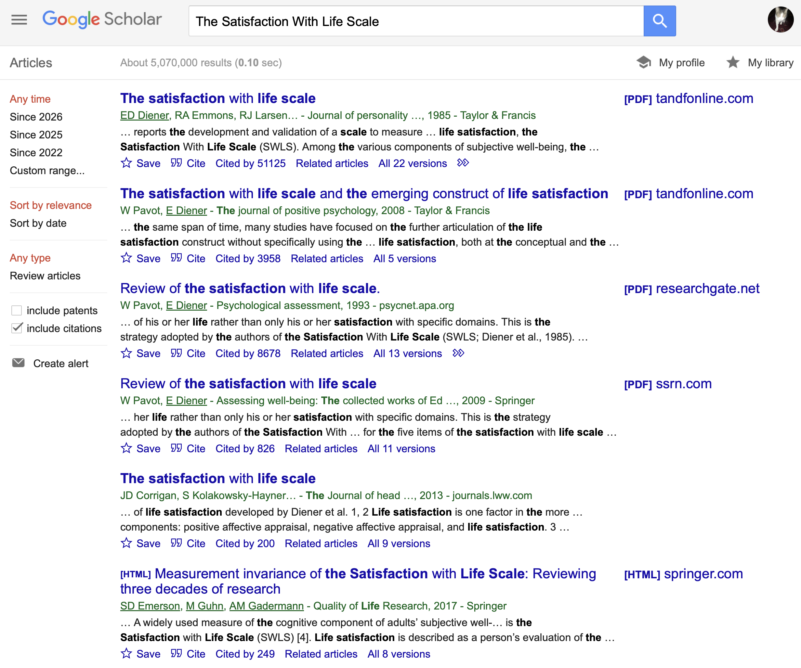
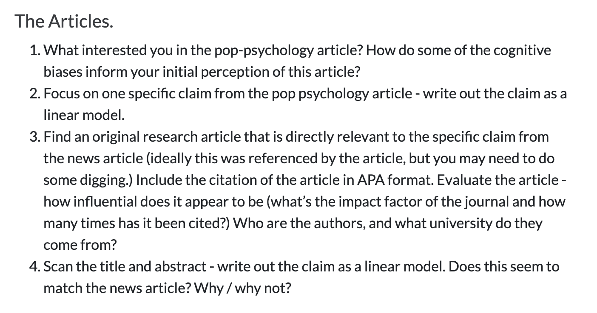

# Week 7 : Scale Review {.smaller}

[**CHECK-IN : Defining a Likert Scale**](https://docs.google.com/forms/d/e/1FAIpQLSdzuU9IKFyElROMwkgkZgGj_3DuXxIKzot5kjkEu2QXpI7S5g/viewform?usp=header)

:::::: r-fit-text
::::: columns
::: {.column width="60%"}

:::

::: {.column width="40%"}
[{fig-alt="A painting of an alligator, its brown coat dressed up with polka dots of red, yellow, and white." fig-align="center" width="80%"}](https://postermuseum.com/products/spotted-alligator-1)
:::
:::::
::::::

## REVIEW : Defining a Likert Scale {.smaller}

[Satisfaction With Life Scale](https://ppc.sas.upenn.edu/resources/questionnaires-researchers/satisfaction-life-scale)

:::::: r-fit-text
::::: columns
::: {.column width="40%"}

:::

::: {.column width="60%"}
**scale :** The variable that you want to measure as a continuous variable.

**items :** The specific question(s) in the scale.

-   **positively keyed item :** measures the high end of the scale (“yes” = high on this variable.)

-   **negatively keyed item :** measures the low end of the scale (“yes” = low on the variable.)

**response scale :** How people answer the scale items. Good to have a place for neutral.
:::
:::::
::::::

## DISCUSSION : Evaluating a Likert Scale {.smaller}

[Satisfaction With Life Scale](https://ppc.sas.upenn.edu/resources/questionnaires-researchers/satisfaction-life-scale)

:::::: r-fit-text
::::: columns
::: {.column width="40%"}

:::

::: {.column width="60%"}
**Does this seem like a valid way to measure satisfaction with life?**

-   Self-Insight / Self-Enhancement / Self-Diminishment?
-   Ways to establish reliability? validity (convergent and discriminant)?
-   What other (better) methods might exist?
:::
:::::
::::::

## But You Don't Have To Take My Word For It...

{fig-align="center" width="80%"}

## ACTIVITY : valid and biased personality

-   **Type in the [RESEARCH METHODS VISION BOARD](https://docs.google.com/spreadsheets/d/14u3w5edvo6KSFRw2U9t1knDANFSGBWOvDjS7-ZGujos/edit?usp=sharing).**

*Search through the list of myers-briggs and big five items. What are some questions that seem VALID? That seem biased? Why???*

::::: columns
::: {.column width="50%"}
Myers-Briggs Items

```         
1. You regularly make new friends.
2. Complex and novel ideas excite you more than simple and straightforward ones.
3. You usually feel more persuaded by what resonates emotionally with you than by factual arguments.
4. Your living and working spaces are clean and organized.
5. You usually stay calm, even under a lot of pressure.
6. You find the idea of networking or promoting yourself to strangers very daunting.
7. You prioritize and plan tasks effectively, often completing them well before the deadline.
8. People’s stories and emotions speak louder to you than numbers or data.
9. You like to use organizing tools like schedules and lists.
10. Even a small mistake can cause you to doubt your overall abilities and knowledge.
11. You feel comfortable just walking up to someone you find interesting and striking up a conversation.
12. You are not too interested in discussions about various interpretations of creative works.
13. You prioritize facts over people’s feelings when determining a course of action.
14. You often allow the day to unfold without any schedule at all.
15. You rarely worry about whether you make a good impression on people you meet.
16. You enjoy participating in team-based activities.
17. You enjoy experimenting with new and untested approaches.
18. You prioritize being sensitive over being completely honest.
19. You actively seek out new experiences and knowledge areas to explore.
20. You are prone to worrying that things will take a turn for the worse.
21. You enjoy solitary hobbies or activities more than group ones.
22. You cannot imagine yourself writing fictional stories for a living.
23. You favor efficiency in decisions, even if it means disregarding some emotional aspects.
24. You prefer to do your chores before allowing yourself to relax.
25. In disagreements, you prioritize proving your point over preserving the feelings of others.
26. You usually wait for others to introduce themselves first at social gatherings.
27. Your mood can change very quickly.
28. You are not easily swayed by emotional arguments.
29. You often end up doing things at the last possible moment.
30. You enjoy debating ethical dilemmas.
31. You usually prefer to be around others rather than on your own.
32. You become bored or lose interest when the discussion gets highly theoretical.
33. When facts and feelings conflict, you usually find yourself following your heart.
34. You find it challenging to maintain a consistent work or study schedule.
35. You rarely second-guess the choices that you have made.
36. Your friends would describe you as lively and outgoing.
37. You are drawn to various forms of creative expression, such as writing.
38. You usually base your choices on objective facts rather than emotional impressions.
39. You like to have a to-do list for each day.
40. You rarely feel insecure.
41. You avoid making phone calls.
42. You enjoy exploring unfamiliar ideas and viewpoints.
43. You can easily connect with people you have just met.
44. If your plans are interrupted, your top priority is to get back on track as soon as possible.
45. You are still bothered by mistakes that you made a long time ago.
46. You are not too interested in discussing theories on what the world could look like in the future.
47. Your emotions control you more than you control them.
48. When making decisions, you focus more on how the affected people might feel than on what is most logical or efficient.
49. Your personal work style is closer to spontaneous bursts of energy than organized and consistent efforts.
50. When someone thinks highly of you, you wonder how long it will take them to feel disappointed in you.
51. You would love a job that requires you to work alone most of the time.
52. You believe that pondering abstract philosophical questions is a waste of time.
53. You feel more drawn to busy, bustling atmospheres than to quiet, intimate places.
54. If a decision feels right to you, you often act on it without needing further proof.
55. You often feel overwhelmed.
56. You complete things methodically without skipping over any steps.
57. You prefer tasks that require you to come up with creative solutions rather than follow concrete steps.
58. You are more likely to rely on emotional intuition than logical reasoning when making a choice.
59. You struggle with deadlines.
60. You feel confident that things will work out for you.
```
:::

::: {.column width="50%"}
Big Five Items

```         
1. Is outgoing, sociable.
2. Is compassionate, has a soft heart.
3. Tends to be disorganized.
4. Is relaxed, handles stress well.
5. Has few artistic interests.
6. Has an assertive personality.
7. Is respectful, treats others with respect.
8. Tends to be lazy.
9. Stays optimistic after experiencing a setback.
10. Is curious about many different things.
11. Rarely feels excited or eager.
12. Tends to find fault with others.
13. Is dependable, steady.
14. Is moody, has up and down mood swings.
15. Is inventive, finds clever ways to do things.
16. Tends to be quiet.
17. Feels little sympathy for others.
18. Is systematic, likes to keep things in order.
19. Can be tense.
20. Is fascinated by art, music, or literature.
21. Is dominant, acts as a leader.
22. Starts arguments with others.
23. Has difficulty getting started on tasks.
24. Feels secure, comfortable with self.
25. Avoids intellectual, philosophical discussions.
26. Is less active than other people.
27. Has a forgiving nature.
28. Can be somewhat careless.
29. Is emotionally stable, not easily upset.
30. Has little creativity.
31. Is sometimes shy, introverted.
32. Is helpful and unselfish with others.
33. Keeps things neat and tidy.
34. Worries a lot.
35. Values art and beauty.
36. Finds it hard to influence people.
37. Is sometimes rude to others.
38. Is efficient, gets things done.
39. Often feels sad.
40. Is complex, a deep thinker.
41. Is full of energy.
42. Is suspicious of others’ intentions.
43. Is reliable, can always be counted on.
44. Keeps their emotions under control.
45. Has difficulty imagining things.
46. Is talkative.
47. Can be cold and uncaring.
48. Leaves a mess, doesn’t clean up.
49. Rarely feels anxious or afraid.
50. Thinks poetry and plays are boring.
51. Prefers to have others take charge.
52. Is polite, courteous to others.
53. Is persistent, works until the task is finished.
54. Tends to feel depressed, blue.
55. Has little interest in abstract ideas.
56. Shows a lot of enthusiasm.
57. Assumes the best about people.
58. Sometimes behaves irresponsibly.
59. Is temperamental, gets emotional easily.
60. Is original, comes up with new ideas.
```
:::
:::::

## CLAP : which one (big five or myers briggs)... {.smaller}

...was the most interesting to take?

...gave you the most valid feedback?

...seemed the most scientific?

# Part 2 : Buddy Time!! {.smaller}

### Activity : Fast Friends Task

Find the person whose Life Narrative you responded to in the VISION BOARD. (Or, someone who you have never spoken to or maybe even seen in our class.)

```         
Set I
1. Given the choice of anyone in the world, whom would you want as a dinner guest?
2. Would you like to be famous? In what way?
3. Before making a telephone call, do you ever rehearse what you are going to say? Why?
4. What would constitute a “perfect” day for you?
5. When did you last sing to yourself? To someone else?
6. If you were able to live to the age of 90 and retain either the mind or body of a 30-year-old for the last 60 years of your life, which would you want?
7. Do you have a secret hunch about how you will die?
8. Name three things you and your partner appear to have in common.
9. For what in your life do you feel most grateful?
10. If you could change anything about the way you were raised, what would it be?
11. Take four minutes and tell your partner your life story in as much detail as possible.
12. If you could wake up tomorrow having gained any one quality or ability, what would it be?

Set II
13. If a crystal ball could tell you the truth about yourself, your life, the future, or anything else, what would you want to know?
14. Is there something that you’ve dreamed of doing for a long time? Why haven’t you done it?
15. What is the greatest accomplishment of your life?
16. What do you value most in a friendship?
17. What is your most treasured memory?
18. What is your most terrible memory?
19. If you knew that in one year you would die suddenly, would you change anything about the way you are now living? Why?
20. What does friendship mean to you?
21. What roles do love and affection play in your life?
22. Alternate sharing something you consider a positive characteristic of your partner. Share a total of five items.
23. How close and warm is your family? Do you feel your childhood was happier than most other people’s?
24. How do you feel about your relationship with your mother?
```

# Part 3 : Digging Deeper {.smaller}

## RECAP : [Dig Deeper Assignment](https://catterson.github.io/rm/notes/digdeeper.html){.smaller}

## ACTIVITY : find the science {.smaller}



## ACTIVITY : evaluate the measure {.smaller}


# NEXT WEEK : PATTERNS IN DATA

{fig-align="center" width="70%"}

# BYE.

{fig-align="center"}
