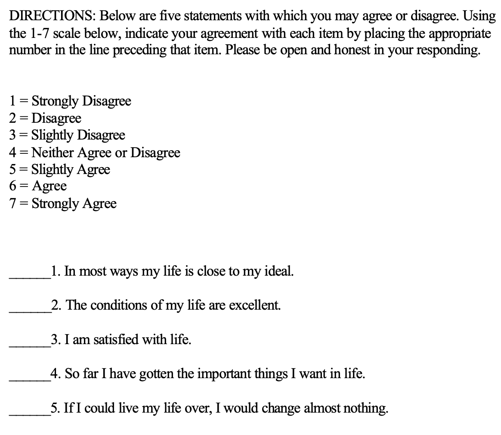
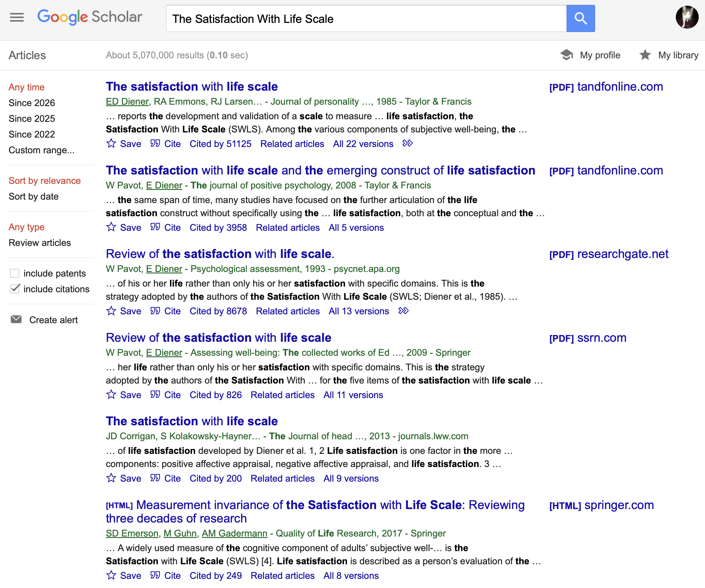
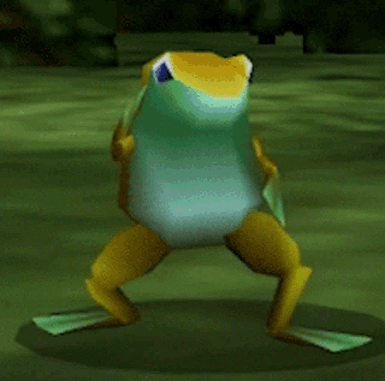

:::::: r-fit-text
## [CHECK-IN : Defining a Likert Scale](https://docs.google.com/forms/d/e/1FAIpQLSdzuU9IKFyElROMwkgkZgGj_3DuXxIKzot5kjkEu2QXpI7S5g/viewform?usp=header)

:::::: r-fit-text
::::: columns
::: {.column width="60%"}

:::

::: {.column width="40%"}
[{fig-alt="A painting of an alligator, its brown coat dressed up with polka dots of red, yellow, and white." fig-align="center" width="80%"}](https://postermuseum.com/products/spotted-alligator-1)
:::
:::::
::::::
:::::::

# PART 2 : Defining a Likert Scale {.smaller}

[Satisfaction With Life Scale](https://ppc.sas.upenn.edu/resources/questionnaires-researchers/satisfaction-life-scale)

:::::: r-fit-text
::::: columns
::: {.column width="40%"}

:::

::: {.column width="60%"}
**scale :** The variable that you want to measure as a continuous variable.

**items :** The specific question(s) in the scale.

- **positively keyed item :** measures the high end of the scale (“yes” = high on this variable.)

- **negatively keyed item :** measures the low end of the scale (“yes” = low on the variable.)

- **response scale :** How people answer the scale items. Good to have a place for neutral.
:::
:::::

## [Satisfaction With Life Scale](https://ppc.sas.upenn.edu/resources/questionnaires-researchers/satisfaction-life-scale)

:::::: r-fit-text
::::: columns
::: {.column width="40%"}

:::

::: {.column width="60%"}

**QUESTIONS**. How would you...

- determine if the test was valid (face, convergent, discriminant)?
- determine if the test was reliable (test-retest, interjudge, interitem)?
- write some negatively-keyed items

:::
:::::

## DISCUSSION : Evaluating a Likert Scale {.smaller}

[Satisfaction With Life Scale](https://ppc.sas.upenn.edu/resources/questionnaires-researchers/satisfaction-life-scale)

:::::: r-fit-text
::::: columns
::: {.column width="40%"}

:::

::: {.column width="60%"}
**Does this seem like a valid way to measure satisfaction with life?**

- Self-Insight / Self-Enhancement / Self-Diminishment?
- Ways to establish reliability? validity (convergent and discriminant)?
- What other (better) methods might exist?
:::
:::::
::::::

## But You Don't Have To Take My Word For It...

{fig-align="center" width="80%"}

## CLAP : which one (big five or myers briggs)... {.smaller}

...was the most interesting to take?

...gave you the most valid feedback?

...seemed the most scientific?

## ACTIVITY : valid and biased personality{.smaller}

::::: columns
::: {.column width="30%"}

**Type in the [RESEARCH METHODS VISION BOARD](https://docs.google.com/spreadsheets/d/14u3w5edvo6KSFRw2U9t1knDANFSGBWOvDjS7-ZGujos/edit?usp=sharing).**

*Search through the list big five items and choose an item.*

-   How might self-enhancement bias influence people's responses? 
-   How might self-insight be relevant? 
-   What is another (non-self-report) way of measuring this variable??*

:::

::: {.column width="70%"}
Big Five Items

```         
1. Is outgoing, sociable.
2. Is compassionate, has a soft heart.
3. Tends to be disorganized.
4. Is relaxed, handles stress well.
5. Has few artistic interests.
6. Has an assertive personality.
7. Is respectful, treats others with respect.
8. Tends to be lazy.
9. Stays optimistic after experiencing a setback.
10. Is curious about many different things.
11. Rarely feels excited or eager.
12. Tends to find fault with others.
13. Is dependable, steady.
14. Is moody, has up and down mood swings.
15. Is inventive, finds clever ways to do things.
16. Tends to be quiet.
17. Feels little sympathy for others.
18. Is systematic, likes to keep things in order.
19. Can be tense.
20. Is fascinated by art, music, or literature.
21. Is dominant, acts as a leader.
22. Starts arguments with others.
23. Has difficulty getting started on tasks.
24. Feels secure, comfortable with self.
25. Avoids intellectual, philosophical discussions.
26. Is less active than other people.
27. Has a forgiving nature.
28. Can be somewhat careless.
29. Is emotionally stable, not easily upset.
30. Has little creativity.
31. Is sometimes shy, introverted.
32. Is helpful and unselfish with others.
33. Keeps things neat and tidy.
34. Worries a lot.
35. Values art and beauty.
36. Finds it hard to influence people.
37. Is sometimes rude to others.
38. Is efficient, gets things done.
39. Often feels sad.
40. Is complex, a deep thinker.
41. Is full of energy.
42. Is suspicious of others’ intentions.
43. Is reliable, can always be counted on.
44. Keeps their emotions under control.
45. Has difficulty imagining things.
46. Is talkative.
47. Can be cold and uncaring.
48. Leaves a mess, doesn’t clean up.
49. Rarely feels anxious or afraid.
50. Thinks poetry and plays are boring.
51. Prefers to have others take charge.
52. Is polite, courteous to others.
53. Is persistent, works until the task is finished.
54. Tends to feel depressed, blue.
55. Has little interest in abstract ideas.
56. Shows a lot of enthusiasm.
57. Assumes the best about people.
58. Sometimes behaves irresponsibly.
59. Is temperamental, gets emotional easily.
60. Is original, comes up with new ideas.
```
:::
:::::

# NEXT WEEK : PATTERNS IN DATA

{fig-align="center" width="70%"}

# BYE.

{fig-align="center"}

{fig-align="center"}
