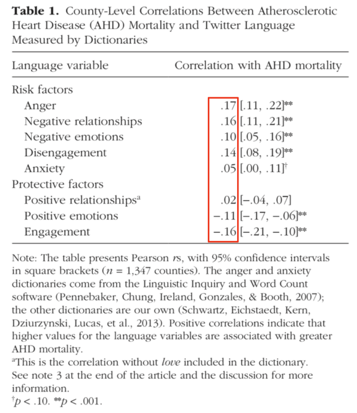
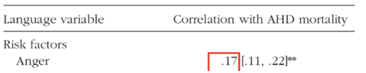
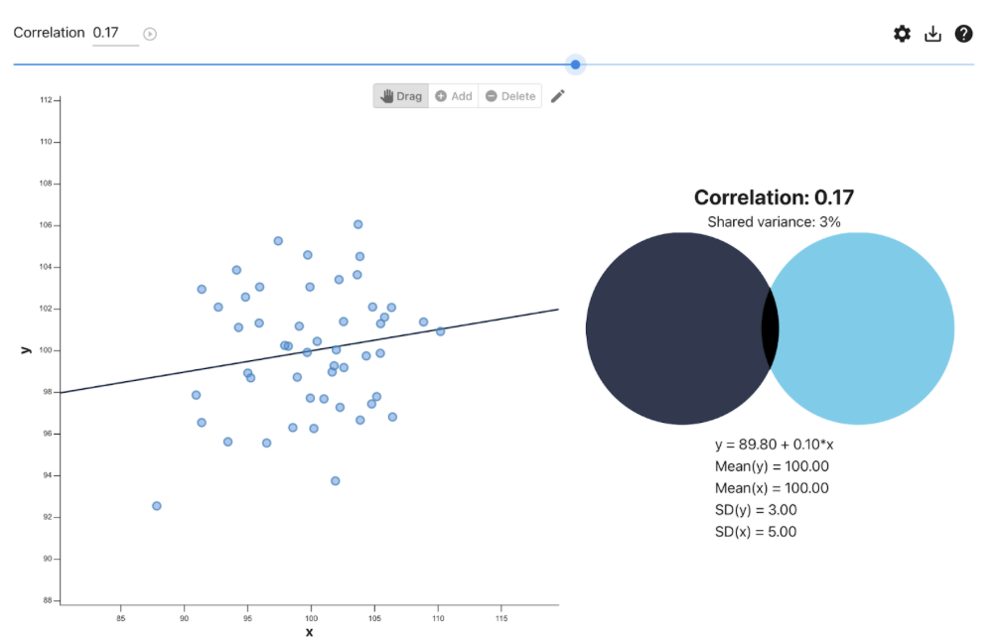
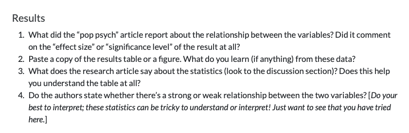
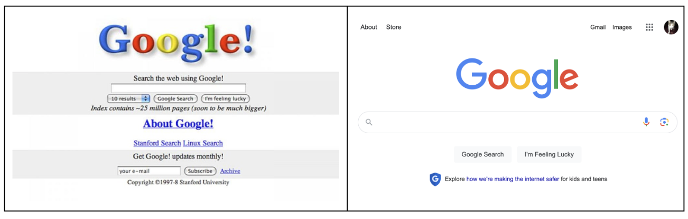
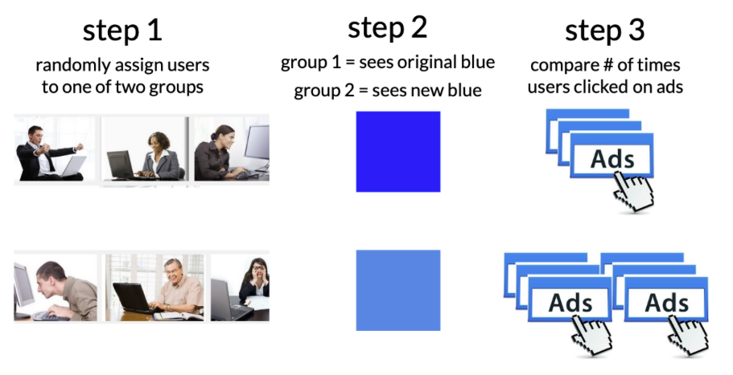
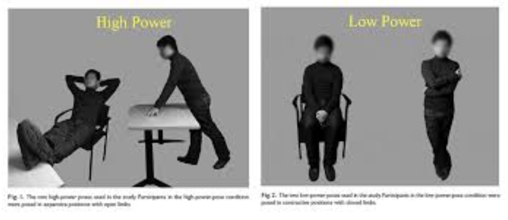
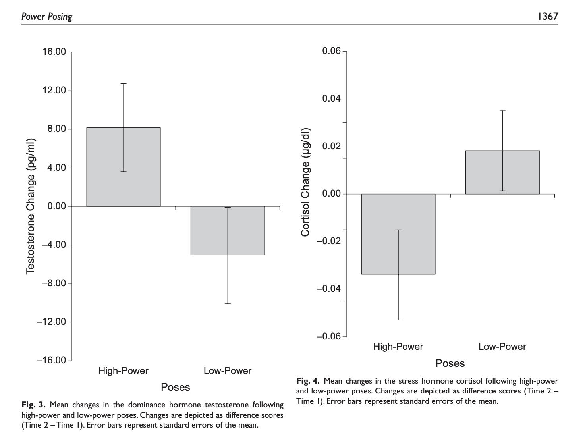
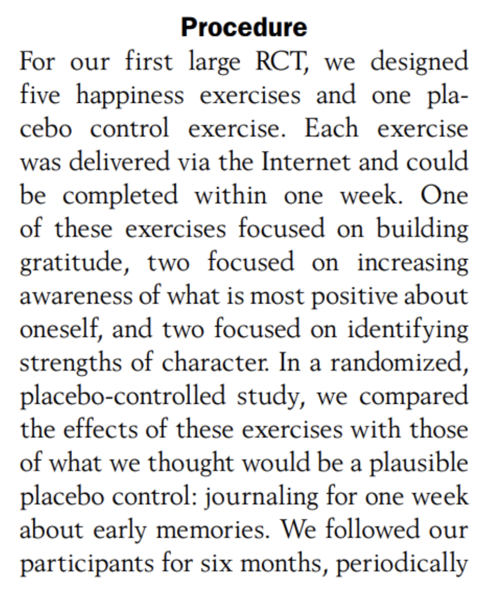

## [**CHECK-IN : tinyurl.com/twitterpattern**](https://docs.google.com/forms/d/e/1FAIpQLSf8Fo8cJBEUGCYlMg75pnYjFKqriEGVFRYYQOIsSPvEAcIszg/viewform)

:::::: r-fit-text
::::: columns
::: {.column width="20%"}
-   researchers measured rates of heart disease (AHD mortality) and rates of negative language usage on Twitter.

-   Focus on correlations in the red box --\>
:::

::: {.column width="80%"}

:::
:::::
::::::

### RECAP : Correlations {.smaller}

{width="96%"}

::::: columns
::: {.column width="50%"}
-   **direction of a relationship :** as one variable increases, what happens to the other variable?

-   **strength of a relationship :** how well one variable can predict another (correlation coefficient (*r*) and/or $R^2$)

-   **the four reason(s) for a relationship :** correlation is not causation (*but causation is correlated...*)
:::

::: {.column width="50%"}

:::
:::::

# Part 2 : [Digging Deeper](https://catterson.github.io/rm/notes/digdeeper.html) {.smaller}

**evaluate the results ([vision board review](https://docs.google.com/spreadsheets/d/14u3w5edvo6KSFRw2U9t1knDANFSGBWOvDjS7-ZGujos/edit?usp=sharing))**

-   Finding the "right" results that describe the pattern.

<!-- -->

-   Thoughts on interpreting slope and "statistical significance".



# Part 3 : Experiments {.smaller}

Why did google change???



### DEFINITION : Causality {.smaller}

::::: columns
::: {.column width="70%"}
1.  The cause and effect are contiguous in space and time.
2.  The cause must be prior to the effect.
3.  There must be a constant union betwixt the cause and effect. (“Tis chiefly this quality, that constitutes the relation.”)
4.  The same cause always produces the same effect, and the same effect never arises but from the same cause.
:::

::: {.column width="30%"}
```         
DISCUSS : 
Which parts of this definition rule out the other reasons for a pattern in the data??

Apply this definition to a true causal relationship. Does it hold up?
```
:::
:::::

### DEFINITION : Principles of an Experiment {.smaller}

::::: columns
::: {.column width="40%"}
```         
dependent variable. what the researchers want to predict or explain

experimental manipulation. change only one thing about the variable

extraneous variables as “noise”. other factors that might influence the outcome variable

random assignment. the group people are put in is random; this ensures that all other variables that might affect the result are evenly split across the two groups 

placebo effects. when individuals in the study change their behavior if they expect something to have an effect

external validity. how much does the experimental manipulation represent what someone might experience in real life?

construct validity. how much does the manipulation actually change the variable of interest?

experimenter expectancy effects. if experimenters know what will happen to participants, they may change their behavior in ways that affect the results
```
:::

::: {.column width="60%"}

:::
:::::

### KEY IDEA : Watch out for Misleading Control Variables {.smaller}

**RECAP : the manipulation (A/B Testing) :** researchers create multiple groups (conditions) and change ONE THING (the IV) about a person’s experience in each group & observe the result (the DV).

**KEY IDEA : the comparison group matters!**

-   a 1.5 hour research methods class DECREASES boredom compared to…

-   a 1.5 hour research methods class INCREASES boredom compared to…

### Science is Hard : Power Posing

-   What is the experimental / control condotion?

-   Is this a fair comparison / manipulation?

::::: columns
::: {.column width="50%"}
[](https://faculty.haas.berkeley.edu/dana_carney/power.poses.PS.2010.pdf)
:::

::: {.column width="50%"}

:::
:::::

### Example : Gratitude Study {.smaller}

::::: columns
::: {.column width="40%"}
Read the prompt below. Answer the following questions.

1.  **ICE-BREAKER :** What's something that you are grateful for?
2.  What is the experimental / control condition?
3.  Is this a fair comparison / manipulation? What would be better?
:::

::: {.column width="60%"}

:::
:::::

### ACTIVITY : Evaluating Dig Deeper {.smaller}

-   Look over the study you posted.

-   Did the researchers do an experiment or correlational study?

-   Could they do an experiment?

# NEXT CLASS : sampling error and bias

**problem : the people we studied are different from EVERYONE ELSE**

-   sampling error : when these differences are random (p-value and stats stuff)

-   sampling bias : these differences are not random (critical thinking stuff)

{fig-align="center" width="80%"}
