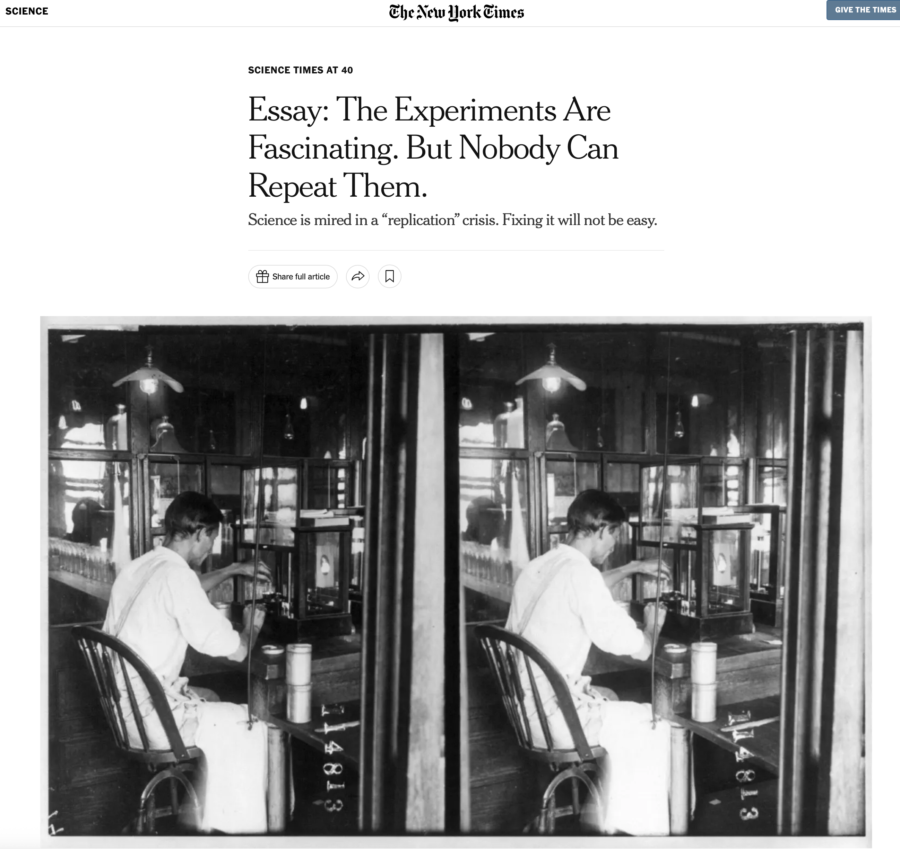

# Lecture 1.

## Psychological Science

### Paradigms of Inquiry {.smaller}

Read the four statements below; which perspective do you believe about psychology? What do you think most psychologists believe? Why?

- POSITIVISM : there is a REAL TRUTH about what makes people think, feel, and act that we can someday learn.

- POST-POSITIVISM : reality exists, but we may not be able to ever understand REAL TRUTH because our ability to study reality will always be influenced by people.

- SOCIAL CONSTRUCTIVISM : reality and “truth” are made up by people (and scientists); scientific knowledge is just a reflection of our society’s pre-existing beliefs.

- ANTI-POSITIVISM / CRITICAL THEORY : there is no reality or “truth” to what people are like/ using science to understand “truth” removes autonomy from people (it turns people into machines).

### How are Psychologists Doing with This Science Stuff?

# 
