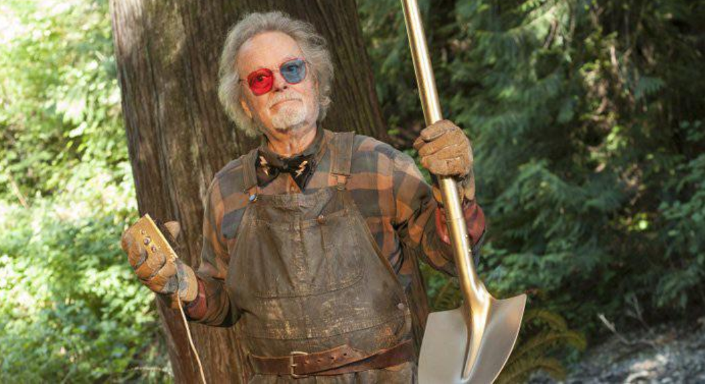

# Lecture 7.

Myers-Briggs Items

```         
1. You regularly make new friends.
2. Complex and novel ideas excite you more than simple and straightforward ones.
3. You usually feel more persuaded by what resonates emotionally with you than by factual arguments.
4. Your living and working spaces are clean and organized.
5. You usually stay calm, even under a lot of pressure.
6. You find the idea of networking or promoting yourself to strangers very daunting.
7. You prioritize and plan tasks effectively, often completing them well before the deadline.
8. People’s stories and emotions speak louder to you than numbers or data.
9. You like to use organizing tools like schedules and lists.
10. Even a small mistake can cause you to doubt your overall abilities and knowledge.
11. You feel comfortable just walking up to someone you find interesting and striking up a conversation.
12. You are not too interested in discussions about various interpretations of creative works.
13. You prioritize facts over people’s feelings when determining a course of action.
14. You often allow the day to unfold without any schedule at all.
15. You rarely worry about whether you make a good impression on people you meet.
16. You enjoy participating in team-based activities.
17. You enjoy experimenting with new and untested approaches.
18. You prioritize being sensitive over being completely honest.
19. You actively seek out new experiences and knowledge areas to explore.
20. You are prone to worrying that things will take a turn for the worse.
21. You enjoy solitary hobbies or activities more than group ones.
22. You cannot imagine yourself writing fictional stories for a living.
23. You favor efficiency in decisions, even if it means disregarding some emotional aspects.
24. You prefer to do your chores before allowing yourself to relax.
25. In disagreements, you prioritize proving your point over preserving the feelings of others.
26. You usually wait for others to introduce themselves first at social gatherings.
27. Your mood can change very quickly.
28. You are not easily swayed by emotional arguments.
29. You often end up doing things at the last possible moment.
30. You enjoy debating ethical dilemmas.
31. You usually prefer to be around others rather than on your own.
32. You become bored or lose interest when the discussion gets highly theoretical.
33. When facts and feelings conflict, you usually find yourself following your heart.
34. You find it challenging to maintain a consistent work or study schedule.
35. You rarely second-guess the choices that you have made.
36. Your friends would describe you as lively and outgoing.
37. You are drawn to various forms of creative expression, such as writing.
38. You usually base your choices on objective facts rather than emotional impressions.
39. You like to have a to-do list for each day.
40. You rarely feel insecure.
41. You avoid making phone calls.
42. You enjoy exploring unfamiliar ideas and viewpoints.
43. You can easily connect with people you have just met.
44. If your plans are interrupted, your top priority is to get back on track as soon as possible.
45. You are still bothered by mistakes that you made a long time ago.
46. You are not too interested in discussing theories on what the world could look like in the future.
47. Your emotions control you more than you control them.
48. When making decisions, you focus more on how the affected people might feel than on what is most logical or efficient.
49. Your personal work style is closer to spontaneous bursts of energy than organized and consistent efforts.
50. When someone thinks highly of you, you wonder how long it will take them to feel disappointed in you.
51. You would love a job that requires you to work alone most of the time.
52. You believe that pondering abstract philosophical questions is a waste of time.
53. You feel more drawn to busy, bustling atmospheres than to quiet, intimate places.
54. If a decision feels right to you, you often act on it without needing further proof.
55. You often feel overwhelmed.
56. You complete things methodically without skipping over any steps.
57. You prefer tasks that require you to come up with creative solutions rather than follow concrete steps.
58. You are more likely to rely on emotional intuition than logical reasoning when making a choice.
59. You struggle with deadlines.
60. You feel confident that things will work out for you.
```

# Lecture 4.

1.  **BONUS VIDEO :** Gottman (author of the SPAFF Coding Guide) ran a series of very influential couple studies; here's a [behind the scenes video](https://www.youtube.com/watch?v=QEnVSrCCSw4) of some of the methods they use to measure how couples fight.

**NOTE :** **Do not spend more than 60 minutes (total) working on the R Stuff (and hopefully much less time!) As long as you can create a free account with posit.cloud, you'll be fine next week in class. Reach out if you are feeling overwhelmed tho!**

1.  [**Sign up for a FREE account with posit.cloud**](https://posit.cloud/plans/free)**.** We will use this program to analyze some data in class next week. NO PRIOR KNOWLEDGE OF R OR STATISTICS IS ASSUMED. We will learn and practice together :)

2.  **WATCH THESE THREE VIDEOS.** I try to help walk you through how to use these programs. Don't worry if you get stuck or confused...totally fine to have questions / be confused - you won't be expected to work with this program on your own for this class, and hopefully you will find it to be a positive experience.

    1.  [**Setting up your account and doing some basic math**](https://www.loom.com/share/3d342fc70e724ab4bab8cd7765d3d94d).

    2.  [**Downloading and loading an RScript into R.**](https://www.loom.com/share/66867ee8cf404b239df61e7921673586) To answer the quiz questions for this week.

    3.  [**Creating (and graphing) a variable in R**.](https://www.loom.com/share/4d22e48cc28b438295e41c38933d9ac2) Just some more practice working with R.

3.  **OPTIONAL READINGS.** We will review some statistics terms in class next week - I won't really expect y'all to remember much - but might be good to do a quick conceptual refresh if it's been a while since you took a stats class.

    1.  [**From the Textbook**](https://kpu.pressbooks.pub/psychmethods4e/chapter/analyzing-the-data/)**.** A quick overview of some of the descriptive and inferential statistics.

    2.  [**A longer overview of descriptive statistics.**](https://catterson.github.io/ystats/chapters/3R_Description.html#centrality) A chapter from my stats class on measures of centrality and complexity. I would skip the videos on "the mean" and "standard deviation" unless you really want to do a deep dive.

### readings

**YOUR POST :** Use the readings to answer the following questions. Please submit answers to the graded Canvas discussion post to help me keep track of your work, but when prompted please also copy / paste your work to our [Vision Board](https://docs.google.com/spreadsheets/d/14u3w5edvo6KSFRw2U9t1knDANFSGBWOvDjS7-ZGujos/edit?usp=sharing) so we can more easily see (and expand upon) this work together in class.

1.  **Thoughts on with Computers.** We are going to use the posit.cloud program to analyze some data in this class and do real statistics. How are you feeling about working with a computer and doing some statistics? Good to be mindful of the feelings (positive and negative) we are experiencing!

2.  **Learning Computers.** Watch the three videos on how to get setup with posit.cloud. Use R to answer a math equation that used to give you trouble as a child (or adult). Did R get the answer right? If you got stuck, that's fine - just let us know.

3.  **Creating Variables.** In the last video, I show how to create a variable in R. Adapt my code to try and create your own variable in R. Take a screenshot of your graph (or copy the graph) and include it with your response. (If you can't get this to work with 15 minutes of trying, just explain how / where you got stuck.)

4.  **Sharing Code.** Include the code you needed to define your variable and graph the variable as a histogram. You don't need to upload a script for this, just share the code as text.

# Lecture 3.

1.  **IN CLASS :** Start a literature review for a topic you would be interested in researching as a psychologist. Find at least three articles related to your topic, fill in the annotated bibliography (see class for a template), and [add a link to your annotated bibliography to the VISION BOARD (FINAL PROJECT tab)]{.underline}. Make sure anyone with the link can view, but you don't need to give folks edit permission, unless you want to.
2.  **Write about reading.** What is the experience of reading like for you(as a kid, in school, outside of school, etc.)? What do you like to read (for fun or school)? Have you ever read an academic article for psychology? Where / why? What was that experience like?

## [ACTIVITY : VISION BOARD](https://docs.google.com/spreadsheets/d/14u3w5edvo6KSFRw2U9t1knDANFSGBWOvDjS7-ZGujos/edit?usp=sharing). {.smaller}

**INSTRUCTIONS**

- Open the Vision Board.
- Find the final project tab; copy your model from Week 2.
- Copy my annotated bibliography template.
- Find some articles

**GOAL : Learn more about the topic than you did before**

- look to the present : what do you learn from this article?
- look to the past : what reserach was cited by this article?
- look to the future : what articles have cited this article?

# Lecture 2.

## TOPIC DISCUSSION : DIG DEEPER {.smaller}



- What's a claim from psychology that you've heard (and believe?)

- What are some of the biases that might motivate this belief?

- How is scientific knowledge created and produced?

5.  **ON VISION BOARD :** Look over the [Dig Deeper description and rubric](/rm/notes/digdeeper.html). The TLDR is that you are going to compare and contrast some "Pop Psych" finding (as reported in the news media, TikTok, textbook) to the actual scientific article that was the basis for this article. **For this first step :** Find a specific psychological “finding” or “result” as reported in a pop psychology source. Psychology findings are commonly written about in major news outlets like the [StudyFinds.org](http://studyfinds.org/), [New York Times](https://www.nytimes.com/topic/subject/psychology-and-psychologists?mcubz=0), [Vox Media](https://www.vox.com/psychology), [Time Magazine](http://time.com/tag/psychology/), [Vice](https://www.vice.com/en_us/topic/psychology), [Buzzfeed](https://www.buzzfeed.com/search?q=psychology), or podcasts. You could also find a claim as reported in TikTok, Instagram post, or whatever other social media source you are finding. The more specific the better; something like "A recent study from the School of Life found that taking classes at DVC leads to higher psychological well-being" would be more specific than "research over thirty decades says childhood trauma is related to adult well-being." [***You do not need to find the original research article yet!***]{.underline}
